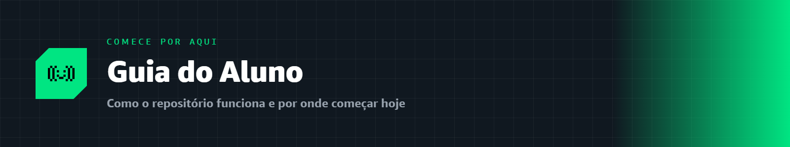
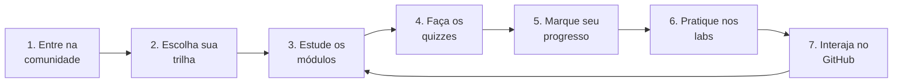

  

# 🎓 Guia do Aluno

Bem-vindo(a) à trilha de aprendizado da **Liga Acadêmica SBG — UNIFAL-MG**! Todo o aprendizado acontece **aqui dentro do GitHub**. Este guia explica como usar o repositório do jeito certo.

---

## 🧭 Como funciona

---

### 1. Entre na comunidade 🤝

Crie seu perfil no **AWS Builder Center** pelo link oficial da nossa líder:

> [!IMPORTANT]
> 👉 **[Entre no AWS Builder Center pelo link da Liga](https://bit.ly/4w720IR)**
> Use **sempre** este link para se registrar — é assim que a AWS reconhece você como membro da nossa liga.

### 2. Escolha sua trilha 🗺️

Temos **três trilhas**, e você pode seguir na ordem que fizer mais sentido para você:

| Trilha | Para quem é |
|:--|:--|
| 🎓 **[Certificação Cloud Practitioner](./certificacao-cloud/)** | Quer tirar a certificação **CLF-C02** e dominar os fundamentos da nuvem. |
| 🤖 **[Certificação AI Practitioner](./certificacao-ia/)** | Quer tirar a certificação **AIF-C01** e entender IA, ML e IA generativa na AWS. |
| 🔬 **[Aprendizado Aprofundado](./aprofundamento/)** | Quer ir além da prova, com o conteúdo técnico da capacitação oficial de líderes. |

> [!TIP]
> Recomendamos começar pela **Cloud Practitioner**, mas as trilhas são independentes. Vá no seu ritmo!

### 3. Estude os módulos 📚

Cada trilha é dividida em **domínios** (ou blocos), e cada domínio tem **módulos** numerados. Cada módulo é uma aula completa, com explicações, analogias, diagramas e exemplos. Estude em ordem dentro de cada domínio.

### 4. Faça os quizzes ✅

No fim de **cada módulo** tem um **quiz interativo de 5 perguntas de múltipla escolha**. As alternativas ficam visíveis — escolha a sua resposta mentalmente e depois clique em **"Ver resposta"** para conferir e entender o porquê.

**Pergunta exemplo:** O que significa "elasticidade" na nuvem?

- **A)** Guardar dados em vários países ao mesmo tempo.
- **B)** Aumentar ou diminuir recursos automaticamente conforme a demanda.
- **C)** Pagar um valor fixo mensal independentemente do uso.
- **D)** Criptografar todo o tráfego de rede.

💡 Ver resposta

> ✅ **Resposta: B)** — Elasticidade é ajustar recursos (para cima ou para baixo) automaticamente conforme a demanda. É um dos maiores diferenciais da nuvem. ✔️

 

Deu certo? É assim que **todos** os quizzes funcionam!

### 5. Marque seu progresso 📊

Cada módulo tem uma **checklist de conclusão** no final. Para registrar oficialmente sua evolução, abra uma **Issue** usando o template de **Checkpoint**.

> [!IMPORTANT]
> Registrar seus checkpoints é **um dos requisitos para concluir o curso**. Não pule essa etapa!
>
> 👉 **[Abrir um Checkpoint de Módulo](https://github.com/melissaalves-stack/awscloudfoundations/issues/new?template=checkpoint-de-modulo.yml)**

### 6. Pratique (sem console!) 🧪

Ao final de cada módulo há uma **sugestão de laboratório**. A parte prática usa ambientes **prontos e gratuitos** — você **não precisa** de conta pessoal da AWS nem de cartão de crédito:

- **AWS Skill Builder** — cursos e labs guiados.
- **AWS Builder Labs** — laboratórios com ambiente pré-configurado.
- **AWS SimuLearn** — prática interativa com IA (e ainda rende certificado oficial da AWS!).

### 7. Interaja nas Issues e Discussions 💬

Tire dúvidas, registre estudos e participe de debates usando os recursos nativos do GitHub, explicados na seção abaixo.

---

## 🛠️ Como interagir na aba Issues

Nossa comunidade usa a aba **Issues** para registrar estudos, tirar dúvidas e interagir. Ao clicar em **[New Issue](https://github.com/melissaalves-stack/awscloudfoundations/issues/new/choose)**, você encontrará estas opções:

### 📊 1. Checkpoint de Módulo

- **O que é:** o formulário oficial para registrar sua evolução na trilha.
- **Quando usar:** sempre que concluir os estudos ou exercícios de um módulo/nível.
- **Como funciona:** escolha a trilha, informe o módulo e preencha a checklist com suas respostas/prints para validar seu progresso.
- 👉 **[Abrir Checkpoint](https://github.com/melissaalves-stack/awscloudfoundations/issues/new?template=checkpoint-de-modulo.yml)**

### ❓ 2. Dúvida

- **O que é:** nosso canal direto para suporte nos conteúdos.
- **Quando usar:** se travou em um conceito, não entendeu um exercício ou encontrou um erro em uma atividade.
- **Como funciona:** descreva o que está tentando fazer, o que aconteceu e, se possível, adicione um print para que a liderança ou colegas ajudem.
- 👉 **[Abrir Dúvida](https://github.com/melissaalves-stack/awscloudfoundations/issues/new?template=duvida.yml)**

### 📝 3. Blank issue *(Apenas Mantenedores)*

- **O que é:** um formulário em branco, sem estrutura padrão.
- **Nota:** uso exclusivo da organização da Liga. Você não precisa usar essa opção no dia a dia.

### 💬 4. Discussions da Liga

- **O que é:** nosso fórum aberto para networking e conversas gerais.
- **Quando usar:** para discussões mais amplas que não são dúvidas pontuais.
- **Exemplos:** carreira em nuvem, compartilhamento de artigos, oportunidades e sugestões para a Liga.

---

## 🏅 As três trilhas em resumo

| Trilha | Estrutura | Status |
|:--|:--|:--:|
| 🎓 **Cloud Practitioner (CLF-C02)** | 4 domínios oficiais da prova | ✅ Disponível |
| 🤖 **AI Practitioner (AIF-C01)** | 5 domínios oficiais da prova | ✅ Disponível |
| 🔬 **Aprendizado Aprofundado** | 12 módulos da capacitação de líderes | ✅ Disponível |

Bons estudos, e **bora construir!** 🚀

---
🏠 [Voltar ao início](./README.md) · 💜 [Sobre a Liga](./sobre/) · 📰 [Novidades Tech](./blog/)
