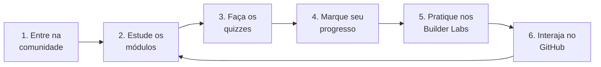

Ah, desculpe! Ficou dentro de um bloco de código.

Abaixo está o conteúdo formatado em **Markdown puro**, do jeito exato que você precisa colar direto no arquivo `.md`:

---

# 🎓 Guia do Aluno

Bem-vindo(a) à trilha de aprendizado da **Liga Acadêmica SBG — UNIFAL-MG**! Todo o aprendizado acontece **aqui dentro do GitHub**. Este guia explica como usar o repositório.

## 🧭 Como funciona

### 1. Entre na comunidade 🤝

Crie seu perfil no **AWS Builder Center** pelo link oficial da nossa líder:

> [!IMPORTANT]
> 👉 **[Entre no AWS Builder Center pelo link da Liga](https://www.google.com/search?q=%23)** *(Link em breve — fique atento aos avisos da Liga!)*
> Use **sempre** este link para se registrar quando estiver disponível — é assim que a AWS reconhece você como membro da nossa liga.

### 2. Estude os módulos 📚

A trilha é dividida em **níveis**, e cada nível tem **módulos** numerados. Comece pelo [Nível 1](https://www.google.com/search?q=./trilha/nivel-1-fundamentos-de-nuvem/) e siga em ordem. Cada módulo é uma aula completa, com explicações, diagramas e exemplos.

### 3. Faça os quizzes ✅

No fim de cada módulo tem um **quiz interativo**. As respostas ficam escondidas em blocos retráteis — tente responder antes de abrir!

**Pergunta exemplo:** O que significa "elasticidade" na nuvem?

👀 <b>Clique aqui para revelar a resposta</b>

> **Resposta:** É a capacidade de aumentar ou diminuir recursos automaticamente conforme a demanda. ✔️

 

Deu certo? É assim que todos os quizzes funcionam!

### 4. Marque seu progresso 📊

Cada módulo tem uma **checklist de conclusão**. Para acompanhar e registrar sua evolução, você usará a aba **Issues** do repositório utilizando o template de Checkpoint.

### 5. Pratique (sem console!) 🧪

A parte prática usa ambientes **prontos e gratuitos** — você **não precisa** de conta pessoal da AWS nem de cartão de crédito:

* **AWS Skill Builder** — cursos e labs guiados
* **AWS Builder Labs** — laboratórios com ambiente pré-configurado
* **AWS SimuLearn** — prática interativa com IA

### 6. Interaja nas Issues e Discussions 💬

Tire dúvidas, envie atividades e participe de debates usando os recursos nativos do GitHub explicados na seção abaixo.

---

## 🛠️ Como interagir na aba Issues

Nossa comunidade usa a aba **Issues** para registrar estudos, tirar dúvidas e interagir. Ao clicar no botão **[New Issue](https://www.google.com/search?q=../../issues/new)**, você encontrará as seguintes opções:

### 📊 1. Checkpoint de Módulo

* **O que é:** O formulário oficial para registrar sua evolução na trilha.
* **Quando usar:** Sempre que você concluir os estudos ou exercícios de um nível/módulo.
* **Como funciona:** Escolha essa opção, selecione o módulo correspondente e preencha a checklist com suas respostas/prints para validar seu progresso.

### ❓ 2. Dúvida

* **O que é:** Nosso canal direto para suporte técnico nos conteúdos.
* **Quando usar:** Se você travou em um conceito de Cloud, não entendeu um exercício ou encontrou um erro ao rodar uma atividade.
* **Como funciona:** Descreva o que está tentando fazer, o erro que apareceu e, se possível, adicione um print para que a liderança ou colegas consigam te ajudar.

### 📝 3. Blank issue *(Apenas Mantenedores)*

* **O que é:** Um formulário em branco e sem estrutura padrão.
* **Nota:** Uso exclusivo da organização da Liga Acadêmica. Você não precisa utilizar essa opção no seu dia a dia.

### 💬 4. Discussions da Liga

* **O que é:** Nosso fórum aberto para networking e conversas gerais.
* **Quando usar:** Para discussões mais amplas que não são dúvidas pontuais de código ou checklists.
* **Exemplos:** Troca de ideias sobre carreira em Nuvem, compartilhamento de artigos, eventos e sugestões para a Liga.

---

## 🏅 Sistema de níveis

|   Nível  |               Tema                 |     Status     |
| -------- | ---------------------------------- | -------------- |
| 🟢 **1** | Fundamentos de Nuvem               | ✅ Disponível |
| 🔵 **2** | Os Blocos de Construção            | ✅ Disponível |
| 🟣 **3** | Arquitetura e Alta Disponibilidade | ✅ Disponível |
| 🟠 **4** | Segurança e Operações              | 🔜 Em breve   |
| 🩷 **5** | Dados, Analytics e IA              | 🔜 Em breve   |
| 🏆 **6** | Projeto Final e Certificação       | 🔜 Em breve   |

Bons estudos, e **bora construir!** 🚀