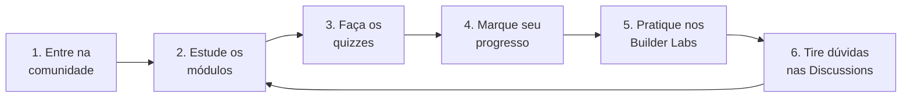

# 🎓 Guia do Aluno

Bem-vindo(a) à trilha de aprendizado da **Liga Acadêmica SBG — UNIFAL-MG**! Todo o aprendizado acontece **aqui dentro do GitHub**. Este guia explica como usar o repositório.

## 🧭 Como funciona

### 1. Entre na comunidade 🤝
Crie seu perfil no **AWS Builder Center** pelo link oficial da nossa líder:

> [!IMPORTANT]
> 👉 **[Entre no AWS Builder Center pelo link da Liga](COLE-SEU-LINK-DO-BUILDER-CENTER-AQUI)**
>
> Use **sempre** este link para se registrar — é assim que a AWS reconhece você como membro da nossa liga.

### 2. Estude os módulos 📚
A trilha é dividida em **níveis**, e cada nível tem **módulos** numerados. Comece pelo [Nível 1](./trilha/nivel-1-fundamentos-de-nuvem/) e siga em ordem. Cada módulo é uma aula completa, com explicações, diagramas e exemplos.

### 3. Faça os quizzes ✅
No fim de cada módulo tem um **quiz interativo**. As respostas ficam escondidas em blocos retráteis — tente responder antes de abrir!

👀 Veja como um quiz funciona (clique aqui)

**Pergunta exemplo:** O que significa "elasticidade" na nuvem?

**Resposta:** É a capacidade de aumentar ou diminuir recursos automaticamente conforme a demanda. ✔️

Deu certo? É assim que todos os quizzes funcionam!

### 4. Marque seu progresso 📊
Cada módulo tem uma **checklist de conclusão**. Para acompanhar sua evolução, abra uma *Issue* usando o template **"📊 Checkpoint de Módulo"** e vá marcando o que concluiu.

### 5. Pratique (sem console!) 🧪
A parte prática usa ambientes **prontos e gratuitos** — você **não precisa** de conta pessoal da AWS nem de cartão de crédito:
- **AWS Skill Builder** — cursos e labs guiados
- **AWS Builder Labs** — laboratórios com ambiente pré-configurado
- **AWS SimuLearn** — prática interativa com IA

### 6. Tire dúvidas 💬
Use a aba **Discussions** deste repositório para perguntar, responder colegas e compartilhar descobertas. Dúvida técnica pontual? Abra uma *Issue* com o template **"❓ Dúvida"**.

---

## 🏅 Sistema de níveis

| Nível | Tema | Status |
|:--:|:--|:--:|
| 🟢 **1** | Fundamentos de Nuvem | ✅ Disponível |
| 🔵 **2** | Os Blocos de Construção | ✅ Disponível |
| 🟣 **3** | Arquitetura e Alta Disponibilidade | 🔜 Em breve |
| 🟠 **4** | Segurança e Operações | 🔜 Em breve |
| 🩷 **5** | Dados, Analytics e IA | 🔜 Em breve |
| 🏆 **6** | Projeto Final e Certificação | 🔜 Em breve |

Bons estudos, e **bora construir!** 🚀
