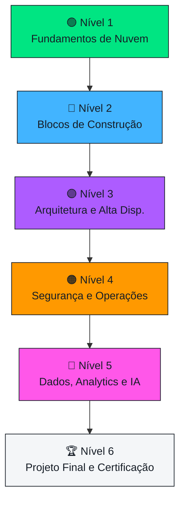

  

---

## 👋 Bem-vindo(a) à Trilha!

Este repositório é o **ambiente de aprendizado** da **Liga Acadêmica SBG da UNIFAL-MG** — vinculada ao programa **AWS Student Builder Group**. Aqui você aprende **computação em nuvem do zero**, no seu ritmo, com aulas didáticas, diagramas, quizzes e prática guiada.

> [!IMPORTANT]
> 🧭 **É a sua primeira vez aqui?** Comece pelo **[📖 Guia do Aluno](./GUIA-DO-ALUNO.md)** — ele explica todo o fluxo de aprendizado.

> [!TIP]
> Todo o aprendizado acontece **aqui dentro do GitHub**. Você **não precisa** de conta pessoal da AWS nem de cartão de crédito — a prática usa ambientes prontos (Builder Labs, Skill Builder, SimuLearn). 🎉

---

## 🗺️ A Trilha de Aprendizado

---

## 📚 Conteúdo disponível

### 🟢 [Nível 1 · Fundamentos de Nuvem](./trilha/nivel-1-fundamentos-de-nuvem/) — ✅ disponível
| # | Módulo | ⏱️ |
|:--:|:--|:--:|
| 00 | [Por que a nuvem existe](./trilha/nivel-1-fundamentos-de-nuvem/00-por-que-a-nuvem-existe.md) | 3h |
| 01 | [A infraestrutura global da AWS](./trilha/nivel-1-fundamentos-de-nuvem/01-infraestrutura-global-da-aws.md) | 3h |
| 02 | [Identidade e acesso (IAM)](./trilha/nivel-1-fundamentos-de-nuvem/02-identidade-e-acesso-iam.md) | 4h |

### 🔵 [Nível 2 · Os Blocos de Construção](./trilha/nivel-2-blocos-de-construcao/) — ✅ disponível
| # | Módulo | ⏱️ |
|:--:|:--|:--:|
| 03 | [Computação: EC2, containers e serverless](./trilha/nivel-2-blocos-de-construcao/03-computacao.md) | 5h |
| 04 | [Armazenamento: objetos, blocos e arquivos](./trilha/nivel-2-blocos-de-construcao/04-armazenamento.md) | 4h |
| 05 | [Redes: VPC, DNS e entrega de conteúdo](./trilha/nivel-2-blocos-de-construcao/05-redes.md) | 5h |
| 06 | [Bancos de dados gerenciados](./trilha/nivel-2-blocos-de-construcao/06-bancos-de-dados.md) | 4h |

### 🔜 Próximos níveis (esqueletos prontos)
- 🟣 [Nível 3 · Arquitetura e Alta Disponibilidade](./trilha/nivel-3-arquitetura-e-alta-disponibilidade/)
- 🟠 [Nível 4 · Segurança e Operações](./trilha/nivel-4-seguranca-e-operacoes/)
- 🩷 [Nível 5 · Dados, Analytics e IA](./trilha/nivel-5-dados-analytics-e-ia/)
- 🏆 [Nível 6 · Projeto Final e Certificação](./trilha/nivel-6-projeto-final-e-certificacao/)

---

## 🎮 Como estudar (100% interativo)

<table>
<tr>
<td width="50%">

**📖 Leia** os módulos em ordem
Cada um é uma aula completa, com analogias e diagramas.

**✅ Responda** os quizzes
As respostas ficam escondidas — tente antes de abrir!

</td>
<td width="50%">

**📊 Acompanhe** seu progresso
Abra uma *Issue* com o template de Checkpoint.

**💬 Converse** nas Discussions
Tire dúvidas e ajude os colegas.

</td>
</tr>
</table>

---

## 🚀 Entre para a comunidade

> [!IMPORTANT]
> Crie seu perfil no **AWS Builder Center** pelo link oficial da nossa líder — é assim que a AWS reconhece você como membro da Liga:
>
> ### 👉 [Entrar no AWS Builder Center](COLE-SEU-LINK-DO-BUILDER-CENTER-AQUI)

 

**🌐 [Site oficial da Liga](https://awsbuildersunifal.vercel.app)** · **[📸 Instagram](https://www.instagram.com/awsbuilders.unifal)** · **[📅 Meetup](https://www.meetup.com/aws-sbg-at-federal-university-of-alfenas)**

Liga Acadêmica SBG · UNIFAL-MG · Alfenas · Feito com 🧡 pela comunidade

