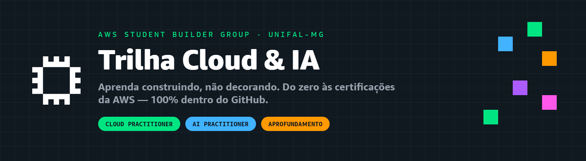
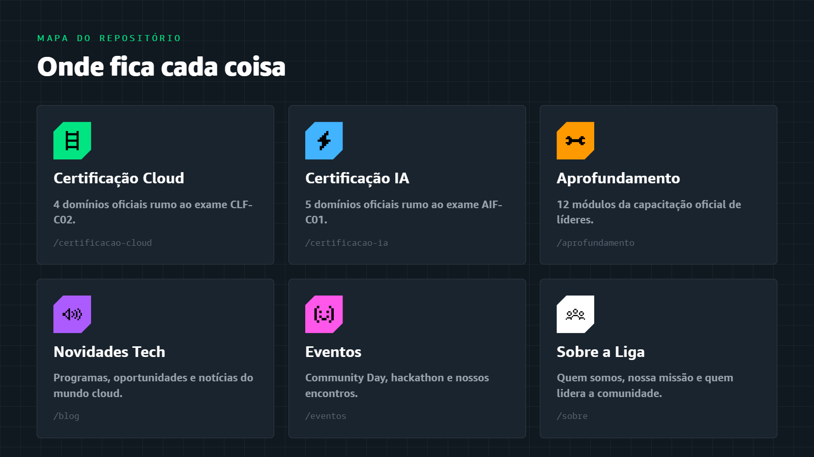
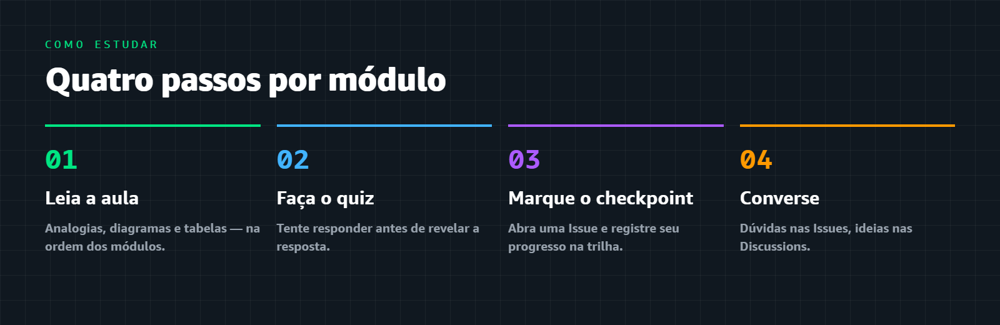

  

  

---

## 👋 Bem-vindo(a) à Liga!

Este repositório é o **ambiente de aprendizado** da **Liga Acadêmica de Computação em Nuvem da UNIFAL-MG** — vinculada ao programa **AWS Student Builder Group**. Aqui você aprende **computação em nuvem e inteligência artificial do zero**, no seu ritmo, com aulas didáticas, diagramas, quizzes interativos e prática guiada.

> [!IMPORTANT]
> 🧭 **É a sua primeira vez aqui?** Comece pelo **[📖 Guia do Aluno](./GUIA-DO-ALUNO.md)** — ele explica todo o fluxo de aprendizado.

> [!TIP]
> Todo o aprendizado acontece **aqui dentro do GitHub**. Você **não precisa** de conta pessoal da AWS nem de cartão de crédito — a prática usa ambientes prontos (Builder Labs, Skill Builder, SimuLearn). 🎉

---

## 🗺️ Como o repositório é organizado

Pensamos tudo para ser **intuitivo**. São três trilhas de estudo e alguns espaços de apoio:

  

| Espaço | O que é |
|:--|:--|
| 🎓 **[Certificação Cloud Practitioner](./certificacao-cloud/)** | Trilha completa rumo à prova oficial **AWS Certified Cloud Practitioner (CLF-C02)**. |
| 🤖 **[Certificação AI Practitioner](./certificacao-ia/)** | Trilha completa rumo à prova oficial **AWS Certified AI Practitioner (AIF-C01)**. |
| 🔬 **[Aprendizado Aprofundado](./aprofundamento/)** | Conteúdo técnico avançado da **capacitação oficial de líderes** da AWS. |
| 📰 **[Novidades Tech](./blog/)** | Nosso "blog": novidades, programas e oportunidades do mundo Cloud. |
| 🎉 **[Eventos](./eventos/)** | Registros e memórias dos nossos encontros, Community Day e Hackathon. |
| 💜 **[Sobre a Liga](./sobre/)** | Quem somos, nossa missão e quem lidera esta comunidade. |

---

## 🎓 Trilha 1 · Certificação Cloud Practitioner (CLF-C02)

  

Organizada nos **4 domínios oficiais da prova**, exatamente como a AWS estrutura o exame:

| Domínio | Tema | Peso na prova |
|:--:|:--|:--:|
| 1️⃣ | [Conceitos de Nuvem](./certificacao-cloud/dominio-1-conceitos-de-nuvem/) | 24% |
| 2️⃣ | [Segurança e Conformidade](./certificacao-cloud/dominio-2-seguranca-e-conformidade/) | 30% |
| 3️⃣ | [Tecnologia e Serviços](./certificacao-cloud/dominio-3-tecnologia-e-servicos/) | 34% |
| 4️⃣ | [Cobrança, Preços e Suporte](./certificacao-cloud/dominio-4-cobranca-precos-e-suporte/) | 12% |

👉 **[Entrar na trilha Cloud Practitioner](./certificacao-cloud/)**

---

## 🤖 Trilha 2 · Certificação AI Practitioner (AIF-C01)

  

A certificação de **Inteligência Artificial** da AWS, também organizada nos **5 domínios oficiais**:

| Domínio | Tema | Peso na prova |
|:--:|:--|:--:|
| 1️⃣ | [Fundamentos de IA e ML](./certificacao-ia/dominio-1-fundamentos-de-ia-e-ml/) | 20% |
| 2️⃣ | [Fundamentos de IA Generativa](./certificacao-ia/dominio-2-fundamentos-de-ia-generativa/) | 24% |
| 3️⃣ | [Aplicações de Modelos de Fundação](./certificacao-ia/dominio-3-aplicacoes-de-modelos/) | 28% |
| 4️⃣ | [IA Responsável](./certificacao-ia/dominio-4-ia-responsavel/) | 14% |
| 5️⃣ | [Segurança, Conformidade e Governança](./certificacao-ia/dominio-5-seguranca-e-governanca/) | 14% |

👉 **[Entrar na trilha AI Practitioner](./certificacao-ia/)**

---

## 🔬 Trilha 3 · Aprendizado Aprofundado

  

> [!NOTE]
> Esta trilha traz o conteúdo da **capacitação oficial que os líderes da AWS recebem gratuitamente** e **precisam concluir** para permanecer no programa. Foi feita e disponibilizada pela própria **presidente da Liga**, após concluir essa formação — porque um líder só ensina bem aquilo que domina de verdade. 💪

Doze módulos técnicos aprofundados, divididos exatamente como o curso oficial de onboarding:

👉 **[Entrar na trilha de Aprofundamento](./aprofundamento/)**

---

## 🎮 Como estudar (100% interativo)

  

<table>
<tr>
<td width="50%" valign="top">

### 📖 Leia
Os módulos em ordem. Cada um é uma aula completa, com analogias, diagramas e tabelas.

### ✅ Responda
Os **quizzes interativos** de cada módulo. Tente antes de revelar a resposta!

</td>
<td width="50%" valign="top">

### 📊 Acompanhe
Seu progresso, abrindo uma *Issue* com o template **[Checkpoint de Módulo](https://github.com/melissaalves-stack/awscloudfoundations/issues/new?template=checkpoint-de-modulo.yml)**.

### 💬 Converse
Tire dúvidas na aba **[Issues](https://github.com/melissaalves-stack/awscloudfoundations/issues/new?template=duvida.yml)** e troque ideias nas **Discussions**.

</td>
</tr>
</table>

---

## 📊 Acompanhe sua evolução

  

Cada módulo concluído vira um **checkpoint**. Abra uma Issue com o template [Checkpoint de Módulo](https://github.com/melissaalves-stack/awscloudfoundations/issues/new?template=checkpoint-de-modulo.yml) e acompanhe sua trilha crescendo.

---

## 🚀 Entre para a comunidade

> [!IMPORTANT]
> Crie seu perfil no **AWS Builder Center** pelo link oficial da nossa líder — é assim que a AWS reconhece você como membro da Liga:
>
> ### 👉 [Entrar no AWS Builder Center](https://bit.ly/4w720IR)

 

---

## 🛡️ Autoria e Licença

Este repositório e todo o seu conteúdo educacional foram desenvolvidos por **Melissa Hollanda de Oliveira Alves** — fundadora e presidente da Liga — em conjunto com a **Liga Acadêmica SBG · UNIFAL-MG**. Saiba mais na página **[Sobre a Liga](./sobre/)**.

Este material está protegido sob a licença **[Creative Commons CC BY-NC-SA 4.0](LICENSE.md)**:
- 👤 **Atribuição:** É obrigatório dar os devidos créditos à autora e à Liga.
- 🚫 **Não Comercial:** É expressamente proibida a venda, comercialização ou uso com fins lucrativos deste material.
- 🔄 **Compartilha Igual:** Qualquer adaptação deve manter esta mesma licença.

---

### 🌐 [Site oficial](https://awsbuildersunifal.vercel.app) &nbsp;·&nbsp; 📸 [Instagram](https://www.instagram.com/awsbuilders.unifal) &nbsp;·&nbsp; 📅 [Meetup](https://www.meetup.com/aws-sbg-at-federal-university-of-alfenas)

 

**Liga Acadêmica SBG · UNIFAL-MG**
Alfenas · Minas Gerais · Feito com 🧡 pela comunidade · Bora construir! 🚀

