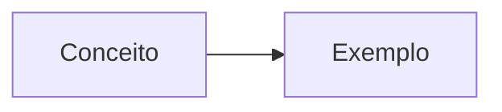

# Módulo XX · [Título do Módulo]

> **Nível:** [N] · [Nome do Nível] · **Tempo estimado:** [X]h · **Pré-requisitos:** [módulos anteriores]

<!-- Substitua tudo entre colchetes. Mantenha a estrutura para todos os módulos ficarem consistentes. -->

## 🎯 Objetivos de aprendizagem
Ao final deste módulo, você será capaz de:
- [ ] [Objetivo 1]
- [ ] [Objetivo 2]
- [ ] [Objetivo 3]

## 🧠 Conteúdo

### [Seção 1]
[Explicação didática, com analogias.]

> [!NOTE]
> [Use callouts para destacar conceitos importantes.]

### [Seção 2]
[...]

## 🧪 Mão na massa (sem console!)
Pratique em ambiente pré-configurado:
- 🔗 [Nome do lab no Skill Builder / Builder Labs](#)

## ❓ Quiz

<b>1. [Pergunta]?</b>

[Resposta explicada.]

<b>2. [Pergunta]?</b>

[Resposta explicada.]

## 📔 Glossário
| Termo | Significado |
|:--|:--|
| **[Termo]** | [Definição] |

## ✅ Checklist de conclusão
- [ ] Li todo o conteúdo
- [ ] Fiz o quiz
- [ ] Pratiquei no lab
- [ ] Anotei minhas dúvidas nas Discussions

---
⬅️ [Módulo anterior](#) · 🏠 [Índice do Nível](./README.md) · ➡️ [Próximo módulo](#)
