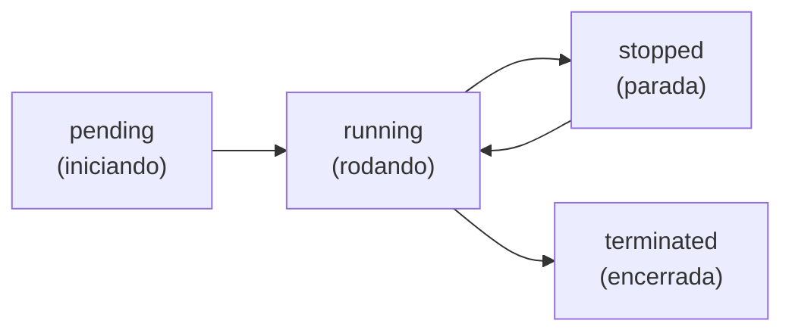

# Módulo 01 · Fundamentos de Computação

> **Trilha:** Aprofundamento · **Tempo estimado:** 3h · **Pré-requisitos:** noções de nuvem (trilha Cloud)

## 🎯 Objetivos de aprendizagem

Ao final deste módulo, você será capaz de:

- Entender em profundidade o que é o **Amazon EC2** e como uma instância é criada.
- Compreender **AMIs**, tipos de instância e o **ciclo de vida** de uma instância.
- Diferenciar os modelos de compra e otimizar custo de computação.

 

---

 

## 🧠 Conteúdo

 

### 1. Computação: o "cérebro" da nuvem

Computação é a capacidade de **processar** — rodar aplicações, cálculos e serviços. Na AWS, o serviço central de computação é o **Amazon EC2 (Elastic Compute Cloud)**, que fornece **servidores virtuais** sob demanda.

> [!TIP]
> **Analogia:** imagine poder alugar quantos computadores quiser, do tamanho que precisar, ligá-los em segundos e devolvê-los quando terminar — pagando só pelo tempo de uso. Isso é o EC2.

 

### 2. A anatomia de uma instância

Ao lançar uma instância, você define quatro coisas essenciais:

| Escolha | O que é | Analogia 🖥️ |
|:--|:--|:--|
| 💿 **AMI** (Amazon Machine Image) | O molde: SO + software pré-instalado. | A "planta" da casa. |
| 📐 **Tipo de instância** | Quantidade de CPU, memória, rede. | O tamanho da casa. |
| 🌐 **Rede (VPC/sub-rede)** | Onde a instância vive. | O bairro. |
| 🔐 **Security Group** | O firewall da instância. | As trancas e o alarme. |

> [!NOTE]
> A **AMI** é reutilizável: você pode criar sua própria AMI com tudo já configurado e lançar dezenas de instâncias idênticas a partir dela — ótimo para escalar rápido.

 

### 3. Famílias de instância

O EC2 oferece **famílias otimizadas** para diferentes cargas:

| Família | Otimizada para | Uso típico |
|:--|:--|:--|
| ⚖️ Uso geral | Equilíbrio CPU/memória | Web, apps gerais |
| 🧮 Computação | CPU intensa | Processamento, jogos |
| 🧠 Memória | Muita RAM | Bancos em memória, analytics |
| 💾 Armazenamento | I/O de disco alto | Data warehouses |
| 🎮 Acelerada (GPU) | GPUs | ML, renderização |

> [!TIP]
> O nome de uma instância (ex.: `m5.large`) codifica família (`m`), geração (`5`) e tamanho (`large`). Você não precisa decorar todas, mas entenda a lógica: **família + geração + tamanho**.

 

### 4. O ciclo de vida de uma instância

Uma instância passa por estados ao longo da vida:

| Estado | O que significa | Você paga? |
|:--|:--|:--:|
| **running** | Ligada e funcionando. | 💵 Sim |
| **stopped** | Desligada (mas ainda existe). | Só pelo armazenamento (EBS) |
| **terminated** | Encerrada e apagada. | Não |

> [!WARNING]
> **Terminated é definitivo!** Ao encerrar uma instância, ela e (por padrão) seus volumes são apagados. Se quiser só pausar, use **stop**, não **terminate**.

 

### 5. Modelos de compra (revisão aprofundada)

| Modelo | Ideal para | Economia |
|:--|:--|:--|
| ⏱️ **On-Demand** | Cargas imprevisíveis, testes. | Nenhuma (paga cheio) |
| 📉 **Savings Plans / Reserved** | Cargas estáveis (1–3 anos). | Até ~72% |
| 🏷️ **Spot** | Tarefas tolerantes a interrupção. | Até ~90% |
| 🖥️ **Dedicated Hosts** | Licenciamento/conformidade. | Varia |

> [!IMPORTANT]
> A grande decisão de custo em computação é combinar modelos: **Reserved/Savings** para a base estável + **Spot** para picos tolerantes a falha + **On-Demand** para o imprevisível.

 

---

 

## ❓ Quiz — teste seus conhecimentos

 

**1. O que é uma AMI no Amazon EC2?**

- **A)** Um tipo de firewall.
- **B)** Um molde com sistema operacional e software para criar instâncias.
- **C)** Um modelo de cobrança.
- **D)** Uma Região da AWS.

💡 Ver resposta

> ✅ **Resposta: B)** — A **AMI** (Amazon Machine Image) é o **molde** (SO + software) usado para lançar instâncias.

 

**2. Uma instância no estado "stopped" gera qual cobrança?**

- **A)** Nenhuma cobrança.
- **B)** Cobrança cheia, como se estivesse rodando.
- **C)** Apenas pelo armazenamento (EBS) associado.
- **D)** O dobro do normal.

💡 Ver resposta

> ✅ **Resposta: C)** — Parada (**stopped**), você paga só pelo **armazenamento EBS**, não pelo processamento.

 

**3. Qual a diferença entre "stop" e "terminate"?**

- **A)** São iguais.
- **B)** Stop pausa (pode religar); terminate encerra e apaga a instância.
- **C)** Terminate pausa; stop apaga.
- **D)** Ambos apagam a instância.

💡 Ver resposta

> ✅ **Resposta: B)** — **Stop** pausa (reversível). **Terminate** encerra e **apaga** (definitivo).

 

**4. Para uma carga estável que roda 24/7 por 3 anos, qual modelo de compra é mais econômico?**

- **A)** On-Demand.
- **B)** Spot.
- **C)** Savings Plans / Reserved.
- **D)** Dedicated Host.

💡 Ver resposta

> ✅ **Resposta: C)** — Cargas **estáveis e previsíveis** economizam muito com **Savings Plans / Reserved**.

 

**5. Uma instância `c5.xlarge` pertence a qual família de otimização?**

- **A)** Memória.
- **B)** Computação (CPU).
- **C)** Armazenamento.
- **D)** GPU.

💡 Ver resposta

> ✅ **Resposta: B)** — O `c` indica a família **otimizada para computação** (CPU intensa).

 

---

 

## 🧪 Mão na massa (sem console!)

- 🔗 **AWS Skill Builder** → *"Compute Fundamentals for AWS"*.
- 🔗 **AWS SimuLearn** → jornada de **computação**: pratique lançar e configurar uma instância em ambiente simulado.

 

---

 

## 📔 Glossário

| Termo | Significado |
|:--|:--|
| **Amazon EC2** | Servidores virtuais sob demanda. |
| **AMI** | Molde com SO e software para instâncias. |
| **Tipo/família de instância** | Perfil de CPU, memória, rede. |
| **Ciclo de vida** | Estados: pending, running, stopped, terminated. |
| **Stop vs. Terminate** | Pausar (reversível) vs. encerrar (definitivo). |
| **On-Demand / Reserved / Spot** | Modelos de compra do EC2. |

 

## ✅ Checklist de conclusão

- [ ] Li todo o conteúdo do módulo
- [ ] Entendo AMIs, tipos e famílias de instância
- [ ] Sei o ciclo de vida e a diferença stop/terminate
- [ ] Diferencio os modelos de compra
- [ ] Fiz o quiz
- [ ] Registrei meu [Checkpoint](https://github.com/melissaalves-stack/awscloudfoundations/issues/new?template=checkpoint-de-modulo.yml)

 

---

**Precisa de ajuda?** 📊 [Checkpoint](https://github.com/melissaalves-stack/awscloudfoundations/issues/new?template=checkpoint-de-modulo.yml) · ❓ [Dúvida](https://github.com/melissaalves-stack/awscloudfoundations/issues/new?template=duvida.yml) · 📖 [Guia](../../GUIA-DO-ALUNO.md) · 🚀 [Builder Center](https://bit.ly/4w720IR)

🏠 [Índice do Aprofundamento](../README.md) &nbsp;·&nbsp; ➡️ [Módulo 02 · ELB e Auto Scaling](../02-elb-e-auto-scaling/README.md)

