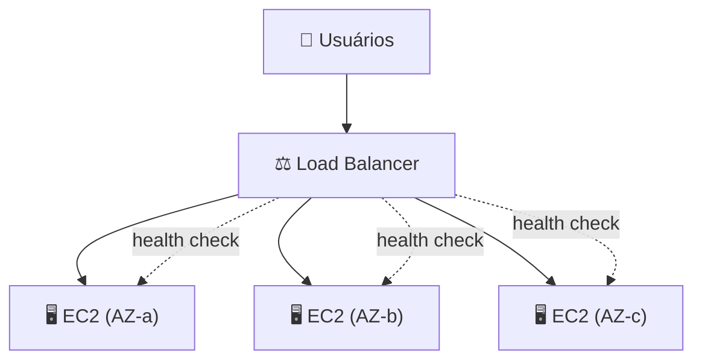
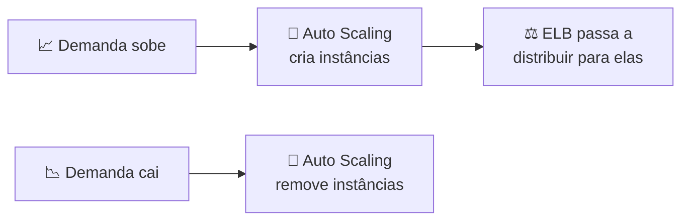

# Módulo 02 · ELB e Auto Scaling

> **Trilha:** Aprofundamento · **Tempo estimado:** 3h · **Pré-requisitos:** Módulo 01

## 🎯 Objetivos de aprendizagem

Ao final deste módulo, você será capaz de:

- Entender em detalhe o **Elastic Load Balancing (ELB)** e seus tipos.
- Compreender o **EC2 Auto Scaling** e suas políticas.
- Explicar como ELB + Auto Scaling entregam **elasticidade** e **alta disponibilidade**.

 

---

 

## 🧠 Conteúdo

 

### 1. O problema que resolvemos

Uma única instância tem dois problemas: se ela **cai**, seu app cai; se a **demanda cresce**, ela não dá conta. A solução combina duas peças: **distribuir** a carga (ELB) e **ajustar** a quantidade de instâncias (Auto Scaling).

 

### 2. Elastic Load Balancing em detalhe

O **ELB** recebe o tráfego e o distribui entre várias instâncias saudáveis, em múltiplas AZs. Ele monitora a saúde com **health checks** e retira instâncias problemáticas da rotação.

**Tipos de balanceador:**

| Tipo | Camada | Melhor para |
|:--|:--|:--|
| 🌐 **Application Load Balancer (ALB)** | Aplicação (HTTP/HTTPS) | Roteamento por caminho/host, apps web e microsserviços |
| ⚡ **Network Load Balancer (NLB)** | Rede (TCP/UDP) | Altíssimo desempenho e baixa latência |
| 🚪 **Gateway Load Balancer (GWLB)** | Rede (appliances) | Distribuir para firewalls/appliances de terceiros |

> [!TIP]
> Macete: **ALB** para tráfego **web** com roteamento inteligente. **NLB** para **desempenho extremo** na camada de rede. É a distinção mais cobrada.

 

### 3. EC2 Auto Scaling em detalhe

O **Auto Scaling Group (ASG)** mantém a quantidade certa de instâncias, definida por três números:

| Parâmetro | O que define |
|:--|:--|
| ⬇️ **Mínimo** | Nunca ter menos que isso. |
| 🎯 **Desejado** | O alvo em condições normais. |
| ⬆️ **Máximo** | Nunca ultrapassar isso (proteção de custo). |

**Tipos de política de escalonamento:**

- 🎯 **Target Tracking** — mantém uma métrica no alvo (ex.: CPU em 50%).
- 📶 **Step Scaling** — adiciona/remove em degraus conforme a intensidade.
- 📅 **Scheduled** — escala em horários previstos (ex.: mais capacidade em horário de pico).

> [!NOTE]
> O ASG também garante **resiliência**: se uma instância falha no health check, ele a **substitui automaticamente**, mantendo o número desejado.

 

### 4. A dupla em ação

> [!IMPORTANT]
> **ELB + Auto Scaling em múltiplas AZs** = a receita clássica de aplicação **elástica** (acompanha a demanda) e **altamente disponível** (sobrevive a falhas de instância e de AZ). Guarde essa combinação.

 

---

 

## ❓ Quiz — teste seus conhecimentos

 

**1. Qual balanceador é ideal para tráfego web (HTTP/HTTPS) com roteamento por caminho?**

- **A)** Network Load Balancer (NLB).
- **B)** Application Load Balancer (ALB).
- **C)** Gateway Load Balancer.
- **D)** Nenhum.

💡 Ver resposta

> ✅ **Resposta: B)** — O **ALB** atua na camada de aplicação (HTTP/HTTPS), com roteamento inteligente.

 

**2. O que o ELB faz quando uma instância falha no health check?**

- **A)** Desliga o load balancer.
- **B)** Para de enviar tráfego para a instância problemática.
- **C)** Aumenta o custo.
- **D)** Apaga a VPC.

💡 Ver resposta

> ✅ **Resposta: B)** — Ele **remove a instância da rotação** e usa apenas as saudáveis.

 

**3. No Auto Scaling Group, o que o valor "máximo" protege?**

- **A)** A segurança dos dados.
- **B)** O custo — impede criar instâncias além do limite.
- **C)** A latência.
- **D)** A criptografia.

💡 Ver resposta

> ✅ **Resposta: B)** — O **máximo** evita estouro de custo, limitando o número de instâncias.

 

**4. Uma política que mantém a CPU média em 50% é do tipo...**

- **A)** Scheduled.
- **B)** Step Scaling.
- **C)** Target Tracking.
- **D)** Manual.

💡 Ver resposta

> ✅ **Resposta: C)** — **Target Tracking** mantém uma métrica-alvo (ex.: CPU em 50%).

 

**5. Qual combinação garante elasticidade E alta disponibilidade?**

- **A)** S3 + Glacier.
- **B)** ELB + Auto Scaling em múltiplas AZs.
- **C)** IAM + KMS.
- **D)** CloudTrail + Config.

💡 Ver resposta

> ✅ **Resposta: B)** — **ELB + Auto Scaling** em várias AZs é a receita clássica de elasticidade e HA.

 

---

 

## 🧪 Mão na massa (sem console!)

- 🔗 **AWS Skill Builder** → *"Elastic Load Balancing & EC2 Auto Scaling"*.
- 🔗 **AWS SimuLearn** → jornada de **escalabilidade e balanceamento**.

 

---

 

## 📔 Glossário

| Termo | Significado |
|:--|:--|
| **ELB** | Distribui tráfego entre instâncias saudáveis. |
| **ALB / NLB / GWLB** | Balanceadores de aplicação / rede / appliances. |
| **Health check** | Verificação de saúde das instâncias. |
| **Auto Scaling Group (ASG)** | Grupo que ajusta o número de instâncias. |
| **Mínimo/Desejado/Máximo** | Limites do ASG. |
| **Target Tracking / Step / Scheduled** | Políticas de escalonamento. |

 

## ✅ Checklist de conclusão

- [ ] Li todo o conteúdo do módulo
- [ ] Diferencio ALB, NLB e GWLB
- [ ] Entendo health checks
- [ ] Sei os parâmetros e políticas do Auto Scaling
- [ ] Explico por que ELB + Auto Scaling = elasticidade + HA
- [ ] Fiz o quiz
- [ ] Registrei meu [Checkpoint](https://github.com/melissaalves-stack/awscloudfoundations/issues/new?template=checkpoint-de-modulo.yml)

 

---

**Precisa de ajuda?** 📊 [Checkpoint](https://github.com/melissaalves-stack/awscloudfoundations/issues/new?template=checkpoint-de-modulo.yml) · ❓ [Dúvida](https://github.com/melissaalves-stack/awscloudfoundations/issues/new?template=duvida.yml) · 📖 [Guia](../../GUIA-DO-ALUNO.md) · 🚀 [Builder Center](https://bit.ly/4w720IR)

⬅️ [Módulo 01](../01-fundamentos-de-computacao/README.md) &nbsp;·&nbsp; 🏠 [Índice do Aprofundamento](../README.md) &nbsp;·&nbsp; ➡️ [Módulo 03 · Infraestrutura Global](../03-infraestrutura-global-aws/README.md)

