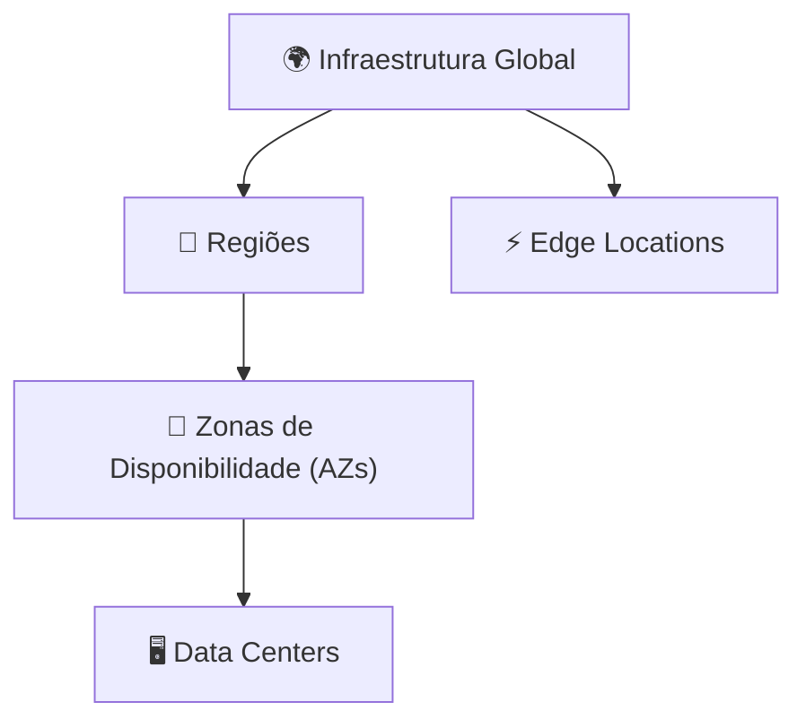

# Módulo 03 · Infraestrutura Global da AWS

> **Trilha:** Aprofundamento · **Tempo estimado:** 2h30 · **Pré-requisitos:** Módulo 02

## 🎯 Objetivos de aprendizagem

Ao final deste módulo, você será capaz de:

- Aprofundar o entendimento de **Regiões, AZs e Edge Locations**.
- Compreender **latência, redundância** e o design para alta disponibilidade.
- Reconhecer serviços de borda e extensões da nuvem.

 

---

 

## 🧠 Conteúdo

 

### 1. A hierarquia da infraestrutura

A AWS organiza o mundo em camadas:

| Nível | Definição | Isolamento |
|:--|:--|:--|
| 📍 **Região** | Área geográfica (ex.: São Paulo). | Isolada de outras Regiões. |
| 🏢 **AZ** | 1+ data centers com energia/rede próprias. | Isolada de outras AZs (mín. 3 por Região). |
| 🖥️ **Data Center** | Prédio físico com servidores. | — |
| ⚡ **Edge Location** | Ponto de presença para conteúdo. | Centenas, mais espalhadas. |

 

### 2. Por que múltiplas AZs importam tanto

Cada AZ é projetada para **falhar de forma independente**: energia, refrigeração e rede separadas, distância física suficiente para não serem afetadas pelo mesmo desastre, mas perto o bastante para **baixa latência** entre elas.

> [!IMPORTANT]
> Ao distribuir uma aplicação em **≥ 2 AZs**, você sobrevive à perda de uma zona inteira. Essa é a base técnica da **alta disponibilidade** na AWS — e o motivo de toda Região ter no mínimo **3 AZs**.

 

### 3. Latência: por que a distância importa

Dados viajam pela luz em fibras ópticas, mas a distância ainda cobra seu preço em **milissegundos**. Quanto mais perto o servidor está do usuário, menor a latência.

> [!TIP]
> Para usuários no Brasil, a Região **São Paulo (sa-east-1)** oferece a menor latência. Para audiência global, distribua com **Edge Locations** (CloudFront) e, se preciso, replique em várias Regiões.

 

### 4. Escolhendo Regiões: os 4 critérios

| Critério | Pergunta |
|:--|:--|
| 🏃 Latência | Onde estão meus usuários? |
| ⚖️ Conformidade | A lei exige dados no país? (LGPD) |
| 💵 Custo | Os preços variam por Região. |
| 🧩 Serviços | O serviço que preciso existe ali? |

 

### 5. Estendendo a borda

| Recurso | Para quê |
|:--|:--|
| ⚡ **Edge Locations** | Cache de conteúdo (CloudFront) perto do usuário. |
| 🏙️ **Local Zones** | Computação perto de grandes cidades (latência ultrabaixa). |
| 📡 **Wavelength** | AWS dentro das redes 5G. |
| 🏭 **Outposts** | Hardware da AWS no seu data center. |

> [!NOTE]
> Todos existem para **aproximar** a nuvem: seja do usuário final (Edge/Local Zones/Wavelength) ou das instalações da empresa (Outposts).

 

---

 

## ❓ Quiz — teste seus conhecimentos

 

**1. Qual é o número mínimo de AZs em uma Região da AWS?**

- **A)** 1
- **B)** 2
- **C)** 3
- **D)** 5

💡 Ver resposta

> ✅ **Resposta: C)** — Toda Região da AWS tem **no mínimo 3 AZs**.

 

**2. Por que as AZs são fisicamente separadas?**

- **A)** Para gastar mais energia.
- **B)** Para que um desastre em uma não afete as outras (isolamento de falhas).
- **C)** Por exigência de marketing.
- **D)** Para aumentar a latência.

💡 Ver resposta

> ✅ **Resposta: B)** — A separação garante **isolamento de falhas**: uma AZ pode cair sem derrubar as outras.

 

**3. Para reduzir a latência de usuários no Brasil, qual Região é indicada?**

- **A)** Norte da Virgínia.
- **B)** Irlanda.
- **C)** São Paulo (sa-east-1).
- **D)** Tóquio.

💡 Ver resposta

> ✅ **Resposta: C)** — **São Paulo** oferece menor latência para usuários brasileiros.

 

**4. O que uma Edge Location faz?**

- **A)** Hospeda o banco de dados principal.
- **B)** Entrega conteúdo em cache perto do usuário final.
- **C)** Substitui uma Região inteira.
- **D)** Gerencia o IAM.

💡 Ver resposta

> ✅ **Resposta: B)** — Edge Locations fazem **cache de conteúdo** próximo ao usuário (base do CloudFront).

 

**5. O AWS Outposts serve para...**

- **A)** Levar hardware da AWS para o data center do próprio cliente.
- **B)** Criar buckets S3.
- **C)** Traduzir textos.
- **D)** Gerenciar faturas.

💡 Ver resposta

> ✅ **Resposta: A)** — O **Outposts** instala infraestrutura da AWS **no data center do cliente**.

 

---

 

## 🧪 Mão na massa (sem console!)

- 🔗 **AWS Skill Builder** → *"AWS Global Infrastructure"*.
- 🔗 Explore o **mapa interativo** da infraestrutura global da AWS (site oficial, sem login).

 

---

 

## 📔 Glossário

| Termo | Significado |
|:--|:--|
| **Região** | Área geográfica isolada com infraestrutura. |
| **AZ** | 1+ data centers isolados (mín. 3 por Região). |
| **Edge Location** | Ponto de presença para cache de conteúdo. |
| **Latência** | Tempo de ida e volta dos dados. |
| **Local Zones / Wavelength / Outposts** | Extensões da nuvem para perto do usuário/empresa. |

 

## ✅ Checklist de conclusão

- [ ] Li todo o conteúdo do módulo
- [ ] Entendo a hierarquia Região → AZ → Data Center
- [ ] Sei por que usar múltiplas AZs
- [ ] Conheço os 4 critérios de escolha de Região
- [ ] Reconheço Edge, Local Zones, Wavelength e Outposts
- [ ] Fiz o quiz
- [ ] Registrei meu [Checkpoint](https://github.com/melissaalves-stack/awscloudfoundations/issues/new?template=checkpoint-de-modulo.yml)

 

---

**Precisa de ajuda?** 📊 [Checkpoint](https://github.com/melissaalves-stack/awscloudfoundations/issues/new?template=checkpoint-de-modulo.yml) · ❓ [Dúvida](https://github.com/melissaalves-stack/awscloudfoundations/issues/new?template=duvida.yml) · 📖 [Guia](../../GUIA-DO-ALUNO.md) · 🚀 [Builder Center](https://bit.ly/4w720IR)

⬅️ [Módulo 02](../02-elb-e-auto-scaling/README.md) &nbsp;·&nbsp; 🏠 [Índice do Aprofundamento](../README.md) &nbsp;·&nbsp; ➡️ [Módulo 04 · Fundamentos de Armazenamento](../04-fundamentos-de-armazenamento/README.md)

