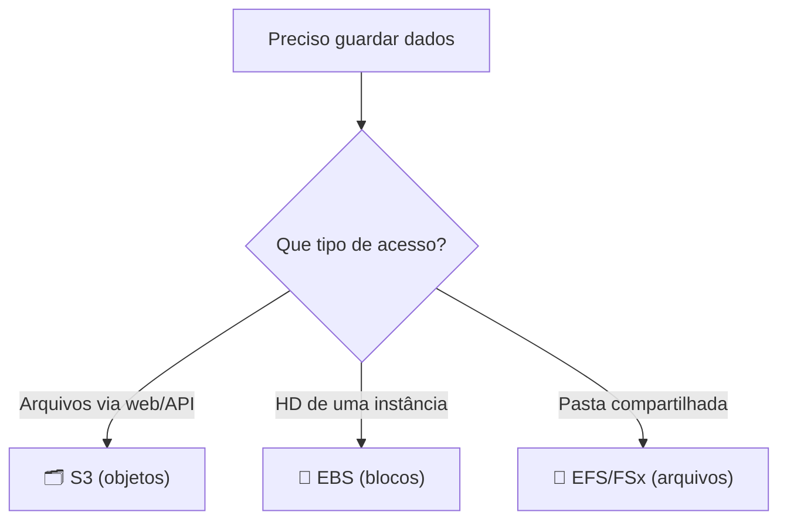

# Módulo 04 · Fundamentos de Armazenamento

> **Trilha:** Aprofundamento · **Tempo estimado:** 3h · **Pré-requisitos:** Módulo 03

## 🎯 Objetivos de aprendizagem

Ao final deste módulo, você será capaz de:

- Diferenciar armazenamento de **objetos, blocos e arquivos** em profundidade.
- Dominar o **Amazon S3**, suas classes e recursos.
- Entender **EBS**, snapshots e **EFS**.

 

---

 

## 🧠 Conteúdo

 

### 1. Os três paradigmas de armazenamento

| Paradigma | Como organiza | Serviço | Acesso |
|:--|:--|:--|:--|
| 🗂️ **Objetos** | Arquivos + metadados, em buckets planos. | Amazon S3 | Via API/HTTP |
| 🧱 **Blocos** | "HD virtual" dividido em blocos. | Amazon EBS | Anexado a 1 instância |
| 📁 **Arquivos** | Hierarquia de pastas compartilhável. | Amazon EFS / FSx | Montado por várias instâncias |

 

### 2. Amazon S3 em profundidade

O **S3** guarda **objetos** em **buckets**. Cada objeto tem uma **chave** (nome), o dado e metadados. É praticamente infinito e tem **durabilidade de 11 noves** (99,999999999%).

**Recursos importantes:**

| Recurso | Para quê |
|:--|:--|
| 🔢 **Versionamento** | Guardar versões antigas de um objeto (proteção contra exclusão). |
| ♻️ **Lifecycle** | Mover objetos automaticamente entre classes (ex.: para Glacier após 90 dias). |
| 🔒 **Criptografia** | Proteger dados em repouso (SSE com KMS). |
| 🚫 **Block Public Access** | Impedir exposição acidental. |
| 🌍 **Replicação** | Copiar objetos entre Regiões/buckets. |

> [!CAUTION]
> Buckets são **privados por padrão**. Exposição pública acidental é um dos maiores incidentes de segurança na nuvem. Use o **Block Public Access** e revise permissões.

 

### 3. Classes de armazenamento do S3

| Classe | Acesso | Custo | Uso |
|:--|:--|:--|:--|
| **Standard** | Frequente | 💵💵💵 | Dados quentes |
| **Intelligent-Tiering** | Automático | Variável | Padrões incertos |
| **Standard-IA** | Infrequente | 💵💵 | Backups acessados às vezes |
| **One Zone-IA** | Infrequente, 1 AZ | 💵 | Dados recriáveis |
| **Glacier Instant/Flexible** | Arquivamento | 💵 | Arquivos frios |
| **Glacier Deep Archive** | Arquivo profundo | 💵 (mínimo) | Retenção de longo prazo |

> [!TIP]
> Regra: quanto **menos** acesso, **mais barato** guardar, porém mais lento/caro recuperar. Use **Lifecycle** para automatizar a descida das classes conforme os dados "esfriam".

 

### 4. Amazon EBS e snapshots

O **EBS** é um volume em blocos anexado a **uma** instância EC2, persistente e **zonal**. Tipos incluem SSD (uso geral, IOPS provisionado) e HDD (throughput, cold).

- 📸 **Snapshots**: backups pontuais e incrementais do volume, guardados no **S3**. A partir de um snapshot você recria volumes (até em outra AZ/Região).

 

### 5. Amazon EFS e FSx

- 📁 **EFS**: sistema de arquivos **compartilhado** por várias instâncias, elástico e regional (Linux).
- 🪟 **FSx**: sistemas de arquivos gerenciados para cargas específicas (ex.: **FSx for Windows**, **FSx for Lustre** para HPC).

 

---

 

## ❓ Quiz — teste seus conhecimentos

 

**1. Qual serviço é o armazenamento de OBJETOS, com durabilidade de 11 noves?**

- **A)** Amazon EBS.
- **B)** Amazon S3.
- **C)** Amazon EFS.
- **D)** Amazon FSx.

💡 Ver resposta

> ✅ **Resposta: B)** — O **Amazon S3** guarda objetos com **11 noves** de durabilidade.

 

**2. O que o versionamento do S3 permite?**

- **A)** Criptografar dados.
- **B)** Guardar versões antigas de um objeto, protegendo contra exclusão/alteração.
- **C)** Reduzir a latência.
- **D)** Criar instâncias.

💡 Ver resposta

> ✅ **Resposta: B)** — O **versionamento** preserva versões anteriores, protegendo contra perdas.

 

**3. Um snapshot de EBS é armazenado onde?**

- **A)** No próprio EBS.
- **B)** No S3 (de forma incremental).
- **C)** No EFS.
- **D)** Em nenhum lugar.

💡 Ver resposta

> ✅ **Resposta: B)** — Snapshots do EBS são guardados no **S3**, de forma **incremental**.

 

**4. Você precisa de uma pasta compartilhada por várias instâncias Linux. Qual serviço?**

- **A)** Amazon EBS.
- **B)** Amazon S3.
- **C)** Amazon EFS.
- **D)** Amazon Glacier.

💡 Ver resposta

> ✅ **Resposta: C)** — O **EFS** é o sistema de **arquivos compartilhado** entre várias instâncias.

 

**5. Para arquivar dados por muitos anos com o menor custo, qual classe do S3?**

- **A)** S3 Standard.
- **B)** S3 Standard-IA.
- **C)** S3 Glacier Deep Archive.
- **D)** S3 Intelligent-Tiering.

💡 Ver resposta

> ✅ **Resposta: C)** — O **Glacier Deep Archive** é a classe mais barata, para retenção de longo prazo.

 

---

 

## 🧪 Mão na massa (sem console!)

- 🔗 **AWS Skill Builder** → *"Storage Fundamentals"*.
- 🔗 **AWS SimuLearn** → jornada de **armazenamento** (S3, versionamento, classes).

 

---

 

## 📔 Glossário

| Termo | Significado |
|:--|:--|
| **Objetos / Blocos / Arquivos** | Paradigmas de armazenamento (S3 / EBS / EFS). |
| **Bucket / Chave** | Contêiner e nome de objeto no S3. |
| **Versionamento** | Guardar versões antigas de objetos. |
| **Lifecycle** | Mover objetos entre classes automaticamente. |
| **Snapshot** | Backup incremental do EBS no S3. |
| **EFS / FSx** | Sistemas de arquivos gerenciados. |

 

## ✅ Checklist de conclusão

- [ ] Li todo o conteúdo do módulo
- [ ] Diferencio objetos, blocos e arquivos
- [ ] Domino S3, classes e recursos (versionamento, lifecycle)
- [ ] Entendo EBS e snapshots
- [ ] Conheço EFS e FSx
- [ ] Fiz o quiz
- [ ] Registrei meu [Checkpoint](https://github.com/melissaalves-stack/awscloudfoundations/issues/new?template=checkpoint-de-modulo.yml)

 

---

**Precisa de ajuda?** 📊 [Checkpoint](https://github.com/melissaalves-stack/awscloudfoundations/issues/new?template=checkpoint-de-modulo.yml) · ❓ [Dúvida](https://github.com/melissaalves-stack/awscloudfoundations/issues/new?template=duvida.yml) · 📖 [Guia](../../GUIA-DO-ALUNO.md) · 🚀 [Builder Center](https://bit.ly/4w720IR)

⬅️ [Módulo 03](../03-infraestrutura-global-aws/README.md) &nbsp;·&nbsp; 🏠 [Índice do Aprofundamento](../README.md) &nbsp;·&nbsp; ➡️ [Módulo 05 · Networking e VPC](../05-networking-e-vpc/README.md)

