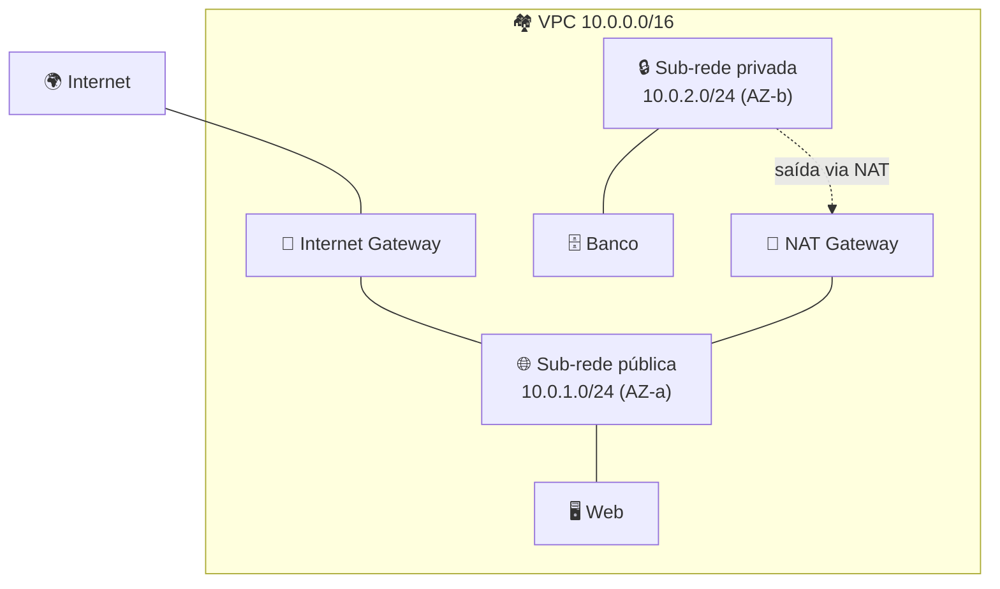

# Módulo 05 · Networking e VPC

> **Trilha:** Aprofundamento · **Tempo estimado:** 3h · **Pré-requisitos:** Módulo 04

## 🎯 Objetivos de aprendizagem

Ao final deste módulo, você será capaz de:

- Entender a **VPC** e seus componentes em profundidade.
- Diferenciar **sub-redes, tabelas de rotas, gateways**.
- Comparar **Security Groups** e **Network ACLs**.

 

---

 

## 🧠 Conteúdo

 

### 1. A VPC: sua rede isolada

A **Amazon VPC** é uma rede virtual **isolada** onde você provisiona recursos. Você define o **intervalo de IPs** (bloco CIDR, ex.: `10.0.0.0/16`) e a divide em **sub-redes**.

> [!TIP]
> **Analogia do condomínio** 🏘️: a VPC é o terreno cercado; o **CIDR** é o tamanho do terreno; as **sub-redes** são os quarteirões; os **gateways** são os portões; e os **firewalls** (SG/NACL) são as trancas.

 

### 2. Sub-redes: públicas e privadas

Cada sub-rede vive em **uma AZ** e tem um bloco de IPs. O que a torna "pública" é ter uma **rota para um Internet Gateway**.

| Tipo | Tem rota para internet? | Uso |
|:--|:--|:--|
| 🌐 Pública | Sim (via IGW) | Web servers, balanceadores |
| 🔒 Privada | Não diretamente | Bancos, backend |

 

### 3. Tabelas de rotas e gateways

| Componente | Função |
|:--|:--|
| 🗺️ **Route Table** | Define para onde o tráfego de cada sub-rede vai. |
| 🚪 **Internet Gateway (IGW)** | Liga a VPC à internet (tráfego de entrada e saída). |
| 🔀 **NAT Gateway** | Permite sub-redes privadas **saírem** à internet sem receber conexões. |
| 🔗 **VPC Endpoints** | Acessam serviços AWS (S3, DynamoDB) **sem** passar pela internet. |
| 🌉 **Peering / Transit Gateway** | Conectam VPCs entre si. |

 

### 4. Segurança de rede: SG vs. NACL

Este é **o** ponto de prova do módulo:

| | 🛡️ Security Group | 🚧 Network ACL |
|:--|:--|:--|
| Atua em | **Instância** (ENI) | **Sub-rede** |
| Estado | **Stateful** (lembra a resposta) | **Stateless** (avalia ida e volta) |
| Regras | Só **allow** | **Allow e deny** |
| Avaliação | Todas as regras | Em **ordem numerada** |

> [!IMPORTANT]
> **Stateful** (SG): se você permite a entrada, a resposta de saída é automática. **Stateless** (NACL): você precisa permitir os dois sentidos explicitamente. Essa diferença cai muito!

 

### 5. Boas práticas de rede

- 🔒 Coloque bancos e backends em **sub-redes privadas**.
- 🌐 Exponha só o necessário (web/balanceador) em **sub-redes públicas**.
- 🧱 Aplique **menor privilégio** também na rede (SGs restritos).
- 🔗 Use **VPC Endpoints** para acessar S3/DynamoDB sem sair para a internet.
- 🏢 Espalhe sub-redes por **múltiplas AZs** para alta disponibilidade.

 

---

 

## ❓ Quiz — teste seus conhecimentos

 

**1. O que torna uma sub-rede "pública"?**

- **A)** Ter um nome público.
- **B)** Ter uma rota para um Internet Gateway.
- **C)** Estar criptografada.
- **D)** Ter mais de um IP.

💡 Ver resposta

> ✅ **Resposta: B)** — Uma sub-rede é **pública** quando tem **rota para o Internet Gateway**.

 

**2. Qual componente permite que uma sub-rede privada acesse a internet para SAIR (ex.: baixar updates), sem receber conexões de fora?**

- **A)** Internet Gateway.
- **B)** NAT Gateway.
- **C)** Security Group.
- **D)** Route Table.

💡 Ver resposta

> ✅ **Resposta: B)** — O **NAT Gateway** permite saída à internet a recursos privados, sem expô-los a conexões de entrada.

 

**3. O Security Group é stateful ou stateless?**

- **A)** Stateless.
- **B)** Stateful.
- **C)** Depende da Região.
- **D)** Nenhum dos dois.

💡 Ver resposta

> ✅ **Resposta: B)** — O **SG é stateful**: se a entrada é permitida, a resposta de saída é liberada automaticamente.

 

**4. Qual afirmação sobre Network ACL está correta?**

- **A)** Atua na instância e só permite allow.
- **B)** Atua na sub-rede, é stateless e permite regras de allow e deny.
- **C)** É igual ao Security Group.
- **D)** Só funciona com IPv6.

💡 Ver resposta

> ✅ **Resposta: B)** — A **NACL** atua na **sub-rede**, é **stateless** e aceita **allow e deny**.

 

**5. Para acessar o S3 sem passar pela internet pública, você usa...**

- **A)** Um VPC Endpoint.
- **B)** Um Internet Gateway.
- **C)** Um Security Group.
- **D)** Um NAT Gateway.

💡 Ver resposta

> ✅ **Resposta: A)** — Um **VPC Endpoint** conecta a serviços da AWS sem sair para a internet.

 

---

 

## 🧪 Mão na massa (sem console!)

- 🔗 **AWS Skill Builder** → *"Networking Fundamentals"* e *"Amazon VPC"*.
- 🔗 Desenhe uma VPC `10.0.0.0/16` com 2 sub-redes públicas e 2 privadas em AZs diferentes, marcando IGW e NAT.

 

---

 

## 📔 Glossário

| Termo | Significado |
|:--|:--|
| **VPC / CIDR** | Rede isolada / intervalo de IPs. |
| **Sub-rede** | Divisão da VPC em uma AZ (pública/privada). |
| **Route Table** | Define o destino do tráfego. |
| **IGW / NAT Gateway** | Entrada-saída à internet / só saída para privadas. |
| **VPC Endpoint** | Acesso a serviços AWS sem internet. |
| **Security Group** | Firewall da instância (stateful). |
| **Network ACL** | Firewall da sub-rede (stateless). |

 

## ✅ Checklist de conclusão

- [ ] Li todo o conteúdo do módulo
- [ ] Entendo VPC, CIDR e sub-redes
- [ ] Sei o papel de IGW, NAT e VPC Endpoints
- [ ] Diferencio Security Group (stateful) de NACL (stateless)
- [ ] Conheço boas práticas de rede
- [ ] Fiz o quiz
- [ ] Registrei meu [Checkpoint](https://github.com/melissaalves-stack/awscloudfoundations/issues/new?template=checkpoint-de-modulo.yml)

 

---

**Precisa de ajuda?** 📊 [Checkpoint](https://github.com/melissaalves-stack/awscloudfoundations/issues/new?template=checkpoint-de-modulo.yml) · ❓ [Dúvida](https://github.com/melissaalves-stack/awscloudfoundations/issues/new?template=duvida.yml) · 📖 [Guia](../../GUIA-DO-ALUNO.md) · 🚀 [Builder Center](https://bit.ly/4w720IR)

⬅️ [Módulo 04](../04-fundamentos-de-armazenamento/README.md) &nbsp;·&nbsp; 🏠 [Índice do Aprofundamento](../README.md) &nbsp;·&nbsp; ➡️ [Módulo 06 · Banco de Dados — Parte 1](../06-banco-de-dados-parte-1/README.md)

