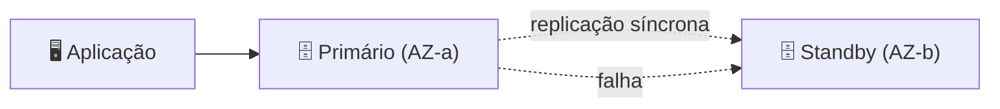

# Módulo 06 · Banco de Dados — Parte 1 (Relacional, RDS e Aurora)

> **Trilha:** Aprofundamento · **Tempo estimado:** 2h30 · **Pré-requisitos:** Módulo 05

## 🎯 Objetivos de aprendizagem

Ao final deste módulo, você será capaz de:

- Entender bancos **relacionais** e o modelo de tabelas.
- Dominar o **Amazon RDS**: engines, Multi-AZ e réplicas de leitura.
- Conhecer o **Amazon Aurora**.

 

---

 

## 🧠 Conteúdo

 

### 1. O modelo relacional

Um banco **relacional** organiza dados em **tabelas** (linhas e colunas), com relações entre elas, e usa **SQL** para consultas. É ideal quando os dados têm estrutura bem definida e integridade importa (ex.: sistema bancário, e-commerce).

> [!TIP]
> Pense em **planilhas conectadas**: uma tabela de Clientes se relaciona com uma de Pedidos pelo `id do cliente`. O banco garante que essas relações fiquem **consistentes**.

 

### 2. Amazon RDS: bancos relacionais gerenciados

O **Amazon RDS** roda os principais engines sem você gerenciar o servidor:

| Engine | Observação |
|:--|:--|
| MySQL | Popular e open source |
| PostgreSQL | Robusto, muito usado |
| MariaDB | Fork do MySQL |
| Oracle | Comercial |
| SQL Server | Microsoft |

A AWS cuida de **provisionamento, patches, backups e recuperação** — você foca nos dados e no acesso.

 

### 3. Alta disponibilidade: Multi-AZ

O **Multi-AZ** cria uma **cópia em espera (standby)** do banco em **outra AZ**, com replicação síncrona. Se o principal falha, a AWS faz **failover automático** para o standby.

> [!IMPORTANT]
> **Multi-AZ = alta disponibilidade** (failover automático), **não** é para escalar leitura. O standby fica em espera; você não lê dele em condições normais.

 

### 4. Escalando leitura: Read Replicas

As **réplicas de leitura (read replicas)** são cópias **somente leitura** que aliviam o banco principal, distribuindo consultas pesadas de leitura.

| Recurso | Objetivo |
|:--|:--|
| 🛟 **Multi-AZ** | Disponibilidade (failover) |
| 📖 **Read Replica** | Desempenho de leitura (escalar consultas) |

> [!NOTE]
> Não confunda: **Multi-AZ** protege contra falhas; **Read Replicas** escalam a leitura. Alguns cenários usam os dois juntos.

 

### 5. Amazon Aurora

O **Aurora** é o banco relacional da AWS, compatível com **MySQL e PostgreSQL**, porém com desempenho superior (até 5x MySQL) e armazenamento que **cresce automaticamente**. Replica os dados em **6 cópias** por 3 AZs, com recuperação rápida.

> [!TIP]
> Escolha **Aurora** quando quiser o poder do relacional com alta disponibilidade e desempenho de nuvem "nativos", pagando um pouco mais. Escolha **RDS padrão** para compatibilidade direta com um engine específico e custo menor.

 

---

 

## ❓ Quiz — teste seus conhecimentos

 

**1. Qual característica define um banco relacional?**

- **A)** Guarda dados sem estrutura.
- **B)** Organiza dados em tabelas com relações, usando SQL.
- **C)** Só funciona serverless.
- **D)** Não permite consultas.

💡 Ver resposta

> ✅ **Resposta: B)** — Bancos **relacionais** usam **tabelas com relações** e **SQL**.

 

**2. Para que serve o Multi-AZ no RDS?**

- **A)** Escalar leitura.
- **B)** Alta disponibilidade, com standby em outra AZ e failover automático.
- **C)** Reduzir custos.
- **D)** Criptografar dados.

💡 Ver resposta

> ✅ **Resposta: B)** — **Multi-AZ** = **alta disponibilidade** com **failover automático** para o standby.

 

**3. Você quer distribuir consultas de leitura pesadas. O que usar?**

- **A)** Multi-AZ.
- **B)** Read Replicas.
- **C)** Snapshot.
- **D)** NAT Gateway.

💡 Ver resposta

> ✅ **Resposta: B)** — **Read Replicas** escalam a **leitura**, aliviando o banco principal.

 

**4. O Amazon Aurora é compatível com quais engines?**

- **A)** Oracle e SQL Server.
- **B)** MySQL e PostgreSQL.
- **C)** MongoDB.
- **D)** Nenhum.

💡 Ver resposta

> ✅ **Resposta: B)** — O **Aurora** é compatível com **MySQL e PostgreSQL**, com desempenho superior.

 

**5. No RDS, quem é responsável por aplicar patches no sistema operacional do banco?**

- **A)** O cliente.
- **B)** A AWS (é um serviço gerenciado).
- **C)** Ninguém.
- **D)** O usuário final.

💡 Ver resposta

> ✅ **Resposta: B)** — No RDS (gerenciado), a **AWS** cuida do SO e patches; você cuida dos dados e do acesso.

 

---

 

## 🧪 Mão na massa (sem console!)

- 🔗 **AWS Skill Builder** → *"Database Fundamentals — Part 1"* e *"Amazon RDS"*.
- 🔗 Desenhe um RDS Multi-AZ com uma read replica e explique o papel de cada componente.

 

---

 

## 📔 Glossário

| Termo | Significado |
|:--|:--|
| **Relacional / SQL** | Dados em tabelas com relações. |
| **Amazon RDS** | Banco relacional gerenciado. |
| **Multi-AZ** | Standby em outra AZ para failover (HA). |
| **Read Replica** | Cópia de leitura para escalar consultas. |
| **Amazon Aurora** | Banco relacional da AWS (MySQL/PostgreSQL). |

 

## ✅ Checklist de conclusão

- [ ] Li todo o conteúdo do módulo
- [ ] Entendo o modelo relacional
- [ ] Conheço os engines do RDS
- [ ] Diferencio Multi-AZ (HA) de Read Replica (leitura)
- [ ] Sei o que é o Aurora
- [ ] Fiz o quiz
- [ ] Registrei meu [Checkpoint](https://github.com/melissaalves-stack/awscloudfoundations/issues/new?template=checkpoint-de-modulo.yml)

 

---

**Precisa de ajuda?** 📊 [Checkpoint](https://github.com/melissaalves-stack/awscloudfoundations/issues/new?template=checkpoint-de-modulo.yml) · ❓ [Dúvida](https://github.com/melissaalves-stack/awscloudfoundations/issues/new?template=duvida.yml) · 📖 [Guia](../../GUIA-DO-ALUNO.md) · 🚀 [Builder Center](https://bit.ly/4w720IR)

⬅️ [Módulo 05](../05-networking-e-vpc/README.md) &nbsp;·&nbsp; 🏠 [Índice do Aprofundamento](../README.md) &nbsp;·&nbsp; ➡️ [Módulo 07 · Banco de Dados — Parte 2](../07-banco-de-dados-parte-2/README.md)

