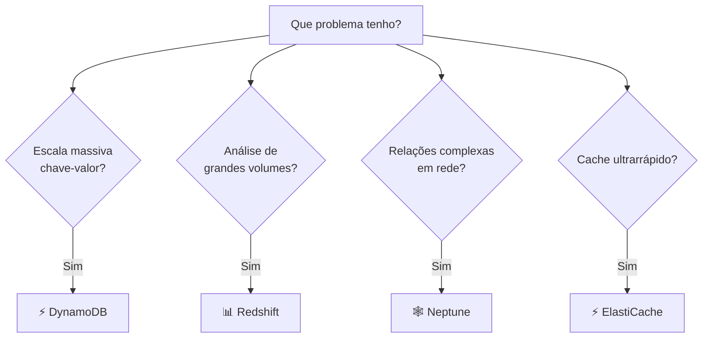

# Módulo 07 · Banco de Dados — Parte 2 (NoSQL, DynamoDB e especializados)

> **Trilha:** Aprofundamento · **Tempo estimado:** 2h30 · **Pré-requisitos:** Módulo 06

## 🎯 Objetivos de aprendizagem

Ao final deste módulo, você será capaz de:

- Entender bancos **não relacionais (NoSQL)** e seus tipos.
- Dominar o **Amazon DynamoDB**.
- Reconhecer os bancos **especializados** da AWS.

 

---

 

## 🧠 Conteúdo

 

### 1. Por que NoSQL?

Bancos **NoSQL** abrem mão da rigidez das tabelas em troca de **flexibilidade** e **escala massiva**. São ideais quando os dados variam de formato, o volume é enorme e a velocidade em qualquer escala é essencial.

| Tipo de NoSQL | Estrutura | Exemplo AWS |
|:--|:--|:--|
| 🔑 **Chave-valor** | Pares chave→valor | DynamoDB |
| 📄 **Documento** | JSON/documentos | DocumentDB |
| ⚡ **Em memória** | Cache rápido | ElastiCache |
| 🕸️ **Grafo** | Nós e relações | Neptune |
| 📊 **Colunar/Wide** | Colunas dinâmicas | Keyspaces (Cassandra) |

 

### 2. Amazon DynamoDB em detalhe

O **DynamoDB** é um banco **chave-valor e documento**, **serverless**, com desempenho em **milissegundos de um dígito** em **qualquer escala**. Não há servidores para gerenciar.

**Conceitos:**

| Conceito | O que é |
|:--|:--|
| 🗝️ **Partition Key** | Chave que distribui os itens (essencial para escala). |
| 📑 **Item / Atributo** | "Linha" e seus campos (flexíveis). |
| ⚙️ **On-Demand vs. Provisioned** | Pagar por uso ou por capacidade reservada. |
| 🌍 **Global Tables** | Replicação multi-Região ativa-ativa. |
| ⚡ **DAX** | Cache em memória para leituras ainda mais rápidas. |

> [!IMPORTANT]
> O **DynamoDB** brilha em cargas de altíssima escala e baixa latência (carrinhos, sessões, jogos, IoT). Como é **serverless**, ele escala praticamente sem limites — mas o **design da partition key** é crucial para o desempenho.

 

### 3. Bancos especializados

Cada problema tem um banco ideal na AWS:

| Serviço | Especialidade | Quando usar |
|:--|:--|:--|
| ⚡ **ElastiCache** | Cache (Redis/Memcached) | Respostas ultrarrápidas, aliviar o banco |
| 📊 **Redshift** | Data warehouse | Análise de grandes volumes (BI) |
| 🕸️ **Neptune** | Grafos | Redes sociais, recomendações, fraude |
| 📄 **DocumentDB** | Documentos (Mongo) | Apps orientados a documentos |
| ⏱️ **Timestream** | Séries temporais | IoT, métricas ao longo do tempo |
| 🔐 **QLDB** | Ledger imutável | Registros auditáveis e imutáveis |

> [!TIP]
> Filosofia da AWS: **"purpose-built databases"** — o banco certo para cada trabalho, em vez de forçar tudo em um só. Reconhecer o propósito de cada um é o que a prova pede.

 

---

 

## ❓ Quiz — teste seus conhecimentos

 

**1. Qual é a principal vantagem dos bancos NoSQL?**

- **A)** Rigidez de esquema.
- **B)** Flexibilidade e escala massiva.
- **C)** Só funcionam com SQL.
- **D)** Não escalam.

💡 Ver resposta

> ✅ **Resposta: B)** — NoSQL oferece **flexibilidade** e **escala massiva**, trocando a rigidez das tabelas.

 

**2. O DynamoDB é...**

- **A)** Um banco relacional gerenciado.
- **B)** Um banco NoSQL serverless de chave-valor/documento, com latência em milissegundos.
- **C)** Um data warehouse.
- **D)** Um serviço de cache apenas.

💡 Ver resposta

> ✅ **Resposta: B)** — O **DynamoDB** é **NoSQL serverless**, rápido e altamente escalável.

 

**3. Qual serviço é um data warehouse para análise de grandes volumes (BI)?**

- **A)** Amazon Neptune.
- **B)** Amazon Redshift.
- **C)** Amazon DynamoDB.
- **D)** Amazon ElastiCache.

💡 Ver resposta

> ✅ **Resposta: B)** — O **Redshift** é o **data warehouse** para BI.

 

**4. Para modelar relações complexas (rede social, detecção de fraude), qual banco?**

- **A)** Amazon Neptune.
- **B)** Amazon Redshift.
- **C)** Amazon RDS.
- **D)** Amazon Timestream.

💡 Ver resposta

> ✅ **Resposta: A)** — O **Neptune** é o banco de **grafos**, ideal para relações complexas.

 

**5. Qual recurso do DynamoDB oferece cache em memória para leituras ainda mais rápidas?**

- **A)** Global Tables.
- **B)** DAX (DynamoDB Accelerator).
- **C)** Partition Key.
- **D)** Multi-AZ.

💡 Ver resposta

> ✅ **Resposta: B)** — O **DAX** é o cache em memória do DynamoDB, acelerando leituras.

 

---

 

## 🧪 Mão na massa (sem console!)

- 🔗 **AWS Skill Builder** → *"Database Fundamentals — Part 2"* e *"Amazon DynamoDB"*.
- 🔗 Para 5 cenários (carrinho de compras, dashboard de vendas, rede social, cache de sessão, séries de IoT), escolha o banco ideal.

 

---

 

## 📔 Glossário

| Termo | Significado |
|:--|:--|
| **NoSQL** | Banco flexível e escalável (chave-valor, documento, grafo...). |
| **DynamoDB** | NoSQL serverless de chave-valor/documento. |
| **Partition Key** | Chave que distribui os itens no DynamoDB. |
| **Global Tables / DAX** | Replicação multi-Região / cache em memória. |
| **Redshift / Neptune / ElastiCache** | Warehouse / grafos / cache. |
| **Purpose-built databases** | O banco certo para cada tipo de problema. |

 

## ✅ Checklist de conclusão

- [ ] Li todo o conteúdo do módulo
- [ ] Entendo NoSQL e seus tipos
- [ ] Domino os conceitos do DynamoDB
- [ ] Reconheço os bancos especializados
- [ ] Sei escolher o banco certo por cenário
- [ ] Fiz o quiz
- [ ] Registrei meu [Checkpoint](https://github.com/melissaalves-stack/awscloudfoundations/issues/new?template=checkpoint-de-modulo.yml)

 

---

**Precisa de ajuda?** 📊 [Checkpoint](https://github.com/melissaalves-stack/awscloudfoundations/issues/new?template=checkpoint-de-modulo.yml) · ❓ [Dúvida](https://github.com/melissaalves-stack/awscloudfoundations/issues/new?template=duvida.yml) · 📖 [Guia](../../GUIA-DO-ALUNO.md) · 🚀 [Builder Center](https://bit.ly/4w720IR)

⬅️ [Módulo 06](../06-banco-de-dados-parte-1/README.md) &nbsp;·&nbsp; 🏠 [Índice do Aprofundamento](../README.md) &nbsp;·&nbsp; ➡️ [Módulo 08 · Responsabilidade Compartilhada](../08-modelo-responsabilidade-compartilhada/README.md)

