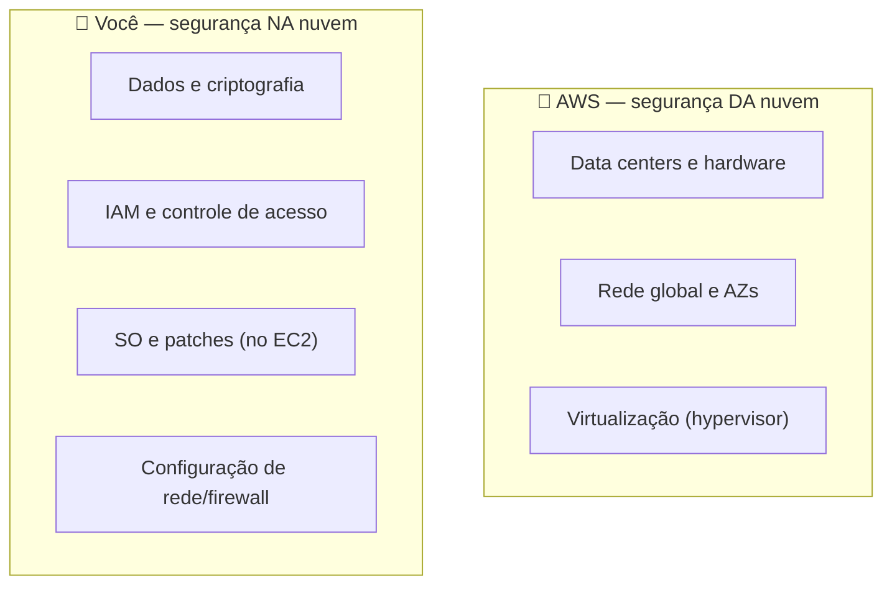

# Módulo 08 · Modelo de Responsabilidade Compartilhada

> **Trilha:** Aprofundamento · **Tempo estimado:** 2h30 · **Pré-requisitos:** Módulo 07

## 🎯 Objetivos de aprendizagem

Ao final deste módulo, você será capaz de:

- Explicar em profundidade o **Modelo de Responsabilidade Compartilhada**.
- Mapear a divisão por **tipo de serviço** (IaaS, PaaS, gerenciado).
- Aplicar o modelo a cenários reais.

 

---

 

## 🧠 Conteúdo

 

### 1. Segurança "da" nuvem vs. "na" nuvem

Na AWS, a segurança é **compartilhada**:

- 🏢 **AWS** → segurança **DA** nuvem (infraestrutura física, hardware, rede, virtualização).
- 👤 **Você** → segurança **NA** nuvem (dados, acesso, configuração, aplicações).

 

### 2. A linha se move conforme o serviço

A divisão **não é fixa** — depende de quão gerenciado é o serviço:

| Serviço | Você gerencia | A AWS gerencia |
|:--|:--|:--|
| 🖥️ **EC2** (IaaS) | SO, patches, apps, dados, acesso | Hardware, rede, virtualização |
| 🗄️ **RDS** (gerenciado) | Dados, acesso, config do banco | SO, patches do banco, infra |
| ⚡ **Lambda / S3** (serverless/gerenciado) | Dados, permissões, código | Quase toda a infraestrutura |

> [!IMPORTANT]
> Regra de ouro: quanto **mais gerenciado** o serviço, **menos** cabe a você. Mas **seus dados** e o **controle de acesso (IAM)** são **sempre** sua responsabilidade — em todos os serviços.

 

### 3. Exemplos práticos

| Situação | Responsável |
|:--|:--|
| Incêndio no data center | 🏢 AWS |
| Bucket S3 exposto por má configuração | 👤 Você |
| Patch de segurança no SO de um EC2 | 👤 Você |
| Patch no SO do host do RDS | 🏢 AWS |
| Senha fraca de um usuário IAM | 👤 Você |
| Falha física de um disco | 🏢 AWS |

> [!CAUTION]
> A maioria dos incidentes reais na nuvem vem de **erros de configuração do cliente** (buckets públicos, permissões amplas, senhas fracas) — não de falhas da AWS. Por isso, dominar IAM e configuração é vital.

 

### 4. Segurança como responsabilidade contínua

Segurança não é "configurar uma vez". Envolve **monitorar** (CloudTrail, CloudWatch, GuardDuty), **auditar** (Config, Artifact) e **melhorar** continuamente — sempre dentro da sua parte do modelo.

 

---

 

## ❓ Quiz — teste seus conhecimentos

 

**1. A AWS é responsável por qual camada?**

- **A)** Configurar suas permissões IAM.
- **B)** A segurança "DA" nuvem (infraestrutura física, rede, virtualização).
- **C)** Criptografar seus dados por você.
- **D)** Aplicar patches no SO das suas instâncias EC2.

💡 Ver resposta

> ✅ **Resposta: B)** — A AWS cuida da segurança **"DA" nuvem** (infraestrutura).

 

**2. Em uma instância EC2, quem aplica patches no sistema operacional?**

- **A)** A AWS.
- **B)** Você (o cliente).
- **C)** Ninguém.
- **D)** O provedor de internet.

💡 Ver resposta

> ✅ **Resposta: B)** — No **EC2 (IaaS)**, o **cliente** gerencia SO e patches.

 

**3. O que é SEMPRE responsabilidade do cliente, em qualquer serviço?**

- **A)** A refrigeração do data center.
- **B)** Seus dados e o controle de acesso (IAM).
- **C)** A rede global.
- **D)** O hypervisor.

💡 Ver resposta

> ✅ **Resposta: B)** — **Dados** e **IAM** são sempre do cliente, em todos os serviços.

 

**4. Um bucket S3 exposto por má configuração é responsabilidade de quem?**

- **A)** Da AWS.
- **B)** Do cliente.
- **C)** De ninguém.
- **D)** Do fabricante do disco.

💡 Ver resposta

> ✅ **Resposta: B)** — **Configuração** e proteção de dados são do **cliente**.

 

**5. À medida que um serviço fica mais gerenciado (ex.: Lambda), a responsabilidade do cliente...**

- **A)** Aumenta.
- **B)** Diminui (a AWS assume mais da infraestrutura).
- **C)** Fica idêntica ao EC2.
- **D)** Desaparece totalmente.

💡 Ver resposta

> ✅ **Resposta: B)** — Quanto **mais gerenciado**, **menos** o cliente gerencia (mas dados e acesso continuam sendo dele).

 

---

 

## 🧪 Mão na massa (sem console!)

- 🔗 **AWS Skill Builder** → *"Shared Responsibility Model"*.
- 🔗 Monte uma tabela para EC2, RDS, S3 e Lambda listando o que é da AWS e o que é seu em cada um.

 

---

 

## 📔 Glossário

| Termo | Significado |
|:--|:--|
| **Responsabilidade Compartilhada** | Divisão de deveres de segurança AWS × cliente. |
| **Segurança "da" nuvem** | Infraestrutura (AWS). |
| **Segurança "na" nuvem** | Dados, acesso e config (cliente). |
| **Serviço gerenciado** | A AWS assume mais responsabilidades. |
| **Erro de configuração** | Causa comum de incidentes (do cliente). |

 

## ✅ Checklist de conclusão

- [ ] Li todo o conteúdo do módulo
- [ ] Diferencio segurança "da" e "na" nuvem
- [ ] Entendo como a linha muda por tipo de serviço
- [ ] Sei que dados e IAM são sempre do cliente
- [ ] Classifico cenários reais
- [ ] Fiz o quiz
- [ ] Registrei meu [Checkpoint](https://github.com/melissaalves-stack/awscloudfoundations/issues/new?template=checkpoint-de-modulo.yml)

 

---

**Precisa de ajuda?** 📊 [Checkpoint](https://github.com/melissaalves-stack/awscloudfoundations/issues/new?template=checkpoint-de-modulo.yml) · ❓ [Dúvida](https://github.com/melissaalves-stack/awscloudfoundations/issues/new?template=duvida.yml) · 📖 [Guia](../../GUIA-DO-ALUNO.md) · 🚀 [Builder Center](https://bit.ly/4w720IR)

⬅️ [Módulo 07](../07-banco-de-dados-parte-2/README.md) &nbsp;·&nbsp; 🏠 [Índice do Aprofundamento](../README.md) &nbsp;·&nbsp; ➡️ [Módulo 09 · IAM — Acesso Seguro](../09-iam-acesso-seguro/README.md)

