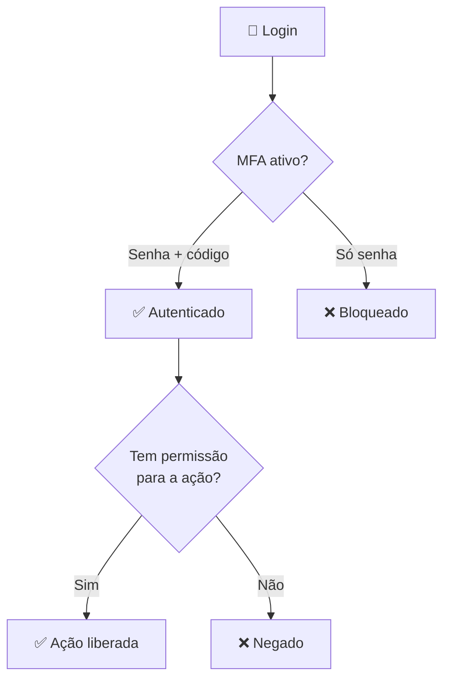

# Módulo 09 · IAM — Acesso Seguro

> **Trilha:** Aprofundamento · **Tempo estimado:** 2h30 · **Pré-requisitos:** Módulo 08

## 🎯 Objetivos de aprendizagem

Ao final deste módulo, você será capaz de:

- Diferenciar **autenticação** e **autorização**.
- Entender o **usuário root** e como protegê-lo.
- Compreender o papel central do **IAM** na segurança.

 

---

 

## 🧠 Conteúdo

 

### 1. IAM: o porteiro da AWS

O **IAM (Identity and Access Management)** controla **quem** pode acessar a AWS e **o que** pode fazer. É **global**, **gratuito** e a primeira linha de defesa da sua conta.

 

### 2. Autenticação vs. autorização

| Conceito | Pergunta | Exemplo |
|:--|:--|:--|
| 🔑 **Autenticação** | "Quem é você?" | Login com senha + MFA |
| 🚪 **Autorização** | "O que você pode fazer?" | Permissão para ler um bucket |

> [!TIP]
> **Analogia do prédio:** a **autenticação** é o crachá que prova quem você é; a **autorização** define quais portas o crachá abre. Você pode entrar no prédio e mesmo assim não ter acesso à sala de servidores.

 

### 3. O usuário root: poder absoluto

Ao criar a conta, nasce o **usuário root** — com acesso **irrestrito**. Ele é poderoso e perigoso.

> [!CAUTION]
> **Nunca** use o root no dia a dia. Proteja-o com **senha forte + MFA**, guarde as credenciais e crie **usuários IAM** para o trabalho cotidiano.

Tarefas que **só** o root faz: fechar a conta, mudar o plano de suporte, alterar o e-mail/nome da conta e algumas configurações de faturamento.

 

### 4. As camadas de proteção

> [!IMPORTANT]
> Segurança de acesso robusta combina: **MFA** (autenticação forte) + **menor privilégio** (autorização mínima) + **não usar o root**. Esses três pilares aparecem em toda a trilha de IAM.

 

### 5. Menor privilégio: a regra de ouro

> [!IMPORTANT]
> Conceda a cada identidade **apenas** as permissões necessárias — nada além. Menos permissões = menor superfície de ataque se a conta for comprometida.

 

---

 

## ❓ Quiz — teste seus conhecimentos

 

**1. O IAM é um serviço de que escopo e custo?**

- **A)** Regional e pago.
- **B)** Global e gratuito.
- **C)** Zonal e pago.
- **D)** Global e pago.

💡 Ver resposta

> ✅ **Resposta: B)** — O **IAM** é **global** e **gratuito**.

 

**2. Qual a diferença entre autenticação e autorização?**

- **A)** São iguais.
- **B)** Autenticação prova quem você é; autorização define o que você pode fazer.
- **C)** Autorização faz login; autenticação define permissões.
- **D)** Ambas significam "criptografar".

💡 Ver resposta

> ✅ **Resposta: B)** — **Autenticação** = identidade; **autorização** = permissões.

 

**3. Por que não usar o usuário root no dia a dia?**

- **A)** Ele é lento.
- **B)** Tem acesso irrestrito; se comprometido, o estrago é total.
- **C)** Não tem permissões.
- **D)** Custa mais caro.

💡 Ver resposta

> ✅ **Resposta: B)** — O root tem **poder total**; deve ser protegido e reservado para tarefas específicas.

 

**4. Qual dessas tarefas SÓ o root pode fazer?**

- **A)** Criar um bucket S3.
- **B)** Fechar a conta AWS.
- **C)** Lançar uma instância EC2.
- **D)** Ler um objeto do S3.

💡 Ver resposta

> ✅ **Resposta: B)** — **Fechar a conta** é uma das tarefas exclusivas do **root**.

 

**5. O que é o princípio do menor privilégio?**

- **A)** Dar acesso de administrador a todos.
- **B)** Conceder apenas as permissões estritamente necessárias.
- **C)** Bloquear todos os acessos.
- **D)** Usar sempre o root.

💡 Ver resposta

> ✅ **Resposta: B)** — **Menor privilégio** = só as permissões necessárias, reduzindo riscos.

 

---

 

## 🧪 Mão na massa (sem console!)

- 🔗 **AWS Skill Builder** → *"Introduction to AWS IAM"*.
- 🔗 **AWS Builder Labs** → pratique proteger o root com MFA e criar o primeiro usuário IAM (ambiente pronto).

 

---

 

## 📔 Glossário

| Termo | Significado |
|:--|:--|
| **IAM** | Gerenciamento de identidade e acesso (global, gratuito). |
| **Autenticação** | Provar a identidade. |
| **Autorização** | Definir o que a identidade pode fazer. |
| **Usuário root** | Identidade "dona" da conta, acesso total. |
| **MFA** | Autenticação multifator. |
| **Menor privilégio** | Só as permissões necessárias. |

 

## ✅ Checklist de conclusão

- [ ] Li todo o conteúdo do módulo
- [ ] Diferencio autenticação e autorização
- [ ] Sei proteger o usuário root
- [ ] Entendo MFA e menor privilégio
- [ ] Reconheço tarefas exclusivas do root
- [ ] Fiz o quiz
- [ ] Registrei meu [Checkpoint](https://github.com/melissaalves-stack/awscloudfoundations/issues/new?template=checkpoint-de-modulo.yml)

 

---

**Precisa de ajuda?** 📊 [Checkpoint](https://github.com/melissaalves-stack/awscloudfoundations/issues/new?template=checkpoint-de-modulo.yml) · ❓ [Dúvida](https://github.com/melissaalves-stack/awscloudfoundations/issues/new?template=duvida.yml) · 📖 [Guia](../../GUIA-DO-ALUNO.md) · 🚀 [Builder Center](https://bit.ly/4w720IR)

⬅️ [Módulo 08](../08-modelo-responsabilidade-compartilhada/README.md) &nbsp;·&nbsp; 🏠 [Índice do Aprofundamento](../README.md) &nbsp;·&nbsp; ➡️ [Módulo 10 · IAM — Usuários e Credenciais](../10-iam-usuarios-e-credenciais/README.md)

