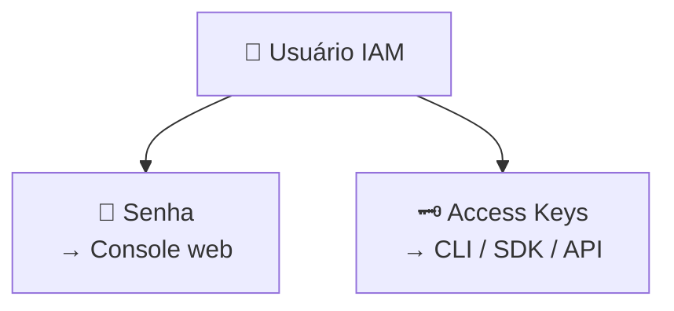

# Módulo 10 · IAM — Usuários e Credenciais

> **Trilha:** Aprofundamento · **Tempo estimado:** 2h · **Pré-requisitos:** Módulo 09

## 🎯 Objetivos de aprendizagem

Ao final deste módulo, você será capaz de:

- Entender o que é um **usuário IAM** e seus tipos de credencial.
- Diferenciar **senha** (console) de **chaves de acesso** (programático).
- Aplicar boas práticas de **MFA** e rotação de credenciais.

 

---

 

## 🧠 Conteúdo

 

### 1. O que é um usuário IAM

Um **usuário IAM** é uma identidade para uma **pessoa** ou **aplicação** que interage com a AWS. Cada usuário tem suas **próprias credenciais** e **permissões**.

> [!TIP]
> Regra: **um usuário por pessoa**. Nunca compartilhe um mesmo usuário entre várias pessoas — isso quebra a auditoria (você não sabe quem fez o quê).

 

### 2. Dois tipos de credencial

| Tipo | Para quê | Como se parece |
|:--|:--|:--|
| 🔑 **Senha** | Acessar o **Console** (navegador). | Uma senha comum. |
| 🗝️ **Chaves de acesso** | Acesso **programático** (CLI, SDK, API). | Access Key ID + Secret Access Key. |

> [!CAUTION]
> A **Secret Access Key** aparece **uma única vez** na criação — guarde-a com segurança. **Nunca** a coloque em código, repositórios públicos ou mensagens. Chaves vazadas são uma das principais causas de contas comprometidas.

 

### 3. MFA: a segunda camada

O **MFA (Multi-Factor Authentication)** adiciona uma segunda prova além da senha — geralmente um código temporário de um app (ex.: Authy, Google Authenticator) ou chave física.

> [!IMPORTANT]
> Ative MFA para o **root** e para **todos os usuários** com acesso ao console, principalmente os com permissões sensíveis. Mesmo que a senha vaze, sem o segundo fator o acesso é bloqueado.

 

### 4. Boas práticas de credenciais

- ✅ **Um usuário por pessoa** (nunca compartilhar).
- ✅ **MFA** sempre que possível.
- ✅ **Rotacionar** chaves de acesso periodicamente.
- ✅ **Remover** credenciais não usadas.
- ✅ Preferir **roles** a chaves fixas para aplicações (próximo módulo).
- ✅ Definir uma **política de senhas** forte (tamanho mínimo, complexidade, expiração).

> [!NOTE]
> O **IAM Credentials Report** lista todas as credenciais da conta e seu status (última utilização, MFA ativo, idade das chaves) — ótimo para auditoria e limpeza.

 

---

 

## ❓ Quiz — teste seus conhecimentos

 

**1. Qual credencial é usada para acesso PROGRAMÁTICO (CLI, SDK, API)?**

- **A)** Senha do console.
- **B)** Chaves de acesso (Access Key ID + Secret Access Key).
- **C)** Número de telefone.
- **D)** Endereço de e-mail.

💡 Ver resposta

> ✅ **Resposta: B)** — As **chaves de acesso** servem para acesso programático (CLI/SDK/API).

 

**2. Boa prática: quantas pessoas devem usar um mesmo usuário IAM?**

- **A)** Quantas quiserem.
- **B)** Apenas uma (um usuário por pessoa).
- **C)** No máximo cinco.
- **D)** Toda a equipe.

💡 Ver resposta

> ✅ **Resposta: B)** — **Um usuário por pessoa** — essencial para auditoria e responsabilização.

 

**3. O que acontece com a Secret Access Key após a criação?**

- **A)** Fica visível para sempre no console.
- **B)** É exibida uma única vez; depois não é mais recuperável.
- **C)** É enviada por e-mail toda semana.
- **D)** É pública.

💡 Ver resposta

> ✅ **Resposta: B)** — A **Secret Key** aparece **uma vez**; guarde-a com segurança (não dá para recuperá-la depois).

 

**4. O que o MFA acrescenta à segurança?**

- **A)** Uma segunda prova de identidade além da senha.
- **B)** Mais espaço de armazenamento.
- **C)** Uma Região extra.
- **D)** Um desconto na fatura.

💡 Ver resposta

> ✅ **Resposta: A)** — O **MFA** adiciona um **segundo fator** (ex.: código do app), protegendo mesmo se a senha vazar.

 

**5. Qual recurso ajuda a auditar credenciais (MFA, idade das chaves, último uso)?**

- **A)** IAM Credentials Report.
- **B)** Amazon S3.
- **C)** AWS Budgets.
- **D)** Amazon Polly.

💡 Ver resposta

> ✅ **Resposta: A)** — O **IAM Credentials Report** lista credenciais e seu status para auditoria.

 

---

 

## 🧪 Mão na massa (sem console!)

- 🔗 **AWS Skill Builder** → *"IAM Users and Credentials"*.
- 🔗 **AWS Builder Labs** → pratique criar um usuário, definir senha, habilitar MFA e gerar/rotacionar chaves (ambiente pronto).

 

---

 

## 📔 Glossário

| Termo | Significado |
|:--|:--|
| **Usuário IAM** | Identidade para pessoa ou aplicação. |
| **Senha** | Credencial para o Console web. |
| **Chaves de acesso** | Credencial para CLI/SDK/API. |
| **Secret Access Key** | Parte secreta das chaves (exibida uma vez). |
| **MFA** | Autenticação multifator. |
| **Credentials Report** | Relatório de auditoria de credenciais. |

 

## ✅ Checklist de conclusão

- [ ] Li todo o conteúdo do módulo
- [ ] Entendo o que é um usuário IAM
- [ ] Diferencio senha e chaves de acesso
- [ ] Sei proteger a Secret Access Key
- [ ] Entendo MFA e rotação de credenciais
- [ ] Fiz o quiz
- [ ] Registrei meu [Checkpoint](https://github.com/melissaalves-stack/awscloudfoundations/issues/new?template=checkpoint-de-modulo.yml)

 

---

**Precisa de ajuda?** 📊 [Checkpoint](https://github.com/melissaalves-stack/awscloudfoundations/issues/new?template=checkpoint-de-modulo.yml) · ❓ [Dúvida](https://github.com/melissaalves-stack/awscloudfoundations/issues/new?template=duvida.yml) · 📖 [Guia](../../GUIA-DO-ALUNO.md) · 🚀 [Builder Center](https://bit.ly/4w720IR)

⬅️ [Módulo 09](../09-iam-acesso-seguro/README.md) &nbsp;·&nbsp; 🏠 [Índice do Aprofundamento](../README.md) &nbsp;·&nbsp; ➡️ [Módulo 11 · IAM — Grupos e Roles](../11-iam-grupos-e-roles/README.md)

