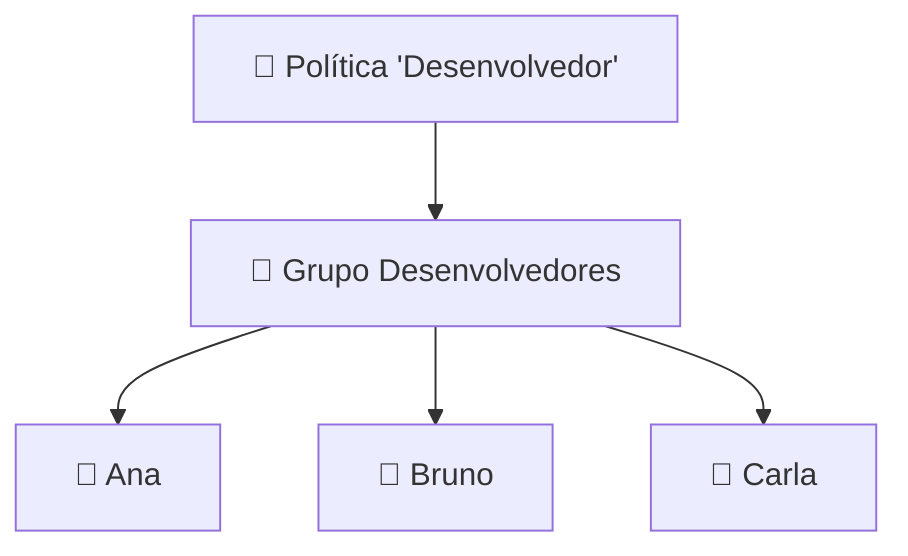
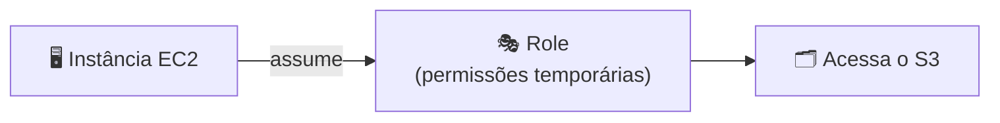

# Módulo 11 · IAM — Grupos e Roles

> **Trilha:** Aprofundamento · **Tempo estimado:** 2h30 · **Pré-requisitos:** Módulo 10

## 🎯 Objetivos de aprendizagem

Ao final deste módulo, você será capaz de:

- Entender **grupos** IAM e por que facilitam a gestão.
- Compreender **roles (funções)** e o acesso temporário.
- Saber quando usar grupo, usuário ou role.

 

---

 

## 🧠 Conteúdo

 

### 1. Grupos: organizando permissões

Um **grupo IAM** reúne usuários que compartilham as **mesmas permissões**. Em vez de dar permissões um a um, você anexa a política ao **grupo** e adiciona pessoas nele.

> [!TIP]
> **Analogia dos departamentos:** em vez de definir o acesso de cada funcionário, você define o acesso do **departamento** e coloca a pessoa nele. Mudou de área? Troca de grupo. Simples e escalável.

> [!NOTE]
> Regras dos grupos: um usuário pode estar em **vários grupos**; grupos **não** podem conter outros grupos; e grupos **não têm credenciais** próprias (não "fazem login").

 

### 2. Roles: identidades temporárias

Uma **role (função)** é uma identidade **sem credenciais fixas** que pode ser **assumida** por quem precisa, ganhando permissões **temporárias**.

Ideal para:

- 🤖 **Serviços/aplicações** — um EC2 assume uma role para ler um bucket, sem chaves no código.
- 🔄 **Acesso entre contas** — uma conta assume uma role em outra.
- 👥 **Federação** — usuários de um provedor externo (Google, AD) assumem uma role.

> [!IMPORTANT]
> A grande vantagem das roles: **nada de chaves fixas**. As credenciais são **temporárias** e rotacionadas automaticamente, reduzindo muito o risco de vazamento. Para dar acesso a **aplicações**, sempre prefira **roles**.

 

### 3. Usuário, grupo ou role?

| Preciso de... | Use |
|:--|:--|
| Identidade para uma pessoa | 👤 **Usuário** (em um grupo) |
| Gerenciar permissões de várias pessoas iguais | 👥 **Grupo** |
| Dar permissões a um serviço/app | 🎭 **Role** |
| Acesso temporário ou entre contas | 🎭 **Role** |

 

### 4. Boas práticas

- ✅ Organize usuários em **grupos** por função.
- ✅ Use **roles** para aplicações e acessos temporários (nunca chaves fixas).
- ✅ Aplique **menor privilégio** em grupos e roles.
- ✅ Revise periodicamente quem está em cada grupo e quais roles existem.

 

---

 

## ❓ Quiz — teste seus conhecimentos

 

**1. Para que serve um grupo IAM?**

- **A)** Dar credenciais de login a si mesmo.
- **B)** Reunir usuários que compartilham as mesmas permissões, facilitando a gestão.
- **C)** Substituir a VPC.
- **D)** Criptografar dados.

💡 Ver resposta

> ✅ **Resposta: B)** — **Grupos** reúnem usuários com as mesmas permissões, simplificando a administração.

 

**2. Um grupo IAM pode conter outro grupo?**

- **A)** Sim, sem limite.
- **B)** Não — grupos não podem conter outros grupos.
- **C)** Só na Região de São Paulo.
- **D)** Apenas com MFA.

💡 Ver resposta

> ✅ **Resposta: B)** — Grupos **não** aninham outros grupos.

 

**3. Qual a principal vantagem de uma role para aplicações?**

- **A)** Usar chaves fixas no código.
- **B)** Fornecer credenciais temporárias e rotacionadas, sem chaves fixas.
- **C)** Ser mais barata.
- **D)** Dar acesso de root.

💡 Ver resposta

> ✅ **Resposta: B)** — Roles dão **credenciais temporárias** automáticas, eliminando o risco de chaves fixas.

 

**4. Uma instância EC2 precisa ler um bucket S3. Qual a forma segura?**

- **A)** Colocar Access Keys no código.
- **B)** A instância assumir uma role com permissão para o S3.
- **C)** Usar o usuário root.
- **D)** Tornar o bucket público.

💡 Ver resposta

> ✅ **Resposta: B)** — A instância deve **assumir uma role** — nunca chaves fixas no código.

 

**5. Para acesso temporário entre duas contas AWS, o que se usa?**

- **A)** Um grupo.
- **B)** Uma role (assumida entre contas).
- **C)** Um bucket.
- **D)** Uma NACL.

💡 Ver resposta

> ✅ **Resposta: B)** — **Roles** permitem acesso temporário **entre contas** (cross-account).

 

---

 

## 🧪 Mão na massa (sem console!)

- 🔗 **AWS Skill Builder** → *"IAM Groups and Roles"*.
- 🔗 **AWS Builder Labs** → pratique criar um grupo com política, adicionar usuários e criar uma role para um serviço (ambiente pronto).

 

---

 

## 📔 Glossário

| Termo | Significado |
|:--|:--|
| **Grupo IAM** | Conjunto de usuários com permissões comuns. |
| **Role (função)** | Identidade assumível, sem credenciais fixas. |
| **Assumir role** | Ganhar permissões temporárias de uma role. |
| **Cross-account** | Acesso entre contas via role. |
| **Federação** | Usuários externos assumindo roles. |

 

## ✅ Checklist de conclusão

- [ ] Li todo o conteúdo do módulo
- [ ] Entendo grupos e suas regras
- [ ] Entendo roles e acesso temporário
- [ ] Sei quando usar usuário, grupo ou role
- [ ] Sei que aplicações devem usar roles (não chaves fixas)
- [ ] Fiz o quiz
- [ ] Registrei meu [Checkpoint](https://github.com/melissaalves-stack/awscloudfoundations/issues/new?template=checkpoint-de-modulo.yml)

 

---

**Precisa de ajuda?** 📊 [Checkpoint](https://github.com/melissaalves-stack/awscloudfoundations/issues/new?template=checkpoint-de-modulo.yml) · ❓ [Dúvida](https://github.com/melissaalves-stack/awscloudfoundations/issues/new?template=duvida.yml) · 📖 [Guia](../../GUIA-DO-ALUNO.md) · 🚀 [Builder Center](https://bit.ly/4w720IR)

⬅️ [Módulo 10](../10-iam-usuarios-e-credenciais/README.md) &nbsp;·&nbsp; 🏠 [Índice do Aprofundamento](../README.md) &nbsp;·&nbsp; ➡️ [Módulo 12 · IAM — Políticas e Permissões](../12-iam-policies-e-permissoes/README.md)

