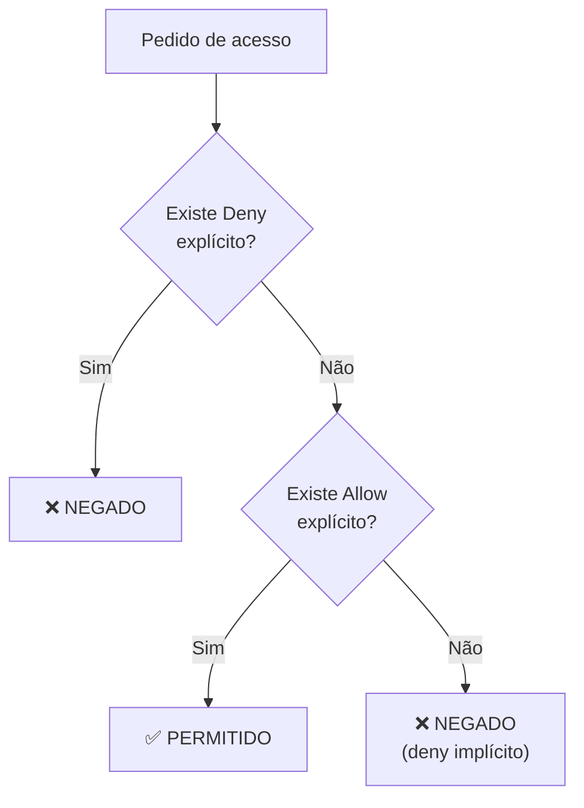

# Módulo 12 · IAM — Políticas e Permissões

> **Trilha:** Aprofundamento · **Tempo estimado:** 3h · **Pré-requisitos:** Módulo 11

## 🎯 Objetivos de aprendizagem

Ao final deste módulo, você será capaz de:

- Entender a estrutura de uma **política IAM (JSON)**.
- Dominar a **lógica de avaliação** (deny explícito vence).
- Diferenciar tipos de política e aplicar o menor privilégio.

<br>

---

<br>

## 🧠 Conteúdo

<br>

### 1. O que é uma política

Uma **política (policy)** é um documento **JSON** que define **permissões** — o que uma identidade pode ou não fazer. Você anexa políticas a usuários, grupos ou roles.

<br>

### 2. Anatomia de uma política

Os elementos principais de cada declaração (**statement**):

| Elemento | O que define | Exemplo |
|:--|:--|:--|
| **Effect** | Permitir ou negar | `"Allow"` / `"Deny"` |
| **Action** | Quais ações | `"s3:GetObject"` |
| **Resource** | Sobre quais recursos | `"arn:aws:s3:::liga/*"` |
| **Condition** (opcional) | Sob quais condições | Só com MFA, só de um IP |

```json
{
  "Version": "2012-10-17",
  "Statement": [
    {
      "Effect": "Allow",
      "Action": ["s3:GetObject", "s3:ListBucket"],
      "Resource": [
        "arn:aws:s3:::relatorios-da-liga",
        "arn:aws:s3:::relatorios-da-liga/*"
      ]
    }
  ]
}
```

Lê-se: "**permitir** listar o bucket e ler seus objetos". Você não precisa escrever JSON de cabeça na prova, mas **entenda os elementos** (Effect, Action, Resource).

<br>

### 3. A lógica de avaliação (o coração do IAM)

Quando uma ação é solicitada, o IAM decide assim:



> [!IMPORTANT]
> As três regras de ouro:
> 1. **Deny explícito SEMPRE vence** (nada sobrepõe um deny).
> 2. Sem deny, um **Allow explícito** libera.
> 3. Sem allow nem deny, o padrão é **negar** (deny implícito).
>
> Ou seja: **tudo é proibido por padrão** até ser explicitamente liberado — e um deny nunca é anulado por um allow.

<br>

### 4. Tipos de política

| Tipo | O que é |
|:--|:--|
| 📦 **Gerenciadas pela AWS** | Prontas, mantidas pela AWS (ex.: `AmazonS3ReadOnlyAccess`). |
| 🛠️ **Gerenciadas pelo cliente** | Você cria e reutiliza em várias identidades. |
| 📎 **Inline** | Coladas direto em um único usuário/grupo/role. |
| 🚧 **SCP (Organizations)** | Limitam o máximo de permissões de contas inteiras. |

> [!NOTE]
> As **SCPs** (do [AWS Organizations](../../certificacao-cloud/dominio-4-cobranca-precos-e-suporte/15-ferramentas-de-custo.md)) definem o **teto** de permissões de uma conta. Mesmo que um usuário tenha um Allow, se a SCP não permite, a ação é bloqueada.

<br>

### 5. Menor privilégio na prática

> [!IMPORTANT]
> Comece **sem** permissões e adicione só o necessário. Use políticas gerenciadas para o comum, refine com políticas próprias, e valide com ferramentas como o **IAM Access Analyzer**, que identifica acessos amplos ou não intencionais.

> [!TIP]
> Dica de ouro: prefira permissões **específicas** (`s3:GetObject` em um bucket) a permissões amplas (`s3:*` em `*`). Quanto mais estreito, mais seguro.

<br>

---

<br>

## ❓ Quiz — teste seus conhecimentos

<br>

**1. Quais são os elementos principais de uma declaração de política?**

- **A)** Nome, senha e e-mail.
- **B)** Effect, Action e Resource.
- **C)** CPU, memória e rede.
- **D)** Região, AZ e sub-rede.

<details>
<summary>💡 Ver resposta</summary>

> ✅ **Resposta: B)** — Uma statement tem **Effect** (allow/deny), **Action** (o quê) e **Resource** (sobre o quê).

</details>

<br>

**2. Uma política dá `Allow` para `s3:*` e outra dá `Deny` para `s3:DeleteObject`. O usuário pode apagar objetos?**

- **A)** Sim, o Allow prevalece.
- **B)** Não, o Deny explícito sempre vence.
- **C)** Só com MFA.
- **D)** Depende da Região.

<details>
<summary>💡 Ver resposta</summary>

> ✅ **Resposta: B)** — O **Deny explícito sempre vence**. Ele faz outras ações de S3, mas não apaga objetos.

</details>

<br>

**3. Se não há Allow nem Deny para uma ação, o que acontece?**

- **A)** É permitida por padrão.
- **B)** É negada por padrão (deny implícito).
- **C)** Gera erro de sintaxe.
- **D)** É permitida só de madrugada.

<details>
<summary>💡 Ver resposta</summary>

> ✅ **Resposta: B)** — Sem Allow explícito, vale o **deny implícito**: tudo é negado por padrão.

</details>

<br>

**4. O que é uma política gerenciada pela AWS?**

- **A)** Uma política pronta e mantida pela AWS (ex.: AmazonS3ReadOnlyAccess).
- **B)** Uma política que você escreve do zero.
- **C)** Um bucket S3.
- **D)** Um tipo de instância.

<details>
<summary>💡 Ver resposta</summary>

> ✅ **Resposta: A)** — Políticas **gerenciadas pela AWS** são prontas e mantidas pela própria AWS.

</details>

<br>

**5. Mesmo com um Allow no usuário, uma ação pode ser bloqueada por...**

- **A)** Uma SCP do Organizations que não a permite.
- **B)** A cor do bucket.
- **C)** O horário de verão.
- **D)** Nada; Allow sempre libera.

<details>
<summary>💡 Ver resposta</summary>

> ✅ **Resposta: A)** — Uma **SCP** define o **teto** de permissões da conta; se ela não permite, o Allow do usuário não basta.

</details>

<br>

---

<br>

## 🧪 Mão na massa (sem console!)

- 🔗 **AWS Skill Builder** → *"IAM Policies and Permissions"*.
- 🔗 **AWS Builder Labs** → escreva uma política de menor privilégio (só leitura de um bucket) e teste a lógica allow/deny (ambiente pronto).

<br>

> [!NOTE]
> 🎉 **Parabéns! Você concluiu a trilha de Aprofundamento!** Você mergulhou em computação, redes, armazenamento, bancos de dados e todo o universo do IAM — o mesmo conteúdo que forma os líderes da AWS. Que orgulho da sua jornada! 🚀

<br>

---

<br>

## 📔 Glossário

| Termo | Significado |
|:--|:--|
| **Política (policy)** | Documento JSON que define permissões. |
| **Effect / Action / Resource** | Elementos de uma declaração. |
| **Deny explícito** | Negação que sempre vence. |
| **Deny implícito** | Padrão de negar quando não há Allow. |
| **Políticas gerenciadas / inline** | Reutilizáveis / coladas em uma identidade. |
| **SCP** | Limite máximo de permissões de contas (Organizations). |
| **IAM Access Analyzer** | Identifica acessos amplos/não intencionais. |

<br>

## ✅ Checklist de conclusão

- [ ] Li todo o conteúdo do módulo
- [ ] Entendo a estrutura de uma política (Effect, Action, Resource)
- [ ] Domino a lógica "deny explícito vence"
- [ ] Diferencio os tipos de política e SCP
- [ ] Sei aplicar o menor privilégio
- [ ] Fiz o quiz
- [ ] Registrei meu [Checkpoint](https://github.com/melissaalves-stack/awscloudfoundations/issues/new?template=checkpoint-de-modulo.yml) — **fim da trilha!** 🎉

<br>

---

<div align="center">

**Precisa de ajuda?** 📊 [Checkpoint](https://github.com/melissaalves-stack/awscloudfoundations/issues/new?template=checkpoint-de-modulo.yml) · ❓ [Dúvida](https://github.com/melissaalves-stack/awscloudfoundations/issues/new?template=duvida.yml) · 📖 [Guia](../../GUIA-DO-ALUNO.md) · 🚀 [Builder Center](https://bit.ly/4w720IR)

⬅️ [Módulo 11](../11-iam-grupos-e-roles/README.md) &nbsp;·&nbsp; 🏠 [Índice do Aprofundamento](../README.md) &nbsp;·&nbsp; 🎓 [Trilha Cloud](../../certificacao-cloud/) &nbsp;·&nbsp; 🤖 [Trilha IA](../../certificacao-ia/)

</div>
