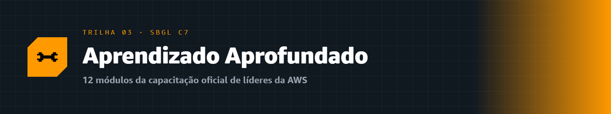
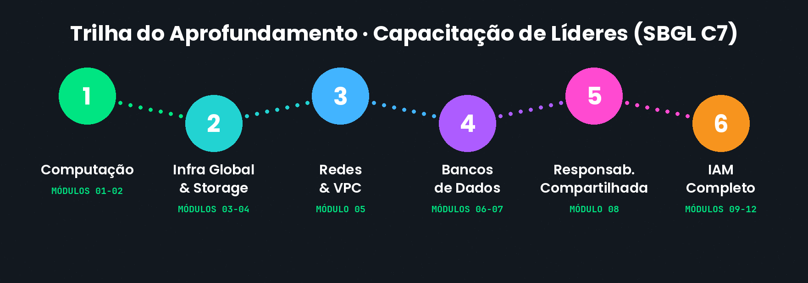
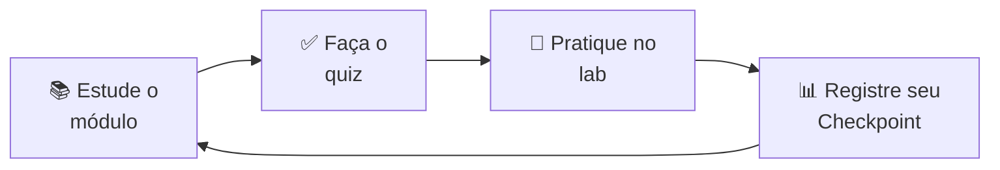

  

# 🔬 Trilha · Aprendizado Aprofundado

---

## 💪 O que é esta trilha

> [!IMPORTANT]
> Esta trilha traz o conteúdo da **capacitação oficial que os líderes da AWS recebem gratuitamente** e **precisam concluir** para permanecer no programa de líderes. Foi construída e disponibilizada pela própria **presidente da Liga**, [Melissa Alves](../sobre/README.md), **após concluir essa formação obrigatória** — porque um líder só ensina bem aquilo que domina de verdade.

Enquanto as trilhas de certificação ([Cloud](../certificacao-cloud/README.md) e [IA](../certificacao-ia/README.md)) preparam você para as provas, o **Aprofundamento** vai além: mergulha no funcionamento técnico dos serviços centrais da AWS, no mesmo formato do curso de onboarding de líderes (**SBGL C7**). É a trilha ideal para quem quer **entender de verdade** o que acontece por baixo dos panos.

> [!NOTE]
> 💡 **Pré-requisito recomendado:** ter concluído (ou estar cursando) a trilha **[Cloud Practitioner](../certificacao-cloud/README.md)**. Aqui a gente aprofunda conceitos que lá são introduzidos.

---

## 🗺️ Os 12 módulos

Doze módulos técnicos, na mesma sequência do curso oficial:

| # | Módulo | Tema |
|:--:|:--|:--|
| 01 | [Fundamentos de Computação](./01-fundamentos-de-computacao/) | EC2, AMIs, tipos e ciclo de vida de instâncias |
| 02 | [ELB e Auto Scaling](./02-elb-e-auto-scaling/) | Balanceamento de carga e escalonamento automático |
| 03 | [Infraestrutura Global da AWS](./03-infraestrutura-global-aws/) | Regiões, AZs, Edge Locations em profundidade |
| 04 | [Fundamentos de Armazenamento](./04-fundamentos-de-armazenamento/) | S3, EBS, EFS e classes de armazenamento |
| 05 | [Networking e VPC](./05-networking-e-vpc/) | VPC, sub-redes, roteamento e segurança de rede |
| 06 | [Banco de Dados — Parte 1](./06-banco-de-dados-parte-1/) | Relacional, RDS e Aurora |
| 07 | [Banco de Dados — Parte 2](./07-banco-de-dados-parte-2/) | NoSQL, DynamoDB e bancos especializados |
| 08 | [Modelo de Responsabilidade Compartilhada](./08-modelo-responsabilidade-compartilhada/) | Segurança "da" e "na" nuvem em detalhe |
| 09 | [IAM — Acesso Seguro](./09-iam-acesso-seguro/) | Autenticação, autorização e o usuário root |
| 10 | [IAM — Usuários e Credenciais](./10-iam-usuarios-e-credenciais/) | Usuários, senhas, chaves de acesso e MFA |
| 11 | [IAM — Grupos e Roles](./11-iam-grupos-e-roles/) | Organização de permissões e acessos temporários |
| 12 | [IAM — Políticas e Permissões](./12-iam-policies-e-permissoes/) | Políticas JSON e lógica de avaliação |

---

## 🎯 Como aproveitar

Cada módulo segue o mesmo padrão das outras trilhas: conteúdo didático com analogias e diagramas, **quiz de 5 perguntas de múltipla escolha**, laboratório prático e checklist. Vá no seu ritmo!

---

## 🔗 Acesso rápido

- 📊 **[Registrar Checkpoint](https://github.com/melissaalves-stack/awscloudfoundations/issues/new?template=checkpoint-de-modulo.yml)**
- ❓ **[Tirar uma Dúvida](https://github.com/melissaalves-stack/awscloudfoundations/issues/new?template=duvida.yml)**
- 📖 **[Guia do Aluno](../GUIA-DO-ALUNO.md)**
- 🚀 **[AWS Builder Center](https://bit.ly/4w720IR)**

---

🏠 [Voltar ao início](../README.md) · 🎓 [Trilha Cloud](../certificacao-cloud/) · 🤖 [Trilha IA](../certificacao-ia/) · 💜 [Sobre a Liga](../sobre/)

