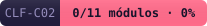
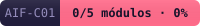
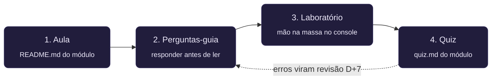
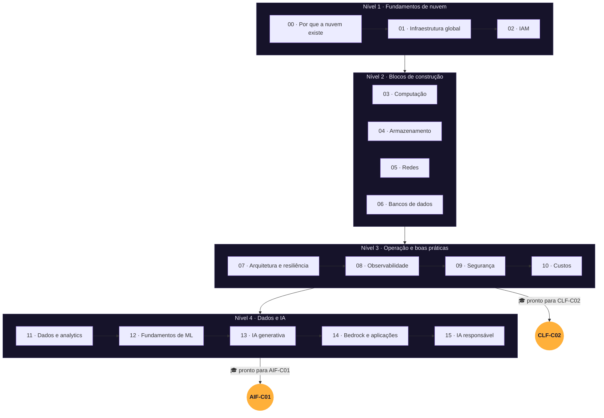

<div align="center">



<p>
  
  
  
  
  
</p>

<p>
  
  
  
</p>

<sub>Os três badges acima são gerados automaticamente a partir do seu <a href="progresso.md"><code>progresso.md</code></a> — veja <a href="#-progresso-do-curso">como funciona</a>.</sub>

</div>

<br>

Um curso prático e estruturado de computação em nuvem projetado para **aprendizado ativo**.

Este não é um material passivo para apenas ler ou decorar. Aqui, você aprende resolvendo problemas, fazendo laboratórios práticos e escrevendo suas próprias explicações. Como resultado, o conteúdo cobre 100% do escopo de duas certificações oficiais da AWS: **AWS Certified Cloud Practitioner (CLF-C02)** e **AWS Certified AI Practitioner (AIF-C01)**.

<br>

## 📖 Sumário

- [🎯 Como funciona o método de estudo](#-como-funciona-o-método-de-estudo)
- [🗺️ Trilha dos módulos](#️-trilha-dos-módulos)
- [⚡ Como praticar com os quizzes](#-como-praticar-com-os-quizzes)
- [⚠️ Alertas importantes antes de começar](#️-alertas-importantes-antes-de-começar)
- [🛠️ Estrutura do repositório](#️-estrutura-do-repositório)
- [📌 Progresso do curso](#-progresso-do-curso)

<br>

## 🎯 Como funciona o método de estudo

Cada módulo segue um ciclo de 4 etapas desenhado para fixação real:



| Parte | Onde fica | O que você vai fazer |
| --- | --- | --- |
| **1. Aula** | `README.md` do módulo | Entender a teoria a partir do problema antes da solução |
| **2. Perguntas-guia** | Dentro da aula | Tentar responder **antes** de ler o conteúdo (para ativar o cérebro) |
| **3. Laboratório** | Dentro da aula | Colocar a mão na massa direto no console da AWS |
| **4. Quiz** | `quiz.md` do módulo | Testar seus conhecimentos com questões no estilo da prova |

> 📚 O guia detalhado de estudo está em [`docs/como-usar-este-repo.md`](docs/como-usar-este-repo.md). Para entender a ciência por trás da metodologia (recuperação ativa, repetição espaçada e intercalação), consulte [`docs/metodo-de-estudo.md`](docs/metodo-de-estudo.md).

<br>

## 🗺️ Trilha dos módulos

A ordem dos módulos foi pensada por **dependência conceitual**, garantindo que você nunca veja um serviço sem antes entender a base necessária.



<details open>
<summary><b>Nível 1 · Fundamentos de nuvem</b></summary>
<br>

| # | Módulo | Tempo Est. |
| --- | --- | --- |
| 00 | [Por que a nuvem existe](modulos/00-por-que-a-nuvem-existe/) | 3h |
| 01 | [A infraestrutura global da AWS](modulos/01-infraestrutura-global/) | 3h |
| 02 | [Identidade e acesso (IAM)](modulos/02-identidade-e-acesso/) | 4h |

</details>

<details open>
<summary><b>Nível 2 · Os blocos de construção</b></summary>
<br>

| # | Módulo | Tempo Est. |
| --- | --- | --- |
| 03 | [Computação: EC2, containers e serverless](modulos/03-computacao/) | 5h |
| 04 | [Armazenamento: objetos, blocos e arquivos](modulos/04-armazenamento/) | 4h |
| 05 | [Redes: VPC, DNS e entrega de conteúdo](modulos/05-redes/) | 5h |
| 06 | [Bancos de dados gerenciados](modulos/06-bancos-de-dados/) | 4h |

</details>

<details open>
<summary><b>Nível 3 · Operação e boas práticas</b></summary>
<br>

| # | Módulo | Tempo Est. |
| --- | --- | --- |
| 07 | [Arquitetura, escala e resiliência](modulos/07-arquitetura-e-resiliencia/) | 4h |
| 08 | [Observabilidade e automação](modulos/08-observabilidade-e-automacao/) | 3h |
| 09 | [Segurança em profundidade](modulos/09-seguranca/) | 4h |
| 10 | [Custos e economia da nuvem](modulos/10-custos-e-economia/) | 3h |

> 🎓 **Concluiu até o módulo 10?** Você cobriu todo o conteúdo da prova **AWS Certified Cloud Practitioner (CLF-C02)**!

</details>

<details open>
<summary><b>Nível 4 · Dados e inteligência artificial</b></summary>
<br>

| # | Módulo | Tempo Est. |
| --- | --- | --- |
| 11 | [Dados e analytics](modulos/11-dados-e-analytics/) | 3h |
| 12 | [Fundamentos de machine learning](modulos/12-fundamentos-de-ml/) | 5h |
| 13 | [IA generativa e modelos de fundação](modulos/13-ia-generativa/) | 5h |
| 14 | [Construindo com modelos: prompt, RAG e agentes](modulos/14-bedrock-e-aplicacoes/) | 5h |
| 15 | [IA responsável e governança](modulos/15-ia-responsavel-e-governanca/) | 3h |

> 🎓 **Concluiu até o módulo 15?** Você cobriu o escopo da prova **AWS Certified AI Practitioner (AIF-C01)**!

</details>

⏱ **Carga horária total estimada:** ~63 horas. Veja o mapeamento de cada módulo para os domínios das exames em [`docs/mapa-provas.md`](docs/mapa-provas.md).

<br>

## ⚡ Como praticar com os quizzes

Você pode testar seus conhecimentos de 3 formas diferentes:

<details>
<summary><b>1. Diretamente pelo GitHub</b></summary>
<br>

Abra o arquivo `quiz.md` do módulo que deseja praticar. As alternativas usam caixas de seleção e os gabaritos explicados ficam ocultos em blocos expansíveis — clique para revelar sem se auto-sabotar.

</details>

<details>
<summary><b>2. Pelo terminal (interativo)</b></summary>
<br>

Requer Python 3.8+ instalado.

```bash
python quiz/quiz.py                 # abre o menu interativo por módulo
python quiz/quiz.py 02               # executa diretamente o quiz do módulo 02
python quiz/quiz.py 02 09            # combina questões de módulos específicos
python quiz/quiz.py --todos -n 65    # gera um simulado completo no formato da prova real
python quiz/quiz.py --errei          # executa um quiz focado apenas nas questões que você errou
python quiz/quiz.py --todos --ordem-fixa   # roda sem embaralhar, útil para revisão sequencial
```

</details>

<details>
<summary><b>3. Interface web</b></summary>
<br>

Para visualizar o quiz no navegador, com placar e progresso visual por módulo:

```bash
python3 -m http.server 8000
# acesse no seu navegador: http://localhost:8000/web/
```

</details>

<br>

## ⚠️ Alertas importantes antes de começar

1. **Proteja sua conta:** crie sua conta AWS e ative o **MFA** na conta *root* imediatamente (veja Módulo 00, Parte 3).
2. **Evite surpresas na fatura:** faça o laboratório do **Módulo 10** logo no início para configurar um *AWS Budget* de US$ 5 com alarme por e-mail.
3. **Segurança de código:** nunca suba credenciais para o Git. O arquivo `.gitignore` do projeto já bloqueia extensões críticas.
4. **Cuidado com recursos pagos:**
   - **NAT Gateway:** cobra por hora, mesmo sem uso. Exclua assim que finalizar o lab.
   - **EC2 e RDS:** lembre-se de desligar/interromper as instâncias ao encerrar sua sessão.

<br>

## 🛠️ Estrutura do repositório

```text
aws-do-zero/
├── modulos/             16 módulos: aula + laboratório + quiz
├── questoes/            Banco de questões em formato JSON
├── quiz/                Scripts do motor de simulados
├── web/                 Interface web interativa para os quizzes
├── docs/                Guias de estudo e mapeamento das exames
├── referencias/         Resumos consolidados para revisão rápida
├── anotacoes/           Espaço para suas notas pessoais (template incluído)
├── assets/              Banner e badges SVG (gerados/estáticos)
├── scripts/             Automações do repositório (ex: badges de progresso)
├── .github/workflows/   Ações que mantêm o README sempre atualizado
└── progresso.md         Seu painel individual de acompanhamento
```

<br>

## 📌 Progresso do curso

Use o painel [`progresso.md`](progresso.md) para marcar `⬜ → ✅` conforme concluir a aula, o laboratório e o quiz de cada módulo.

Isso não é só decorativo: um [GitHub Action](.github/workflows/progresso.yml) observa mudanças em `progresso.md` e roda [`scripts/gerar_badges.py`](scripts/gerar_badges.py) automaticamente, recalculando os três badges no topo deste README (progresso geral, CLF-C02 e AIF-C01). Basta commitar seu progresso — o painel se atualiza sozinho.

Quer testar localmente antes de commitar?

```bash
python scripts/gerar_badges.py
```

- [ ] Módulos 00 a 10 concluídos
- [ ] Pontuação de 85%+ em 3 simulados da CLF-C02
- [ ] **Aprovação na certificação AWS CLF-C02** 🎯
- [ ] Módulos 11 a 15 concluídos
- [ ] Pontuação de 85%+ em 3 simulados da AIF-C01
- [ ] **Aprovação na certificação AWS AIF-C01** 🎯

<br>

<div align="center">

Bons estudos e mão na massa! 🚀

</div>
