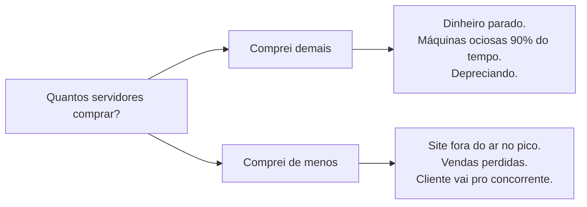

# Módulo 00 — Por que a nuvem existe

`CLF-C02 D1` · ⏱ ~3h · [◀ índice](../../README.md)

> **Status:** `[ ] não iniciado` · `[ ] estudando` · `[ ] concluído` · `[ ] revisado`

---

## Por que este módulo existe

Quase todo material de AWS começa listando serviços. Isso produz pessoas que sabem que o S3 existe mas não sabem por que alguém inventaria o S3. Aqui a ordem é outra: primeiro o problema, depois a solução.

Se você entender bem este módulo, os 15 seguintes viram consequência lógica. Se pular, eles viram lista de decoreba.

## O que você vai saber fazer no fim

- [ ] Explicar computação em nuvem para alguém de fora da computação, sem jargão
- [ ] Explicar por que CapEx vs OpEx muda decisões de **engenharia**, não só de finanças
- [ ] Distinguir IaaS, PaaS e SaaS com exemplos que você mesmo escolheu
- [ ] Explicar a diferença entre escalabilidade e elasticidade sem hesitar
- [ ] Listar os 6 benefícios da nuvem AWS e dar um exemplo concreto de cada um
- [ ] Argumentar, com números, um caso em que a nuvem é a **pior** escolha

## Perguntas-guia

Responda de cabeça **antes** de ler o resto. Você vai errar — é esse o mecanismo.

1. "A nuvem é o computador de outra pessoa" é uma piada correta. Por que ela é incompleta?
2. Uma loja online vende 10× mais na Black Friday. Como ela resolvia isso em 2005? E hoje?
3. Existe algum cenário em que rodar seu próprio servidor é objetivamente mais barato? Qual?
4. Por que "elasticidade" e "escalabilidade" não são sinônimos?

---

# A aula

## 1. O problema: capacidade é uma aposta

Imagine que você é responsável pela infraestrutura de uma loja online em 2005. Você precisa comprar servidores. E aí surge a pergunta que não tem resposta boa:

**Quantos servidores comprar?**

Você tem duas formas de errar:

E o pior: a decisão é **irreversível em prazo curto**. Comprar servidor leva semanas. Instalar leva mais. Se você errou, você conviveu com o erro por três anos, que é o tempo de amortização do equipamento.

Note uma coisa importante: esse não é um problema de dinheiro. É um problema de **informação**. Você precisa decidir hoje uma capacidade que só será conhecida daqui a dois anos.

> **A tese central da computação em nuvem:** transformar uma decisão de capacidade (arriscada, irreversível, antecipada) em uma decisão de consumo (reversível, contínua, ajustável).

Todo o resto — todos os 200+ serviços da AWS — é consequência disso.

## 2. A tecnologia que tornou isso possível: virtualização

A nuvem não foi inventada por causa de uma ideia de negócio. Ela ficou possível por causa de uma tecnologia: **virtualização**.

Um servidor físico roda um *hypervisor*, um software que fatia aquele hardware em várias máquinas virtuais isoladas. Cada VM acha que é um computador inteiro. Na prática, dez clientes diferentes podem estar no mesmo metal sem se enxergarem.

Isso resolve o problema econômico do provedor: ele compra hardware em escala industrial, mantém taxa de utilização alta juntando cargas de milhares de clientes com picos em horários diferentes, e revende fatias por hora ou por segundo.

**A AWS existe porque a Amazon tinha esse problema em casa.** Ela precisava de capacidade para o pico da Black Friday e ficava com essa capacidade ociosa nos outros 11 meses. Em 2006 começou a alugar a sobra. Hoje a AWS é o principal motor de lucro operacional do grupo.

## 3. CapEx vs OpEx — e por que isso é assunto de engenharia

- **CapEx** (despesa de capital): você compra o ativo. Sai caro de uma vez, vira patrimônio, deprecia ao longo dos anos.
- **OpEx** (despesa operacional): você paga pelo uso. Sai do caixa mês a mês, não vira patrimônio.

O curso de contabilidade para aqui. Mas para você, que vai escrever código, a consequência é outra e é mais interessante:

**Quando a infraestrutura vira OpEx, experimentar fica barato.**

Testar uma ideia nova em 2005 exigia aprovar orçamento, comprar servidor, esperar semanas. O custo de errar era alto, então só ideias com alta certeza eram testadas. Hoje você sobe um ambiente em 4 minutos, testa e destrói. O custo de errar caiu para centavos.

Isso muda a cultura de engenharia inteira: infraestrutura como código, ambientes efêmeros, CI/CD, testes A/B em produção. Nada disso faz sentido num mundo CapEx. **A nuvem não mudou só onde o servidor fica — mudou o custo de estar errado.**

## 4. Definição formal

> Computação em nuvem é a entrega sob demanda de recursos de TI pela internet, com pagamento conforme o uso.

Quebrando os três pedaços:

- **Sob demanda** — você provisiona sozinho, na hora, sem falar com ninguém
- **Pela internet** — via API, CLI ou console; o recurso físico não é seu problema
- **Pagamento conforme o uso** — por segundo, por requisição, por GB armazenado

### Os 6 benefícios da nuvem AWS

Estes seis aparecem na prova quase com essas palavras. Mas não decore a lista — perceba que cada um é consequência direta da seção 1.

1. **Trocar despesa de capital por despesa variável** — pague só pelo que consumir
2. **Beneficiar-se de economias de escala massivas** — a AWS compra hardware num volume que você jamais teria
3. **Parar de adivinhar capacidade** — escale para cima e para baixo conforme a demanda real
4. **Aumentar velocidade e agilidade** — recursos em minutos, não semanas
5. **Parar de gastar dinheiro mantendo data centers** — nada de refrigeração, energia, segurança física, racks
6. **Tornar-se global em minutos** — implante em várias regiões do mundo com poucos cliques

> 🎯 **Na prova:** questões que citam "reduzir tempo até o mercado", "não precisar prever demanda" ou "sem investimento inicial" estão testando esta lista.

## 5. IaaS, PaaS, SaaS — o eixo do controle

A diferença entre os três é **quanto da pilha você gerencia**.

| Camada | On-premises | IaaS | PaaS | SaaS |
|---|---|---|---|---|
| Aplicação | você | você | você | fornecedor |
| Dados | você | você | você | fornecedor |
| Runtime | você | você | fornecedor | fornecedor |
| Sistema operacional | você | você | fornecedor | fornecedor |
| Virtualização | você | fornecedor | fornecedor | fornecedor |
| Hardware e rede | você | fornecedor | fornecedor | fornecedor |

- **IaaS** — Infraestrutura como Serviço. Você recebe a máquina virtual crua. Máximo controle, máxima responsabilidade. → **EC2, VPC, EBS**
- **PaaS** — Plataforma como Serviço. Você entrega o código, a plataforma cuida do resto. → **Elastic Beanstalk, RDS, Lambda**
- **SaaS** — Software como Serviço. Produto pronto, você só usa. → **Gmail, Dropbox, Amazon WorkMail**

Uma forma de lembrar, com pizza: IaaS = você recebe massa e ingredientes. PaaS = a pizza vem congelada, você só assa. SaaS = a pizza chega pronta na porta.

**A pegadinha:** não existe "melhor" entre os três. Existe o certo para o caso. Mais controle sempre custa mais trabalho; mais conveniência sempre custa flexibilidade.

## 6. Modelos de implantação

- **Nuvem (cloud-native)** — tudo roda na AWS
- **Híbrido** — parte na AWS, parte no seu data center, ligados por Direct Connect, VPN, Storage Gateway ou Outposts. Comum em bancos, governo e empresas com legado pesado
- **On-premises / nuvem privada** — infraestrutura própria, possivelmente virtualizada. Continua sendo a escolha certa em alguns casos (seção 8)

## 7. O vocabulário que a prova adora confundir

Estes quatro termos parecem sinônimos e não são. Leia devagar.

**Escalabilidade** — a capacidade de crescer para atender mais demanda.
- *Vertical (scale up)* — trocar por uma máquina maior. Tem teto físico e geralmente exige reiniciar.
- *Horizontal (scale out)* — adicionar mais máquinas. Praticamente sem teto. É o modelo preferido na nuvem.

**Elasticidade** — crescer **e encolher** automaticamente conforme a demanda. Um sistema pode ser escalável sem ser elástico: se você precisa clicar num botão para adicionar servidores, é escalável; se ele adiciona e remove sozinho às 3h da manhã, é elástico. **Elasticidade é o que gera economia real**, porque o que economiza dinheiro é o *encolher*.

**Agilidade** — a velocidade com que você consegue experimentar. É consequência da seção 3.

**Alta disponibilidade** — o sistema continua no ar apesar de falhas. Na AWS isso quase sempre significa distribuir entre múltiplas Zonas de Disponibilidade (módulo 01).

## 8. Quando a nuvem é a escolha errada

Esta seção não cai na prova. Está aqui porque você é estudante de computação e merece a versão honesta.

A nuvem sai mais cara que hardware próprio quando:

- **A carga é altíssima, constante e previsível.** Sem picos você não usa elasticidade — está pagando o prêmio de um seguro que nunca aciona. Empresas como Dropbox e Basecamp fizeram migrações de volta para hardware próprio por exatamente esse motivo.
- **Você move volumes gigantes de dados para fora.** Entrada é grátis, saída é cobrada. Em CDN e streaming essa conta domina todas as outras.
- **Você já tem data center pago e equipe treinada.** O CapEx já foi feito; migrar joga fora um ativo.

E há custos que não aparecem na fatura: **aprisionamento tecnológico** (uma aplicação profundamente acoplada a serviços gerenciados não migra fácil) e **complexidade** (são mais de 200 serviços; a superfície de configuração errada é enorme, e a maioria dos vazamentos em nuvem é bucket mal configurado, não falha da AWS).

> Saber disso te deixa melhor na prova, não pior. As questões de otimização de custos testam exatamente esse julgamento.

---

## Laboratório

**Sem console neste módulo.** O exercício é de raciocínio, e vale mais do que parece.

### Parte 1 — o ponto de virada

Um servidor razoável custa R$ 18.000, amortizado em 3 anos, mais uns R$ 200/mês de energia, refrigeração e link.

1. Calcule o custo mensal real dele.
2. Abra o [AWS Pricing Calculator](https://calculator.aws) e monte uma EC2 de porte parecido (ex.: 4 vCPU, 16 GB) rodando 24×7 em `sa-east-1`.
3. Compare. Depois refaça supondo que a máquina só é necessária 8h por dia útil (≈ 176h/mês em vez de 730h).

**A pergunta que importa:** em qual dos dois cenários a nuvem ganha, e por quê? Escreva a resposta em "Minhas anotações".

### Parte 2 — classifique

Pegue 5 serviços digitais que você usa (Spotify, GitHub, Netflix, o sistema da faculdade, o que quiser). Para cada um: é IaaS, PaaS ou SaaS **na sua perspectiva de usuário**? E na perspectiva de quem o construiu?

A segunda pergunta é a boa. O Spotify é SaaS para você e é construído sobre IaaS/PaaS. As camadas se empilham.

### Parte 3 — crie sua conta AWS

Ainda não vamos usar, mas a criação leva tempo (exige cartão de crédito e validação por telefone). Faça agora e, **assim que entrar**, ative MFA na conta root. O módulo 02 explica por quê; por ora, confie.

---

## Minhas anotações

<!-- Escreva com suas palavras. Se você não consegue escrever, você não entendeu ainda. -->

**A tese da nuvem em uma frase minha:**

_(preencher)_

**Meu cálculo do ponto de virada:**

_(preencher)_

**Um caso em que eu NÃO usaria nuvem:**

_(preencher)_

## O que ainda não entendi

- [ ]

---

**Quiz:** [`quiz.md`](quiz.md) · rode também com `python quiz/quiz.py 00`

**Próximo:** [Módulo 01 — A infraestrutura global da AWS](../01-infraestrutura-global/README.md)
