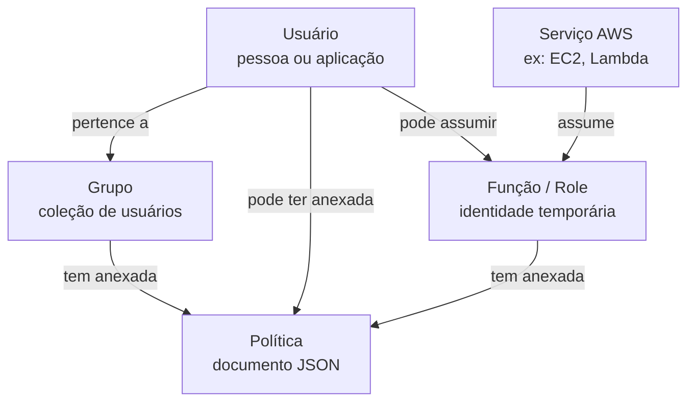
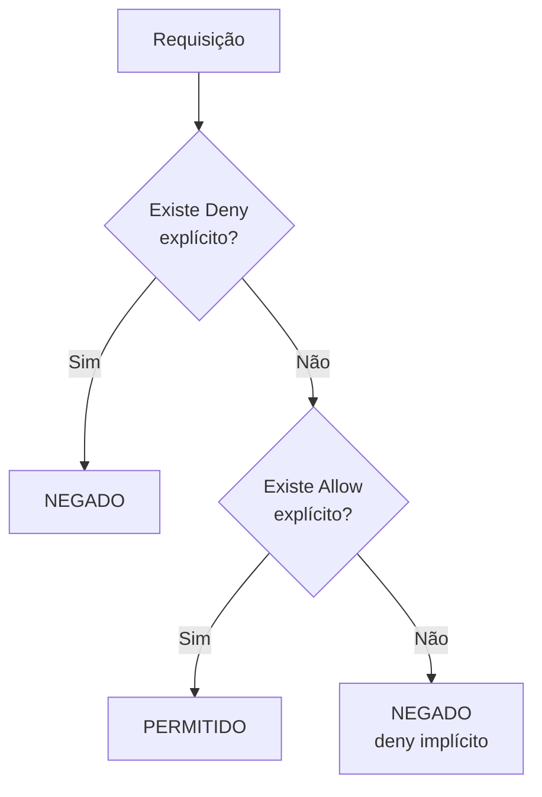

# Módulo 02 — Identidade e acesso (IAM)

`CLF-C02 D2` · `AIF-C01 D5` · ⏱ ~4h · [◀ índice](../../README.md)

> **Status:** `[ ] não iniciado` · `[ ] estudando` · `[ ] concluído` · `[ ] revisado`

---

## Por que este módulo existe

IAM é a primeira coisa que você toca em qualquer conta AWS e a causa raiz da maioria dos incidentes de segurança em nuvem. Não porque seja difícil, mas porque é chato — e as pessoas contornam o que é chato dando permissão demais.

Também é o módulo que mais aparece nas duas provas: 30% do CLF-C02 é segurança, e o domínio 5 do AIF-C01 é basicamente IAM aplicado a serviços de IA.

Se você só tiver tempo para dominar um módulo deste repositório, domine este.

## O que você vai saber fazer no fim

- [ ] Criar usuários, grupos, políticas e funções sabendo quando usar cada um
- [ ] Ler uma política IAM em JSON e dizer exatamente o que ela permite
- [ ] Escrever uma política do zero para um caso específico
- [ ] Explicar por que uma EC2 nunca deve carregar chave de acesso
- [ ] Aplicar a lógica de avaliação: deny explícito > allow explícito > deny implícito
- [ ] Explicar a diferença entre IAM, IAM Identity Center, Cognito e Directory Service

## Perguntas-guia

Tente antes de ler.

1. Qual a diferença prática entre anexar uma política a um usuário e criar uma função?
2. Uma política dá `Allow` em `s3:*` e outra dá `Deny` em `s3:DeleteObject`. O que acontece?
3. Por que se diz que uma SCP "não concede permissão"?
4. Se IAM é gratuito e global, o que isso te diz sobre onde ele roda?

---

# A aula

## 1. Autenticação não é autorização

Dois conceitos que as pessoas embolam a vida toda:

- **Autenticação** — *quem é você?* (senha, MFA, chave de acesso)
- **Autorização** — *o que você pode fazer?* (políticas)

O IAM faz os dois, mas a parte difícil é sempre a segunda. Autenticar é binário: ou você provou quem é, ou não. Autorizar é um espaço de decisões com milhares de ações possíveis.

**IAM é global e gratuito.** Global porque uma identidade precisa valer em todas as regiões — não faria sentido você ser admin em São Paulo e ninguém na Virgínia. Gratuito porque a AWS não quer que preço seja desculpa para você usar a conta root.

## 2. A conta root

Quando você cria uma conta AWS, nasce junto o usuário **root**, identificado pelo e-mail do cadastro. Ele tem poder absoluto e **não pode ser limitado** — nem por política, nem por SCP.

Por isso a regra é simples: **crie um usuário administrador e nunca mais use o root no dia a dia.**

**Ações que só o root consegue fazer** (a prova cobra esta lista):

- Alterar o plano de suporte
- Fechar a conta AWS
- Alterar e-mail, nome ou senha da conta
- Restaurar permissões de um usuário IAM que se trancou para fora
- Registrar-se como vendedor no AWS Marketplace
- Configurar pagamentos e informações fiscais

**Checklist de proteção do root, na primeira hora de vida da conta:**

1. Ative MFA (aplicativo autenticador ou chave física)
2. Não crie chaves de acesso para o root — se já existirem, apague
3. Use uma senha forte e única
4. Crie um usuário IAM administrador e faça login com ele daqui em diante

## 3. As quatro entidades do IAM



**Usuário (user)** — uma identidade permanente para uma pessoa ou aplicação. Tem credenciais fixas: senha (console) e/ou chave de acesso (API/CLI).

**Grupo (group)** — apenas uma coleção de usuários para facilitar a gestão de permissões. Dois detalhes que a prova cobra: grupos **não podem conter outros grupos**, e um grupo **não é uma identidade** (não dá para um grupo "fazer" nada nem assumir uma função).

**Política (policy)** — o documento JSON que descreve permissões. Três tipos:
- *Gerenciadas pela AWS* — prontas, mantidas pela AWS (ex.: `AmazonS3ReadOnlyAccess`). Boas para começar, geralmente amplas demais para produção
- *Gerenciadas pelo cliente* — você escreve e reutiliza em várias identidades. É o que se usa na prática
- *Inline* — coladas direto numa identidade, relação 1:1. Use pouco: são difíceis de auditar

**Função (role)** — o conceito mais importante e o menos intuitivo. É uma identidade **sem credenciais permanentes**, que alguém *assume* temporariamente. Ao assumir, recebe credenciais que expiram (via AWS STS).

## 4. Por que funções existem (a parte que importa)

Imagine uma EC2 que precisa ler um bucket S3. A solução ingênua:

```bash
# ❌ NUNCA FAÇA ISSO
aws configure
# cola AKIA... e a secret key dentro da instância
```

Por que isso é ruim:

- A chave é permanente. Se vazar, vale até alguém perceber e revogar
- Ela fica em disco, em arquivo de configuração, provavelmente também num backup e talvez num commit
- Rotacionar exige entrar em cada máquina
- Se a instância for comprometida, o atacante leva uma credencial de longa duração

Com uma função:

```bash
# ✅ A instância recebe uma role. Nenhuma chave em lugar nenhum.
aws s3 ls s3://meu-bucket   # simplesmente funciona
```

A EC2 pega credenciais temporárias no *Instance Metadata Service*, elas expiram em algumas horas e são rotacionadas automaticamente. Nada em disco, nada para vazar, nada para rotacionar à mão.

> **A regra:** se um **serviço da AWS** precisa de permissão, a resposta é sempre uma **função**. Chave de acesso é só para acesso programático de fora da AWS — e mesmo aí, o ideal é IAM Identity Center com credenciais temporárias.

Funções também servem para acesso entre contas e para federação (login com Google, Microsoft Entra, o AD da empresa).

## 5. Anatomia de uma política

```json
{
  "Version": "2012-10-17",
  "Statement": [
    {
      "Sid": "LeituraDoBucketDeRelatorios",
      "Effect": "Allow",
      "Action": [
        "s3:GetObject",
        "s3:ListBucket"
      ],
      "Resource": [
        "arn:aws:s3:::relatorios-financeiro",
        "arn:aws:s3:::relatorios-financeiro/*"
      ],
      "Condition": {
        "IpAddress": {
          "aws:SourceIp": "200.150.10.0/24"
        }
      }
    }
  ]
}
```

Campo a campo:

- **Version** — sempre `2012-10-17`. Não é a data da sua política, é a versão da linguagem
- **Sid** — identificador opcional, útil para você se achar
- **Effect** — `Allow` ou `Deny`
- **Action** — as operações de API. Aceita curinga: `s3:Get*`
- **Resource** — o ARN do recurso. Repare que aparecem **dois** ARNs acima: `bucket` (para ações no bucket, como `ListBucket`) e `bucket/*` (para ações nos objetos, como `GetObject`). Esquecer isso é o erro nº 1 de quem escreve a primeira política
- **Condition** — restrições extras: IP de origem, se tem MFA, horário, tag do recurso

### Anatomia de um ARN

```
arn:aws:s3:::relatorios-financeiro/2026/janeiro.pdf
 │   │  │  │ │          │
 │   │  │  │ │          └─ recurso
 │   │  │  │ └─ conta (vazio no S3, porque o nome é global)
 │   │  │  └─ região (vazio no S3, porque bucket é global)
 │   │  └─ serviço
 │   └─ partição (aws, aws-cn, aws-us-gov)
 └─ prefixo fixo
```

## 6. A lógica de avaliação

Esta é a pergunta clássica de prova. A ordem é:



Três regras que resolvem qualquer questão sobre isso:

1. **Tudo é negado por padrão** (deny implícito)
2. Um `Allow` explícito libera
3. Um `Deny` explícito **sempre vence**, não importa quantos `Allow` existam

Então, no cenário da pergunta-guia nº 2: `Allow s3:*` + `Deny s3:DeleteObject` = você pode fazer tudo no S3 **exceto** apagar objetos.

## 7. Menor privilégio na prática

O princípio é fácil de enunciar e difícil de seguir: **conceda apenas as permissões necessárias para a tarefa, e nada mais**.

O que ajuda na vida real:

- Comece restritivo e vá abrindo conforme quebra, não o contrário
- Use o **IAM Access Analyzer**, que lê o CloudTrail e gera uma política baseada no que a identidade **realmente usou**
- Prefira condições a permissões amplas: em vez de dar acesso a todos os buckets, dê acesso aos buckets com uma tag específica
- Revise as **credenciais não usadas** (o IAM mostra o "último acesso" de cada permissão)

**Anti-padrão que você vai ver em todo tutorial da internet:** anexar `AdministratorAccess` porque "assim funciona". Funciona mesmo — e é como a maioria das contas é comprometida.

## 8. Quem é quem no zoológico de identidade

Confusão frequente e cobrada:

- **IAM** — identidades **dentro de uma conta** AWS, para quem administra recursos
- **IAM Identity Center** (antigo AWS SSO) — login único para **várias contas** AWS e aplicações; integra com AD/Entra/Okta. É a recomendação atual para acesso humano
- **Amazon Cognito** — identidade para os **usuários finais do seu aplicativo** (os clientes do seu app, não os funcionários)
- **AWS Directory Service** — Active Directory gerenciado na AWS
- **AWS STS** — o serviço que emite as credenciais temporárias por trás das funções

> Mnemônico: **IAM = funcionários. Cognito = clientes.**

## 9. AWS Organizations e SCPs

Quando a empresa tem várias contas (o normal: uma para produção, uma para desenvolvimento, uma para faturamento), o **AWS Organizations** administra todas de forma central.

- **OUs (Unidades Organizacionais)** — agrupam contas para aplicar políticas em bloco
- **Cobrança consolidada** — uma fatura só, descontos de volume agregados entre contas, Reserved Instances e Savings Plans compartilhados
- **SCPs (Service Control Policies)** — definem o **teto** de permissões de uma conta

O ponto sutil das SCPs, que a prova adora: **SCP não concede permissão, apenas limita.** Ela define o máximo que as identidades daquela conta *poderiam* ter. A permissão efetiva é a interseção:

```
permissão real = o que a política IAM permite  ∩  o que a SCP permite
```

Se a SCP bloqueia `ec2:*` e o usuário tem `AdministratorAccess`, ele **não** consegue criar EC2. E a SCP não se aplica à conta de gerenciamento da organização.

---

## Laboratório

> ⚠️ Faça o lab do [módulo 10](../10-custos-e-economia/README.md) (budget com alerta) antes, se ainda não fez.

### Parte 1 — proteger o root

1. Faça login como root, vá em **IAM > Painel** e observe as recomendações de segurança
2. Ative MFA no root
3. Verifique se existem chaves de acesso do root. Se existirem, apague

### Parte 2 — usuário e grupo

1. Crie o grupo `Desenvolvedores` com a política gerenciada `ReadOnlyAccess`
2. Crie o usuário `seu-nome-dev` com acesso ao console, dentro desse grupo
3. Saia, entre com o novo usuário e tente criar uma EC2. **Leia a mensagem de erro com atenção** — ela cita a ação e o recurso negados, e aprender a ler esse erro economiza horas no futuro

### Parte 3 — escrever uma política

1. Crie um bucket S3 chamado `lab-iam-seu-nome`
2. Escreva uma política gerenciada pelo cliente que permita **somente** `s3:GetObject` e `s3:ListBucket` **somente** nesse bucket
3. Anexe ao seu usuário e teste: `aws s3 ls s3://lab-iam-seu-nome`
4. Agora tente `aws s3 rm` num objeto. Deve falhar
5. Tente listar outro bucket. Também deve falhar

**Se o `ListBucket` funcionar mas o `GetObject` não** (ou vice-versa), você caiu na armadilha dos dois ARNs da seção 5. Volte lá.

### Parte 4 — função para uma EC2

1. Crie uma função IAM do tipo *AWS service > EC2* com a política que você escreveu
2. Suba uma `t2.micro` (Amazon Linux) e anexe a função
3. Conecte via **Session Manager** (não use SSH — você não precisa de chave nem de porta 22 aberta)
4. Rode `aws s3 ls s3://lab-iam-seu-nome` — funciona sem nenhuma credencial configurada
5. Rode `curl http://169.254.169.254/latest/meta-data/iam/security-credentials/` e veja as credenciais temporárias que a instância recebeu. **Observe a data de expiração.** Esse é o mecanismo inteiro

### Parte 5 — o Deny sempre vence

1. Anexe ao seu usuário, além da política anterior, uma política com `Deny` em `s3:ListBucket`
2. Tente listar. Confirme que o `Deny` venceu mesmo com o `Allow` presente

### Limpeza

Termine a EC2, apague o bucket, remova as políticas de teste. Mantenha o usuário administrador e o MFA.

---

## Minhas anotações

**Função vs política anexada a usuário, com minhas palavras:**

_(preencher)_

**A política que escrevi na Parte 3 e o que cada linha faz:**

_(preencher)_

**O que apareceu no metadata da instância e por que isso é mais seguro:**

_(preencher)_

## O que ainda não entendi

- [ ]

---

**Quiz:** [`quiz.md`](quiz.md) · rode também com `python quiz/quiz.py 02`

**Anterior:** [Módulo 01](../01-infraestrutura-global/README.md) · **Próximo:** [Módulo 03 — Computação](../03-computacao/README.md)
