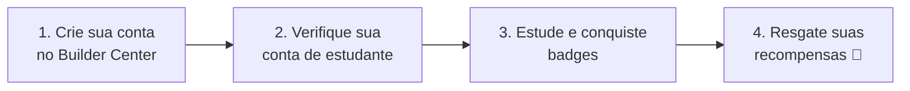

# 🎁 Chegou o AWS Student Rewards: recompensas grátis enquanto você aprende

> 📅 **21 de agosto de 2026** · por **Melissa Alves** · `Programa` `Oportunidade`

---

A AWS acabou de lançar o **AWS Student Rewards**, um programa oficial **focado em estudantes universitários** para liberar **recompensas gratuitas enquanto você aprende computação em nuvem**. Se você é da Liga, essa notícia é feita para você. 🎉

---

## 🎓 O que dá para liberar

Conforme você avança e conquista **badges** (medalhas) na plataforma, você desbloqueia recompensas de verdade:

| Conquista | Recompensa |
|:--|:--|
| 🎟️ **Ao se verificar como estudante** | **12 meses de Skill Builder Premium** — acesso a +900 cursos, labs práticos e materiais preparatórios. |
| 🏅 **Ao conquistar 7 badges** | **US$ 10** em créditos AWS. |
| 🏅 **Ao atingir 14 badges** | **+US$ 20** em créditos AWS. |
| 🏆 **Ao alcançar 21 badges** | **Voucher de US$ 100** para uma certificação oficial AWS Foundational. |

> [!IMPORTANT]
> Um voucher de **US$ 100** cobre o valor de uma prova **Foundational** — como a **Cloud Practitioner (CLF-C02)** ou a **AI Practitioner (AIF-C01)**, as duas trilhas que você estuda aqui no repositório. Ou seja: dá para estudar de graça **e** certificar de graça. 💜

---

## ✅ Quem pode participar

Basta ter **e-mail universitário ativo** para se verificar como estudante e começar a acumular os prêmios. Simples assim.

---

## 🧭 Passo a passo

1. **Crie sua conta no Builder Center** pelo link oficial da Liga: 👉 **[bit.ly/4w720IR](https://bit.ly/4w720IR)**
2. **Verifique sua conta de estudante** com seu e-mail universitário.
3. **Estude** pelas nossas trilhas e **conquiste badges** na plataforma.
4. **Resgate** os créditos e vouchers conforme atinge cada marco.

> [!TIP]
> As trilhas deste repositório foram feitas justamente para te ajudar a dominar o conteúdo das badges. Combine o estudo aqui com a prática no Skill Builder e vá acumulando conquistas. 🚀

---

## 💡 A dica da presidente

> "Aproveitem cada badge como um degrau. O programa transforma o seu estudo em recompensa real — e, no fim, em uma certificação oficial no seu currículo. Não deixem essa oportunidade passar." — **Melissa Alves**, fundadora e presidente da Liga

---

## 🔗 Links úteis

- 🚀 **[Entrar no AWS Builder Center (link da Liga)](https://bit.ly/4w720IR)**
- 🎓 **[Trilha Cloud Practitioner](../certificacao-cloud/)** — rumo à CLF-C02
- 🤖 **[Trilha AI Practitioner](../certificacao-ia/)** — rumo à AIF-C01
- 📖 **[Guia do Aluno](../GUIA-DO-ALUNO.md)**

---

`#AWS` `#CloudComputing` `#StudentRewards` `#AWSEducation` `#CarreiraTech` `#Tecnologia`

---

📰 [Voltar às Novidades](./README.md) · 🏠 [Início](../README.md)

