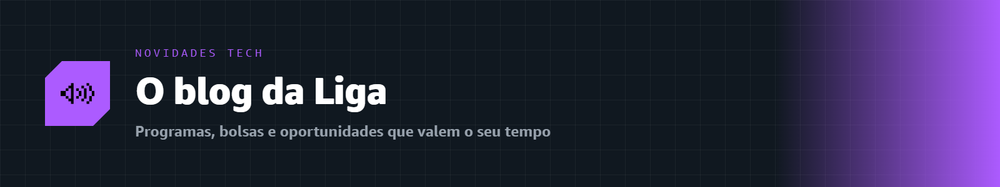

  

# 📰 Novidades Tech

### O "blog" da Liga Acadêmica SBG · UNIFAL-MG

Novidades, programas, oportunidades e tudo que rola no mundo Cloud & IA. 🚀

---

Aqui a gente compartilha o que há de novo no ecossistema AWS e na comunidade: novos programas, oportunidades para estudantes, lançamentos, dicas de carreira e recados da Liga. Passe por aqui de vez em quando para não perder nada! ✨

---

## 🗞️ Últimas publicações

| Data | Post | Tema |
|:--:|:--|:--|
| 21/08/2026 | **[🎁 Chegou o AWS Student Rewards: recompensas grátis enquanto você aprende](./2026-08-21-aws-student-rewards.md)** | `Programa` `Oportunidade` |

> [!TIP]
> Quer sugerir uma pauta para as Novidades Tech? Abra uma **[Discussion](https://github.com/melissaalves-stack/awscloudfoundations/discussions)** com sua ideia!

---

🏠 [Voltar ao início](../README.md) · 📖 [Guia do Aluno](../GUIA-DO-ALUNO.md) · 💜 [Sobre a Liga](../sobre/)

