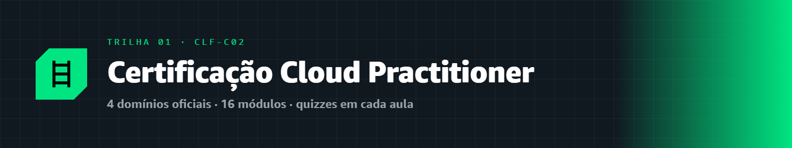
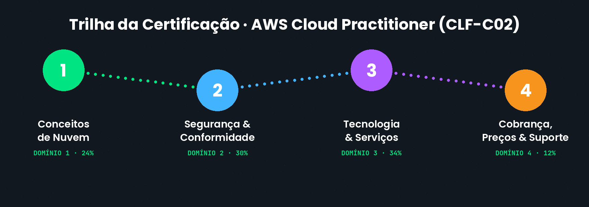
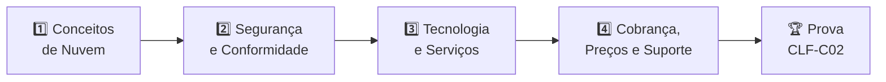

  

# 🎓 Trilha · Certificação AWS Cloud Practitioner (CLF-C02)

---

Esta é a trilha completa rumo à **AWS Certified Cloud Practitioner (CLF-C02)** — a certificação de entrada da AWS, que valida seu conhecimento fundamental sobre a nuvem. Ela é organizada **exatamente nos 4 domínios oficiais do exame**, para que seu estudo espelhe a prova de verdade.

> [!NOTE]
> 📋 **Sobre a prova:** são **65 questões** (50 valem nota) em **90 minutos**, de múltipla escolha e múltipla resposta. A nota de aprovação é **700 de 1000**. O exame custa **US$ 100** (e você pode zerar esse custo com o voucher do [AWS Student Rewards](../blog/2026-08-21-aws-student-rewards.md)! 🎁).

---

## 🗺️ Os 4 domínios da certificação

Cada domínio é um "bloco" real da prova, com seu peso oficial. Dentro de cada domínio há **níveis**, e cada nível reúne **módulos** (as aulas).

### 1️⃣ [Domínio 1 · Conceitos de Nuvem](./dominio-1-conceitos-de-nuvem/) &nbsp; `24% da prova`
O que é a nuvem, por que ela existe, como a AWS organiza sua infraestrutura pelo mundo e os frameworks que guiam boas decisões.

### 2️⃣ [Domínio 2 · Segurança e Conformidade](./dominio-2-seguranca-e-conformidade/) &nbsp; `30% da prova`
O modelo de responsabilidade compartilhada, identidade e acesso (IAM), proteção de dados e conformidade. **O maior peso depois de Tecnologia.**

### 3️⃣ [Domínio 3 · Tecnologia e Serviços](./dominio-3-tecnologia-e-servicos/) &nbsp; `34% da prova`
Os serviços centrais da AWS: computação, armazenamento, redes, bancos de dados, além de escalabilidade e alta disponibilidade. **O maior domínio da prova.**

### 4️⃣ [Domínio 4 · Cobrança, Preços e Suporte](./dominio-4-cobranca-precos-e-suporte/) &nbsp; `12% da prova`
Modelos de preço, ferramentas de custo, planos de suporte e onde buscar ajuda.

---

## 🎯 Como seguir a trilha

1. Estude os domínios **em ordem** (eles se apoiam uns nos outros).
2. Faça o **quiz** ao final de cada módulo.
3. Pratique com o **laboratório** sugerido no final de cada nível.
4. Registre seu **[Checkpoint](https://github.com/melissaalves-stack/awscloudfoundations/issues/new?template=checkpoint-de-modulo.yml)** a cada módulo concluído.

> [!TIP]
> Antes de começar, garanta que você já entrou na comunidade pelo **[AWS Builder Center](https://bit.ly/4w720IR)**. É de lá que saem as badges e recompensas do [Student Rewards](../blog/2026-08-21-aws-student-rewards.md)!

---

## 🔗 Acesso rápido

- 📊 **[Registrar Checkpoint](https://github.com/melissaalves-stack/awscloudfoundations/issues/new?template=checkpoint-de-modulo.yml)**
- ❓ **[Tirar uma Dúvida](https://github.com/melissaalves-stack/awscloudfoundations/issues/new?template=duvida.yml)**
- 📖 **[Guia do Aluno](../GUIA-DO-ALUNO.md)**
- 🚀 **[AWS Builder Center](https://bit.ly/4w720IR)**

---

🏠 [Voltar ao início](../README.md) · 🤖 [Trilha AI Practitioner](../certificacao-ia/) · 🔬 [Aprofundamento](../aprofundamento/)

