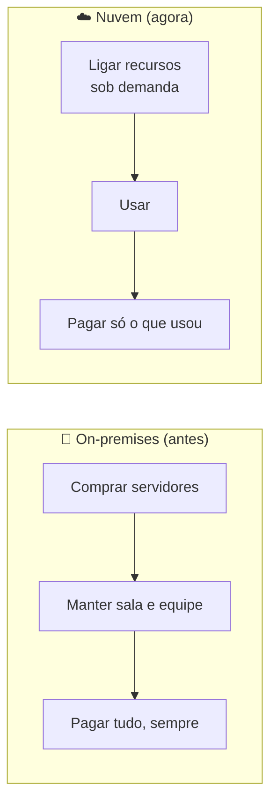

# Módulo 00 · Por que a nuvem existe

> **Domínio:** 1 · Conceitos de Nuvem · **Tempo estimado:** 3h · **Pré-requisitos:** nenhum

## 🎯 Objetivos de aprendizagem

Ao final deste módulo, você será capaz de:

- Explicar o problema que existia **antes** da computação em nuvem.
- Definir o que é computação em nuvem com suas próprias palavras.
- Diferenciar os modelos de serviço (IaaS, PaaS, SaaS) e de implantação (nuvem, on-premises, híbrida).
- Reconhecer as **6 vantagens** da nuvem cobradas na prova.

 

---

 

## 🧠 Conteúdo

 

### 1. O mundo antes da nuvem

Imagine que você teve uma ideia genial de aplicativo. Nos anos 2000, para colocá-lo no ar, você precisaria:

1. **Comprar servidores físicos** (computadores caros, de milhares de reais cada).
2. Alugar uma **sala refrigerada** para guardá-los.
3. Contratar gente para **manter tudo funcionando** 24 horas por dia.
4. **Adivinhar** quantos usuários teria — e torcer para acertar.

> [!WARNING]
> O maior problema era o **chute**. Se você comprasse poucos servidores e o app viralizasse, ele **caía**. Se comprasse muitos e ninguém aparecesse, você **perdia dinheiro** com máquinas paradas. As duas pontas eram ruins.

Esse modelo é o que chamamos de **on-premises** (ou "on-prem"): tudo por sua conta, na sua infraestrutura.

 

### 2. A grande virada: a nuvem

**Computação em nuvem é alugar recursos de tecnologia (servidores, armazenamento, banco de dados) pela internet, pagando apenas pelo que você usar** — em vez de comprar e manter tudo isso você mesmo.

> [!TIP]
> **Analogia da energia elétrica** ⚡
> Você não tem uma usina em casa para ter luz. Você liga o interruptor, usa a energia e paga só o que consumiu no fim do mês. A nuvem é a mesma coisa, só que para computação: você "liga" um servidor quando precisa e paga pelo uso.

 

### 3. Os modelos de serviço: IaaS, PaaS e SaaS

Nem toda nuvem entrega a mesma coisa. Existem três "níveis de prontidão":

| Modelo | O que é | Analogia da pizza 🍕 | Exemplo |
|:--|:--|:--|:--|
| **IaaS** (Infraestrutura como Serviço) | Você aluga a infraestrutura crua (servidores, rede) e monta o resto. | Massa e ingredientes: você faz a pizza. | Amazon EC2 |
| **PaaS** (Plataforma como Serviço) | A plataforma já vem pronta; você só coloca seu código. | Pizza pré-assada: você só esquenta. | AWS Elastic Beanstalk |
| **SaaS** (Software como Serviço) | O software pronto, é só usar. | Pizza entregue na sua porta. | Gmail, Dropbox |

> [!NOTE]
> Quanto mais você sobe de IaaS → PaaS → SaaS, **menos** você gerencia e **mais** a AWS gerencia por você. Você troca controle por conveniência. Não existe modelo "melhor": existe o certo para cada caso.

 

### 4. Os modelos de implantação (deployment)

Onde os recursos rodam também é uma escolha. A prova cobra três modelos:

| Modelo | O que é | Quando usar |
|:--|:--|:--|
| ☁️ **Nuvem (cloud)** | Tudo roda na nuvem de um provedor como a AWS. | Novos projetos, startups, quem quer agilidade. |
| 🏢 **On-premises** | Tudo roda na sua própria infraestrutura. | Exigências legais, latência muito baixa, hardware específico. |
| 🔗 **Híbrido (hybrid)** | Parte na nuvem, parte on-premises, conectadas. | Migração gradual, dados sensíveis locais + processamento na nuvem. |

> [!TIP]
> Muita empresa grande começa **híbrida**: mantém sistemas antigos on-premises e cria os novos na nuvem, migrando aos poucos. É o caminho mais comum do mundo real.

 

### 5. Por que todo mundo migrou? As 6 vantagens

A prova adora as **6 vantagens da computação em nuvem**. Guarde-as bem:

| # | Vantagem | Em português claro |
|:--:|:--|:--|
| 1 | **Trocar CapEx por OpEx** | Deixar de gastar um caminhão de dinheiro comprando hardware (CapEx) e passar a pagar pelo uso (OpEx). |
| 2 | **Beneficiar-se de economias de escala** | Como a AWS compra em escala gigante, os preços caem — e essa economia chega até você. |
| 3 | **Parar de adivinhar capacidade** | Escale para cima ou para baixo conforme a demanda, sem chute. |
| 4 | **Aumentar velocidade e agilidade** | Suba recursos em minutos, não em semanas. |
| 5 | **Parar de gastar com data centers** | Nada de sala refrigerada, energia e manutenção de prédio. |
| 6 | **Ir global em minutos** | Coloque sua aplicação perto de usuários no mundo todo com poucos cliques. |

> [!IMPORTANT]
> A "vedete" da lista é a **troca de CapEx por OpEx**. Entender essa lógica econômica é o coração do Domínio 1 — e ela reaparece no [Módulo 03 · Economia da nuvem](./03-economia-da-nuvem-e-migracao.md).

 

---

 

## ❓ Quiz — teste seus conhecimentos

 

**1. Qual era o maior risco do modelo on-premises?**

- **A)** Os servidores eram lentos demais para qualquer aplicação.
- **B)** Ter que adivinhar a demanda — comprar hardware demais (desperdício) ou de menos (o sistema caía).
- **C)** Não existir internet na época.
- **D)** A impossibilidade de contratar funcionários.

💡 Ver resposta

> ✅ **Resposta: B)** — O grande problema era o **chute de capacidade**. A nuvem resolve isso deixando você ajustar recursos sob demanda.

 

**2. Na analogia da energia elétrica, o que representa "pagar só o que consumiu"?**

- **A)** O modelo CapEx de comprar servidores.
- **B)** O modelo de pagamento por uso (pay-as-you-go) da nuvem.
- **C)** A necessidade de ter uma usina em casa.
- **D)** O contrato fixo mensal de um data center.

💡 Ver resposta

> ✅ **Resposta: B)** — Assim como você paga só a energia que usou, na nuvem você paga só pelos recursos que consumiu. É o **pay-as-you-go**.

 

**3. No modelo SaaS, quem gerencia o software?**

- **A)** Você, do zero.
- **B)** Ninguém — o software se gerencia sozinho.
- **C)** O provedor (a AWS ou a empresa dona do software); você apenas usa.
- **D)** Uma equipe que você precisa contratar.

💡 Ver resposta

> ✅ **Resposta: C)** — No SaaS (ex.: Gmail), o **provedor** cuida de tudo. É o modelo com **menos** gerenciamento da sua parte.

 

**4. O que significa "trocar CapEx por OpEx"?**

- **A)** Trocar um grande gasto inicial (comprar servidores) por um gasto variável (pagar pelo uso).
- **B)** Comprar mais servidores de uma vez para economizar.
- **C)** Deixar de pagar impostos sobre tecnologia.
- **D)** Migrar todos os dados para um único data center.

💡 Ver resposta

> ✅ **Resposta: A)** — CapEx é despesa de capital (investimento inicial); OpEx é despesa operacional (pagamento recorrente pelo uso). É a lógica econômica central da nuvem.

 

**5. Uma empresa mantém sistemas antigos no próprio data center, mas cria os novos na AWS, conectando os dois. Que modelo de implantação é esse?**

- **A)** Nuvem pública pura.
- **B)** On-premises puro.
- **C)** Híbrido.
- **D)** SaaS.

💡 Ver resposta

> ✅ **Resposta: C)** — É o modelo **híbrido**: parte on-premises, parte na nuvem, integradas. É o caminho típico de quem migra aos poucos.

 

---

 

## 🧪 Mão na massa (sem console!)

Depois do quiz, pratique em ambiente pronto e gratuito — **sem** conta pessoal nem cartão:

- 🔗 **AWS Skill Builder** → curso *"AWS Cloud Practitioner Essentials"* (comece pela introdução).
- 🔗 **AWS SimuLearn** → procure pelos módulos introdutórios de nuvem com prática guiada por IA.

 

---

 

## 📔 Glossário

| Termo | Significado |
|:--|:--|
| **On-premises** | Infraestrutura própria, mantida pela empresa em suas instalações. |
| **IaaS / PaaS / SaaS** | Modelos de serviço em nuvem, do mais "cru" ao mais "pronto". |
| **Nuvem / Híbrido / On-premises** | Modelos de implantação: onde os recursos rodam. |
| **CapEx** | Despesa de capital: investimento inicial em um ativo. |
| **OpEx** | Despesa operacional: pagamento recorrente pelo uso. |
| **Elasticidade** | Ajuste automático de recursos conforme a demanda. |
| **Pay-as-you-go** | Modelo de pagar apenas pelo que se usa. |

 

## ✅ Checklist de conclusão

- [ ] Li todo o conteúdo do módulo
- [ ] Entendi a diferença entre on-premises e nuvem
- [ ] Consigo explicar IaaS, PaaS e SaaS
- [ ] Sei diferenciar os modelos de implantação (nuvem, híbrido, on-premises)
- [ ] Decorei as 6 vantagens e a troca CapEx→OpEx
- [ ] Fiz o quiz
- [ ] Registrei meu [Checkpoint](https://github.com/melissaalves-stack/awscloudfoundations/issues/new?template=checkpoint-de-modulo.yml)

 

---

**Precisa de ajuda?** 📊 [Checkpoint](https://github.com/melissaalves-stack/awscloudfoundations/issues/new?template=checkpoint-de-modulo.yml) · ❓ [Dúvida](https://github.com/melissaalves-stack/awscloudfoundations/issues/new?template=duvida.yml) · 📖 [Guia](../../GUIA-DO-ALUNO.md) · 🚀 [Builder Center](https://bit.ly/4w720IR)

🏠 [Índice do Domínio 1](./README.md) &nbsp;·&nbsp; ➡️ [Módulo 01 · A infraestrutura global da AWS](./01-infraestrutura-global-da-aws.md)

