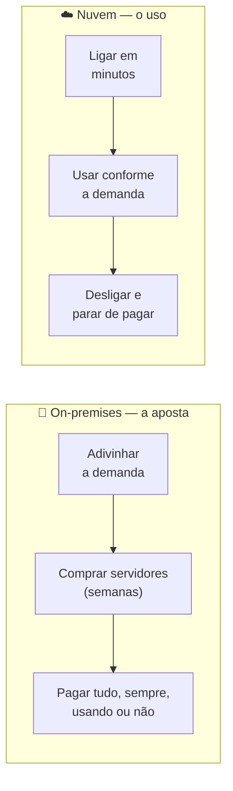

# Módulo 00 · Por que a nuvem existe

> **Domínio:** 1 · Conceitos de Nuvem · **Tempo estimado:** 4h · **Pré-requisitos:** nenhum
> **Peso na prova:** o Domínio 1 vale **24%** do CLF-C02. Este é o módulo que faz todos os outros fazerem sentido.

## 🎯 Onde você quer chegar

Ao final deste módulo, você vai:

- Entender **por que** a nuvem foi inevitável — a dor que ela veio curar.
- Saber explicar computação em nuvem para qualquer pessoa, usando suas próprias palavras.
- Diferenciar, sem hesitar, **IaaS / PaaS / SaaS** e **nuvem / híbrido / on-premises**.
- Reconhecer as **6 vantagens da nuvem** mesmo quando a prova as disfarça em um cenário.
- Nunca mais confundir os pares que derrubam candidatos: **escalabilidade × elasticidade** e **CapEx × OpEx**.

 

---

 

## 🎬 Antes de tudo, uma pergunta

Sexta-feira, 21h. No mesmo segundo em que você aperta *play* num filme, mais **cem milhões de pessoas** fazem o mesmo na Netflix. Ninguém trava. O vídeo começa na hora, em 4K, do Japão ao interior de Minas.

Agora, segunda-feira, 4h da manhã. Quase ninguém assistindo. E aqui vai a pergunta que vale o módulo inteiro:

> **Quantos servidores a Netflix está usando às 21h de sexta? E às 4h de segunda?**

A resposta certa é: **números completamente diferentes** — e ninguém aperta um botão para mudar isso. O sistema *sozinho* liga máquinas quando a multidão chega e desliga quando ela vai embora. Você só paga pelas que usou.

Isso parece óbvio hoje. Mas há vinte anos era **impossível**. E entender por que era impossível — e o que mudou — é entender por que a nuvem existe. Vamos por partes, começando pela dor.

 

---

 

## 🧠 Parte 1 — O mundo antes da nuvem (a dor)

Imagine que **você** teve a ideia do próximo app que vai bombar. Estamos em 2005. Para colocá-lo no ar, seu roteiro era este:

1. Você **adivinha** quantos usuários terá. (Sim, adivinha. Não tem como saber.)
2. Com base no chute, **compra servidores** — máquinas de milhares de reais, que demoram semanas pra chegar.
3. Aluga uma **sala refrigerada**, com energia de reserva, ar-condicionado e segurança.
4. Contrata **gente** pra manter tudo ligado 24 horas por dia.
5. Só **então**, meses depois, você lança.

Repare que o problema nem é o dinheiro. O problema é que você teve que **apostar antes de saber**. E toda aposta dessas tem só dois finais, os dois ruins:

> [!WARNING]
> **O dilema da capacidade — a raiz de toda a dor:**
> - **Apostou baixo e o app viralizou?** Os servidores não aguentam, o site cai — e você perde os clientes bem no dia do seu sucesso. A pior hora pra falhar.
> - **Apostou alto e a demanda não veio?** Você fica com máquinas caríssimas ligadas, paradas, torrando dinheiro todo mês.
>
> Não existia meio-termo. Ou você desperdiçava, ou você caía.

Esse modelo — comprar, manter e responder por tudo na sua própria infraestrutura — tem nome, e ele **cai na prova**: **on-premises** (ou "on-prem"). Guarde a palavra; ela vai voltar.

 

## 💡 Parte 2 — A virada (a cura)

E se você **não precisasse comprar nada** antes de saber se vai dar certo? E se pudesse **ligar um servidor em minutos**, usar enquanto precisa, e **desligar** quando a demanda cair — pagando só por esse tempo?

Isso é computação em nuvem.

> **Computação em nuvem é a entrega de recursos de TI (servidores, armazenamento, banco de dados e mais) sob demanda, pela internet, com pagamento pelo uso.** Em vez de *comprar e manter*, você *aluga e consome*.

A mudança é de mentalidade: TI deixa de ser um **ativo que você compra** e vira um **serviço que você consome**.

> [!TIP]
> **A analogia que resolve tudo: a energia elétrica** ⚡
> Você não constrói uma usina no quintal pra ter luz. Você se liga na rede, aperta o interruptor quando precisa, e paga no fim do mês **exatamente o que consumiu**. Ninguém deixa uma usina ligada "por garantia".
> A nuvem é isso, para computação. Esse modelo de pagar-pelo-uso tem nome de prova: **pay-as-you-go**.

Volte agora à Netflix da sexta-feira. Ela "liga mais tomadas" às 21h e "desliga" às 4h. Nenhum humano no meio. É a cura exata pro dilema da capacidade que te assombrava lá em 2005.

 

## 🍕 Parte 3 — Nem toda nuvem vem pronta: IaaS, PaaS e SaaS

Aqui um aluno sempre pergunta: "mas eu alugo o quê, exatamente?". Ótima pergunta — porque existe um **espectro de prontidão**. E a melhor forma de sentir esse espectro é com comida.

Imagine que você quer comer uma pizza. Você tem três caminhos:

| Você quer... | Modelo | Na prática | Exemplo |
|:--|:--|:--|:--|
| 🧑‍🍳 Comprar os ingredientes e **fazer você mesmo** | **IaaS** — Infraestrutura como Serviço | O provedor te dá os blocos crus (servidor, rede, disco); você instala o sistema, cuida de tudo. Máximo controle, máximo trabalho. | Amazon EC2 |
| 🍕 Comprar a **pizza congelada e só assar** | **PaaS** — Plataforma como Serviço | A base já vem pronta; você só entrega o seu código. | AWS Elastic Beanstalk |
| 🛵 Pedir a **pizza pronta no delivery** | **SaaS** — Software como Serviço | Está tudo feito; você só usa. | Gmail, Dropbox |

> [!NOTE]
> A régua é simples: quanto mais você caminha de **IaaS → PaaS → SaaS**, **menos você gerencia** e **mais o provedor gerencia por você**. Você troca controle por conveniência. Nenhum é "o melhor" — depende de quanta cozinha você quer ter.

> [!TIP]
> **Guarde o gancho da prova:** se o cenário diz que "o cliente ainda precisa cuidar do sistema operacional e dos patches", é **IaaS**. Se diz "o cliente só envia o código", é **PaaS**. Se diz "o usuário só acessa o software pronto", é **SaaS**.

 

## 🌍 Parte 4 — E onde tudo isso roda? (nuvem, híbrido, on-premises)

Reparou que "IaaS/PaaS/SaaS" responde **o que** você aluga? Falta responder **onde** as coisas rodam. São três modelos de implantação — e a prova adora te dar um cenário e perguntar qual encaixa.

| Onde roda | O que é | Quando é a escolha certa |
|:--|:--|:--|
| ☁️ **Nuvem** | Tudo na nuvem de um provedor. | Projeto novo, startup, quem quer velocidade e escala sem hardware. |
| 🏢 **On-premises** | Tudo na sua própria infraestrutura. | Exigência legal rígida, latência extrema, hardware específico. |
| 🔗 **Híbrido** | Parte na nuvem, parte on-premises, conversando entre si. | Migração gradual; dado sensível fica em casa, o resto escala na nuvem. |

> [!TIP]
> **Palavra-gatilho de prova:** viu *"manter alguns sistemas no data center atual"* somado a *"aproveitar a nuvem"*? Ou *"a lei exige os dados no local"* junto de *"mas queremos escalar"*? A resposta é quase sempre **híbrido**.

 

## 🚀 Parte 5 — Por que o mundo inteiro migrou: as 6 vantagens

Agora que você sentiu a dor (Parte 1) e viu a cura (Parte 2), as vantagens da nuvem deixam de ser uma lista pra decorar e viram **respostas a problemas que você já reconhece**. A AWS oficializa **seis** — e cada uma resolve uma dor da nossa história.

| # | Vantagem | Qual dor ela cura | Como a prova a "disfarça" |
|:--:|:--|:--|:--|
| 1 | **Trocar CapEx por despesa variável** | O gasto gigante e antecipado de comprar servidores | "deixar de investir adiantado em hardware" |
| 2 | **Ganhar com economias de escala** | Preço alto por comprar sozinho, em pouca quantidade | "preços menores porque muitos clientes dividem a estrutura" |
| 3 | **Parar de adivinhar capacidade** | O dilema da aposta (baixo demais / alto demais) | "acabar com sobra ou falta de capacidade" |
| 4 | **Ganhar velocidade e agilidade** | Esperar semanas por um servidor | "de semanas para minutos" / "inovar rápido" |
| 5 | **Parar de gastar com data centers** | A sala refrigerada, a energia, a equipe | "focar no cliente em vez do trabalho pesado" |
| 6 | **Ficar global em minutos** | Seus usuários longe, com o site lento | "baixa latência para usuários no mundo todo" |

> [!IMPORTANT]
> A vantagem-estrela é a **nº 1 — trocar CapEx por OpEx**. É a lógica econômica que sustenta a nuvem inteira. Se você entender só uma coisa deste módulo, entenda essa — e ela volta no [Módulo 03 · Economia da nuvem](./03-economia-da-nuvem-e-migracao.md).

 

## ⚠️ Parte 6 — Os pares que a prova usa pra te derrubar

Alguns termos parecem gêmeos, mas não são. A prova **vive** dessa confusão. Desarme cada armadilha agora.

**🔸 CapEx vs. OpEx**
Pensa no carro. **Comprar** um carro à vista é **CapEx** — um gastão único, adiantado, pra ter o ativo. **Pegar Uber** é **OpEx** — você paga só quando anda, sem dono, sem seguro, sem oficina. A nuvem te tira do "comprar o carro" e te coloca no "pagar pela corrida".

**🔸 Escalabilidade vs. Elasticidade** (a pegadinha nº 1 do Domínio 1)
- **Escalabilidade** é *conseguir* crescer quando precisa. É ter a capacidade de ficar maior.
- **Elasticidade** é o ajuste **automático e nos dois sentidos**: sobe quando a demanda aperta **e desce quando ela alivia**, sozinho, em tempo real.
- Lembra da Netflix respirando — enchendo às 21h, esvaziando às 4h? Aquilo é **elasticidade**. A palavra-chave é **automático** e **para os dois lados**. Escalar você pode fazer na mão; ser elástico é a mágica de fazer sozinho.

**🔸 Agilidade vs. Elasticidade**
- **Elasticidade** = *quantidade de recursos* acompanhando a demanda.
- **Agilidade** = *velocidade pra inovar*: subir um ambiente de teste em minutos, experimentar uma ideia, descartar se não deu. Cenário fala em "inovar/experimentar rápido"? É **agilidade**.

**🔸 Disponibilidade vs. Durabilidade** (a base fica aqui, o detalhe vem no Domínio 3)
- **Disponibilidade** = o sistema está no ar quando você precisa. (Consigo acessar agora?)
- **Durabilidade** = o dado não se perde com o tempo. (Meu arquivo vai continuar existindo?)

 

---

 

## 🎯 Dicas de prova (as pegadinhas clássicas)

> [!CAUTION]
> Onde os candidatos mais escorregam neste tema:
>
> - **Escalabilidade ≠ elasticidade.** Se a questão frisa "automaticamente" e "aumenta e diminui", é **elasticidade**.
> - **"Nuvem" nem sempre é a resposta.** Exigência legal de dado local, latência extrema ou hardware específico podem pedir **on-premises** ou **híbrido**. Leia o que o cenário *exige*.
> - **Não inverta CapEx e OpEx.** A nuvem vai **de CapEx (compra antecipada) para OpEx (uso)**.
> - **Não misture "o quê" com "onde".** IaaS/PaaS/SaaS = o que você aluga. Nuvem/híbrido/on-premises = onde roda.
> - **SaaS não gerencia SO.** Se o cliente "precisa aplicar patch no sistema operacional", **não é SaaS** — é IaaS.

 

## 🗺️ Mapa rápido pra revisão

| Conceito | É sobre... | Âncora de memória |
|:--|:--|:--|
| IaaS / PaaS / SaaS | o que você aluga | pizza: ingredientes → congelada → delivery |
| Nuvem / Híbrido / On-premises | onde roda | híbrido = "parte aqui, parte lá" |
| Pay-as-you-go | como você paga | conta de luz |
| CapEx → OpEx | economia | comprar o carro → pegar Uber |
| Escalabilidade | poder crescer | "aguento ficar maior" |
| Elasticidade | crescer e encolher sozinho | "a Netflix respira" |
| Agilidade | inovar rápido | "testo hoje, descarto amanhã" |

 

---

 

## ❓ Quiz nível prova

Mesmas regras do CLF-C02: cenário curto, quatro alternativas plausíveis. Tente responder **antes** de abrir a explicação — e leia por que as erradas estão erradas, porque é isso que a prova cobra.

 

**1. Uma loja virtual só trava durante grandes promoções, quando o acesso multiplica por dez; no resto do ano os servidores ficam ociosos. Qual característica da nuvem resolve os dois problemas de uma vez?**

- **A)** Durabilidade
- **B)** Elasticidade
- **C)** Economia de escala
- **D)** Agilidade

💡 Ver resposta e explicação

> ✅ **Resposta: B) Elasticidade**
>
> Ela ajusta os recursos **automaticamente e nos dois sentidos** — sobe na promoção, desce depois. Cura a queda **e** a ociosidade. (É a Netflix respirando.)
>
> - **A) Durabilidade** ❌ — é sobre não perder dados, não sobre acompanhar demanda.
> - **C) Economia de escala** ❌ — explica por que é barato, não ajusta capacidade.
> - **D) Agilidade** ❌ — é sobre inovar rápido, não sobre escalar com a carga.

 

**2. Um hospital precisa, por lei, manter os prontuários em servidores dentro do próprio prédio, mas quer usar a nuvem para processar relatórios estatísticos pesados. Qual modelo de implantação atende aos dois requisitos?**

- **A)** Nuvem pública pura
- **B)** On-premises puro
- **C)** Híbrido
- **D)** SaaS

💡 Ver resposta e explicação

> ✅ **Resposta: C) Híbrido**
>
> Dado sensível fica **on-premises** (cumpre a lei); o processamento pesado vai pra **nuvem** (ganha escala). Cenário híbrido clássico.
>
> - **A)** ❌ — violaria a exigência de manter os prontuários no local.
> - **B)** ❌ — perderia a escala da nuvem para os relatórios.
> - **D)** ❌ — SaaS é modelo de *serviço*, não de *implantação*; não responde "onde roda".

 

**3. Uma desenvolvedora quer publicar uma aplicação web sem configurar servidor, sistema operacional ou balanceador — só enviar o código e ver no ar. Qual modelo de serviço encaixa melhor?**

- **A)** IaaS
- **B)** PaaS
- **C)** SaaS
- **D)** On-premises

💡 Ver resposta e explicação

> ✅ **Resposta: B) PaaS**
>
> No PaaS (ex.: Elastic Beanstalk) o provedor cuida da infra e do SO; ela entrega **só o código**. É a pizza congelada: base pronta, você só finaliza.
>
> - **A) IaaS** ❌ — daria o servidor cru, e ela teria que configurar SO e o resto (o oposto do pedido).
> - **C) SaaS** ❌ — é software pronto pro usuário final, não serve pra publicar a *própria* aplicação.
> - **D) On-premises** ❌ — é "onde roda", e exigiria gerenciar tudo.

 

**4. Ao migrar para a nuvem, a empresa deixou de fazer grandes compras de servidores a cada dois anos e passou a receber uma fatura mensal proporcional ao uso. Essa mudança é melhor descrita como:**

- **A)** Troca de OpEx por CapEx
- **B)** Troca de CapEx por OpEx
- **C)** Aumento de durabilidade
- **D)** Redução de elasticidade

💡 Ver resposta e explicação

> ✅ **Resposta: B) Troca de CapEx por OpEx**
>
> Sair da compra antecipada (CapEx, "comprar o carro") para a fatura pelo uso (OpEx, "pegar Uber") é a definição exata.
>
> - **A)** ❌ — está invertido.
> - **C)/D)** ❌ — nada a ver; o tema é financeiro.

 

**5. Qual situação é um exemplo de "aumentar a velocidade e a agilidade" com a nuvem?** *(resposta única)*

- **A)** Uma equipe provisiona um ambiente de testes completo em minutos, testa uma ideia e o descarta se não vingar.
- **B)** A empresa paga menos porque a AWS compra hardware em enorme escala.
- **C)** Os arquivos de um bucket sobrevivem à falha de um data center inteiro.
- **D)** O sistema continua no ar mesmo quando uma zona falha.

💡 Ver resposta e explicação

> ✅ **Resposta: A)**
>
> Agilidade é experimentar e inovar rápido, com baixo custo de errar — subir em minutos e descartar sem prejuízo.
>
> - **B)** ❌ — é **economia de escala**.
> - **C)** ❌ — é **durabilidade**.
> - **D)** ❌ — é **alta disponibilidade / tolerância a falhas**.

 

**6. Selecione as DUAS afirmações corretas sobre escalabilidade e elasticidade.** *(múltipla resposta — escolha 2)*

- **A)** Escalabilidade é a capacidade de crescer para suportar mais carga.
- **B)** Elasticidade e escalabilidade são exatamente a mesma coisa.
- **C)** Elasticidade ajusta recursos automaticamente, tanto para cima quanto para baixo.
- **D)** Elasticidade só adiciona recursos, nunca remove.

💡 Ver resposta e explicação

> ✅ **Respostas: A) e C)**
>
> **A** define escalabilidade (poder crescer); **C** define elasticidade (ajuste automático e bidirecional).
>
> - **B)** ❌ — não são a mesma coisa; a prova explora justamente a diferença.
> - **D)** ❌ — a elasticidade **também remove** recursos quando a demanda cai (é o que economiza dinheiro).
>
> 💡 *Repare no formato: questões de "escolha 2" existem na prova real. Não marcar exatamente duas já zera a questão.*

 

---

 

## 🧪 Mão na massa (sem console!)

- 🔗 **AWS Skill Builder** → *"AWS Cloud Practitioner Essentials"*, comece pela introdução aos conceitos.
- 🔗 **AWS SimuLearn** → módulos introdutórios com prática guiada por IA.
- ✍️ **Desafio do módulo:** conte a história deste módulo pra alguém leigo em 3 minutos — do dilema da capacidade até a Netflix respirando. Se a pessoa entender, você dominou o Domínio 1.

 

---

 

## 📔 Glossário

| Termo | Significado |
|:--|:--|
| **On-premises** | Infraestrutura própria, mantida pela empresa em suas instalações. |
| **Computação em nuvem** | Entrega de recursos de TI sob demanda, pela internet, com pagamento pelo uso. |
| **Pay-as-you-go** | Pagar apenas pelo que se consome. |
| **IaaS / PaaS / SaaS** | Modelos de serviço, do mais "cru" ao mais "pronto". |
| **Nuvem / Híbrido / On-premises** | Modelos de implantação: onde os recursos rodam. |
| **CapEx** | Despesa de capital: investimento único e antecipado. |
| **OpEx** | Despesa operacional: pagamento recorrente pelo uso. |
| **Escalabilidade** | Capacidade de crescer para suportar mais demanda. |
| **Elasticidade** | Ajuste automático de recursos, para cima e para baixo, conforme a demanda. |
| **Agilidade** | Capacidade de inovar e experimentar rapidamente. |
| **Disponibilidade** | O sistema estar acessível quando necessário. |
| **Durabilidade** | Garantia de que os dados não se perdem ao longo do tempo. |

 

## ✅ Checklist de conclusão

- [ ] Entendi o dilema da capacidade (por que on-premises doía)
- [ ] Sei explicar a nuvem e o pay-as-you-go com a analogia da energia
- [ ] Diferencio IaaS/PaaS/SaaS (o quê) de nuvem/híbrido/on-premises (onde)
- [ ] Entendi as 6 vantagens como respostas a dores reais
- [ ] Não confundo mais escalabilidade × elasticidade nem CapEx × OpEx
- [ ] Revisei as dicas de prova e as pegadinhas
- [ ] Fiz o quiz e entendi por que cada alternativa errada está errada
- [ ] Registrei meu [Checkpoint](https://github.com/melissaalves-stack/awscloudfoundations/issues/new?template=checkpoint-de-modulo.yml)

 

---

**Precisa de ajuda?** 📊 [Checkpoint](https://github.com/melissaalves-stack/awscloudfoundations/issues/new?template=checkpoint-de-modulo.yml) · ❓ [Dúvida](https://github.com/melissaalves-stack/awscloudfoundations/issues/new?template=duvida.yml) · 📖 [Guia](../../GUIA-DO-ALUNO.md) · 🚀 [Builder Center](https://bit.ly/4w720IR)

🏠 [Índice do Domínio 1](./README.md) &nbsp;·&nbsp; ➡️ [Módulo 01 · A infraestrutura global da AWS](./01-infraestrutura-global-da-aws.md)

