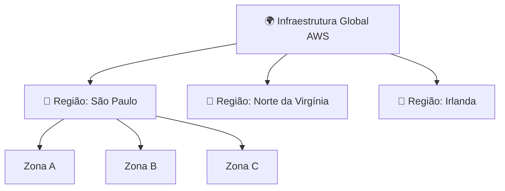
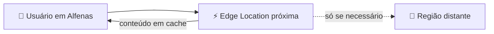

# Módulo 01 · A infraestrutura global da AWS

> **Domínio:** 1 · Conceitos de Nuvem · **Tempo estimado:** 3h · **Pré-requisitos:** Módulo 00

## 🎯 Objetivos de aprendizagem

Ao final deste módulo, você será capaz de:

- Explicar o que são Regiões e Zonas de Disponibilidade (AZs).
- Entender por que a AWS espalha data centers pelo mundo.
- Escolher uma Região com base em critérios reais.
- Reconhecer o papel das Edge Locations na entrega de conteúdo.
- Diferenciar serviços globais, regionais e zonais.

 

---

 

## 🧠 Conteúdo

 

### 1. A nuvem é feita de prédios reais

"Nuvem" parece algo mágico e abstrato, mas ela é **muito física**: são milhares de computadores dentro de **data centers** — galpões gigantes cheios de servidores — espalhados pelo planeta.

> [!NOTE]
> Quando você "sobe algo na nuvem", esse algo está rodando em um prédio real, em algum lugar do mundo. A AWS só cuida de tudo isso por você.

 

### 2. Regiões (Regions)

Uma **Região** é uma área geográfica do mundo onde a AWS tem infraestrutura. Exemplos: São Paulo (Brasil), Norte da Virgínia (EUA), Irlanda, Tóquio.

> [!IMPORTANT]
> Uma Região é **isolada** das outras: por padrão, seus dados **não saem** da Região que você escolheu, a menos que você mande. Isso é essencial para conformidade (LGPD, por exemplo).

Cada Região tem dois nomes: um **nome amigável** (ex.: *América do Sul (São Paulo)*) que você vê no Console, e um **código** (ex.: `sa-east-1`) usado programaticamente, como na AWS CLI.

 

### 3. Zonas de Disponibilidade (Availability Zones / AZs)

Cada Região é dividida em várias **Zonas de Disponibilidade**. Uma AZ é composta por **um ou mais data centers** independentes, com energia, refrigeração e rede próprias, e ficam fisicamente **separadas** umas das outras (mas conectadas por links rápidos de baixa latência).

> [!TIP]
> **Por que isso importa?** Se um data center pega fogo, inunda ou fica sem energia, os outros continuam funcionando. Ao distribuir sua aplicação em **múltiplas AZs**, ela continua no ar mesmo se uma zona inteira falhar. Isso se chama **alta disponibilidade**.

> [!NOTE]
> **Número mágico:** toda Região da AWS tem **no mínimo 3 AZs**. Guarde isso — a prova gosta de perguntar o mínimo.

> [!WARNING]
> Colocar tudo em uma única AZ é como guardar todos os seus arquivos em um único HD sem backup. Funciona... até o dia em que não funciona.

As AZs são referenciadas pelo código da Região seguido de uma letra. Por exemplo, na Região `sa-east-1` (São Paulo): `sa-east-1a`, `sa-east-1b`, `sa-east-1c`.

 

### 4. Como escolher uma Região?

Não existe Região "melhor" — existe a mais adequada ao seu caso. Considere:

| Critério | Pergunta que você faz |
|:--|:--|
| 🏃 **Latência** | Meus usuários estão perto dessa Região? (mais perto = mais rápido) |
| 💵 **Custo** | Os preços variam entre Regiões. Qual cabe no orçamento? |
| ⚖️ **Conformidade** | A lei exige que os dados fiquem no país? (ex.: LGPD no Brasil) |
| 🧩 **Serviços disponíveis** | A Região tem o serviço específico que eu preciso? |

> [!NOTE]
> Para usuários no Brasil, a Região **São Paulo (sa-east-1)** costuma oferecer a menor latência e ajuda em questões de conformidade com a LGPD. Nem todo serviço está em toda Região — sempre confira.

 

### 5. Edge Locations e a "borda" da rede

Além das Regiões, a AWS tem centenas de **Edge Locations** — pontos menores, espalhados em ainda mais cidades, usados para **entregar conteúdo mais perto do usuário final**.

É o que faz um vídeo ou site carregar rápido: em vez de buscar o conteúdo do outro lado do mundo, ele é servido de uma borda pertinho de você. O serviço que usa isso é o **Amazon CloudFront** (veremos no Domínio 3).

> [!TIP]
> Entre a Região (origem) e as Edge Locations existe ainda um **Regional Edge Cache**: um cache maior e intermediário que guarda conteúdo que já expirou nas bordas, evitando ir buscar de novo na origem distante.

 

### 6. Escopo dos serviços: global, regional ou zonal

Cada serviço da AWS "vive" em um nível diferente da infraestrutura. Entender isso evita muita confusão:

| Escopo | O recurso existe em... | Exemplos |
|:--|:--|:--|
| 🌐 **Global** | Toda a AWS, sem Região fixa | IAM, Route 53, CloudFront |
| 📍 **Regional** | Uma Região (replicado entre AZs) | S3, DynamoDB, Lambda |
| 🏠 **Zonal** | Uma única AZ | EC2 (a instância), EBS, sub-redes |

> [!TIP]
> Faz sentido: **identidade** (IAM) precisa valer no mundo todo, então é global. Já **uma instância EC2** roda em uma máquina específica, dentro de uma AZ — por isso é zonal. Para deixá-la resiliente, você replica em outras AZs.

 

### 7. Estendendo a nuvem: Local Zones, Wavelength e Outposts

Às vezes você precisa da AWS **mais perto ainda**, ou até dentro da sua empresa. Para isso existem:

- 🏙️ **Local Zones** — colocam computação e armazenamento perto de grandes cidades, para latência ultrabaixa.
- 📡 **Wavelength** — leva a AWS para dentro das redes 5G das operadoras.
- 🏭 **Outposts** — racks físicos da AWS instalados **no seu próprio data center**, para quem precisa rodar localmente com as mesmas ferramentas da nuvem.

> [!NOTE]
> Você não precisa decorar detalhes desses três. Basta reconhecer que servem para **aproximar a nuvem** de casos específicos (latência, 5G, data center próprio).

 

---

 

## ❓ Quiz — teste seus conhecimentos

 

**1. Qual a diferença entre uma Região e uma Zona de Disponibilidade?**

- **A)** São sinônimos — significam a mesma coisa.
- **B)** Região é uma área geográfica; a AZ é um ou mais data centers isolados dentro de uma Região.
- **C)** Região é um único servidor; AZ é um conjunto de Regiões.
- **D)** AZ é maior que uma Região.

💡 Ver resposta

> ✅ **Resposta: B)** — A **Região** (ex.: São Paulo) é geográfica. A **AZ** é um ou mais data centers isolados **dentro** dela. Cada Região tem no mínimo 3 AZs.

 

**2. Por que distribuir uma aplicação em várias AZs?**

- **A)** Para gastar mais dinheiro.
- **B)** Para deixar a aplicação mais lenta.
- **C)** Para garantir alta disponibilidade — se uma AZ falhar, as outras seguem funcionando.
- **D)** Porque a AWS obriga.

💡 Ver resposta

> ✅ **Resposta: C)** — Distribuir em múltiplas AZs garante **alta disponibilidade**: uma falha de zona (incêndio, queda de energia) não derruba a aplicação.

 

**3. Qual destes NÃO é um critério válido para escolher uma Região?**

- **A)** Latência (proximidade dos usuários).
- **B)** Conformidade legal (ex.: LGPD).
- **C)** A cor do logotipo da Região.
- **D)** Disponibilidade dos serviços que você precisa.

💡 Ver resposta

> ✅ **Resposta: C)** — Critérios reais são **latência, custo, conformidade** e **disponibilidade de serviços**. Região não tem "cor".

 

**4. Para que servem as Edge Locations?**

- **A)** Para hospedar bancos de dados principais.
- **B)** Para entregar conteúdo em cache mais perto do usuário final, reduzindo latência.
- **C)** Para substituir as Regiões.
- **D)** Para armazenar backups de longo prazo.

💡 Ver resposta

> ✅ **Resposta: B)** — Edge Locations entregam conteúdo **perto do usuário**, acelerando o carregamento. É a base do **Amazon CloudFront**.

 

**5. O IAM é um serviço global, regional ou zonal? E uma instância EC2?**

- **A)** IAM é zonal; EC2 é global.
- **B)** Ambos são regionais.
- **C)** IAM é global; a instância EC2 é zonal.
- **D)** Ambos são globais.

💡 Ver resposta

> ✅ **Resposta: C)** — O **IAM é global** (identidade vale em toda a AWS). Uma **instância EC2 é zonal** (roda em uma AZ). Por isso, para resiliência, distribuímos EC2 em várias AZs.

 

---

 

## 🧪 Mão na massa (sem console!)

- 🔗 **AWS Skill Builder** → módulo *"AWS Global Infrastructure"* dentro do Cloud Practitioner Essentials.
- 🔗 Explore o **mapa interativo da infraestrutura global** no site oficial da AWS (apenas visualização, sem login).

 

---

 

## 📔 Glossário

| Termo | Significado |
|:--|:--|
| **Região (Region)** | Área geográfica isolada com infraestrutura da AWS. |
| **Zona de Disponibilidade (AZ)** | Um ou mais data centers isolados dentro de uma Região (mín. 3 por Região). |
| **Alta disponibilidade** | Capacidade de continuar funcionando mesmo com falhas. |
| **Edge Location** | Ponto de presença para entregar conteúdo perto do usuário. |
| **Regional Edge Cache** | Cache intermediário entre a origem e as Edge Locations. |
| **Serviço global/regional/zonal** | O nível da infraestrutura em que um recurso existe. |
| **Outposts / Local Zones / Wavelength** | Formas de estender a AWS para perto do usuário ou para o data center próprio. |

 

## ✅ Checklist de conclusão

- [ ] Li todo o conteúdo do módulo
- [ ] Sei diferenciar Região, AZ e Edge Location
- [ ] Entendi por que usar múltiplas AZs (e que há no mínimo 3)
- [ ] Consigo classificar serviços em global, regional e zonal
- [ ] Fiz o quiz
- [ ] Registrei meu [Checkpoint](https://github.com/melissaalves-stack/awscloudfoundations/issues/new?template=checkpoint-de-modulo.yml)

 

---

**Precisa de ajuda?** 📊 [Checkpoint](https://github.com/melissaalves-stack/awscloudfoundations/issues/new?template=checkpoint-de-modulo.yml) · ❓ [Dúvida](https://github.com/melissaalves-stack/awscloudfoundations/issues/new?template=duvida.yml) · 📖 [Guia](../../GUIA-DO-ALUNO.md) · 🚀 [Builder Center](https://bit.ly/4w720IR)

⬅️ [Módulo 00](./00-por-que-a-nuvem-existe.md) &nbsp;·&nbsp; 🏠 [Índice do Domínio 1](./README.md) &nbsp;·&nbsp; ➡️ [Módulo 02 · Well-Architected e CAF](./02-well-architected-e-caf.md)

