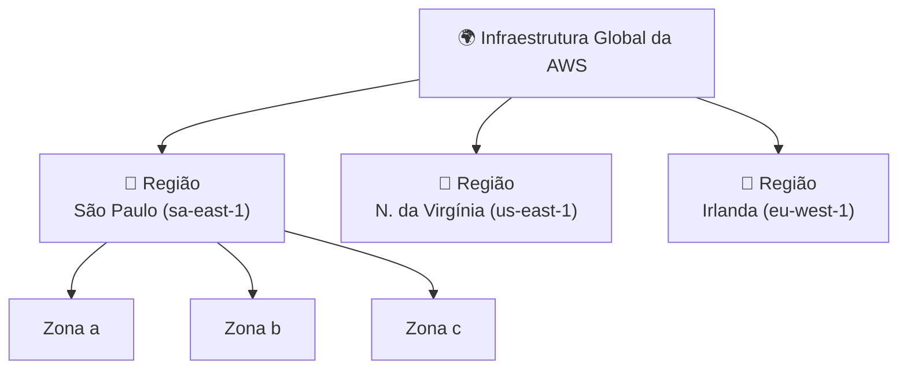
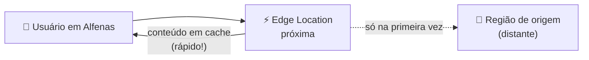

# Módulo 01 · A infraestrutura global da AWS

> **Domínio:** 1 · Conceitos de Nuvem · **Tempo estimado:** 4h · **Pré-requisitos:** Módulo 00
> **Peso na prova:** parte do Domínio 1 (**24%**). Este módulo é a base física de tudo o que você vai construir — e fonte garantida de perguntas.

## 🎯 Onde você quer chegar

Ao final deste módulo, você vai:

- Entender que a "nuvem" é feita de **prédios reais** — e por que eles estão espalhados pelo mundo.
- Diferenciar com clareza **Região**, **Zona de Disponibilidade (AZ)** e **Edge Location**.
- Saber **escolher uma Região** com critérios de verdade (e reconhecer isso num cenário de prova).
- Classificar qualquer serviço como **global, regional ou zonal** — e por que isso importa para resiliência.
- Reconhecer as extensões da nuvem: **Local Zones, Wavelength e Outposts**.

 

---

 

## 🎬 Uma história de dois cliques

Você, em Alfenas, abre um site hospedado na AWS. O site carrega numa piscada. No mesmo instante, alguém em Tóquio abre o **mesmo** site — e para essa pessoa ele também carrega numa piscada.

Como? Os dois estão a milhares de quilômetros um do outro. Se existisse **um único** servidor no planeta, um dos dois esperaria o dado atravessar o mundo — e sentiria a lentidão.

A resposta é que a AWS **não** tem um servidor. Ela tem uma **teia global** de infraestrutura, montada de um jeito muito específico pra resolver três problemas ao mesmo tempo: **velocidade** (estar perto do usuário), **resiliência** (sobreviver a desastres) e **conformidade** (respeitar as leis de cada país). Este módulo é sobre como essa teia é organizada — em camadas, da maior para a menor.

 

---

 

## 🧠 Parte 1 — A nuvem é feita de prédios reais

A gente diz "subi na nuvem" e imagina algo etéreo. Mas pare e visualize: o seu arquivo está, neste segundo, dentro de um **galpão do tamanho de um campo de futebol**, refrigerado, cheio de servidores empilhados, em algum lugar do mundo. Esses galpões são os **data centers**.

> [!NOTE]
> A palavra "nuvem" é só uma metáfora de marketing. Debaixo dela há concreto, metal, fibra ótica e ar-condicionado industrial. A AWS cuida desse mundo físico **por você** — mas ele existe, e a prova espera que você saiba disso.

A AWS organiza esses data centers em três camadas, do maior pro menor: **Regiões → Zonas de Disponibilidade → (dentro delas) os data centers**. Além disso, há uma quarta peça espalhada por fora: as **Edge Locations**. Vamos uma a uma.

 

## 🌎 Parte 2 — Regiões: os grandes territórios

Uma **Região** é uma área geográfica do mundo onde a AWS instalou um cluster de infraestrutura. Exemplos: *América do Sul (São Paulo)*, *Norte da Virgínia (EUA)*, *Irlanda*, *Tóquio*.

Cada Região tem **dois nomes**, e os dois caem na prova:
- Um **nome amigável** que você vê no Console: *América do Sul (São Paulo)*.
- Um **código** usado por programadores e pela CLI: `sa-east-1`.

> [!IMPORTANT]
> **Regiões são isoladas umas das outras.** Por padrão, seus dados **não saem** da Região escolhida, a menos que você mande explicitamente. Isso não é detalhe: é o que permite cumprir leis como a **LGPD** (dados de brasileiros no Brasil) ou a GDPR (dados de europeus na Europa). "Isolamento entre Regiões" é resposta de prova.

 

## 🏢 Parte 3 — Zonas de Disponibilidade: o segredo da resiliência

Aqui mora o conceito mais cobrado do módulo. Cada Região é dividida em **Zonas de Disponibilidade (Availability Zones, ou AZs)**. Uma AZ é composta de **um ou mais data centers** com **energia, refrigeração e rede próprias e independentes** — e fica fisicamente **separada** das outras AZs (quilômetros de distância), mas ligada a elas por fibra de altíssima velocidade e baixa latência.

Por que essa separação genial? Porque ela isola desastres.

> [!TIP]
> **A analogia dos três armazéns.** Imagine que você guarda o estoque da sua loja. Se colocar tudo num armazém só e ele pegar fogo, você perde tudo. Se dividir o mesmo estoque em **três armazéns distantes**, um incêndio em um deles não te tira do jogo — os outros dois seguem vendendo. As AZs são esses armazéns. Distribuir sua aplicação entre elas se chama **alta disponibilidade**.

> [!NOTE]
> **Número mágico (decore):** toda Região da AWS tem **no mínimo 3 AZs**. A prova adora perguntar o mínimo — a resposta é **três**.

As AZs são nomeadas pelo código da Região + uma letra: em São Paulo (`sa-east-1`), são `sa-east-1a`, `sa-east-1b`, `sa-east-1c`.

> [!WARNING]
> Colocar toda a aplicação numa **única AZ** é como voltar a ter um armazém só. Funciona — até o dia em que aquela zona cai, e você cai junto. Foi exatamente esse o erro de muitas empresas no famoso incidente de 2017 na Virgínia.

 

## 🎯 Parte 4 — Como escolher uma Região (isto é cenário de prova puro)

Não existe Região "melhor". Existe a **mais adequada** — e a prova te dá uma situação e pergunta qual escolher. São **quatro critérios**:

| Critério | A pergunta que você faz | Palavra-gatilho na prova |
|:--|:--|:--|
| 🏃 **Latência** | Meus usuários estão perto dessa Região? | "reduzir latência para os usuários" |
| ⚖️ **Conformidade** | A lei exige os dados no país? | "requisito legal / soberania de dados / LGPD" |
| 💵 **Custo** | O preço varia entre Regiões — qual cabe? | "reduzir custos" |
| 🧩 **Disponibilidade de serviços** | A Região tem o serviço que preciso? | "serviço X ainda não disponível na Região" |

> [!TIP]
> **Mapeando gatilho → resposta:** se o cenário fala em *lei / dados no país*, o critério é **conformidade**. Se fala em *usuários reclamando de lentidão*, é **latência**. Se um recurso novo "não aparece" numa Região, é **disponibilidade de serviços** (nem todo serviço existe em toda Região — sempre confira).

 

## ⚡ Parte 5 — Edge Locations: a nuvem na esquina da sua casa

Volte à história do começo: como o site carrega rápido tanto em Alfenas quanto em Tóquio? Por causa das **Edge Locations** — centenas de pontos menores, espalhados em **muito mais cidades** que as Regiões, cuja função é **entregar conteúdo pertinho do usuário final**.

Em vez de buscar um vídeo do outro lado do planeta toda vez, a AWS guarda uma **cópia em cache** na borda mais próxima de você. O serviço que faz isso é o **Amazon CloudFront** (a CDN da AWS — você verá em detalhe no Domínio 3).

> [!NOTE]
> Entre a Região de origem e as Edge Locations existe ainda um **Regional Edge Cache** — um cache intermediário e maior, que segura conteúdo que já saiu das bordas, pra evitar ir buscar de novo lá na origem distante. Você não precisa dos detalhes; basta saber que ele existe pra deixar tudo ainda mais rápido.

 

## 🧭 Parte 6 — Global, Regional ou Zonal: onde cada serviço "mora"

Este é um dos pontos que mais gera confusão — e por isso vale ouro na prova. Cada serviço da AWS "vive" numa camada da infraestrutura:

| Escopo | O recurso existe em... | Exemplos | Por quê |
|:--|:--|:--|:--|
| 🌐 **Global** | Toda a AWS, sem Região fixa | **IAM, Route 53, CloudFront** | Identidade e DNS precisam valer no mundo inteiro |
| 📍 **Regional** | Uma Região (replicado entre as AZs) | **S3, DynamoDB, Lambda** | Serviços gerenciados que a AWS já espalha pelas AZs pra você |
| 🏠 **Zonal** | Uma única AZ | **Instância EC2, volume EBS, sub-rede** | Rodam numa máquina específica, num data center específico |

> [!TIP]
> A lógica é intuitiva quando você pensa no propósito: sua **identidade** (IAM) tem que funcionar em qualquer lugar → **global**. Uma **instância EC2** é uma máquina física específica → **zonal**. É justamente por o EC2 ser zonal que você precisa distribuí-lo em várias AZs pra ter alta disponibilidade (lembra dos três armazéns?).

> [!CAUTION]
> **Pegadinha clássica:** achar que o S3 é global "porque tem nome único no mundo todo". O nome do bucket é único globalmente, mas o **S3 é um serviço regional** — seus dados vivem na Região que você escolheu. Não confunda "nome global" com "serviço global".

 

## 🛰️ Parte 7 — Quando a nuvem precisa chegar mais perto ainda

Às vezes nem uma Região próxima basta — você precisa da AWS **dentro** de uma cidade específica, de uma rede 5G, ou até do seu próprio prédio. Para esses casos existem três extensões:

- 🏙️ **Local Zones** — trazem computação e armazenamento pra **perto de grandes cidades** que não têm uma Região ali, entregando latência de milissegundos de um dígito (ótimo pra jogos, edição de vídeo ao vivo).
- 📡 **Wavelength** — instalam infraestrutura da AWS **dentro das redes 5G** das operadoras, pra aplicações móveis de latência ultrabaixa.
- 🏭 **Outposts** — racks físicos da AWS entregues e instalados **no seu próprio data center**, pra quem precisa rodar localmente (por lei ou latência) mas quer as mesmas ferramentas da nuvem.

> [!NOTE]
> Não precisa decorar detalhes técnicos dos três. Só saiba **reconhecer o propósito**: todos servem para **aproximar a nuvem** de um caso específico — cidade sem Região (Local Zones), rede 5G (Wavelength) ou seu data center (Outposts).

 

---

 

## 🎯 Dicas de prova (pegadinhas clássicas)

> [!CAUTION]
> - **Mínimo de AZs por Região = 3.** Se aparecer "2", desconfie.
> - **S3 é regional, não global** — apesar do nome de bucket único no mundo.
> - **IAM, Route 53 e CloudFront são globais.** Se a questão pede um serviço global, provavelmente é um desses.
> - **EC2 é zonal.** Alta disponibilidade de EC2 = distribuir em **múltiplas AZs**, não em múltiplas Regiões (isso já seria pra disaster recovery).
> - **Conformidade/latência escolhem a Região.** Se o cenário fala em lei de dados → conformidade; se fala em usuário distante e lento → latência.
> - **Não confunda AZ com Região.** Múltiplas AZs = alta disponibilidade dentro de uma Região. Múltiplas Regiões = alcance global + recuperação de desastres.

 

## 🗺️ Mapa rápido pra revisão

| Camada | O que é | Serve para |
|:--|:--|:--|
| Região | Área geográfica com cluster de infra | escolher por latência, lei, custo, serviços |
| Zona de Disponibilidade (AZ) | 1+ data centers isolados na Região (mín. 3) | alta disponibilidade |
| Edge Location | Ponto de cache perto do usuário | velocidade de entrega (CloudFront) |
| Local Zones / Wavelength / Outposts | Extensões da nuvem | aproximar de cidade / 5G / seu data center |

 

---

 

## ❓ Quiz nível prova

 

**1. Uma empresa precisa garantir que sua aplicação continue no ar mesmo que um data center inteiro sofra um incêndio, dentro da mesma Região. Qual é a abordagem correta?**

- **A)** Colocar tudo em uma única AZ, bem reforçada.
- **B)** Distribuir a aplicação por múltiplas Zonas de Disponibilidade.
- **C)** Usar apenas Edge Locations.
- **D)** Hospedar a aplicação on-premises.

💡 Ver resposta e explicação

> ✅ **Resposta: B)**
>
> Distribuir por **múltiplas AZs** garante alta disponibilidade: como as AZs são fisicamente isoladas, o incêndio em uma não afeta as outras.
>
> - **A)** ❌ — uma AZ só é um ponto único de falha (o "armazém único").
> - **C)** ❌ — Edge Locations servem para cache/entrega de conteúdo, não para hospedar a aplicação.
> - **D)** ❌ — não resolve o problema e ignora a infraestrutura da AWS.

 

**2. Um app de streaming reclama que usuários no Japão sofrem com vídeos lentos, enquanto os no Brasil vão bem. Qual recurso da AWS resolve isso mais diretamente?**

- **A)** Adicionar mais AZs na Região de São Paulo.
- **B)** Usar Edge Locations (CloudFront) para servir o conteúdo mais perto dos usuários japoneses.
- **C)** Migrar tudo para on-premises.
- **D)** Trocar o tipo de instância EC2.

💡 Ver resposta e explicação

> ✅ **Resposta: B)**
>
> O problema é **latência por distância**. As **Edge Locations** (via CloudFront) guardam cópias em cache perto do usuário japonês, acelerando a entrega.
>
> - **A)** ❌ — mais AZs em SP não aproxima o conteúdo do Japão.
> - **C)** ❌ — pioraria o alcance global.
> - **D)** ❌ — o gargalo é distância de rede, não potência da máquina.

 

**3. Uma fintech brasileira precisa, por exigência regulatória, manter os dados dos clientes dentro do território nacional. O que isso influencia diretamente?**

- **A)** O tipo de instância EC2.
- **B)** A escolha da Região.
- **C)** A cor do Console.
- **D)** O número de Edge Locations.

💡 Ver resposta e explicação

> ✅ **Resposta: B)**
>
> Exigência legal de dados no país é o critério de **conformidade**, que determina a **escolha da Região** (no caso, São Paulo). Regiões são isoladas, então os dados ficam onde você escolher.
>
> - **A) / D)** ❌ — não têm relação com onde os dados residem legalmente.
> - **C)** ❌ — distrator.

 

**4. Qual conjunto contém apenas serviços de escopo GLOBAL?**

- **A)** EC2, EBS, sub-redes
- **B)** S3, DynamoDB, Lambda
- **C)** IAM, Route 53, CloudFront
- **D)** EC2, S3, IAM

💡 Ver resposta e explicação

> ✅ **Resposta: C)**
>
> **IAM, Route 53 e CloudFront** são globais — funcionam sem Região fixa.
>
> - **A)** ❌ — todos zonais.
> - **B)** ❌ — todos regionais.
> - **D)** ❌ — mistura zonal (EC2), regional (S3) e global (IAM).

 

**5. Verdadeiro ou falso, e por quê: "O Amazon S3 é um serviço global porque o nome do bucket é único no mundo inteiro."**

- **A)** Verdadeiro — nome único global significa serviço global.
- **B)** Falso — o S3 é regional; apenas o *nome* do bucket é único globalmente.
- **C)** Verdadeiro — o S3 não pertence a nenhuma Região.
- **D)** Falso — o S3 é zonal.

💡 Ver resposta e explicação

> ✅ **Resposta: B)**
>
> Pegadinha clássica. O **nome** do bucket é único no mundo, mas o **serviço S3 é regional** — seus dados residem na Região escolhida. "Nome global" ≠ "serviço global".
>
> - **A) / C)** ❌ — confundem nome único com escopo do serviço.
> - **D)** ❌ — o S3 não é zonal; é regional (replicado entre AZs automaticamente).

 

**6. Selecione as DUAS afirmações corretas.** *(múltipla resposta — escolha 2)*

- **A)** Toda Região da AWS tem no mínimo três Zonas de Disponibilidade.
- **B)** Uma Zona de Disponibilidade é maior que uma Região.
- **C)** As Regiões são isoladas entre si, e por padrão os dados não saem da Região escolhida.
- **D)** Edge Locations substituem as Regiões na hospedagem de bancos de dados.

💡 Ver resposta e explicação

> ✅ **Respostas: A) e C)**
>
> **A** é o número mágico (mín. 3 AZs). **C** é o princípio de isolamento que sustenta a conformidade.
>
> - **B)** ❌ — invertido: a AZ está *dentro* da Região.
> - **D)** ❌ — Edge Locations fazem cache de conteúdo, não hospedam bancos.

 

---

 

## 🧪 Mão na massa (sem console!)

- 🔗 **AWS Skill Builder** → módulo *"AWS Global Infrastructure"* no Cloud Practitioner Essentials.
- 🔗 Explore o **mapa interativo da infraestrutura global** no site oficial da AWS (só visualização, sem login).
- ✍️ **Desafio:** desenhe num papel uma Região com 3 AZs e uma Edge Location perto de um usuário. Marque onde você colocaria uma aplicação para ela sobreviver à queda de uma AZ. Se souber explicar o desenho, dominou o módulo.

 

---

 

## 📔 Glossário

| Termo | Significado |
|:--|:--|
| **Região (Region)** | Área geográfica isolada com um cluster de infraestrutura da AWS. |
| **Código da Região** | Identificador técnico (ex.: `sa-east-1`) usado na CLI/SDK. |
| **Zona de Disponibilidade (AZ)** | Um ou mais data centers isolados dentro de uma Região (mín. 3). |
| **Alta disponibilidade** | Continuar funcionando mesmo com a falha de uma AZ. |
| **Edge Location** | Ponto de presença que entrega conteúdo em cache perto do usuário. |
| **Regional Edge Cache** | Cache intermediário entre a origem e as Edge Locations. |
| **Escopo (global/regional/zonal)** | A camada da infraestrutura em que um serviço existe. |
| **Local Zones / Wavelength / Outposts** | Extensões que aproximam a AWS de cidades, do 5G ou do seu data center. |

 

## ✅ Checklist de conclusão

- [ ] Entendi que a nuvem é feita de data centers reais
- [ ] Diferencio Região, AZ e Edge Location
- [ ] Sei que toda Região tem no mínimo 3 AZs e por que isso importa
- [ ] Sei escolher uma Região pelos 4 critérios (latência, conformidade, custo, serviços)
- [ ] Classifico serviços em global, regional e zonal (e não caio na pegadinha do S3)
- [ ] Reconheço o propósito de Local Zones, Wavelength e Outposts
- [ ] Fiz o quiz e entendi por que cada alternativa errada está errada
- [ ] Registrei meu [Checkpoint](https://github.com/melissaalves-stack/awscloudfoundations/issues/new?template=checkpoint-de-modulo.yml)

 

---

**Precisa de ajuda?** 📊 [Checkpoint](https://github.com/melissaalves-stack/awscloudfoundations/issues/new?template=checkpoint-de-modulo.yml) · ❓ [Dúvida](https://github.com/melissaalves-stack/awscloudfoundations/issues/new?template=duvida.yml) · 📖 [Guia](../../GUIA-DO-ALUNO.md) · 🚀 [Builder Center](https://bit.ly/4w720IR)

⬅️ [Módulo 00](./00-por-que-a-nuvem-existe.md) &nbsp;·&nbsp; 🏠 [Índice do Domínio 1](./README.md) &nbsp;·&nbsp; ➡️ [Módulo 02 · Well-Architected e CAF](./02-well-architected-e-caf.md)

