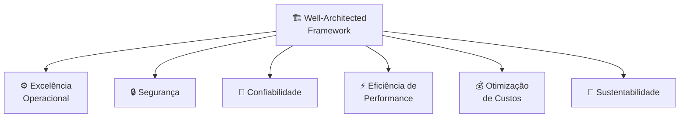

# Módulo 02 · Frameworks: Well-Architected e Cloud Adoption Framework

> **Domínio:** 1 · Conceitos de Nuvem · **Tempo estimado:** 2h30 · **Pré-requisitos:** Módulos 00 e 01

## 🎯 Objetivos de aprendizagem

Ao final deste módulo, você será capaz de:

- Explicar o que é o **AWS Well-Architected Framework** e citar seus **6 pilares**.
- Entender o que é o **AWS Cloud Adoption Framework (CAF)** e suas **6 perspectivas**.
- Diferenciar quando cada framework é usado.

 

---

 

## 🧠 Conteúdo

 

### 1. Por que existem "frameworks"?

Um **framework** é um conjunto de boas práticas organizadas — um "manual de bons hábitos". A AWS criou dois principais, com propósitos diferentes:

| Framework | Responde à pergunta... |
|:--|:--|
| 🏗️ **Well-Architected** | "Minha **arquitetura** na nuvem está bem construída?" |
| 🧭 **Cloud Adoption (CAF)** | "Minha **empresa** está pronta para adotar a nuvem?" |

> [!TIP]
> Macete: **Well-Architected** é sobre *como você constrói* (técnico). **CAF** é sobre *como a organização se transforma* (estratégico).

 

### 2. AWS Well-Architected Framework — os 6 pilares

Pense nos pilares como o "checklist de qualidade" de qualquer solução na nuvem:

| Pilar | O que garante | Analogia 🏠 |
|:--|:--|:--|
| ⚙️ **Excelência Operacional** | Rodar e monitorar sistemas, melhorar processos | Manutenção regular da casa |
| 🔒 **Segurança** | Proteger dados, sistemas e ativos | Fechaduras, alarme e cofre |
| 🛟 **Confiabilidade** | Se recuperar de falhas e escalar sob demanda | Ter gerador e caixa d'água reserva |
| ⚡ **Eficiência de Performance** | Usar os recursos certos, na medida certa | Escolher o eletrodoméstico certo para cada tarefa |
| 💰 **Otimização de Custos** | Não pagar por nada além do necessário | Não deixar luz acesa em cômodo vazio |
| 🌱 **Sustentabilidade** | Reduzir o impacto ambiental | Painéis solares e economia de água |

> [!IMPORTANT]
> São **6 pilares**. O da **Sustentabilidade** foi o último a entrar (em 2021) e cai bastante em provas recentes. Decore todos os seis!

 

### 3. AWS Cloud Adoption Framework (CAF) — as 6 perspectivas

O CAF ajuda uma **organização inteira** a planejar sua jornada para a nuvem. Ele agrupa recomendações em **6 perspectivas**, divididas em dois grupos:

**Foco em pessoas e negócio** (não técnico):

| Perspectiva | Sobre o quê |
|:--|:--|
| 💼 **Negócio (Business)** | Garantir que a nuvem gere valor para os objetivos da empresa. |
| 👥 **Pessoas (People)** | Preparar as equipes, cultura e habilidades. |
| 🏛️ **Governança (Governance)** | Gerenciar riscos, orçamentos e conformidade. |

**Foco em tecnologia** (técnico):

| Perspectiva | Sobre o quê |
|:--|:--|
| 🖥️ **Plataforma (Platform)** | Construir e modernizar a infraestrutura na nuvem. |
| 🔐 **Segurança (Security)** | Garantir confidencialidade, integridade e disponibilidade. |
| 🔧 **Operações (Operations)** | Manter os serviços de nuvem funcionando no dia a dia. |

> [!NOTE]
> Não precisa decorar cada detalhe do CAF para a prova. Basta reconhecer que ele tem **6 perspectivas** e que serve para **planejar a adoção da nuvem** em nível organizacional.

 

---

 

## ❓ Quiz — teste seus conhecimentos

 

**1. Quantos pilares tem o AWS Well-Architected Framework?**

- **A)** 4
- **B)** 5
- **C)** 6
- **D)** 7

💡 Ver resposta

> ✅ **Resposta: C)** — São **6 pilares**: Excelência Operacional, Segurança, Confiabilidade, Eficiência de Performance, Otimização de Custos e Sustentabilidade.

 

**2. Qual pilar foi adicionado por último ao Well-Architected Framework?**

- **A)** Segurança.
- **B)** Sustentabilidade.
- **C)** Confiabilidade.
- **D)** Otimização de Custos.

💡 Ver resposta

> ✅ **Resposta: B)** — A **Sustentabilidade** entrou em 2021 e é o pilar mais recente.

 

**3. O Well-Architected Framework responde a qual pergunta?**

- **A)** "Minha empresa está pronta para adotar a nuvem?"
- **B)** "Minha arquitetura na nuvem está bem construída?"
- **C)** "Quanto custa cada serviço?"
- **D)** "Qual Região devo escolher?"

💡 Ver resposta

> ✅ **Resposta: B)** — O Well-Architected é técnico: avalia **como você construiu** sua solução. O CAF é que trata da prontidão organizacional.

 

**4. O AWS Cloud Adoption Framework (CAF) serve para...**

- **A)** Configurar instâncias EC2.
- **B)** Ajudar uma organização a planejar sua jornada de adoção da nuvem.
- **C)** Criar buckets S3.
- **D)** Medir a latência entre Regiões.

💡 Ver resposta

> ✅ **Resposta: B)** — O CAF é **estratégico**: orienta a empresa (pessoas, negócio, governança e tecnologia) a adotar a nuvem com sucesso.

 

**5. Qual destas é uma perspectiva do CAF com foco em pessoas/negócio?**

- **A)** Plataforma.
- **B)** Operações.
- **C)** Governança.
- **D)** Segurança.

💡 Ver resposta

> ✅ **Resposta: C)** — **Governança** (junto de Negócio e Pessoas) é uma perspectiva de foco não técnico. Plataforma, Segurança e Operações são as técnicas.

 

---

 

## 🧪 Mão na massa (sem console!)

- 🔗 **AWS Skill Builder** → procure por *"AWS Well-Architected"* para uma visão guiada dos pilares.
- 🔗 Leia a página oficial do **Well-Architected Framework** (documentação pública, sem login) e associe cada pilar a um exemplo do seu dia a dia.

 

---

 

## 📔 Glossário

| Termo | Significado |
|:--|:--|
| **Well-Architected Framework** | Conjunto de boas práticas para construir soluções na nuvem (6 pilares). |
| **Pilar** | Cada uma das 6 dimensões de qualidade de uma arquitetura. |
| **Cloud Adoption Framework (CAF)** | Guia para a adoção organizacional da nuvem (6 perspectivas). |
| **Perspectiva** | Cada uma das 6 áreas de foco do CAF. |
| **Sustentabilidade** | Pilar que trata do impacto ambiental das cargas de trabalho. |

 

## ✅ Checklist de conclusão

- [ ] Li todo o conteúdo do módulo
- [ ] Sei citar os 6 pilares do Well-Architected
- [ ] Entendi a diferença entre Well-Architected e CAF
- [ ] Reconheço as 6 perspectivas do CAF
- [ ] Fiz o quiz
- [ ] Registrei meu [Checkpoint](https://github.com/melissaalves-stack/awscloudfoundations/issues/new?template=checkpoint-de-modulo.yml)

 

---

**Precisa de ajuda?** 📊 [Checkpoint](https://github.com/melissaalves-stack/awscloudfoundations/issues/new?template=checkpoint-de-modulo.yml) · ❓ [Dúvida](https://github.com/melissaalves-stack/awscloudfoundations/issues/new?template=duvida.yml) · 📖 [Guia](../../GUIA-DO-ALUNO.md) · 🚀 [Builder Center](https://bit.ly/4w720IR)

⬅️ [Módulo 01](./01-infraestrutura-global-da-aws.md) &nbsp;·&nbsp; 🏠 [Índice do Domínio 1](./README.md) &nbsp;·&nbsp; ➡️ [Módulo 03 · Economia da nuvem e migração](./03-economia-da-nuvem-e-migracao.md)

