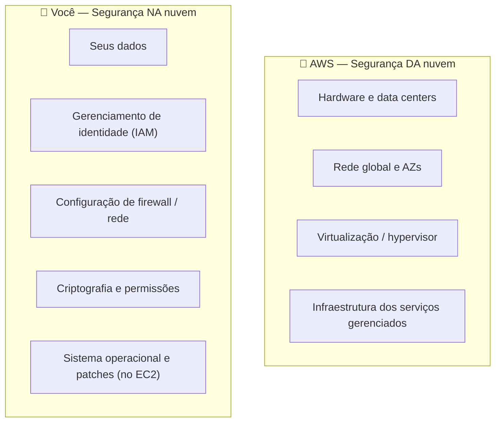

# Módulo 04 · O Modelo de Responsabilidade Compartilhada

> **Domínio:** 2 · Segurança e Conformidade · **Tempo estimado:** 2h30 · **Pré-requisitos:** Domínio 1

## 🎯 Objetivos de aprendizagem

Ao final deste módulo, você será capaz de:

- Explicar o que é o **Modelo de Responsabilidade Compartilhada**.
- Diferenciar segurança **"da" nuvem** (AWS) e segurança **"na" nuvem** (você).
- Classificar exemplos reais de responsabilidade entre AWS e cliente.

 

---

 

## 🧠 Conteúdo

 

### 1. A ideia central

Na nuvem, a segurança é **dividida** entre a AWS e você. Nenhum dos dois é responsável por tudo. Entender essa divisão é uma das perguntas mais comuns da prova.

> [!IMPORTANT]
> A regra de ouro:
> - 🏢 A **AWS** cuida da segurança **"DA" nuvem** (a infraestrutura).
> - 👤 **Você** cuida da segurança **"NA" nuvem** (o que você coloca lá dentro).

 

### 2. A analogia do apartamento alugado 🏠

Pense em alugar um apartamento em um prédio:

| O prédio (AWS) cuida de... | Você (inquilino) cuida de... |
|:--|:--|
| Estrutura, fundação, paredes | Trancar a **sua** porta |
| Segurança da portaria | Não deixar a chave com estranhos |
| Encanamento e elétrica do prédio | Guardar bem seus objetos de valor |
| Câmeras nas áreas comuns | Decidir quem entra no seu apê |

A AWS garante que o "prédio" é seguro. Mas se você deixa a sua porta destrancada (ex.: um bucket S3 público sem querer), o problema é seu.

 

### 3. Quem cuida de quê, na prática

| Responsabilidade | De quem é? |
|:--|:--:|
| Segurança física dos data centers | 🏢 AWS |
| Descarte seguro de discos antigos | 🏢 AWS |
| Configurar quem pode acessar seus recursos (IAM) | 👤 Você |
| Criptografar seus dados sensíveis | 👤 Você |
| Aplicar patches no SO de uma instância EC2 | 👤 Você |
| Manter o hypervisor atualizado | 🏢 AWS |

 

### 4. O detalhe que confunde: serviços gerenciados

A linha de divisão **muda** conforme o tipo de serviço:

- **EC2** (IaaS): você gerencia mais coisas — inclusive o **sistema operacional e os patches**.
- **RDS** (banco gerenciado): a AWS cuida do SO e dos patches do banco; você cuida dos dados e do acesso.
- **Lambda / S3** (serverless / gerenciado): a AWS cuida de quase tudo da infraestrutura; você cuida dos **dados e das permissões**.

> [!TIP]
> Quanto **mais gerenciado** o serviço, **menos** responsabilidade sobra para você. Mas os **seus dados e o controle de acesso (IAM)** são **sempre** sua responsabilidade — em todos os serviços.

 

---

 

## ❓ Quiz — teste seus conhecimentos

 

**1. No modelo de responsabilidade compartilhada, a AWS é responsável por...**

- **A)** Configurar suas permissões de IAM.
- **B)** A segurança "DA" nuvem — a infraestrutura física, rede e virtualização.
- **C)** Criptografar seus dados por você.
- **D)** Aplicar patches no SO das suas instâncias EC2.

💡 Ver resposta

> ✅ **Resposta: B)** — A AWS cuida da segurança **"DA" nuvem**: data centers, hardware, rede e hypervisor.

 

**2. Quem é responsável por aplicar patches no sistema operacional de uma instância EC2?**

- **A)** A AWS.
- **B)** Ninguém.
- **C)** Você (o cliente).
- **D)** O provedor de internet.

💡 Ver resposta

> ✅ **Resposta: C)** — No **EC2** (IaaS), o **cliente** cuida do SO e dos patches. Em serviços gerenciados como o RDS, isso muda.

 

**3. Um bucket S3 ficou público por engano e vazou dados. De quem é a responsabilidade?**

- **A)** Da AWS, sempre.
- **B)** Do cliente — configurar permissões e proteger dados é responsabilidade dele.
- **C)** De ninguém.
- **D)** Do fabricante do disco.

💡 Ver resposta

> ✅ **Resposta: B)** — Proteger dados e configurar acesso é **sempre** do cliente. A AWS garante a infraestrutura, não as suas configurações.

 

**4. Descartar com segurança discos antigos dos data centers é responsabilidade de quem?**

- **A)** Do cliente.
- **B)** Da AWS.
- **C)** Compartilhada igualmente.
- **D)** Do usuário final.

💡 Ver resposta

> ✅ **Resposta: B)** — Tudo que é **físico** (incluindo descarte de hardware) é da **AWS**.

 

**5. Independentemente do serviço usado, o que é SEMPRE responsabilidade do cliente?**

- **A)** A refrigeração do data center.
- **B)** Os próprios dados e o controle de acesso (IAM).
- **C)** A manutenção do hypervisor.
- **D)** A rede global da AWS.

💡 Ver resposta

> ✅ **Resposta: B)** — **Seus dados** e o **gerenciamento de identidade/acesso** são responsabilidade do cliente em **todos** os serviços.

 

---

 

## 🧪 Mão na massa (sem console!)

- 🔗 **AWS Skill Builder** → procure por *"Shared Responsibility Model"* para a visão oficial ilustrada.
- 🔗 Faça o exercício mental: pegue 5 serviços (EC2, S3, RDS, Lambda, DynamoDB) e liste, para cada um, o que é da AWS e o que é seu.

 

---

 

## 📔 Glossário

| Termo | Significado |
|:--|:--|
| **Responsabilidade Compartilhada** | Divisão de deveres de segurança entre AWS e cliente. |
| **Segurança "da" nuvem** | Responsabilidade da AWS (infraestrutura). |
| **Segurança "na" nuvem** | Responsabilidade do cliente (dados, acesso, configuração). |
| **Serviço gerenciado** | Serviço em que a AWS assume mais responsabilidades operacionais. |
| **Hypervisor** | Software que gerencia a virtualização; responsabilidade da AWS. |

 

## ✅ Checklist de conclusão

- [ ] Li todo o conteúdo do módulo
- [ ] Entendo a diferença entre segurança "da" e "na" nuvem
- [ ] Consigo classificar exemplos reais de responsabilidade
- [ ] Sei que dados e IAM são sempre do cliente
- [ ] Fiz o quiz
- [ ] Registrei meu [Checkpoint](https://github.com/melissaalves-stack/awscloudfoundations/issues/new?template=checkpoint-de-modulo.yml)

 

---

**Precisa de ajuda?** 📊 [Checkpoint](https://github.com/melissaalves-stack/awscloudfoundations/issues/new?template=checkpoint-de-modulo.yml) · ❓ [Dúvida](https://github.com/melissaalves-stack/awscloudfoundations/issues/new?template=duvida.yml) · 📖 [Guia](../../GUIA-DO-ALUNO.md) · 🚀 [Builder Center](https://bit.ly/4w720IR)

🏠 [Índice do Domínio 2](./README.md) &nbsp;·&nbsp; ➡️ [Módulo 05 · Identidade e acesso (IAM)](./05-identidade-e-acesso-iam.md)

