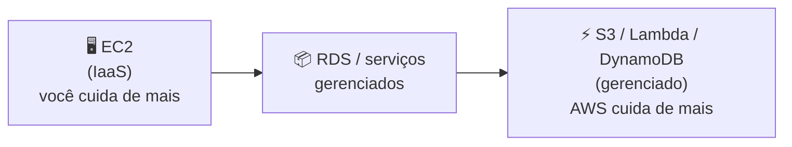

# Módulo 04 · O Modelo de Responsabilidade Compartilhada

> **Domínio:** 2 · Segurança e Conformidade · **Tempo estimado:** 3h · **Pré-requisitos:** Domínio 1 completo
> **Peso na prova:** o Domínio 2 vale **30%** do CLF-C02 — o segundo maior. E este módulo é a espinha dorsal dele: entender quem é responsável por quê é o que destrava metade das questões de segurança.

## 🎯 Onde você quer chegar

Ao final deste módulo, você vai:

- Explicar o **Modelo de Responsabilidade Compartilhada** com suas próprias palavras.
- Saber, para qualquer tarefa, dizer se ela é da **AWS** ou do **cliente**.
- Entender a diferença entre segurança **"da" nuvem** e segurança **"na" nuvem**.
- Não cair na pegadinha dos **serviços gerenciados**, onde a linha de responsabilidade se move.

 

---

 

## 🎬 De quem é a culpa quando vaza?

Toda semana sai uma notícia: "empresa vazou dados de milhões de clientes que estavam na AWS". A pergunta que todo mundo faz é: *a AWS falhou?*

Quase sempre, **não**. Na esmagadora maioria dos vazamentos, a infraestrutura da AWS estava perfeita — o que falhou foi a **configuração feita pelo cliente**: um bucket S3 deixado público sem querer, uma senha fraca, uma permissão larga demais.

Como isso é possível? Porque na nuvem a segurança é **dividida**. A AWS cuida de uma parte, e **você** cuida da outra. Saber exatamente onde uma responsabilidade termina e a outra começa é o coração do Domínio 2 — e é o que este módulo te dá.

 

---

 

## 🧠 Parte 1 — A ideia central: segurança "da" nuvem vs. "na" nuvem

O modelo se resume a uma frase que vale ouro na prova:

> - A **AWS** é responsável pela segurança **DA** nuvem (a infraestrutura: os prédios, o hardware, a rede, a virtualização).
> - **Você** é responsável pela segurança **NA** nuvem (o que você coloca lá dentro: seus dados, seus acessos, suas configurações).

Uma preposição muda tudo: **"da"** (AWS) vs. **"na"** (você). A AWS protege a fundação; você protege o que constrói em cima dela.

 

## 🏠 Parte 2 — A analogia do apartamento alugado

A melhor forma de sentir isso é pensar num prédio de apartamentos. A administradora do prédio (a AWS) e você (o inquilino) têm deveres diferentes — e claros:

| O prédio (AWS) cuida de... | Você (inquilino) cuida de... |
|:--|:--|
| Estrutura, fundação, paredes | Trancar a **sua** porta |
| Segurança da portaria e do perímetro | Não deixar a chave com estranhos |
| Encanamento e elétrica do prédio | Guardar bem seus objetos de valor |
| Câmeras nas áreas comuns | Decidir quem entra no seu apê |

> [!TIP]
> Repare: se você deixar sua porta destrancada e for roubado, **a culpa não é do prédio** — a portaria estava lá, as câmeras funcionando, a estrutura de pé. Você não trancou o que era seu. Na nuvem é idêntico: se você deixa um bucket público, a AWS não falhou. Você não trancou o que era seu.

 

## 🔍 Parte 3 — Quem cuida de quê, na prática

A prova adora te dar uma tarefa e perguntar "de quem é a responsabilidade?". Aqui está o mapa essencial:

| Responsabilidade | De quem é? | Por quê |
|:--|:--:|:--|
| Segurança física dos data centers | 🏢 **AWS** | É a infraestrutura ("da" nuvem) |
| Descarte seguro de discos antigos | 🏢 **AWS** | Hardware é da AWS |
| Manter o **hypervisor** atualizado | 🏢 **AWS** | A camada de virtualização é dela |
| Configurar **quem acessa** seus recursos (IAM) | 👤 **Você** | Controle de acesso é seu |
| **Criptografar** seus dados sensíveis | 👤 **Você** | Seus dados, sua proteção |
| Aplicar **patches no SO** de uma instância EC2 | 👤 **Você** | Você escolheu e opera aquele SO |
| Configurar corretamente um **Security Group** | 👤 **Você** | Configuração é sua |
| Classificar e gerenciar seus dados | 👤 **Você** | Só você sabe o que é sensível |

> [!IMPORTANT]
> Um jeito infalível de decidir na prova: pergunte **"isso é físico/infraestrutura, ou é configuração/dado?"** Físico e infraestrutura (prédio, hardware, hypervisor, rede física) → **AWS**. Configuração, dados, acesso e sistema operacional que você gerencia → **você**.

 

## ⚙️ Parte 4 — A pegadinha: a linha se move com serviços gerenciados

Aqui está o detalhe que derruba gente que decorou só "AWS = física, cliente = resto". A linha de responsabilidade **não é fixa** — ela desliza dependendo de quão **gerenciado** é o serviço.

Pense num espectro:

- Numa instância **EC2** (IaaS, pouco gerenciada), **você** cuida do sistema operacional, dos patches, do firewall. Muita responsabilidade sua.
- Já num serviço **totalmente gerenciado** como o **S3, DynamoDB ou Lambda**, a AWS assume o sistema operacional, os patches e a infraestrutura por baixo. **Sobra menos** para você — mas nunca sobra **nada**: seus **dados** e o **controle de acesso** continuam sendo sempre seus.

> [!NOTE]
> **Regra de ouro que nunca falha:** não importa quão gerenciado seja o serviço, **você é SEMPRE responsável por: (1) seus dados, (2) o controle de acesso a eles (IAM) e (3) a classificação desses dados.** Isso nunca passa para a AWS. Se a questão perguntar "o que é sempre responsabilidade do cliente?", a resposta orbita esses três.

> [!CAUTION]
> **Pegadinha clássica:** "quem aplica patch de segurança no banco de dados?" A resposta **depende**: se for um banco que você instalou numa instância **EC2**, o patch é **seu**; se for um banco **gerenciado** (RDS), o patch do sistema/engine é da **AWS**. Leia se o serviço é gerenciado ou não.

 

---

 

## 🎯 Dicas de prova (pegadinhas clássicas)

> [!CAUTION]
> - **"Da" nuvem = AWS; "na" nuvem = você.** Uma preposição decide a resposta.
> - **Físico/infra → AWS. Configuração/dados/acesso → você.** É o teste rápido.
> - **Você é SEMPRE dono dos seus dados, do acesso (IAM) e da classificação.** Nunca passa pra AWS.
> - **A linha se move com serviços gerenciados.** Patch de SO no EC2 = você; patch no RDS = AWS.
> - **Segurança física dos data centers = sempre AWS.** Vazamento por bucket público = sempre culpa de configuração do cliente.
> - Descarte de hardware, hypervisor, rede física, energia → **AWS**.

 

## 🗺️ Mapa rápido pra revisão

| Pergunta | Resposta |
|:--|:--|
| Prédio, hardware, hypervisor, rede física | 🏢 AWS ("da" nuvem) |
| Meus dados, meu IAM, minha config, meu SO no EC2 | 👤 Você ("na" nuvem) |
| Patch de SO no EC2 | 👤 Você |
| Patch do engine no RDS (gerenciado) | 🏢 AWS |
| Sempre do cliente, em qualquer serviço | Dados + acesso + classificação |

 

---

 

## ❓ Quiz nível prova

 

**1. Uma empresa descobre que um bucket S3 com dados de clientes estava acessível publicamente por engano. De quem é a responsabilidade por essa exposição?**

- **A)** Da AWS, por não impedir a configuração.
- **B)** Do cliente, pois configurar o acesso aos próprios dados é responsabilidade dele.
- **C)** Compartilhada igualmente entre os dois.
- **D)** De ninguém — é um risco inevitável.

💡 Ver resposta e explicação

> ✅ **Resposta: B)**
>
> Controle de acesso e configuração dos próprios dados é **sempre** responsabilidade do cliente (segurança "na" nuvem). A infraestrutura da AWS funcionou; a configuração é que falhou.
>
> - **A)** ❌ — a AWS oferece as ferramentas (Block Public Access); usá-las é com o cliente.
> - **C)** ❌ — nesse caso específico (configuração), a responsabilidade é do cliente.
> - **D)** ❌ — é um risco totalmente evitável com configuração correta.

 

**2. Qual das tarefas a seguir é responsabilidade da AWS no Modelo de Responsabilidade Compartilhada?**

- **A)** Configurar políticas de IAM.
- **B)** Criptografar os dados do cliente.
- **C)** Garantir a segurança física dos data centers.
- **D)** Aplicar patches no sistema operacional de uma instância EC2.

💡 Ver resposta e explicação

> ✅ **Resposta: C)**
>
> Segurança física dos data centers é infraestrutura — segurança "da" nuvem, sempre da **AWS**.
>
> - **A), B), D)** ❌ — todas são segurança "na" nuvem: configuração de acesso, proteção de dados e patch do SO que o cliente gerencia.

 

**3. Uma empresa usa o Amazon RDS (banco de dados gerenciado). Quem é responsável por aplicar patches no motor do banco e no sistema operacional subjacente?**

- **A)** O cliente, como em qualquer banco.
- **B)** A AWS, porque o RDS é um serviço gerenciado.
- **C)** Ninguém — bancos gerenciados não recebem patches.
- **D)** Uma empresa terceirizada contratada pelo cliente.

💡 Ver resposta e explicação

> ✅ **Resposta: B)**
>
> No RDS (gerenciado), a AWS assume o patch do SO e do engine. A linha de responsabilidade **se moveu** para a AWS por ser um serviço gerenciado.
>
> - **A)** ❌ — seria verdade se o banco estivesse instalado numa EC2 (não gerenciado), mas aqui é RDS.
> - **C)** ❌ — recebem patches, sim; a AWS os aplica.
> - **D)** ❌ — não é o modelo.

 

**4. Independentemente do serviço usado (EC2, S3, Lambda...), o que é SEMPRE responsabilidade do cliente?**

- **A)** A manutenção do hypervisor.
- **B)** Os dados, o controle de acesso a eles e sua classificação.
- **C)** A refrigeração dos data centers.
- **D)** O descarte físico dos discos.

💡 Ver resposta e explicação

> ✅ **Resposta: B)**
>
> Dados, acesso (IAM) e classificação **nunca** passam para a AWS, não importa o serviço. É a regra de ouro do modelo.
>
> - **A), C), D)** ❌ — todas são infraestrutura ("da" nuvem), sempre da AWS.

 

**5. Selecione as DUAS responsabilidades que pertencem ao CLIENTE.** *(múltipla resposta — escolha 2)*

- **A)** Configurar corretamente um Security Group.
- **B)** Manter a energia e a refrigeração do data center.
- **C)** Gerenciar as permissões de IAM dos usuários.
- **D)** Proteger fisicamente os servidores contra roubo.

💡 Ver resposta e explicação

> ✅ **Respostas: A) e C)**
>
> Configuração de Security Group e gestão de IAM são segurança "na" nuvem — do cliente.
>
> - **B) e D)** ❌ — energia, refrigeração e proteção física são infraestrutura, sempre da AWS.

 

---

 

## 🧪 Mão na massa (sem console!)

- 🔗 **AWS Skill Builder** → módulo sobre o *Shared Responsibility Model* no Cloud Practitioner Essentials.
- 🔗 Leia o diagrama oficial do **Modelo de Responsabilidade Compartilhada** no site da AWS (sem login).
- ✍️ **Desafio:** pegue 10 tarefas de segurança quaisquer e classifique cada uma em "AWS" ou "cliente". Se acertar as 10, você domina o módulo mais importante do Domínio 2.

 

---

 

## 📔 Glossário

| Termo | Significado |
|:--|:--|
| **Responsabilidade Compartilhada** | Divisão dos deveres de segurança entre AWS e cliente. |
| **Segurança "da" nuvem** | Responsabilidade da AWS: infraestrutura física, hardware, rede, virtualização. |
| **Segurança "na" nuvem** | Responsabilidade do cliente: dados, acesso, configuração, SO gerenciado. |
| **Serviço gerenciado** | Serviço em que a AWS assume mais responsabilidades operacionais (ex.: S3, RDS, Lambda). |
| **Hypervisor** | Software que gerencia a virtualização; responsabilidade da AWS. |

 

## ✅ Checklist de conclusão

- [ ] Sei explicar segurança "da" nuvem vs. "na" nuvem
- [ ] Uso o teste "físico/infra → AWS; config/dados → cliente"
- [ ] Sei que dados, acesso e classificação são sempre do cliente
- [ ] Entendi que a linha se move com serviços gerenciados (EC2 vs. RDS)
- [ ] Fiz o quiz e entendi por que cada alternativa errada está errada
- [ ] Registrei meu [Checkpoint](https://github.com/melissaalves-stack/awscloudfoundations/issues/new?template=checkpoint-de-modulo.yml)

 

---

**Precisa de ajuda?** 📊 [Checkpoint](https://github.com/melissaalves-stack/awscloudfoundations/issues/new?template=checkpoint-de-modulo.yml) · ❓ [Dúvida](https://github.com/melissaalves-stack/awscloudfoundations/issues/new?template=duvida.yml) · 📖 [Guia](../../GUIA-DO-ALUNO.md) · 🚀 [Builder Center](https://bit.ly/4w720IR)

🏠 [Índice do Domínio 2](./README.md) &nbsp;·&nbsp; ➡️ [Módulo 05 · Identidade e acesso (IAM)](./05-identidade-e-acesso-iam.md)

