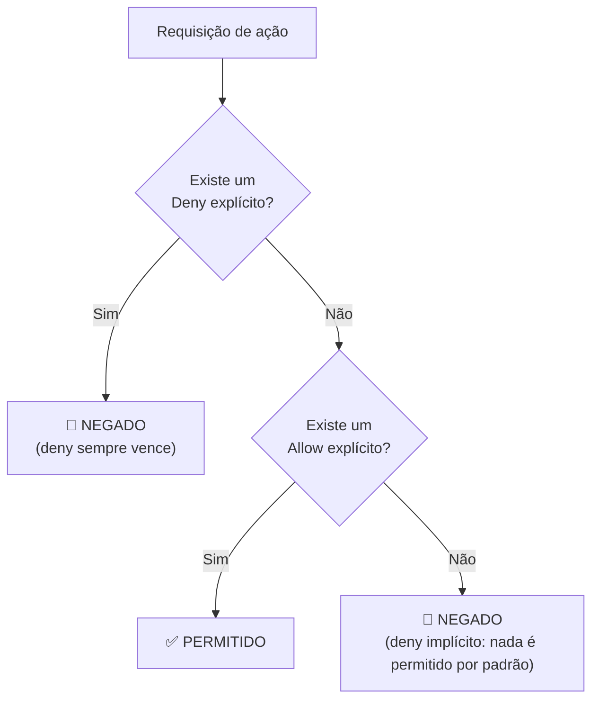

# Módulo 05 · Identidade e acesso (IAM)

> **Domínio:** 2 · Segurança e Conformidade · **Tempo estimado:** 4h · **Pré-requisitos:** Módulo 04
> **Peso na prova:** parte do Domínio 2 (**30%**). O IAM é o serviço de segurança mais cobrado do exame inteiro. Domine este módulo.

## 🎯 Onde você quer chegar

Ao final deste módulo, você vai:

- Diferenciar **autenticação** (quem você é) de **autorização** (o que você pode fazer).
- Saber por que **nunca** se usa o usuário **root** no dia a dia.
- Dominar os 4 blocos do IAM: **usuário, grupo, função (role) e política**.
- Entender a **lógica de avaliação** do IAM — em especial a regra "deny explícito sempre vence".
- Aplicar o **princípio do menor privilégio** e saber quando usar **IAM** vs. **Cognito**.

 

---

 

## 🎬 Duas perguntas na porta

Você chega num prédio corporativo. Na portaria, duas coisas acontecem, sempre nessa ordem:

1. O segurança confere seu crachá: *"você é mesmo quem diz ser?"* — isso é **autenticação**.
2. Depois, ele checa a que andares seu crachá dá acesso: *"você pode entrar onde?"* — isso é **autorização**.

Você pode passar na primeira e falhar na segunda: seu crachá é válido (autenticado), mas não abre a sala do servidor (não autorizado). Guardar essa diferença é o primeiro passo — e o serviço que faz esse duplo controle na AWS chama-se **IAM (Identity and Access Management)**. Ele é **global** e **gratuito**, e é a primeira linha de defesa de qualquer conta.

 

---

 

## 🧠 Parte 1 — Autenticação vs. autorização

| Conceito | Pergunta que responde | Exemplo |
|:--|:--|:--|
| 🔑 **Autenticação** | "Você é quem diz ser?" | Login com usuário e senha (+ MFA) |
| 🚪 **Autorização** | "O que você tem permissão de fazer?" | Poder ler um bucket, mas não apagá-lo |

> [!NOTE]
> A ordem importa: primeiro você **autentica** (prova a identidade), depois o sistema verifica sua **autorização** (o que aquela identidade pode fazer). O IAM cuida das duas coisas.

 

## 👑 Parte 2 — O usuário root: poderoso e perigoso

Quando você cria uma conta AWS, nasce junto o **usuário root** — a identidade "dona" da conta, com **acesso total e irrestrito** a tudo. Ele pode fazer qualquer coisa, inclusive fechar a conta.

E é justamente por isso que ele é perigoso.

> [!WARNING]
> **Nunca use o root no dia a dia.** Se as credenciais do root vazarem, o invasor tem controle absoluto — sem limites. O root é como a **chave-mestra do prédio inteiro**: você a guarda num cofre e usa só em emergências, jamais para abrir a porta todo dia.

**O que fazer com o root:**
1. Proteja-o com uma **senha forte** e **MFA** (autenticação multifator).
2. Guarde as credenciais em segurança e **não as use** para tarefas cotidianas.
3. Crie **usuários IAM** com permissões limitadas para o trabalho do dia a dia.

> [!TIP]
> Existe um punhado de tarefas que **só o root pode fazer** (ex.: alterar o plano de suporte, fechar a conta, mudar o e-mail da conta). Fora essas exceções, tudo deve ser feito por usuários IAM. A prova gosta de perguntar "qual a boa prática para o root?" — a resposta é sempre: **ativar MFA e não usá-lo no cotidiano**.

 

## 🧱 Parte 3 — Os 4 blocos do IAM

O IAM se constrói com quatro peças. Entender cada uma — e como se encaixam — resolve a maioria das questões.

| Peça | O que é | Exemplo |
|:--|:--|:--|
| 👤 **Usuário (User)** | Uma identidade para uma pessoa ou aplicação específica. | A usuária "melissa" |
| 👥 **Grupo (Group)** | Um conjunto de usuários que compartilham as mesmas permissões. | Grupo "Desenvolvedores" |
| 🎭 **Função (Role)** | Uma identidade **temporária** que pode ser **assumida** por quem precisar, sem senha fixa. | Uma role que uma instância EC2 assume para ler um bucket |
| 📜 **Política (Policy)** | Um documento em **JSON** que **define as permissões** (o que pode e o que não pode). | "Pode ler arquivos do S3, mas não apagá-los" |

> [!TIP]
> **Como as peças se encaixam:** você escreve uma **política** (as permissões) e a anexa a um **usuário**, a um **grupo** ou a uma **role**. Boa prática: anexe políticas a **grupos** e coloque os usuários nos grupos — assim você gerencia permissões de dezenas de pessoas de uma vez, em vez de uma por uma.

> [!IMPORTANT]
> **Quando usar Role em vez de Usuário?** Sempre que quem precisa de acesso **não é uma pessoa fixa**: uma **aplicação/serviço** (uma EC2 que precisa acessar o S3), um acesso **temporário**, ou acesso **entre contas**. A grande vantagem: a role dá credenciais **temporárias**, sem senha fixa que possa vazar. "Dê uma role à instância EC2" é resposta de prova para "como um serviço acessa outro com segurança".

 

## 📜 Parte 4 — Como uma política se parece

Você não precisa escrever JSON de cabeça, mas precisa reconhecer as três partes de cada regra (statement):

- **Effect** — `Allow` (permitir) ou `Deny` (negar).
- **Action** — o que pode ser feito (ex.: `s3:GetObject`).
- **Resource** — sobre o quê (ex.: um bucket específico).

Lê-se como uma frase: *"**Permitir** a **ação de ler objetos** no **bucket X**"*.

 

## ⚖️ Parte 5 — A lógica de avaliação (o coração do IAM)

Quando alguém tenta fazer algo, o IAM decide se permite seguindo **três regras de ouro**, nesta ordem:

1. **Deny explícito SEMPRE vence.** Se qualquer política nega, acabou — nada sobrepõe um deny.
2. Se **não há** deny, um **Allow explícito** libera a ação.
3. Se **não há** nem allow nem deny, o padrão é **negar** (é o "deny implícito").

> [!IMPORTANT]
> Duas frases que a prova ama:
> 1. **"Tudo é negado por padrão"** — se você não liberou explicitamente, está bloqueado (deny implícito).
> 2. **"Deny explícito sempre vence Allow"** — se uma política permite e outra nega a mesma ação, o resultado é **negar**.

 

## 🔐 Parte 6 — O princípio do menor privilégio

Esta é **a** regra de ouro da segurança de acessos:

> **Conceda a cada identidade apenas as permissões estritamente necessárias para o trabalho dela — nada mais.**

Se um estagiário só precisa **ler** relatórios, ele não deve ter permissão de **apagar** o banco de dados. Quanto menos permissões cada identidade tem, menor o estrago se aquela credencial for comprometida.

> [!TIP]
> Na prova, "menor privilégio" (least privilege) é quase sempre a resposta certa quando a questão pergunta "qual a melhor prática de segurança para conceder acesso?". Comece do zero e adicione só o necessário — nunca comece dando acesso amplo pra depois tirar.

 

## 🙋 Parte 7 — IAM não é para os clientes do seu app: conheça o Cognito

Cuidado com uma confusão comum e cobrada:

- 🧑‍💼 **IAM** → para **quem administra a AWS** (você, sua equipe, seus serviços). São os "funcionários".
- 🙋 **Amazon Cognito** → para os **usuários finais do seu aplicativo** (os milhões de clientes que fazem login no seu site/app).

> [!CAUTION]
> **Pegadinha:** se a questão fala em "gerenciar o login de milhares de usuários do aplicativo", **não é IAM — é Cognito**. Regra prática: se a identidade mexe no ambiente AWS, é IAM; se é um cliente logando no produto que você construiu, é Cognito.

 

## ✅ Parte 8 — Boas práticas (checklist de segurança do IAM)

- Ative **MFA**, principalmente no root e em usuários privilegiados.
- **Não use o root** no dia a dia; crie usuários IAM.
- Aplique o **menor privilégio** sempre.
- Use **grupos** para organizar permissões.
- Use **roles** para dar acesso a serviços e aplicações (nunca chaves fixas no código).
- Nunca compartilhe senhas nem publique chaves de acesso em repositórios públicos.

 

---

 

## 🎯 Dicas de prova (pegadinhas clássicas)

> [!CAUTION]
> - **IAM é global e gratuito.** Não tem custo e não pertence a uma Região.
> - **Deny explícito sempre vence.** Allow + Deny na mesma ação = negado.
> - **Tudo é negado por padrão** (deny implícito) até você permitir.
> - **Role para serviços/aplicações**, não chaves fixas. "EC2 acessando S3" = use uma role.
> - **MFA + não usar root** = a boa prática que a prova espera.
> - **Cognito ≠ IAM.** Usuários finais do app = Cognito. Administradores/serviços da AWS = IAM.
> - **Menor privilégio** costuma ser a resposta "mais segura".

 

## 🗺️ Mapa rápido pra revisão

| Conceito | Em uma frase |
|:--|:--|
| Autenticação × Autorização | quem você é × o que você pode |
| Root | chave-mestra: MFA + guardar + não usar |
| Usuário / Grupo / Role / Política | identidade / conjunto / temporária assumível / regras JSON |
| Lógica de avaliação | deny explícito > allow explícito > deny implícito |
| Menor privilégio | só o necessário, nada mais |
| IAM × Cognito | admins/serviços × usuários finais do app |

 

---

 

## ❓ Quiz nível prova

 

**1. Uma instância EC2 precisa ler arquivos de um bucket S3 de forma segura. Qual é a melhor prática?**

- **A)** Salvar as chaves de acesso do usuário root no código da aplicação.
- **B)** Atribuir uma IAM Role à instância EC2 com permissão de leitura no bucket.
- **C)** Deixar o bucket público.
- **D)** Criar um usuário IAM e colar suas chaves fixas na instância.

💡 Ver resposta e explicação

> ✅ **Resposta: B)**
>
> **Roles** dão credenciais temporárias a serviços/aplicações, sem chaves fixas que possam vazar. É a forma segura de uma EC2 acessar o S3.
>
> - **A)** ❌ — usar chaves do root em código é o pior cenário possível de segurança.
> - **C)** ❌ — expor o bucket é uma falha grave.
> - **D)** ❌ — chaves fixas numa instância podem vazar; a role resolve isso melhor.

 

**2. Uma política permite `s3:*` e outra nega explicitamente `s3:DeleteObject` para o mesmo usuário. O usuário consegue apagar objetos no S3?**

- **A)** Sim, porque há um Allow para `s3:*`.
- **B)** Não, porque o Deny explícito sempre vence o Allow.
- **C)** Depende da ordem em que as políticas foram criadas.
- **D)** Sim, se ele for administrador.

💡 Ver resposta e explicação

> ✅ **Resposta: B)**
>
> **Deny explícito sempre vence.** Mesmo com um Allow amplo (`s3:*`), a negação explícita de `DeleteObject` bloqueia essa ação.
>
> - **A)** ❌ — o Allow amplo não supera um Deny explícito.
> - **C)** ❌ — a ordem não importa; deny sempre ganha.
> - **D)** ❌ — o deny se aplica independentemente do "cargo".

 

**3. Qual é a melhor prática para o usuário root de uma conta AWS?**

- **A)** Usá-lo para todas as tarefas diárias por conveniência.
- **B)** Compartilhá-lo com a equipe para agilizar.
- **C)** Ativar MFA, guardar as credenciais com segurança e não usá-lo no dia a dia.
- **D)** Apagar o usuário root.

💡 Ver resposta e explicação

> ✅ **Resposta: C)**
>
> O root deve ter **MFA**, ficar guardado e ser usado só nas raras tarefas exclusivas dele. O trabalho diário vai para usuários IAM.
>
> - **A) / B)** ❌ — usar/compartilhar o root no cotidiano é risco altíssimo.
> - **D)** ❌ — não dá para apagar o root; ele é o dono da conta. Você o protege, não o elimina.

 

**4. Um aplicativo terá milhões de usuários finais que precisam criar conta e fazer login. Qual serviço da AWS é o indicado para gerenciar essas identidades?**

- **A)** AWS IAM
- **B)** Amazon Cognito
- **C)** AWS Organizations
- **D)** IAM Identity Center

💡 Ver resposta e explicação

> ✅ **Resposta: B) Amazon Cognito**
>
> Cognito é feito para gerenciar identidades dos **usuários finais de aplicativos** (login, cadastro, federação social).
>
> - **A)** ❌ — IAM é para administradores e serviços da AWS, não para os clientes do app.
> - **C)** ❌ — Organizations gerencia várias contas AWS.
> - **D)** ❌ — o Identity Center gerencia acesso de funcionários a contas/aplicações corporativas, não milhões de clientes de um app público.

 

**5. Selecione as DUAS práticas que seguem o princípio do menor privilégio e a segurança do IAM.** *(múltipla resposta — escolha 2)*

- **A)** Conceder a cada usuário apenas as permissões necessárias para sua função.
- **B)** Dar acesso de administrador a todos, para evitar bloqueios.
- **C)** Usar grupos para aplicar permissões consistentes a conjuntos de usuários.
- **D)** Compartilhar um único usuário IAM entre toda a equipe.

💡 Ver resposta e explicação

> ✅ **Respostas: A) e C)**
>
> **A** é a definição de menor privilégio; **C** é a boa prática de gerenciar permissões por grupo.
>
> - **B)** ❌ — acesso admin para todos é o oposto do menor privilégio.
> - **D)** ❌ — compartilhar usuário destrói a auditoria (não se sabe quem fez o quê) e é inseguro.

 

---

 

## 🧪 Mão na massa (sem console!)

- 🔗 **AWS Skill Builder** → módulo de *IAM* no Cloud Practitioner Essentials.
- 🔗 **AWS SimuLearn** → cenários guiados de criação de usuários, grupos e políticas.
- ✍️ **Desafio:** escreva em uma frase, para 3 situações diferentes, se você usaria usuário, grupo ou role — e por quê. Ex.: "uma EC2 lendo o S3 → role, porque é um serviço e evita chave fixa".

 

---

 

## 📔 Glossário

| Termo | Significado |
|:--|:--|
| **IAM** | Serviço global e gratuito de gerenciamento de identidade e acesso da AWS. |
| **Autenticação** | Provar a identidade (quem você é). |
| **Autorização** | Definir o que a identidade pode fazer. |
| **Usuário root** | Identidade "dona" da conta, com acesso total. |
| **Usuário / Grupo** | Identidade individual / conjunto de usuários com permissões comuns. |
| **Role (Função)** | Identidade assumível com credenciais temporárias; ideal para serviços. |
| **Política (Policy)** | Documento JSON que define permissões (Effect, Action, Resource). |
| **Deny explícito** | Negação que sempre vence qualquer Allow. |
| **Deny implícito** | Tudo é negado por padrão até ser permitido. |
| **MFA** | Autenticação multifator (segunda prova além da senha). |
| **Menor privilégio** | Conceder apenas as permissões estritamente necessárias. |
| **Amazon Cognito** | Serviço de identidade para os usuários finais do seu aplicativo. |

 

## ✅ Checklist de conclusão

- [ ] Diferencio autenticação de autorização
- [ ] Sei por que não usar o root e como protegê-lo (MFA)
- [ ] Domino os 4 blocos: usuário, grupo, role, política
- [ ] Entendi a lógica "deny explícito sempre vence" e o deny implícito
- [ ] Sei aplicar o menor privilégio
- [ ] Sei quando usar IAM e quando usar Cognito
- [ ] Fiz o quiz e entendi por que cada alternativa errada está errada
- [ ] Registrei meu [Checkpoint](https://github.com/melissaalves-stack/awscloudfoundations/issues/new?template=checkpoint-de-modulo.yml)

 

---

**Precisa de ajuda?** 📊 [Checkpoint](https://github.com/melissaalves-stack/awscloudfoundations/issues/new?template=checkpoint-de-modulo.yml) · ❓ [Dúvida](https://github.com/melissaalves-stack/awscloudfoundations/issues/new?template=duvida.yml) · 📖 [Guia](../../GUIA-DO-ALUNO.md) · 🚀 [Builder Center](https://bit.ly/4w720IR)

⬅️ [Módulo 04](./04-modelo-responsabilidade-compartilhada.md) &nbsp;·&nbsp; 🏠 [Índice do Domínio 2](./README.md) &nbsp;·&nbsp; ➡️ [Módulo 06 · Proteção de dados e criptografia](./06-protecao-de-dados-e-criptografia.md)

