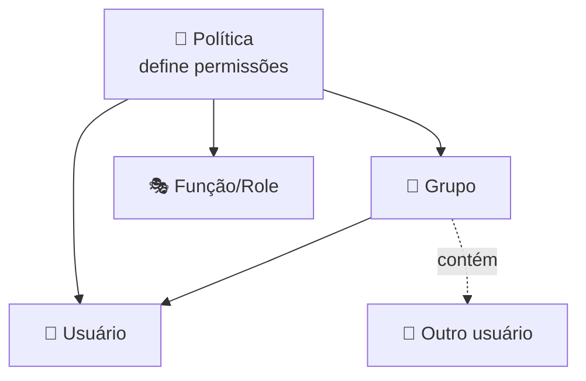
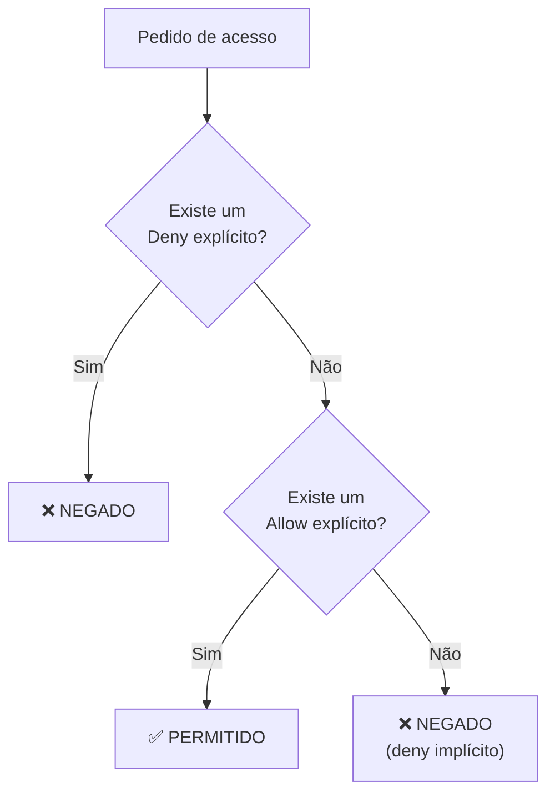
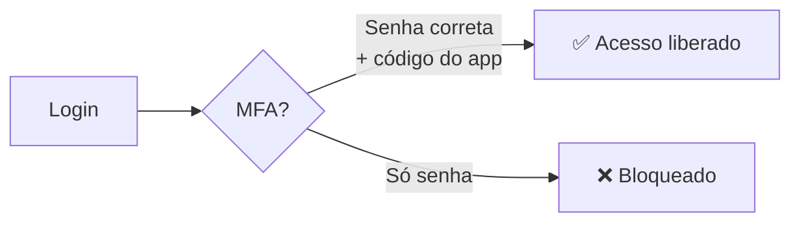

# Módulo 05 · Identidade e acesso (IAM)

> **Domínio:** 2 · Segurança e Conformidade · **Tempo estimado:** 4h · **Pré-requisitos:** Módulo 04

## 🎯 Objetivos de aprendizagem

Ao final deste módulo, você será capaz de:

- Diferenciar **autenticação** de **autorização**.
- Entender o que são usuários, grupos, funções (roles) e políticas (policies) no IAM.
- Aplicar o princípio do **menor privilégio**.
- Entender como o IAM decide se um acesso é permitido ou negado.
- Listar boas práticas de segurança de acesso.

<br>

---

<br>

## 🧠 Conteúdo

<br>

### 1. Autenticação vs. autorização

Dois conceitos que parecem iguais, mas não são:

- 🔑 **Autenticação** = provar **quem você é** (ex.: entrar com login e senha).
- 🚪 **Autorização** = definir **o que você pode fazer** depois de entrar.

> [!TIP]
> **Analogia do prédio:** a **autenticação** é o crachá que prova que você trabalha ali. A **autorização** é quais portas o seu crachá abre. Você pode entrar no prédio (autenticado) mas não ter acesso à sala do servidor (não autorizado).

O serviço que cuida disso na AWS é o **IAM — Identity and Access Management**. E o melhor: **o IAM é gratuito** e **global**.

<br>

### 2. O usuário root: poderoso e perigoso

Quando uma conta AWS é criada, nasce o **usuário root** — o "dono" absoluto, com acesso a **tudo**.

> [!CAUTION]
> O usuário root é como a chave-mestra do prédio. Você **não** deve usá-lo no dia a dia. Configure-o com senha forte + MFA, guarde-o em segurança e use-o apenas para tarefas muito específicas. Para o resto, crie usuários IAM.

> [!NOTE]
> Há um punhado de tarefas que **só** o root pode fazer: fechar a conta, mudar o plano de suporte, alterar o e-mail da conta e algumas configurações de faturamento. Fora isso, tudo deve ser feito por usuários IAM.

<br>

### 3. Os quatro conceitos do IAM



| Conceito | O que é | Exemplo |
|:--|:--|:--|
| 👤 **Usuário (User)** | Uma identidade para uma pessoa ou aplicação. | A usuária "melissa". |
| 👥 **Grupo (Group)** | Um conjunto de usuários que compartilham permissões. | Grupo "Desenvolvedores". |
| 🎭 **Função (Role)** | Uma identidade "temporária" que pode ser assumida por quem precisa. | Uma role que um servidor assume para ler arquivos. |
| 📜 **Política (Policy)** | Um documento (em JSON) que **define permissões** (o que pode/não pode). | "Pode ler arquivos, mas não apagar." |

> [!NOTE]
> **Grupos** facilitam a vida: em vez de dar permissões um por um, você aplica a política ao grupo e adiciona pessoas nele. **Roles** são ótimas para dar permissões a **serviços** (não a pessoas), sem precisar de senhas.

<br>

### 4. Como uma política se parece

Uma política é um documento JSON com três partes principais: o **efeito** (permitir ou negar), a **ação** (o que pode ser feito) e o **recurso** (sobre o quê):

```json
{
  "Effect": "Allow",
  "Action": "s3:GetObject",
  "Resource": "arn:aws:s3:::relatorios-da-liga/*"
}
```

Isto lê-se: "**permitir** a ação **ler objetos** no bucket **relatorios-da-liga**". Você não precisa decorar a sintaxe para a prova, mas entender as três partes ajuda muito.

<br>

### 5. Como o IAM decide: a lógica de avaliação

Quando alguém tenta fazer algo, o IAM segue uma regra de ouro para decidir:



> [!IMPORTANT]
> A ordem é: **1) Deny explícito sempre vence.** **2)** Se não há Deny, um **Allow explícito** libera. **3)** Se não há nem Allow nem Deny, o padrão é **negar** (deny implícito). Ou seja: por padrão, tudo é proibido até que você libere — e um Deny nunca é sobreposto por um Allow.

<br>

### 6. O princípio do menor privilégio

Esta é **a regra de ouro da segurança na nuvem**:

> [!IMPORTANT]
> **Dê a cada usuário apenas as permissões mínimas necessárias para fazer o trabalho dele — nada além disso.**

Se a pessoa só precisa **ler** relatórios, ela não deve poder **apagar** o banco de dados. Menos permissões = menos risco se aquela conta for comprometida.

<br>

### 7. IAM não é para todo mundo: e os clientes do seu app?

Cuidado com uma confusão comum:

- 🧑‍💼 **IAM** → para **quem administra a AWS** (você, sua equipe, serviços). São os "funcionários".
- 🙋 **Amazon Cognito** → para os **usuários finais do seu aplicativo** (os clientes que fazem login no seu site/app).

> [!TIP]
> Regra prática: se a identidade mexe no ambiente AWS, é **IAM**. Se é um cliente logando no produto que você construiu, é **Cognito**.

<br>

### 8. Boas práticas de segurança

- ✅ Ative **MFA** (autenticação multifator) — uma segunda prova além da senha (ex.: código no celular).
- ✅ **Não use o root** no dia a dia; crie usuários IAM.
- ✅ Aplique o **menor privilégio** sempre.
- ✅ Use **grupos** para organizar permissões.
- ✅ Use **roles** para dar acesso a serviços e aplicações (nunca coloque chaves fixas em código).
- ✅ Nunca compartilhe senhas nem publique chaves de acesso em repositórios públicos.



<br>

---

<br>

## ❓ Quiz — teste seus conhecimentos

<br>

**1. Qual a diferença entre autenticação e autorização?**

- **A)** São sinônimos.
- **B)** Autenticação prova quem você é; autorização define o que você pode fazer.
- **C)** Autenticação define permissões; autorização faz login.
- **D)** Ambas significam "fazer login".

<details>
<summary>💡 Ver resposta</summary>

> ✅ **Resposta: B)** — **Autenticação** = provar identidade (login/senha). **Autorização** = o que você pode fazer depois de autenticado.

</details>

<br>

**2. Por que NÃO devemos usar o usuário root no dia a dia?**

- **A)** Porque ele é lento.
- **B)** Porque ele tem acesso irrestrito a tudo — se comprometido, o estrago é total.
- **C)** Porque ele não tem permissões.
- **D)** Porque a AWS cobra a mais por usá-lo.

<details>
<summary>💡 Ver resposta</summary>

> ✅ **Resposta: B)** — O root tem poder total. Protege-se com MFA, guarda-se, e usam-se **usuários IAM** com permissões limitadas no dia a dia.

</details>

<br>

**3. O que é o princípio do menor privilégio?**

- **A)** Dar a todos os usuários acesso de administrador.
- **B)** Conceder apenas as permissões mínimas necessárias para cada função.
- **C)** Bloquear todos os acessos permanentemente.
- **D)** Usar sempre o usuário root.

<details>
<summary>💡 Ver resposta</summary>

> ✅ **Resposta: B)** — Menor privilégio = **só as permissões estritamente necessárias**. Reduz o risco em caso de comprometimento.

</details>

<br>

**4. Uma política tem um `Allow` para `s3:*` e outra tem um `Deny` para `s3:DeleteObject`. O usuário consegue apagar um objeto?**

- **A)** Sim, porque o Allow é mais amplo.
- **B)** Não, porque o Deny explícito sempre vence.
- **C)** Depende do horário.
- **D)** Sim, se ele for do grupo certo.

<details>
<summary>💡 Ver resposta</summary>

> ✅ **Resposta: B)** — O **Deny explícito sempre vence** o Allow. O usuário faz as outras ações de S3, mas **não** apaga objetos.

</details>

<br>

**5. Seu aplicativo tem milhares de clientes que fazem login. Qual serviço você usa para eles?**

- **A)** IAM.
- **B)** Usuário root.
- **C)** Amazon Cognito.
- **D)** AWS Shield.

<details>
<summary>💡 Ver resposta</summary>

> ✅ **Resposta: C)** — Para **usuários finais do seu app**, use o **Amazon Cognito**. O IAM é para quem **administra** a AWS.

</details>

<br>

---

<br>

## 🧪 Mão na massa (sem console!)

- 🔗 **AWS Skill Builder** → labs guiados de *"Introduction to AWS Identity and Access Management (IAM)"*.
- 🔗 **AWS Builder Labs** → laboratório com ambiente pronto para praticar criação de usuários, grupos e políticas **sem** usar sua própria conta.
- 🔗 **AWS SimuLearn** → procure pela jornada de **identidade e acesso** para praticar IAM com MFA em ambiente isolado e seguro.

<br>

---

<br>

## 📔 Glossário

| Termo | Significado |
|:--|:--|
| **IAM** | Serviço global e gratuito de gerenciamento de identidade e acesso da AWS. |
| **Autenticação** | Provar a identidade. |
| **Autorização** | Definir o que a identidade pode fazer. |
| **Usuário root** | Identidade "dona" da conta, com acesso total. |
| **Política (Policy)** | Documento JSON que define permissões (Effect, Action, Resource). |
| **Role (Função)** | Identidade assumível, ideal para serviços e acessos temporários. |
| **Deny explícito** | Negação que sempre vence qualquer permissão. |
| **MFA** | Autenticação multifator (segunda prova além da senha). |
| **Menor privilégio** | Dar só as permissões estritamente necessárias. |
| **Amazon Cognito** | Serviço de identidade para os usuários finais do seu aplicativo. |

<br>

## ✅ Checklist de conclusão

- [ ] Li todo o conteúdo do módulo
- [ ] Sei diferenciar autenticação e autorização
- [ ] Entendi usuários, grupos, roles e políticas
- [ ] Consigo explicar o menor privilégio
- [ ] Entendi a lógica "deny explícito vence"
- [ ] Sei quando usar IAM e quando usar Cognito
- [ ] Fiz o quiz
- [ ] Registrei meu [Checkpoint](https://github.com/melissaalves-stack/awscloudfoundations/issues/new?template=checkpoint-de-modulo.yml)

<br>

---

<div align="center">

**Precisa de ajuda?** 📊 [Checkpoint](https://github.com/melissaalves-stack/awscloudfoundations/issues/new?template=checkpoint-de-modulo.yml) · ❓ [Dúvida](https://github.com/melissaalves-stack/awscloudfoundations/issues/new?template=duvida.yml) · 📖 [Guia](../../GUIA-DO-ALUNO.md) · 🚀 [Builder Center](https://bit.ly/4w720IR)

⬅️ [Módulo 04](./04-modelo-responsabilidade-compartilhada.md) &nbsp;·&nbsp; 🏠 [Índice do Domínio 2](./README.md) &nbsp;·&nbsp; ➡️ [Módulo 06 · Proteção de dados e criptografia](./06-protecao-de-dados-e-criptografia.md)

</div>
