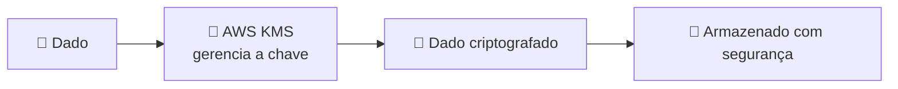

# Módulo 06 · Proteção de dados e criptografia

> **Domínio:** 2 · Segurança e Conformidade · **Tempo estimado:** 3h · **Pré-requisitos:** Módulos 04 e 05

## 🎯 Objetivos de aprendizagem

Ao final deste módulo, você será capaz de:

- Entender criptografia **em repouso** e **em trânsito**.
- Explicar o papel do **AWS KMS** e do **CloudHSM**.
- Reconhecer serviços de proteção de dados como **Secrets Manager** e **Macie**.

 

---

 

## 🧠 Conteúdo

 

### 1. O que é criptografia (sem susto)

Criptografar é **embaralhar** um dado com uma "chave", de modo que só quem tem a chave certa consiga lê-lo de volta. Sem a chave, o dado vira texto sem sentido.

> [!TIP]
> **Analogia do cofre** 🔐
> Criptografar é trancar seu documento num cofre. Mesmo que alguém roube o cofre, sem a **chave** não abre. A "chave" aqui é uma sequência secreta que o computador usa para embaralhar e desembaralhar.

 

### 2. Dois momentos: em repouso e em trânsito

| Tipo | Quando acontece | Exemplo |
|:--|:--|:--|
| 🛑 **Em repouso (at rest)** | Quando o dado está **guardado** (parado no disco). | Um arquivo salvo num bucket S3 criptografado. |
| 🚚 **Em trânsito (in transit)** | Quando o dado está **viajando** pela rede. | Uma página carregando por HTTPS (o cadeado do navegador). |

> [!IMPORTANT]
> A prova gosta dessa dupla. **Em repouso** = dado parado/armazenado. **Em trânsito** = dado em movimento pela rede. O ideal é proteger **os dois**.

 

### 3. AWS KMS — o gerente de chaves

Gerenciar chaves de criptografia à mão é complicado e arriscado. O **AWS KMS (Key Management Service)** faz isso por você: cria, guarda, gira e controla o acesso às chaves — e se integra com quase todos os serviços (S3, EBS, RDS...).

> [!NOTE]
> Com o KMS, você ativa criptografia em muitos serviços praticamente com **um clique** — o KMS cuida das chaves nos bastidores.

 

### 4. Quando você precisa de controle total: CloudHSM

Alguns setores (bancos, governo) exigem controle **físico e exclusivo** das chaves, por lei. Para esses casos existe o **AWS CloudHSM** — um módulo de hardware dedicado **só para você**, onde as chaves nunca saem do seu controle.

> [!TIP]
> Regra prática: **KMS** para a maioria dos casos (gerenciado e fácil). **CloudHSM** quando há exigência regulatória de hardware dedicado.

 

### 5. Outros guardiões de dados

| Serviço | Para que serve |
|:--|:--|
| 🗝️ **AWS Secrets Manager** | Guardar e girar **segredos** (senhas de banco, chaves de API) com segurança, sem deixá-los no código. |
| 📇 **AWS Systems Manager Parameter Store** | Guardar configurações e segredos simples (versão mais econômica para casos básicos). |
| 🕵️ **Amazon Macie** | Usa ML para **descobrir dados sensíveis** (como CPFs e cartões) guardados no S3. |
| 📜 **AWS Certificate Manager (ACM)** | Gerencia certificados SSL/TLS para habilitar HTTPS (criptografia em trânsito). |

> [!CAUTION]
> **Nunca** escreva senhas ou chaves de acesso direto no seu código ou em repositórios públicos. Use o **Secrets Manager** ou **roles** do IAM. Chaves vazadas em repositórios são uma das principais causas de incidentes.

 

---

 

## ❓ Quiz — teste seus conhecimentos

 

**1. Um arquivo salvo e parado em um bucket S3 criptografado está protegido de que forma?**

- **A)** Em trânsito.
- **B)** Em repouso.
- **C)** Não está protegido.
- **D)** Apenas por senha.

💡 Ver resposta

> ✅ **Resposta: B)** — Dado **guardado/parado** = criptografia **em repouso** (at rest).

 

**2. O cadeado HTTPS de um site protege os dados de que forma?**

- **A)** Em repouso.
- **B)** Em trânsito.
- **C)** Nenhuma.
- **D)** Apenas contra vírus.

💡 Ver resposta

> ✅ **Resposta: B)** — HTTPS protege o dado **em movimento pela rede** = criptografia **em trânsito** (in transit).

 

**3. Qual serviço a AWS oferece para criar e gerenciar chaves de criptografia de forma integrada?**

- **A)** Amazon Macie.
- **B)** AWS KMS (Key Management Service).
- **C)** Amazon Cognito.
- **D)** AWS Shield.

💡 Ver resposta

> ✅ **Resposta: B)** — O **KMS** gerencia chaves e se integra com S3, EBS, RDS e muitos outros serviços.

 

**4. Um banco precisa, por lei, de um módulo de hardware dedicado só para suas chaves. Qual serviço atende?**

- **A)** AWS KMS.
- **B)** AWS CloudHSM.
- **C)** AWS Secrets Manager.
- **D)** Amazon Macie.

💡 Ver resposta

> ✅ **Resposta: B)** — O **CloudHSM** oferece hardware dedicado e exclusivo, ideal para exigências regulatórias.

 

**5. Qual serviço usa machine learning para descobrir dados sensíveis (como CPFs) guardados no S3?**

- **A)** Amazon Macie.
- **B)** AWS KMS.
- **C)** AWS Certificate Manager.
- **D)** Amazon Cognito.

💡 Ver resposta

> ✅ **Resposta: A)** — O **Amazon Macie** identifica e classifica dados sensíveis no S3 usando ML.

 

---

 

## 🧪 Mão na massa (sem console!)

- 🔗 **AWS Skill Builder** → procure por *"AWS KMS"* e *"Data Protection"* para exemplos guiados.
- 🔗 Reflita: para um app que guarda dados de clientes, liste onde você aplicaria criptografia **em repouso** e onde aplicaria **em trânsito**.

 

---

 

## 📔 Glossário

| Termo | Significado |
|:--|:--|
| **Criptografia** | Embaralhar dados com uma chave para que só quem a possui consiga lê-los. |
| **Em repouso (at rest)** | Proteção de dados armazenados/parados. |
| **Em trânsito (in transit)** | Proteção de dados em movimento pela rede. |
| **AWS KMS** | Serviço gerenciado de criação e gestão de chaves. |
| **AWS CloudHSM** | Módulo de hardware dedicado para controle exclusivo de chaves. |
| **Secrets Manager** | Serviço para guardar e girar segredos com segurança. |
| **Amazon Macie** | Descobre dados sensíveis no S3 com ML. |
| **ACM** | Gerencia certificados SSL/TLS (HTTPS). |

 

## ✅ Checklist de conclusão

- [ ] Li todo o conteúdo do módulo
- [ ] Entendo criptografia em repouso e em trânsito
- [ ] Sei o papel do KMS e do CloudHSM
- [ ] Reconheço Secrets Manager, Macie e ACM
- [ ] Fiz o quiz
- [ ] Registrei meu [Checkpoint](https://github.com/melissaalves-stack/awscloudfoundations/issues/new?template=checkpoint-de-modulo.yml)

 

---

**Precisa de ajuda?** 📊 [Checkpoint](https://github.com/melissaalves-stack/awscloudfoundations/issues/new?template=checkpoint-de-modulo.yml) · ❓ [Dúvida](https://github.com/melissaalves-stack/awscloudfoundations/issues/new?template=duvida.yml) · 📖 [Guia](../../GUIA-DO-ALUNO.md) · 🚀 [Builder Center](https://bit.ly/4w720IR)

⬅️ [Módulo 05](./05-identidade-e-acesso-iam.md) &nbsp;·&nbsp; 🏠 [Índice do Domínio 2](./README.md) &nbsp;·&nbsp; ➡️ [Módulo 07 · Conformidade e serviços de segurança](./07-conformidade-e-servicos-de-seguranca.md)

