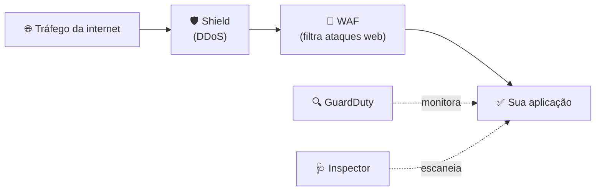

# Módulo 07 · Conformidade e serviços de segurança

> **Domínio:** 2 · Segurança e Conformidade · **Tempo estimado:** 2h30 · **Pré-requisitos:** Módulos 04 a 06

## 🎯 Objetivos de aprendizagem

Ao final deste módulo, você será capaz de:

- Entender o que é **conformidade** e o papel do **AWS Artifact**.
- Reconhecer os principais **serviços de segurança**: GuardDuty, Shield, WAF, Inspector.
- Saber onde encontrar informações de segurança e monitoramento.

 

---

 

## 🧠 Conteúdo

 

### 1. O que é conformidade?

**Conformidade (compliance)** é seguir as regras — leis, normas e padrões do setor. Exemplos: **LGPD** (Brasil), **GDPR** (Europa), **PCI DSS** (cartões), **HIPAA** (saúde nos EUA).

A AWS mantém **certificações** que comprovam que sua infraestrutura atende a esses padrões. Mas lembre-se do [Módulo 04](./04-modelo-responsabilidade-compartilhada.md): a AWS garante a conformidade **da** infraestrutura; a conformidade do que **você** constrói continua sua.

 

### 2. AWS Artifact — a "sala de documentos"

O **AWS Artifact** é o portal onde você baixa, sob demanda, os **relatórios de conformidade** e certificações da AWS (como ISO, SOC, PCI). Útil quando um auditor pede provas de que a infraestrutura é segura.

> [!NOTE]
> Pense no Artifact como um "cartório digital": é lá que ficam os documentos oficiais que comprovam a conformidade da AWS.

 

### 3. Os guardiões: serviços de segurança

Cada um protege contra um tipo de ameaça diferente:

| Serviço | O que faz | Analogia 🛡️ |
|:--|:--|:--|
| 🔍 **Amazon GuardDuty** | Detecta ameaças e atividades suspeitas continuamente. | Um detetive que vigia comportamentos estranhos. |
| 🛡️ **AWS Shield** | Protege contra ataques **DDoS** (sobrecarga). | Um escudo contra "tsunamis" de tráfego. |
| 🧱 **AWS WAF** (Web Application Firewall) | Filtra tráfego malicioso em aplicações web (ex.: SQL injection). | Um porteiro que barra pedidos maliciosos. |
| 🩺 **Amazon Inspector** | Verifica vulnerabilidades em instâncias e aplicações. | Um check-up de saúde do seu sistema. |

> [!TIP]
> Macete rápido:
> - **Shield** = anti-**DDoS**.
> - **WAF** = firewall de **aplicação web**.
> - **GuardDuty** = **detecção** de ameaças (monitora).
> - **Inspector** = **varredura** de vulnerabilidades.

 

### 4. Monitorando e auditando

Dois serviços aparecem muito quando o assunto é "quem fez o quê":

| Serviço | Responde à pergunta... |
|:--|:--|
| 🔎 **AWS CloudTrail** | "**Quem** fez **qual** ação na minha conta e **quando**?" (auditoria) |
| 📊 **Amazon CloudWatch** | "Como estão a **saúde e o desempenho** dos meus recursos?" (métricas e logs) |

> [!IMPORTANT]
> Não confunda: **CloudTrail** = trilha de **auditoria** (ações e chamadas de API). **CloudWatch** = **monitoramento** (métricas, alarmes, logs de desempenho). A prova adora testar essa diferença.

 

### 5. Central de recomendações: Trusted Advisor

O **AWS Trusted Advisor** analisa sua conta e dá recomendações em 5 categorias: **otimização de custos, desempenho, segurança, tolerância a falhas e limites de serviço**. É como um consultor automático apontando o que melhorar. (Veremos de novo no [Domínio 4](../dominio-4-cobranca-precos-e-suporte/README.md).)

 

---

 

## ❓ Quiz — teste seus conhecimentos

 

**1. Onde você baixa os relatórios de conformidade oficiais da AWS (ISO, SOC, PCI)?**

- **A)** Amazon GuardDuty.
- **B)** AWS Artifact.
- **C)** AWS Shield.
- **D)** Amazon CloudWatch.

💡 Ver resposta

> ✅ **Resposta: B)** — O **AWS Artifact** é o portal de relatórios e certificações de conformidade.

 

**2. Qual serviço protege especificamente contra ataques DDoS?**

- **A)** AWS WAF.
- **B)** AWS Shield.
- **C)** Amazon Inspector.
- **D)** AWS Artifact.

💡 Ver resposta

> ✅ **Resposta: B)** — O **AWS Shield** protege contra **DDoS** (sobrecarga de tráfego).

 

**3. Qual serviço detecta ameaças e atividades suspeitas de forma contínua?**

- **A)** Amazon GuardDuty.
- **B)** AWS Artifact.
- **C)** AWS Certificate Manager.
- **D)** Amazon Cognito.

💡 Ver resposta

> ✅ **Resposta: A)** — O **GuardDuty** é o serviço de **detecção** de ameaças (o "detetive").

 

**4. Você precisa saber QUEM realizou uma ação na sua conta e QUANDO. Qual serviço usar?**

- **A)** Amazon CloudWatch.
- **B)** AWS CloudTrail.
- **C)** AWS WAF.
- **D)** Amazon Inspector.

💡 Ver resposta

> ✅ **Resposta: B)** — O **CloudTrail** é a trilha de **auditoria** (registra ações e chamadas de API). O CloudWatch é para métricas de desempenho.

 

**5. Qual serviço filtra tráfego malicioso em aplicações web, como tentativas de SQL injection?**

- **A)** AWS Shield.
- **B)** AWS WAF.
- **C)** Amazon Macie.
- **D)** AWS KMS.

💡 Ver resposta

> ✅ **Resposta: B)** — O **AWS WAF** (Web Application Firewall) filtra ataques na camada de aplicação web.

 

---

 

## 🧪 Mão na massa (sem console!)

- 🔗 **AWS Skill Builder** → procure por *"AWS Security Services"* para conhecer GuardDuty, Shield, WAF e Inspector.
- 🔗 Monte uma tabela mental associando cada ameaça (DDoS, ataque web, vulnerabilidade, atividade suspeita) ao serviço que a combate.

 

---

 

## 📔 Glossário

| Termo | Significado |
|:--|:--|
| **Conformidade (compliance)** | Aderência a leis e padrões (LGPD, PCI DSS etc.). |
| **AWS Artifact** | Portal de relatórios e certificações de conformidade. |
| **GuardDuty** | Detecção contínua de ameaças. |
| **AWS Shield** | Proteção contra DDoS. |
| **AWS WAF** | Firewall de aplicações web. |
| **Amazon Inspector** | Varredura de vulnerabilidades. |
| **CloudTrail** | Auditoria: quem fez o quê e quando. |
| **CloudWatch** | Monitoramento: métricas, logs e alarmes. |
| **Trusted Advisor** | Recomendações em 5 categorias, incluindo segurança. |

 

## ✅ Checklist de conclusão

- [ ] Li todo o conteúdo do módulo
- [ ] Sei o que é conformidade e o papel do AWS Artifact
- [ ] Diferencio Shield, WAF, GuardDuty e Inspector
- [ ] Diferencio CloudTrail (auditoria) de CloudWatch (monitoramento)
- [ ] Fiz o quiz
- [ ] Registrei meu [Checkpoint](https://github.com/melissaalves-stack/awscloudfoundations/issues/new?template=checkpoint-de-modulo.yml)

 

---

**Precisa de ajuda?** 📊 [Checkpoint](https://github.com/melissaalves-stack/awscloudfoundations/issues/new?template=checkpoint-de-modulo.yml) · ❓ [Dúvida](https://github.com/melissaalves-stack/awscloudfoundations/issues/new?template=duvida.yml) · 📖 [Guia](../../GUIA-DO-ALUNO.md) · 🚀 [Builder Center](https://bit.ly/4w720IR)

⬅️ [Módulo 06](./06-protecao-de-dados-e-criptografia.md) &nbsp;·&nbsp; 🏠 [Índice do Domínio 2](./README.md) &nbsp;·&nbsp; ➡️ [Domínio 3 · Tecnologia e Serviços](../dominio-3-tecnologia-e-servicos/README.md)

