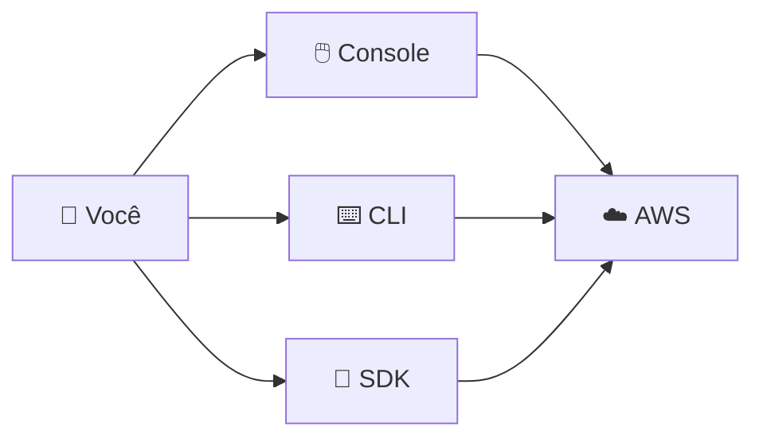

# Módulo 08 · Como interagir com a AWS (Console, CLI, SDK)

> **Domínio:** 3 · Tecnologia e Serviços · **Tempo estimado:** 1h30 · **Pré-requisitos:** Domínios 1 e 2

## 🎯 Objetivos de aprendizagem

Ao final deste módulo, você será capaz de:

- Conhecer as três formas de interagir com a AWS: **Console, CLI e SDK**.
- Entender o conceito de **Infraestrutura como Código (IaC)** e o **CloudFormation**.

 

---

 

## 🧠 Conteúdo

 

### 1. Três portas de entrada

Você pode controlar a AWS de três jeitos, dependendo do que precisa:

| Forma | O que é | Para quem |
|:--|:--|:--|
| 🖱️ **Console de Gerenciamento** | Interface gráfica no navegador (clicar e apontar). | Iniciantes, tarefas visuais, exploração. |
| ⌨️ **AWS CLI** (Command Line Interface) | Controlar a AWS por comandos de terminal. | Automação e scripts. |
| 🧩 **AWS SDK** (Software Development Kit) | Controlar a AWS pelo código do seu app (Python, Java, JS...). | Desenvolvedores integrando a AWS nas aplicações. |

> [!TIP]
> Todas as três fazem "a mesma coisa" por baixo: chamam a **API** da AWS. O Console é a forma visual; a CLI é a forma por comandos; o SDK é a forma via código.

 

### 2. Infraestrutura como Código (IaC)

E se, em vez de clicar 50 vezes para criar recursos, você **descrevesse** tudo em um arquivo e a AWS montasse sozinha? Isso é **Infraestrutura como Código**.

O serviço da AWS para isso é o **AWS CloudFormation**: você escreve um "modelo" (template) e ele cria, atualiza e apaga toda a infraestrutura de forma automática e repetível.

> [!NOTE]
> **Vantagens da IaC:** repetível (cria ambientes idênticos), versionável (histórico no Git), rápido e sem erro humano de cliques. O **CloudFormation** é o serviço-chave a lembrar para a prova.

 

---

 

## ❓ Quiz — teste seus conhecimentos

 

**1. Qual forma de interação com a AWS usa uma interface gráfica no navegador?**

- **A)** AWS CLI.
- **B)** AWS SDK.
- **C)** Console de Gerenciamento.
- **D)** CloudFormation.

💡 Ver resposta

> ✅ **Resposta: C)** — O **Console** é a interface gráfica (clicar e apontar) no navegador.

 

**2. Um desenvolvedor quer controlar a AWS diretamente do código Python do seu aplicativo. O que ele usa?**

- **A)** O Console.
- **B)** O AWS SDK.
- **C)** O AWS Artifact.
- **D)** O CloudWatch.

💡 Ver resposta

> ✅ **Resposta: B)** — O **SDK** permite controlar a AWS a partir do código da aplicação (Python, Java, JS etc.).

 

**3. Qual ferramenta é ideal para automação por comandos de terminal e scripts?**

- **A)** AWS CLI.
- **B)** Console.
- **C)** Amazon Macie.
- **D)** AWS Shield.

💡 Ver resposta

> ✅ **Resposta: A)** — A **AWS CLI** (Command Line Interface) é feita para comandos de terminal e automação.

 

**4. O que é Infraestrutura como Código (IaC)?**

- **A)** Escrever código dentro de uma instância EC2.
- **B)** Descrever a infraestrutura em arquivos, para criá-la de forma automática e repetível.
- **C)** Um tipo de banco de dados.
- **D)** Uma forma de criptografia.

💡 Ver resposta

> ✅ **Resposta: B)** — IaC é **descrever** a infraestrutura em arquivos para provisioná-la automaticamente.

 

**5. Qual serviço da AWS é usado para Infraestrutura como Código?**

- **A)** AWS CloudFormation.
- **B)** Amazon CloudWatch.
- **C)** AWS CloudTrail.
- **D)** Amazon CloudFront.

💡 Ver resposta

> ✅ **Resposta: A)** — O **CloudFormation** provisiona infraestrutura a partir de templates. (Cuidado para não confundir com os outros "Cloud..."!)

 

---

 

## 🧪 Mão na massa (sem console!)

- 🔗 **AWS Skill Builder** → procure por *"AWS CLI"* e *"CloudFormation"* para exemplos guiados.
- 🔗 Observe um template simples de CloudFormation (disponível na documentação pública) e identifique quais recursos ele cria.

 

---

 

## 📔 Glossário

| Termo | Significado |
|:--|:--|
| **Console de Gerenciamento** | Interface gráfica da AWS no navegador. |
| **AWS CLI** | Interface de linha de comando para automação. |
| **AWS SDK** | Kit para controlar a AWS pelo código da aplicação. |
| **API** | Camada que todas as formas de interação chamam por baixo. |
| **IaC** | Infraestrutura como Código: provisionar por arquivos. |
| **CloudFormation** | Serviço de IaC da AWS. |

 

## ✅ Checklist de conclusão

- [ ] Li todo o conteúdo do módulo
- [ ] Diferencio Console, CLI e SDK
- [ ] Entendo o conceito de IaC
- [ ] Sei que o CloudFormation é o serviço de IaC
- [ ] Fiz o quiz
- [ ] Registrei meu [Checkpoint](https://github.com/melissaalves-stack/awscloudfoundations/issues/new?template=checkpoint-de-modulo.yml)

 

---

**Precisa de ajuda?** 📊 [Checkpoint](https://github.com/melissaalves-stack/awscloudfoundations/issues/new?template=checkpoint-de-modulo.yml) · ❓ [Dúvida](https://github.com/melissaalves-stack/awscloudfoundations/issues/new?template=duvida.yml) · 📖 [Guia](../../GUIA-DO-ALUNO.md) · 🚀 [Builder Center](https://bit.ly/4w720IR)

🏠 [Índice do Domínio 3](./README.md) &nbsp;·&nbsp; ➡️ [Módulo 09 · Computação](./09-computacao-ec2-containers-serverless.md)

