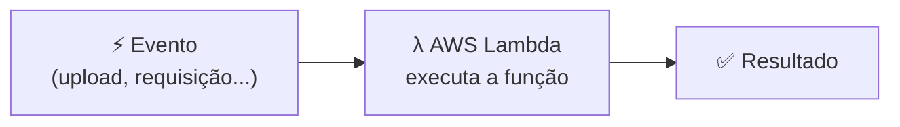
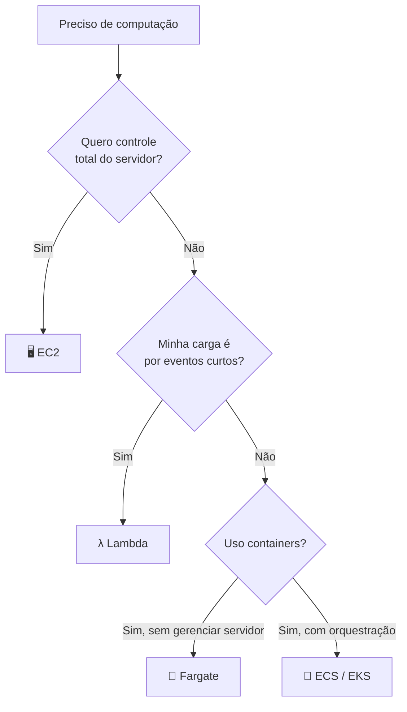

# Módulo 09 · Computação: EC2, containers e serverless

> **Domínio:** 3 · Tecnologia e Serviços · **Tempo estimado:** 3h30 · **Pré-requisitos:** Módulo 08

## 🎯 Objetivos de aprendizagem

Ao final deste módulo, você será capaz de:

- Entender o que é o **Amazon EC2** e seus tipos e modelos de compra.
- Diferenciar **máquinas virtuais**, **containers** e **serverless**.
- Reconhecer quando usar **Lambda**, **ECS/EKS** e **Fargate**.

 

---

 

## 🧠 Conteúdo

 

### 1. Amazon EC2 — o servidor na nuvem

O **Amazon EC2 (Elastic Compute Cloud)** é o serviço para alugar **servidores virtuais** (chamados **instâncias**) na nuvem. É o coração da computação IaaS da AWS.

> [!TIP]
> **Analogia:** o EC2 é como alugar um computador completo na nuvem. Você escolhe o tamanho (CPU, memória), o sistema operacional e liga quando precisa — pagando por hora ou por segundo de uso.

Ao criar uma instância, você escolhe uma **AMI (Amazon Machine Image)** — um "molde" com o sistema operacional e os programas já prontos.

 

### 2. Famílias de instância: cada tarefa, um tipo

O EC2 tem **tipos otimizados** para diferentes necessidades:

| Família | Otimizada para | Exemplo de uso |
|:--|:--|:--|
| ⚖️ **Uso geral** | Equilíbrio entre CPU, memória e rede | Servidores web, apps pequenos |
| 🧮 **Otimizada para computação** | Muito processamento (CPU) | Análise científica, jogos |
| 🧠 **Otimizada para memória** | Muita RAM | Bancos de dados em memória |
| 💾 **Otimizada para armazenamento** | Muito acesso a disco | Data warehouses |
| 🎮 **Computação acelerada** | GPUs | Machine learning, renderização |

> [!NOTE]
> Você não precisa decorar todos os nomes técnicos. Basta entender que **existem famílias otimizadas** e saber escolher pelo perfil da carga (mais CPU? mais memória? GPU?).

 

### 3. Modelos de compra — a parte que mais cai na prova 💰

A forma como você paga pelo EC2 muda **muito** o custo:

| Modelo | Como funciona | Melhor para |
|:--|:--|:--|
| ⏱️ **On-Demand** | Paga pelo uso, sem compromisso. | Cargas imprevisíveis, testes, curta duração. |
| 📉 **Savings Plans / Reserved** | Compromisso de 1–3 anos em troca de grande desconto. | Cargas estáveis e previsíveis. |
| 🏷️ **Spot** | Usa capacidade ociosa com até ~90% de desconto, mas pode ser interrompida. | Tarefas tolerantes a falhas (processamento em lote). |
| 🖥️ **Dedicated Hosts** | Servidor físico inteiro só para você. | Exigências de licenciamento ou conformidade. |

> [!IMPORTANT]
> Macete de prova:
> - **On-Demand** = flexível, sem compromisso (mais caro por hora).
> - **Reserved / Savings Plans** = desconto por compromisso de longo prazo.
> - **Spot** = mais barato, mas pode ser interrompido.

 

### 4. Além das máquinas virtuais: containers

Uma instância EC2 carrega um sistema operacional inteiro. Já um **container** empacota só o **aplicativo e o que ele precisa** — mais leve e rápido de iniciar.

| Serviço | O que é |
|:--|:--|
| 🐳 **Amazon ECS** | Orquestrador de containers próprio da AWS. |
| ☸️ **Amazon EKS** | Kubernetes gerenciado (padrão de mercado). |
| 🚀 **AWS Fargate** | Roda containers **sem** você gerenciar servidores (serverless para containers). |

 

### 5. Serverless: esqueça os servidores

**Serverless** ("sem servidor") não significa que não há servidores — significa que **você não os gerencia**. A AWS cuida de tudo, e você só se preocupa com o código.

O serviço estrela é o **AWS Lambda**: você envia uma função, ela roda **quando é acionada** (por um evento) e você paga **só pelo tempo de execução** — em milissegundos.

> [!TIP]
> **EC2 x Lambda:**
> - **EC2** = você aluga o servidor e o mantém ligado (paga pelo tempo ligado).
> - **Lambda** = você só envia o código; roda sob demanda e paga por execução. Sem servidor para gerenciar.

 

### 6. Como escolher?

 

---

 

## ❓ Quiz — teste seus conhecimentos

 

**1. O que é uma instância no Amazon EC2?**

- **A)** Um banco de dados gerenciado.
- **B)** Um servidor virtual que você aluga na nuvem.
- **C)** Um tipo de bucket de armazenamento.
- **D)** Uma política de segurança.

💡 Ver resposta

> ✅ **Resposta: B)** — Uma **instância** EC2 é um **servidor virtual** alugado na nuvem.

 

**2. Uma tarefa de processamento em lote pode ser interrompida sem problema e você quer o menor custo. Qual modelo de compra usar?**

- **A)** On-Demand.
- **B)** Reserved.
- **C)** Spot.
- **D)** Dedicated Host.

💡 Ver resposta

> ✅ **Resposta: C)** — Instâncias **Spot** usam capacidade ociosa com grande desconto, ideais para cargas **tolerantes a interrupção**.

 

**3. Uma carga de trabalho é estável e roda 24/7 por 3 anos. Qual modelo dá o melhor custo?**

- **A)** Spot.
- **B)** On-Demand.
- **C)** Savings Plans / Reserved.
- **D)** Nenhum, EC2 não serve para isso.

💡 Ver resposta

> ✅ **Resposta: C)** — Para cargas **estáveis e previsíveis**, o compromisso de **Savings Plans / Reserved** traz o maior desconto.

 

**4. Qual serviço executa código sob demanda, sem que você gerencie servidores, cobrando por execução?**

- **A)** Amazon EC2.
- **B)** AWS Lambda.
- **C)** Amazon S3.
- **D)** Amazon EKS.

💡 Ver resposta

> ✅ **Resposta: B)** — O **AWS Lambda** é serverless: roda por evento e cobra por tempo de execução.

 

**5. Você quer rodar containers sem gerenciar a infraestrutura de servidores. Qual serviço usar?**

- **A)** AWS Fargate.
- **B)** Amazon EC2 On-Demand.
- **C)** AWS Artifact.
- **D)** Amazon Macie.

💡 Ver resposta

> ✅ **Resposta: A)** — O **AWS Fargate** roda containers **sem** que você gerencie servidores (serverless para containers).

 

---

 

## 🧪 Mão na massa (sem console!)

- 🔗 **AWS Skill Builder** → procure por *"Compute Fundamentals"* e *"AWS Lambda Foundations"*.
- 🔗 **AWS SimuLearn** → jornada de **computação**: pratique lançar uma instância EC2 em ambiente simulado.

 

---

 

## 📔 Glossário

| Termo | Significado |
|:--|:--|
| **Amazon EC2** | Serviço de servidores virtuais (instâncias). |
| **Instância** | Um servidor virtual EC2 em execução. |
| **AMI** | Molde com SO e software para criar instâncias. |
| **On-Demand / Reserved / Spot** | Modelos de compra do EC2. |
| **Container** | Empacotamento leve de app e dependências. |
| **ECS / EKS / Fargate** | Serviços de containers da AWS. |
| **Serverless** | Modelo em que você não gerencia servidores. |
| **AWS Lambda** | Serviço serverless de execução de funções por evento. |

 

## ✅ Checklist de conclusão

- [ ] Li todo o conteúdo do módulo
- [ ] Entendo o que é o EC2 e suas famílias
- [ ] Diferencio os modelos de compra (On-Demand, Reserved, Spot)
- [ ] Diferencio VMs, containers e serverless
- [ ] Sei quando usar Lambda, ECS/EKS e Fargate
- [ ] Fiz o quiz
- [ ] Registrei meu [Checkpoint](https://github.com/melissaalves-stack/awscloudfoundations/issues/new?template=checkpoint-de-modulo.yml)

 

---

**Precisa de ajuda?** 📊 [Checkpoint](https://github.com/melissaalves-stack/awscloudfoundations/issues/new?template=checkpoint-de-modulo.yml) · ❓ [Dúvida](https://github.com/melissaalves-stack/awscloudfoundations/issues/new?template=duvida.yml) · 📖 [Guia](../../GUIA-DO-ALUNO.md) · 🚀 [Builder Center](https://bit.ly/4w720IR)

⬅️ [Módulo 08](./08-formas-de-interagir-com-a-aws.md) &nbsp;·&nbsp; 🏠 [Índice do Domínio 3](./README.md) &nbsp;·&nbsp; ➡️ [Módulo 10 · Armazenamento](./10-armazenamento-s3-ebs-efs.md)

