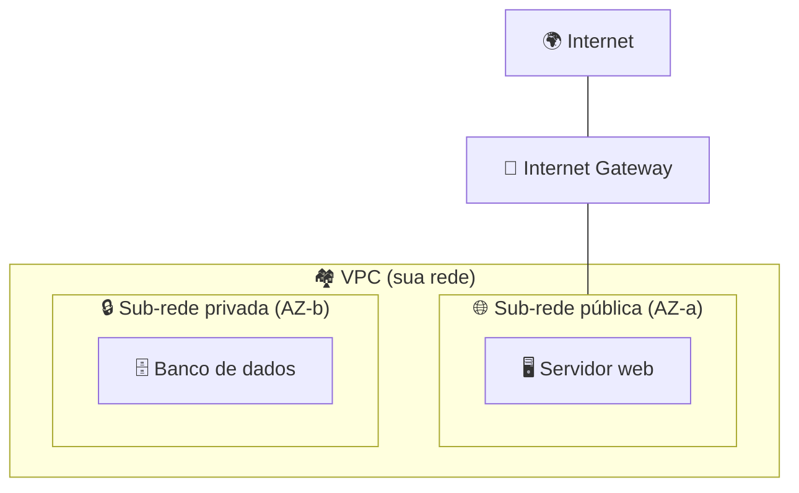
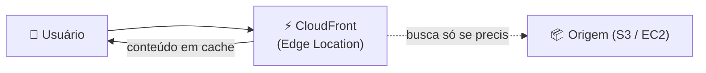

# Módulo 11 · Redes: VPC, DNS e entrega de conteúdo

> **Domínio:** 3 · Tecnologia e Serviços · **Tempo estimado:** 3h · **Pré-requisitos:** Módulo 10

## 🎯 Objetivos de aprendizagem

Ao final deste módulo, você será capaz de:

- Entender o que é uma **VPC** e seus componentes básicos (sub-redes, gateways).
- Diferenciar **sub-redes públicas e privadas**.
- Conhecer o **Route 53** (DNS) e o **CloudFront** (CDN).

 

---

 

## 🧠 Conteúdo

 

### 1. A VPC — sua rede privada na nuvem

A **Amazon VPC (Virtual Private Cloud)** é a **sua rede privada e isolada** dentro da AWS. É onde seus recursos (como instâncias EC2) vivem, protegidos do resto do mundo até você decidir abrir o acesso.

> [!TIP]
> **Analogia do condomínio** 🏘️
> A VPC é um condomínio fechado só seu. Dentro dele você cria "quarteirões" (sub-redes), define quem entra pelo portão e coloca muros e câmeras (regras de segurança).

 

### 2. Sub-redes: públicas e privadas

Uma VPC é dividida em **sub-redes (subnets)**, e cada sub-rede fica em uma **AZ**:

| Tipo | Acesso à internet | Uso típico |
|:--|:--|:--|
| 🌐 **Sub-rede pública** | Sim (tem rota para a internet). | Servidores web, balanceadores de carga. |
| 🔒 **Sub-rede privada** | Não diretamente. | Bancos de dados, servidores internos. |

> [!IMPORTANT]
> Boa prática de segurança: coloque o que precisa de internet (web) em sub-redes **públicas** e o que é sensível (banco de dados) em sub-redes **privadas**. Isso reduz a superfície de ataque.

 

### 3. Os "porteiros" da VPC

| Componente | Função |
|:--|:--|
| 🚪 **Internet Gateway (IGW)** | Porta que liga a VPC à internet. |
| 🔀 **NAT Gateway** | Deixa recursos privados **saírem** para a internet (ex.: baixar atualizações) sem ficarem expostos a receber conexões. |
| 🛡️ **Security Group** | Firewall **da instância** (regras de entrada/saída); é "stateful". |
| 🚧 **Network ACL (NACL)** | Firewall **da sub-rede**; é "stateless". |

> [!NOTE]
> Diferença clássica de prova: **Security Group** atua na **instância** e é *stateful* (lembra a conexão de volta). **NACL** atua na **sub-rede** e é *stateless*. Ambos filtram tráfego, em camadas diferentes.

 

### 4. Route 53 — o DNS da AWS

O **Amazon Route 53** é o serviço de **DNS**: ele traduz nomes de domínio (como `ligasbg.com.br`) no endereço IP do servidor certo. Também registra domínios e faz roteamento inteligente (por latência, geografia, saúde do servidor).

> [!TIP]
> DNS é a "agenda de contatos" da internet: você digita um nome, e o DNS descobre o "número" (IP) para ligar. O **Route 53** é a agenda da AWS. (O nome vem da porta 53, usada pelo DNS.)

 

### 5. CloudFront — a rede de entrega de conteúdo (CDN)

O **Amazon CloudFront** é a **CDN** da AWS: ele guarda cópias do seu conteúdo nas **Edge Locations** (lembra do [Módulo 01](../dominio-1-conceitos-de-nuvem/01-infraestrutura-global-da-aws.md)?) para entregá-lo **pertinho do usuário**, deixando sites e vídeos muito mais rápidos.

 

---

 

## ❓ Quiz — teste seus conhecimentos

 

**1. O que é uma Amazon VPC?**

- **A)** Um banco de dados relacional.
- **B)** Sua rede privada e isolada dentro da AWS.
- **C)** Um serviço de e-mail.
- **D)** Um tipo de instância EC2.

💡 Ver resposta

> ✅ **Resposta: B)** — A **VPC** é a sua **rede privada e isolada** na AWS, onde seus recursos vivem.

 

**2. Onde você deve colocar um banco de dados sensível, por boa prática de segurança?**

- **A)** Em uma sub-rede pública.
- **B)** Em uma sub-rede privada.
- **C)** Diretamente na internet.
- **D)** Em uma Edge Location.

💡 Ver resposta

> ✅ **Resposta: B)** — Recursos sensíveis (como bancos) ficam em **sub-redes privadas**, sem acesso direto da internet.

 

**3. Qual serviço traduz nomes de domínio em endereços IP (DNS)?**

- **A)** Amazon CloudFront.
- **B)** Amazon Route 53.
- **C)** Amazon VPC.
- **D)** AWS Shield.

💡 Ver resposta

> ✅ **Resposta: B)** — O **Amazon Route 53** é o serviço de **DNS** (a "agenda" da internet).

 

**4. Qual serviço entrega conteúdo em cache perto do usuário para acelerar sites e vídeos?**

- **A)** Amazon CloudFront.
- **B)** Amazon EBS.
- **C)** AWS CloudTrail.
- **D)** Amazon Route 53.

💡 Ver resposta

> ✅ **Resposta: A)** — O **Amazon CloudFront** é a **CDN**, que entrega conteúdo pelas Edge Locations.

 

**5. Qual componente atua como firewall no nível da INSTÂNCIA e é "stateful"?**

- **A)** Network ACL (NACL).
- **B)** Security Group.
- **C)** Internet Gateway.
- **D)** NAT Gateway.

💡 Ver resposta

> ✅ **Resposta: B)** — O **Security Group** é o firewall da **instância** e é *stateful*. A **NACL** atua na **sub-rede** e é *stateless*.

 

---

 

## 🧪 Mão na massa (sem console!)

- 🔗 **AWS Skill Builder** → procure por *"Networking Fundamentals"* e *"Amazon VPC"*.
- 🔗 Desenhe no papel uma VPC com uma sub-rede pública (web) e uma privada (banco), marcando onde entra o Internet Gateway.

 

---

 

## 📔 Glossário

| Termo | Significado |
|:--|:--|
| **VPC** | Rede privada e isolada do cliente na AWS. |
| **Sub-rede (subnet)** | Divisão da VPC, dentro de uma AZ (pública ou privada). |
| **Internet Gateway** | Porta que conecta a VPC à internet. |
| **NAT Gateway** | Permite saída para a internet a recursos privados. |
| **Security Group** | Firewall da instância (stateful). |
| **Network ACL** | Firewall da sub-rede (stateless). |
| **Route 53** | Serviço de DNS da AWS. |
| **CloudFront** | CDN da AWS (entrega via Edge Locations). |

 

## ✅ Checklist de conclusão

- [ ] Li todo o conteúdo do módulo
- [ ] Entendo o que é uma VPC e suas sub-redes
- [ ] Diferencio sub-rede pública e privada
- [ ] Sei o papel do Route 53 (DNS) e do CloudFront (CDN)
- [ ] Diferencio Security Group e Network ACL
- [ ] Fiz o quiz
- [ ] Registrei meu [Checkpoint](https://github.com/melissaalves-stack/awscloudfoundations/issues/new?template=checkpoint-de-modulo.yml)

 

---

**Precisa de ajuda?** 📊 [Checkpoint](https://github.com/melissaalves-stack/awscloudfoundations/issues/new?template=checkpoint-de-modulo.yml) · ❓ [Dúvida](https://github.com/melissaalves-stack/awscloudfoundations/issues/new?template=duvida.yml) · 📖 [Guia](../../GUIA-DO-ALUNO.md) · 🚀 [Builder Center](https://bit.ly/4w720IR)

⬅️ [Módulo 10](./10-armazenamento-s3-ebs-efs.md) &nbsp;·&nbsp; 🏠 [Índice do Domínio 3](./README.md) &nbsp;·&nbsp; ➡️ [Módulo 12 · Bancos de dados](./12-bancos-de-dados.md)

