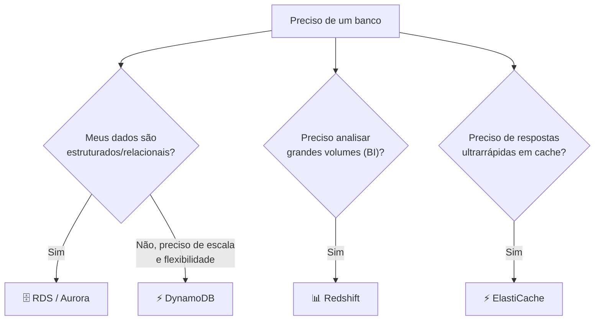

# Módulo 12 · Bancos de dados na AWS

> **Domínio:** 3 · Tecnologia e Serviços · **Tempo estimado:** 2h30 · **Pré-requisitos:** Módulo 11

## 🎯 Objetivos de aprendizagem

Ao final deste módulo, você será capaz de:

- Diferenciar bancos **relacionais** e **não relacionais**.
- Conhecer **RDS**, **Aurora**, **DynamoDB** e outros bancos gerenciados.
- Escolher o banco certo para cada caso.

 

---

 

## 🧠 Conteúdo

 

### 1. Relacional vs. não relacional

| | **Relacional (SQL)** | **Não relacional (NoSQL)** |
|:--|:--|:--|
| Estrutura | Tabelas com linhas e colunas fixas. | Flexível (documentos, chave-valor). |
| Analogia | Uma planilha bem organizada. | Um caderno de anotações livres. |
| Bom para | Dados estruturados, relações complexas. | Escala massiva, dados variados, alta velocidade. |
| Exemplos AWS | Amazon RDS, Aurora | Amazon DynamoDB |

> [!TIP]
> Regra rápida: se seus dados cabem bem em **tabelas com relações** (clientes, pedidos, produtos), pense **relacional (RDS)**. Se você precisa de **escala enorme e flexibilidade** (carrinho de compras, sessões, IoT), pense **DynamoDB**.

 

### 2. Amazon RDS — banco relacional gerenciado

O **Amazon RDS (Relational Database Service)** roda bancos relacionais populares (**MySQL, PostgreSQL, MariaDB, Oracle, SQL Server**) sem você precisar cuidar do servidor: a AWS faz backups, patches e alta disponibilidade.

> [!NOTE]
> Lembra do [Módulo 04](../dominio-2-seguranca-e-conformidade/04-modelo-responsabilidade-compartilhada.md)? No RDS, a AWS cuida do SO e do patch do banco. Você cuida dos **dados** e do **acesso**.

 

### 3. Amazon Aurora — o "turbo" relacional da AWS

O **Amazon Aurora** é o banco relacional próprio da AWS, compatível com MySQL e PostgreSQL, porém **muito mais rápido** e com alta disponibilidade embutida. É a opção premium dentro do RDS.

 

### 4. Amazon DynamoDB — NoSQL serverless

O **Amazon DynamoDB** é um banco **não relacional** (chave-valor e documentos), **serverless**, com desempenho em **milissegundos** em qualquer escala. Não há servidor para gerenciar e ele escala praticamente sem limite.

 

### 5. Bancos para necessidades específicas

A AWS tem um banco "sob medida" para vários cenários. Você só precisa reconhecer o propósito de cada um:

| Serviço | Especialidade |
|:--|:--|
| ⚡ **Amazon ElastiCache** | Cache em memória (Redis/Memcached) para respostas ultrarrápidas. |
| 📊 **Amazon Redshift** | Data warehouse para análise de grandes volumes (BI). |
| 🕸️ **Amazon Neptune** | Banco de grafos (relações complexas, redes sociais). |
| 📄 **Amazon DocumentDB** | Banco de documentos compatível com MongoDB. |

 

---

 

## ❓ Quiz — teste seus conhecimentos

 

**1. Qual serviço é o banco de dados RELACIONAL gerenciado da AWS (MySQL, PostgreSQL etc.)?**

- **A)** Amazon DynamoDB.
- **B)** Amazon RDS.
- **C)** Amazon S3.
- **D)** Amazon Redshift.

💡 Ver resposta

> ✅ **Resposta: B)** — O **Amazon RDS** roda bancos **relacionais** gerenciados.

 

**2. Você precisa de um banco NoSQL, serverless, com desempenho em milissegundos em escala enorme. Qual usar?**

- **A)** Amazon RDS.
- **B)** Amazon Aurora.
- **C)** Amazon DynamoDB.
- **D)** Amazon Neptune.

💡 Ver resposta

> ✅ **Resposta: C)** — O **DynamoDB** é o banco **NoSQL serverless** da AWS, rápido e altamente escalável.

 

**3. Qual serviço é um data warehouse feito para análise de grandes volumes (BI)?**

- **A)** Amazon Redshift.
- **B)** Amazon ElastiCache.
- **C)** Amazon RDS.
- **D)** Amazon DynamoDB.

💡 Ver resposta

> ✅ **Resposta: A)** — O **Amazon Redshift** é o **data warehouse** para análises e Business Intelligence.

 

**4. Qual serviço fornece cache em memória (Redis/Memcached) para respostas ultrarrápidas?**

- **A)** Amazon Aurora.
- **B)** Amazon ElastiCache.
- **C)** Amazon Neptune.
- **D)** Amazon DocumentDB.

💡 Ver resposta

> ✅ **Resposta: B)** — O **Amazon ElastiCache** oferece **cache em memória** para acelerar aplicações.

 

**5. O Amazon Aurora é compatível com quais bancos?**

- **A)** Apenas Oracle.
- **B)** MySQL e PostgreSQL.
- **C)** Apenas SQL Server.
- **D)** Nenhum, é totalmente proprietário.

💡 Ver resposta

> ✅ **Resposta: B)** — O **Aurora** é compatível com **MySQL e PostgreSQL**, com desempenho e disponibilidade superiores.

 

---

 

## 🧪 Mão na massa (sem console!)

- 🔗 **AWS Skill Builder** → procure por *"Databases on AWS"* e *"Amazon RDS"*.
- 🔗 Para cada cenário (loja online, rede social, relatório financeiro), escolha mentalmente o banco mais adequado e justifique.

 

---

 

## 📔 Glossário

| Termo | Significado |
|:--|:--|
| **Relacional (SQL)** | Banco em tabelas com linhas e colunas. |
| **Não relacional (NoSQL)** | Banco flexível (chave-valor, documentos). |
| **Amazon RDS** | Banco relacional gerenciado. |
| **Amazon Aurora** | Banco relacional premium da AWS (MySQL/PostgreSQL). |
| **Amazon DynamoDB** | Banco NoSQL serverless. |
| **Amazon Redshift** | Data warehouse para BI. |
| **Amazon ElastiCache** | Cache em memória. |
| **Neptune / DocumentDB** | Bancos de grafos / documentos. |

 

## ✅ Checklist de conclusão

- [ ] Li todo o conteúdo do módulo
- [ ] Diferencio bancos relacionais e não relacionais
- [ ] Conheço RDS, Aurora e DynamoDB
- [ ] Reconheço Redshift, ElastiCache, Neptune e DocumentDB
- [ ] Sei escolher o banco certo por cenário
- [ ] Fiz o quiz
- [ ] Registrei meu [Checkpoint](https://github.com/melissaalves-stack/awscloudfoundations/issues/new?template=checkpoint-de-modulo.yml)

 

---

**Precisa de ajuda?** 📊 [Checkpoint](https://github.com/melissaalves-stack/awscloudfoundations/issues/new?template=checkpoint-de-modulo.yml) · ❓ [Dúvida](https://github.com/melissaalves-stack/awscloudfoundations/issues/new?template=duvida.yml) · 📖 [Guia](../../GUIA-DO-ALUNO.md) · 🚀 [Builder Center](https://bit.ly/4w720IR)

⬅️ [Módulo 11](./11-redes-vpc-dns-cloudfront.md) &nbsp;·&nbsp; 🏠 [Índice do Domínio 3](./README.md) &nbsp;·&nbsp; ➡️ [Módulo 13 · Escalabilidade e alta disponibilidade](./13-escalabilidade-e-alta-disponibilidade.md)

