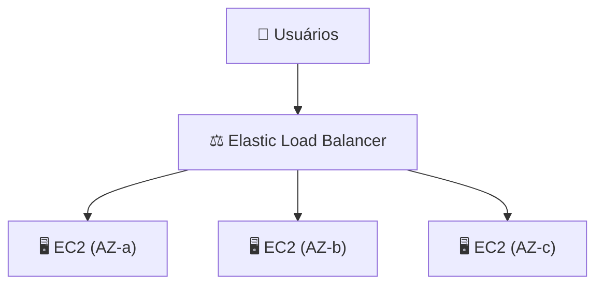
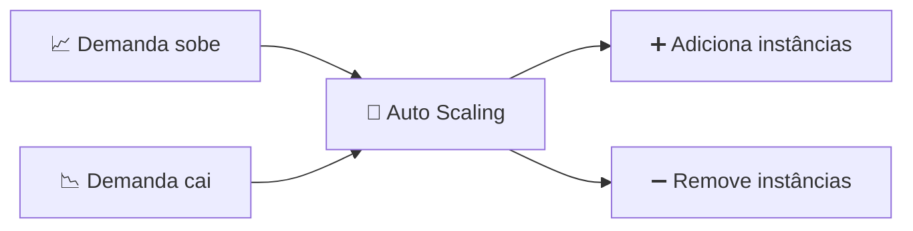

# Módulo 13 · Escalabilidade e alta disponibilidade (ELB e Auto Scaling)

> **Domínio:** 3 · Tecnologia e Serviços · **Tempo estimado:** 2h30 · **Pré-requisitos:** Módulo 12

## 🎯 Objetivos de aprendizagem

Ao final deste módulo, você será capaz de:

- Diferenciar **escalar verticalmente** e **horizontalmente**.
- Entender o **Elastic Load Balancing (ELB)**.
- Entender o **EC2 Auto Scaling** e como eles garantem **alta disponibilidade**.

 

---

 

## 🧠 Conteúdo

 

### 1. Duas formas de crescer

Quando a demanda aumenta, você pode escalar de dois jeitos:

| Tipo | O que é | Analogia 🍕 |
|:--|:--|:--|
| ⬆️ **Vertical (scale up)** | Tornar o servidor **maior** (mais CPU/RAM). | Trocar sua pizza média por uma família. |
| ➡️ **Horizontal (scale out)** | Adicionar **mais servidores**. | Pedir várias pizzas em vez de uma gigante. |

> [!IMPORTANT]
> A nuvem adora o **escalonamento horizontal**: adicionar mais máquinas iguais é mais resiliente (se uma cai, as outras seguem) e mais elástico. A prova valoriza o "scale out".

 

### 2. Elastic Load Balancing (ELB) — o distribuidor de tráfego

Se você tem vários servidores, alguém precisa **distribuir os pedidos** entre eles de forma justa. Esse é o **Elastic Load Balancing (ELB)**: ele recebe o tráfego e reparte entre as instâncias saudáveis, em várias AZs.

> [!TIP]
> O ELB faz **verificações de saúde** (health checks): se uma instância falha, ele **para de mandar tráfego** para ela e usa apenas as saudáveis. Isso é alta disponibilidade na prática.

Tipos principais de balanceador: **Application Load Balancer (ALB)** para tráfego web (HTTP/HTTPS) e **Network Load Balancer (NLB)** para altíssimo desempenho na camada de rede.

 

### 3. EC2 Auto Scaling — o ajuste automático

O **Amazon EC2 Auto Scaling** adiciona ou remove instâncias **automaticamente**, conforme a demanda:

- Muitos acessos? Ele **cria** mais instâncias (scale out).
- Demanda caiu? Ele **remove** instâncias (scale in), economizando dinheiro.

> [!NOTE]
> Você define um **mínimo**, um **desejado** e um **máximo** de instâncias. O Auto Scaling mantém tudo dentro desses limites — nem falta capacidade, nem sobra custo.

 

### 4. A dupla dinâmica: ELB + Auto Scaling = elasticidade

Juntos, ELB e Auto Scaling entregam o sonho da nuvem:

1. O **Auto Scaling** cria/remove instâncias conforme a demanda.
2. O **ELB** distribui o tráfego entre as instâncias que existem no momento.
3. Resultado: a aplicação **aguenta picos**, **se recupera de falhas** e **não desperdiça dinheiro** em horas de baixa.

> [!IMPORTANT]
> Essa combinação é o coração da **elasticidade** e da **alta disponibilidade**. Se a prova perguntar como manter um app disponível e econômico sob demanda variável, a resposta quase sempre envolve **ELB + Auto Scaling em múltiplas AZs**.

 

---

 

## ❓ Quiz — teste seus conhecimentos

 

**1. Adicionar mais servidores (em vez de aumentar um só) é escalar de que forma?**

- **A)** Verticalmente (scale up).
- **B)** Horizontalmente (scale out).
- **C)** Diagonalmente.
- **D)** Não é escalonamento.

💡 Ver resposta

> ✅ **Resposta: B)** — Adicionar **mais máquinas** é escalonamento **horizontal** (scale out), o preferido da nuvem.

 

**2. Qual serviço distribui o tráfego entre várias instâncias saudáveis?**

- **A)** EC2 Auto Scaling.
- **B)** Elastic Load Balancing (ELB).
- **C)** Amazon S3.
- **D)** AWS CloudTrail.

💡 Ver resposta

> ✅ **Resposta: B)** — O **ELB** reparte o tráfego entre as instâncias saudáveis, em várias AZs.

 

**3. O que o EC2 Auto Scaling faz quando a demanda cai?**

- **A)** Cria mais instâncias.
- **B)** Remove instâncias para economizar (scale in).
- **C)** Desliga a conta.
- **D)** Aumenta o tamanho de cada instância.

💡 Ver resposta

> ✅ **Resposta: B)** — Com a demanda baixa, o Auto Scaling **remove** instâncias (scale in), reduzindo custos.

 

**4. Como o ELB contribui para a alta disponibilidade?**

- **A)** Ignorando instâncias que falham, via health checks, e usando só as saudáveis.
- **B)** Desligando todas as instâncias à noite.
- **C)** Criptografando os dados em repouso.
- **D)** Armazenando backups no Glacier.

💡 Ver resposta

> ✅ **Resposta: A)** — O ELB faz **health checks** e para de enviar tráfego para instâncias com falha, mantendo o serviço no ar.

 

**5. Qual combinação entrega elasticidade e alta disponibilidade para uma aplicação web?**

- **A)** S3 + Glacier.
- **B)** ELB + Auto Scaling em múltiplas AZs.
- **C)** IAM + KMS.
- **D)** CloudTrail + CloudWatch.

💡 Ver resposta

> ✅ **Resposta: B)** — **ELB + Auto Scaling** em várias AZs é a combinação clássica para elasticidade e disponibilidade.

 

---

 

## 🧪 Mão na massa (sem console!)

- 🔗 **AWS Skill Builder** → procure por *"Elastic Load Balancing"* e *"EC2 Auto Scaling"*.
- 🔗 **AWS SimuLearn** → jornada de **escalabilidade**: pratique configurar balanceamento e auto scaling em ambiente simulado.

 

---

 

## 📔 Glossário

| Termo | Significado |
|:--|:--|
| **Escalonamento vertical** | Aumentar o tamanho de um servidor. |
| **Escalonamento horizontal** | Adicionar mais servidores. |
| **Elastic Load Balancing (ELB)** | Distribui tráfego entre instâncias saudáveis. |
| **Health check** | Verificação de saúde das instâncias. |
| **ALB / NLB** | Balanceadores de aplicação / de rede. |
| **EC2 Auto Scaling** | Ajusta o número de instâncias automaticamente. |
| **Elasticidade** | Ajuste automático de recursos conforme a demanda. |

 

## ✅ Checklist de conclusão

- [ ] Li todo o conteúdo do módulo
- [ ] Diferencio escalonamento vertical e horizontal
- [ ] Entendo o papel do ELB e dos health checks
- [ ] Entendo o EC2 Auto Scaling (mín/desejado/máx)
- [ ] Sei por que ELB + Auto Scaling garantem elasticidade e HA
- [ ] Fiz o quiz
- [ ] Registrei meu [Checkpoint](https://github.com/melissaalves-stack/awscloudfoundations/issues/new?template=checkpoint-de-modulo.yml)

 

---

**Precisa de ajuda?** 📊 [Checkpoint](https://github.com/melissaalves-stack/awscloudfoundations/issues/new?template=checkpoint-de-modulo.yml) · ❓ [Dúvida](https://github.com/melissaalves-stack/awscloudfoundations/issues/new?template=duvida.yml) · 📖 [Guia](../../GUIA-DO-ALUNO.md) · 🚀 [Builder Center](https://bit.ly/4w720IR)

⬅️ [Módulo 12](./12-bancos-de-dados.md) &nbsp;·&nbsp; 🏠 [Índice do Domínio 3](./README.md) &nbsp;·&nbsp; ➡️ [Domínio 4 · Cobrança, Preços e Suporte](../dominio-4-cobranca-precos-e-suporte/README.md)

