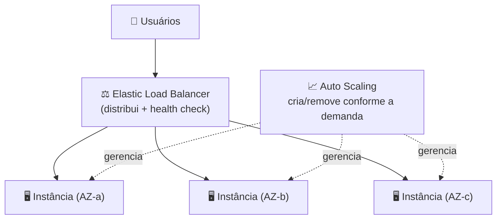

# Módulo 13 · Escalabilidade e alta disponibilidade

> **Domínio:** 3 · Tecnologia e Serviços · **Tempo estimado:** 4h · **Pré-requisitos:** Módulos 09 a 12
> **Peso na prova:** fecha o Domínio 3 (**34%**). Escalonamento vertical × horizontal e a dupla **ELB + Auto Scaling** são presença certa.

## 🎯 Onde você quer chegar

Ao final deste módulo, você vai:

- Diferenciar escalonamento **vertical** (máquina maior) de **horizontal** (mais máquinas).
- Entender o **Elastic Load Balancing (ELB)** — o distribuidor de tráfego.
- Entender o **EC2 Auto Scaling** — o ajuste automático de quantidade.
- Ver como **ELB + Auto Scaling** juntos produzem **elasticidade** e **alta disponibilidade**.

 

---

 

## 🎬 O restaurante na noite de sexta

Um restaurante começa a noite tranquilo, com 2 garçons. Às 21h, lota. O dono tem duas escolhas: pedir que os **2 garçons corram mais** (cada um vira "super-garçom") — ou **chamar mais 6 garçons**. A primeira tem um limite (uma pessoa só corre até certo ponto, e se ela passar mal, o salão inteiro para). A segunda escala melhor e é mais segura: se um garçom sai, os outros seguem.

Essas duas escolhas são o coração deste módulo: crescer tornando **maior** vs. crescer adicionando **mais**. E a nuvem faz isso **sozinha**, em tempo real — é onde tudo o que você viu no curso se junta.

 

---

 

## 🧠 Parte 1 — Duas formas de crescer

| Tipo | O que é | Analogia 🍕 | Limite |
|:--|:--|:--|:--|
| ⬆️ **Vertical (scale up)** | Tornar o servidor **maior** (mais CPU/RAM). | Trocar a pizza média por uma família | Tem teto (a máquina só cresce até certo ponto) e vira ponto único de falha |
| ➡️ **Horizontal (scale out)** | Adicionar **mais servidores**. | Pedir várias pizzas em vez de uma gigante | Praticamente sem teto e mais resiliente |

> [!IMPORTANT]
> A nuvem prefere **escalonamento horizontal** (scale out) — adicionar mais máquinas iguais. Por dois motivos: não tem "teto" como a vertical, e é mais **resiliente** (se uma máquina cai, as outras seguem). O vertical tem uso, mas concentra risco. Se a prova pergunta "a forma mais resiliente e escalável de crescer", a resposta tende a ser **horizontal**.

 

## ⚖️ Parte 2 — Elastic Load Balancing (ELB): o distribuidor de tráfego

Se você tem várias máquinas (scale out), precisa de alguém para **distribuir os acessos** entre elas de forma justa — senão uma fica sobrecarregada e outra ociosa. Esse é o **Elastic Load Balancing (ELB)**: ele fica "na frente" das instâncias e reparte o tráfego.

Além de distribuir, o ELB faz **health checks**: verifica a saúde de cada instância e **para de enviar tráfego para as que falharam**, mandando só para as saudáveis.

> [!TIP]
> Tipos que podem aparecer: **ALB (Application Load Balancer)** trabalha no nível de aplicação (HTTP/HTTPS, roteamento inteligente por conteúdo); **NLB (Network Load Balancer)** trabalha no nível de rede (altíssima performance, TCP). Para o Cloud Practitioner, o essencial é saber que o **ELB distribui tráfego e faz health check** entre instâncias.

 

## 📈 Parte 3 — EC2 Auto Scaling: o ajuste automático

O **EC2 Auto Scaling** ajusta **automaticamente o número de instâncias** conforme a demanda. Você define regras baseadas em métricas (ex.: "se a CPU passar de 70%, adicione instâncias") e três limites:

- **Mínimo** — nunca menos que isso (garante disponibilidade).
- **Desejado** — o alvo no momento.
- **Máximo** — nunca mais que isso (protege o orçamento).

Quando a demanda sobe, ele **cria** instâncias; quando cai, ele **remove** — e ainda **substitui** instâncias que falham no health check.

> [!CAUTION]
> **Pegadinha de custo:** sem um **máximo** bem definido, um pico de tráfego (ou um ataque) pode fazer o Auto Scaling criar instâncias sem parar e estourar a fatura. Definir o máximo é também uma decisão de **custo**, não só de capacidade.

 

## 🔗 Parte 4 — A dupla dinâmica: ELB + Auto Scaling = elasticidade

Aqui tudo se junta. Sozinhos, cada um resolve metade do problema. **Juntos**, eles entregam a **elasticidade** que você viu lá no Domínio 1 (a "Netflix que respira"):

- O **Auto Scaling** cria e remove instâncias conforme a demanda.
- O **ELB** distribui o tráfego entre as instâncias que existem naquele momento.

> [!IMPORTANT]
> E quando você distribui essas instâncias por **múltiplas AZs** (Domínio 1!), ganha **alta disponibilidade** de brinde: se uma AZ cai, o ELB manda o tráfego para as instâncias saudáveis nas outras AZs, e o Auto Scaling repõe o que faltou. **Elasticidade + múltiplas AZs = a arquitetura resiliente clássica** que a prova espera que você reconheça.

 

---

 

## 🎯 Dicas de prova (pegadinhas clássicas)

> [!CAUTION]
> - **Vertical = máquina maior (tem teto). Horizontal = mais máquinas (resiliente, sem teto).** A nuvem prefere horizontal.
> - **ELB distribui tráfego + faz health check.** Sozinho, não cria instâncias.
> - **Auto Scaling cria/remove instâncias** conforme a demanda. Sozinho, não distribui tráfego.
> - **ELB + Auto Scaling = elasticidade.** Em múltiplas AZs = alta disponibilidade.
> - Definir o **máximo** do Auto Scaling protege o **custo**.
> - Health check tira instância doente da rotação — resiliência automática.

 

## 🗺️ Mapa rápido pra revisão

| Conceito | Em uma frase |
|:--|:--|
| Vertical (scale up) | máquina maior — a pizza família |
| Horizontal (scale out) | mais máquinas — várias pizzas (preferido) |
| ELB | distribui tráfego + health check |
| Auto Scaling | ajusta a quantidade de instâncias (mín./desejado/máx.) |
| ELB + Auto Scaling | elasticidade (a nuvem "respira") |
| + múltiplas AZs | alta disponibilidade |

 

---

 

## ❓ Quiz nível prova

 

**1. Qual é a diferença entre escalonamento vertical e horizontal?**

- **A)** Vertical adiciona mais servidores; horizontal aumenta o tamanho de um servidor.
- **B)** Vertical aumenta o tamanho de um servidor; horizontal adiciona mais servidores.
- **C)** Os dois significam a mesma coisa.
- **D)** Horizontal só funciona on-premises.

💡 Ver resposta e explicação

> ✅ **Resposta: B)**
>
> **Vertical (scale up)** = servidor **maior**. **Horizontal (scale out)** = **mais** servidores. A nuvem prefere o horizontal por ser resiliente e sem teto.
>
> - **A)** ❌ — está invertido.
> - **C)** ❌ — são conceitos distintos.
> - **D)** ❌ — o horizontal é justamente uma força da nuvem.

 

**2. Uma aplicação recebe tráfego que varia muito ao longo do dia. A empresa quer que o número de instâncias aumente e diminua automaticamente conforme a demanda. Qual serviço faz isso?**

- **A)** Elastic Load Balancing
- **B)** EC2 Auto Scaling
- **C)** Amazon CloudFront
- **D)** Amazon S3

💡 Ver resposta e explicação

> ✅ **Resposta: B) EC2 Auto Scaling**
>
> Ajustar automaticamente a **quantidade** de instâncias conforme a demanda é o papel do Auto Scaling.
>
> - **A)** ❌ — o ELB distribui tráfego, mas não cria/remove instâncias.
> - **C)** ❌ — CloudFront é CDN.
> - **D)** ❌ — S3 é armazenamento.

 

**3. Qual é a função principal de um Elastic Load Balancer?**

- **A)** Criar e remover instâncias automaticamente.
- **B)** Distribuir o tráfego entre várias instâncias e enviar apenas às saudáveis (health check).
- **C)** Armazenar backups de longo prazo.
- **D)** Traduzir nomes de domínio em IPs.

💡 Ver resposta e explicação

> ✅ **Resposta: B)**
>
> O ELB **distribui o tráfego** entre instâncias e usa **health checks** para rotear só para as saudáveis.
>
> - **A)** ❌ — isso é o Auto Scaling.
> - **C)** ❌ — isso é o S3/Glacier.
> - **D)** ❌ — isso é o Route 53 (DNS).

 

**4. Como ELB e Auto Scaling trabalham juntos para entregar elasticidade e alta disponibilidade?**

- **A)** O ELB cria instâncias e o Auto Scaling distribui o tráfego.
- **B)** O Auto Scaling ajusta a quantidade de instâncias e o ELB distribui o tráfego entre elas; em múltiplas AZs, o sistema sobrevive à queda de uma zona.
- **C)** Os dois fazem exatamente a mesma coisa, de forma redundante.
- **D)** Eles só funcionam em uma única AZ.

💡 Ver resposta e explicação

> ✅ **Resposta: B)**
>
> Auto Scaling cuida da **quantidade**; ELB cuida da **distribuição**. Espalhados por várias AZs, entregam **alta disponibilidade**.
>
> - **A)** ❌ — está com os papéis invertidos.
> - **C)** ❌ — têm funções complementares, não idênticas.
> - **D)** ❌ — justamente o uso em múltiplas AZs é o que traz resiliência.

 

**5. Selecione as DUAS afirmações corretas.** *(múltipla resposta — escolha 2)*

- **A)** O escalonamento horizontal é geralmente mais resiliente que o vertical.
- **B)** O ELB, sozinho, cria e remove instâncias conforme a demanda.
- **C)** Definir um número máximo no Auto Scaling ajuda a controlar custos.
- **D)** O escalonamento vertical não tem limite algum.

💡 Ver resposta e explicação

> ✅ **Respostas: A) e C)**
>
> **A** (horizontal é mais resiliente) e **C** (o máximo controla custo) estão corretas.
>
> - **B)** ❌ — quem cria/remove instâncias é o **Auto Scaling**, não o ELB.
> - **D)** ❌ — o vertical **tem** teto (a máquina só cresce até um limite).

 

---

 

## 🧪 Mão na massa (sem console!)

- 🔗 **AWS Skill Builder** → módulos de *Elastic Load Balancing* e *EC2 Auto Scaling*.
- ✍️ **Desafio do restaurante:** desenhe um ELB na frente de 3 instâncias em 3 AZs, com o Auto Scaling gerenciando a quantidade. Explique o que acontece quando (a) o tráfego dobra e (b) uma AZ cai. Se souber, você fechou o Domínio 3.

 

---

 

## 📔 Glossário

| Termo | Significado |
|:--|:--|
| **Escalonamento vertical** | Aumentar o tamanho (CPU/RAM) de um servidor. |
| **Escalonamento horizontal** | Adicionar mais servidores. |
| **Elastic Load Balancing (ELB)** | Distribui tráfego entre instâncias saudáveis. |
| **Health check** | Verificação de saúde das instâncias pelo ELB. |
| **ALB / NLB** | Balanceador de aplicação (HTTP) / de rede (TCP). |
| **EC2 Auto Scaling** | Ajusta automaticamente o número de instâncias (mín./desejado/máx.). |
| **Elasticidade** | Ajuste automático de recursos conforme a demanda. |

 

## ✅ Checklist de conclusão

- [ ] Diferencio escalonamento vertical e horizontal (e sei por que a nuvem prefere o horizontal)
- [ ] Entendi o papel do ELB (distribuir + health check)
- [ ] Entendi o EC2 Auto Scaling (mín./desejado/máx.)
- [ ] Sei como ELB + Auto Scaling geram elasticidade e, com múltiplas AZs, alta disponibilidade
- [ ] Lembro que o máximo do Auto Scaling controla custo
- [ ] Fiz o quiz e entendi por que cada alternativa errada está errada
- [ ] Registrei meu [Checkpoint](https://github.com/melissaalves-stack/awscloudfoundations/issues/new?template=checkpoint-de-modulo.yml)

 

---

**Precisa de ajuda?** 📊 [Checkpoint](https://github.com/melissaalves-stack/awscloudfoundations/issues/new?template=checkpoint-de-modulo.yml) · ❓ [Dúvida](https://github.com/melissaalves-stack/awscloudfoundations/issues/new?template=duvida.yml) · 📖 [Guia](../../GUIA-DO-ALUNO.md) · 🚀 [Builder Center](https://bit.ly/4w720IR)

⬅️ [Módulo 12](./12-bancos-de-dados.md) &nbsp;·&nbsp; 🏠 [Índice do Domínio 3](./README.md) &nbsp;·&nbsp; ➡️ [Domínio 4 · Cobrança, Preços e Suporte](../dominio-4-cobranca-precos-e-suporte/README.md)

