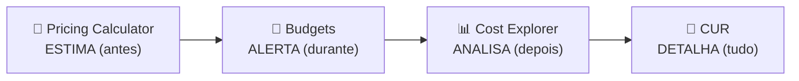

# Módulo 15 · Ferramentas de custo e faturamento

> **Domínio:** 4 · Cobrança, Preços e Suporte · **Tempo estimado:** 2h · **Pré-requisitos:** Módulo 14

## 🎯 Objetivos de aprendizagem

Ao final deste módulo, você será capaz de:

- Diferenciar as ferramentas de custo da AWS e quando usar cada uma.
- Entender **Pricing Calculator, Cost Explorer, Budgets** e **Cost & Usage Report**.
- Conhecer o **AWS Organizations** e o faturamento consolidado.

 

---

 

## 🧠 Conteúdo

 

### 1. A pergunta certa para a ferramenta certa

Cada ferramenta responde a um momento diferente da vida financeira na nuvem:

| Ferramenta | Responde à pergunta... | Momento |
|:--|:--|:--|
| 🧮 **AWS Pricing Calculator** | "Quanto **vai** custar antes de eu construir?" | **Antes** (estimativa) |
| 📊 **AWS Cost Explorer** | "Quanto eu **já** gastei e como foi a tendência?" | **Depois** (análise) |
| 🎯 **AWS Budgets** | "Como sou **avisado** se passar de um limite?" | **Durante** (alerta) |
| 📄 **AWS Cost & Usage Report (CUR)** | "Onde está o **relatório mais detalhado** possível?" | Detalhamento total |

> [!IMPORTANT]
> Macete de prova:
> - **Estimar antes** → **Pricing Calculator**.
> - **Analisar o passado** → **Cost Explorer**.
> - **Ser avisado ao estourar um teto** → **Budgets**.
> Essa distinção "antes / depois / alerta" cai bastante.

 

### 2. Pricing Calculator — planejando o gasto

O **AWS Pricing Calculator** permite montar um orçamento **antes** de criar qualquer recurso. Você escolhe os serviços e as configurações, e ele estima o custo mensal. Ótimo para propostas e planejamento.

 

### 3. Cost Explorer — enxergando para onde vai o dinheiro

O **AWS Cost Explorer** mostra, com gráficos, **quanto** você gastou, **em quê** e a **tendência** ao longo do tempo. Ajuda a identificar desperdícios e prever gastos futuros.

 

### 4. Budgets — colocando limites e alertas

O **AWS Budgets** deixa você definir um **orçamento** (ex.: US$ 50/mês) e receber um **alerta** por e-mail quando o gasto (ou a previsão) se aproxima ou ultrapassa esse valor. É o "guarda-custos" que evita sustos na fatura.

 

### 5. AWS Organizations e faturamento consolidado

O **AWS Organizations** permite gerenciar **várias contas AWS** juntas, com:

- 💳 **Faturamento consolidado** — uma fatura única para todas as contas, com descontos por volume somado.
- 🛡️ **SCPs (Service Control Policies)** — regras que limitam o que cada conta pode fazer (governança central).

> [!NOTE]
> Para empresas com muitas contas (produção, testes, times diferentes), o **Organizations** centraliza governança e economiza com o volume combinado.

 

---

 

## ❓ Quiz — teste seus conhecimentos

 

**1. Você quer ESTIMAR o custo de uma solução ANTES de construí-la. Qual ferramenta usar?**

- **A)** AWS Cost Explorer.
- **B)** AWS Pricing Calculator.
- **C)** AWS Budgets.
- **D)** AWS CloudTrail.

💡 Ver resposta

> ✅ **Resposta: B)** — O **Pricing Calculator** estima custos **antes** de criar recursos.

 

**2. Você quer analisar quanto JÁ gastou e ver a tendência ao longo dos meses. Qual ferramenta?**

- **A)** AWS Pricing Calculator.
- **B)** AWS Cost Explorer.
- **C)** AWS Artifact.
- **D)** AWS Shield.

💡 Ver resposta

> ✅ **Resposta: B)** — O **Cost Explorer** analisa gastos passados e tendências com gráficos.

 

**3. Você quer receber um alerta por e-mail se o gasto passar de US$ 100. Qual ferramenta?**

- **A)** AWS Budgets.
- **B)** AWS Cost Explorer.
- **C)** AWS Pricing Calculator.
- **D)** Amazon CloudFront.

💡 Ver resposta

> ✅ **Resposta: A)** — O **AWS Budgets** define limites e **alerta** quando você se aproxima ou ultrapassa.

 

**4. O que o faturamento consolidado do AWS Organizations oferece?**

- **A)** Uma fatura única para várias contas, com descontos por volume somado.
- **B)** Criptografia de dados em repouso.
- **C)** Proteção contra DDoS.
- **D)** Um banco de dados relacional.

💡 Ver resposta

> ✅ **Resposta: A)** — O **faturamento consolidado** junta as contas numa fatura só e aproveita o volume combinado para descontos.

 

**5. O que são as SCPs (Service Control Policies) do AWS Organizations?**

- **A)** Chaves de criptografia.
- **B)** Regras que limitam o que cada conta pode fazer (governança).
- **C)** Relatórios de conformidade.
- **D)** Tipos de instância EC2.

💡 Ver resposta

> ✅ **Resposta: B)** — As **SCPs** definem os limites máximos de permissão de cada conta, centralizando a governança.

 

---

 

## 🧪 Mão na massa (sem console!)

- 🔗 **AWS Skill Builder** → procure por *"AWS Billing and Cost Management"*.
- 🔗 Abra a **AWS Pricing Calculator** (sem login) e estime o custo mensal de 1 instância EC2 + 1 bucket S3.

 

---

 

## 📔 Glossário

| Termo | Significado |
|:--|:--|
| **Pricing Calculator** | Estima custos antes de construir. |
| **Cost Explorer** | Analisa gastos passados e tendências. |
| **AWS Budgets** | Define orçamentos e envia alertas. |
| **Cost & Usage Report (CUR)** | Relatório mais detalhado de custo e uso. |
| **AWS Organizations** | Gerencia várias contas juntas. |
| **Faturamento consolidado** | Fatura única para várias contas. |
| **SCP** | Política que limita o que uma conta pode fazer. |

 

## ✅ Checklist de conclusão

- [ ] Li todo o conteúdo do módulo
- [ ] Diferencio Pricing Calculator, Cost Explorer e Budgets
- [ ] Sei quando usar cada ferramenta (antes/depois/alerta)
- [ ] Entendo o faturamento consolidado do Organizations
- [ ] Fiz o quiz
- [ ] Registrei meu [Checkpoint](https://github.com/melissaalves-stack/awscloudfoundations/issues/new?template=checkpoint-de-modulo.yml)

 

---

**Precisa de ajuda?** 📊 [Checkpoint](https://github.com/melissaalves-stack/awscloudfoundations/issues/new?template=checkpoint-de-modulo.yml) · ❓ [Dúvida](https://github.com/melissaalves-stack/awscloudfoundations/issues/new?template=duvida.yml) · 📖 [Guia](../../GUIA-DO-ALUNO.md) · 🚀 [Builder Center](https://bit.ly/4w720IR)

⬅️ [Módulo 14](./14-modelos-de-preco.md) &nbsp;·&nbsp; 🏠 [Índice do Domínio 4](./README.md) &nbsp;·&nbsp; ➡️ [Módulo 16 · Suporte e Trusted Advisor](./16-suporte-e-trusted-advisor.md)

