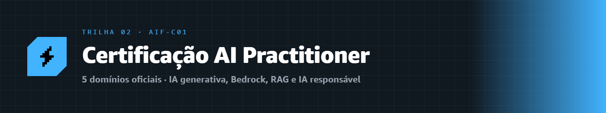
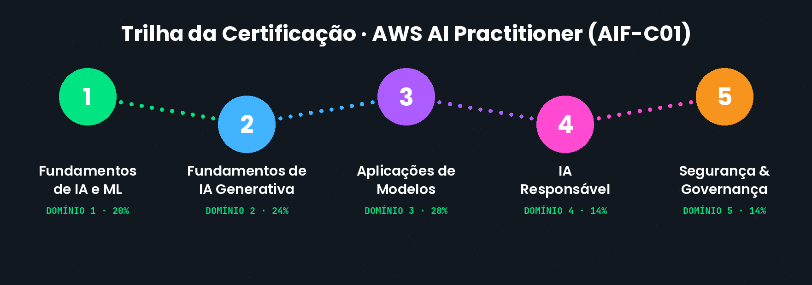
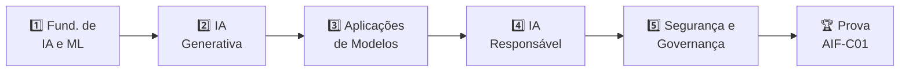

  

# 🤖 Trilha · Certificação AWS AI Practitioner (AIF-C01)

---

Esta é a trilha completa rumo à **AWS Certified AI Practitioner (AIF-C01)** — a certificação de entrada da AWS em **Inteligência Artificial, Machine Learning e IA Generativa**. Como a Cloud Practitioner, ela é organizada **exatamente nos 5 domínios oficiais do exame**.

> [!NOTE]
> 📋 **Sobre a prova:** são **65 questões** (50 valem nota) em **90 minutos**. A nota de aprovação é **700 de 1000**. É uma prova **fundacional** — você **não** precisa saber programar nem construir modelos, apenas entender os conceitos e os serviços de IA da AWS.

> [!TIP]
> 💡 Já fez a trilha **[Cloud Practitioner](../certificacao-cloud/README.md)**? Ótimo — conceitos como IAM, S3 e segurança aparecem aqui também. Mas você pode fazer esta trilha de forma independente.

---

## 🗺️ Os 5 domínios da certificação

### 1️⃣ [Domínio 1 · Fundamentos de IA e ML](./dominio-1-fundamentos-de-ia-e-ml/) &nbsp; `20% da prova`
O que é IA, ML e deep learning, tipos de aprendizado e o ciclo de vida de um projeto de machine learning.

### 2️⃣ [Domínio 2 · Fundamentos de IA Generativa](./dominio-2-fundamentos-de-ia-generativa/) &nbsp; `24% da prova`
O que é IA generativa, modelos de fundação, LLMs, tokens, embeddings e engenharia de prompt.

### 3️⃣ [Domínio 3 · Aplicações de Modelos de Fundação](./dominio-3-aplicacoes-de-modelos/) &nbsp; `28% da prova`
Como aplicar modelos na prática com **Amazon Bedrock** e **SageMaker**, além de RAG e ajuste fino. **O maior domínio.**

### 4️⃣ [Domínio 4 · IA Responsável](./dominio-4-ia-responsavel/) &nbsp; `14% da prova`
Viés, justiça, transparência, explicabilidade e as ferramentas de IA responsável da AWS.

### 5️⃣ [Domínio 5 · Segurança, Conformidade e Governança](./dominio-5-seguranca-e-governanca/) &nbsp; `14% da prova`
Como proteger, governar e manter em conformidade as soluções de IA.

---

## 🎯 Como seguir a trilha

1. Estude os domínios **em ordem**.
2. Faça o **quiz** ao final de cada módulo.
3. Pratique com o **laboratório** sugerido.
4. Registre seu **[Checkpoint](https://github.com/melissaalves-stack/awscloudfoundations/issues/new?template=checkpoint-de-modulo.yml)** a cada módulo.

---

## 🔗 Acesso rápido

- 📊 **[Registrar Checkpoint](https://github.com/melissaalves-stack/awscloudfoundations/issues/new?template=checkpoint-de-modulo.yml)**
- ❓ **[Tirar uma Dúvida](https://github.com/melissaalves-stack/awscloudfoundations/issues/new?template=duvida.yml)**
- 📖 **[Guia do Aluno](../GUIA-DO-ALUNO.md)**
- 🚀 **[AWS Builder Center](https://bit.ly/4w720IR)**

---

🏠 [Voltar ao início](../README.md) · 🎓 [Trilha Cloud Practitioner](../certificacao-cloud/) · 🔬 [Aprofundamento](../aprofundamento/)

