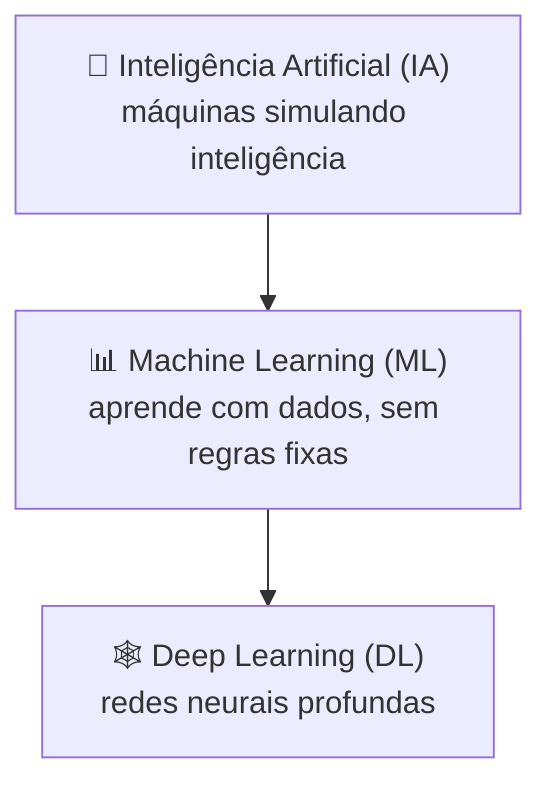

# Módulo 00 · IA, ML e Deep Learning: o mapa do território

> **Domínio:** 1 · Fundamentos de IA e ML · **Tempo estimado:** 2h30 · **Pré-requisitos:** nenhum

## 🎯 Objetivos de aprendizagem

Ao final deste módulo, você será capaz de:

- Diferenciar **Inteligência Artificial, Machine Learning e Deep Learning**.
- Entender o que são **dados de treino** e por que eles são o "combustível" da IA.
- Reconhecer casos de uso de IA no mundo real.

 

---

 

## 🧠 Conteúdo

 

### 1. Três termos que vivem confundidos

IA, ML e Deep Learning **não** são sinônimos. Eles são como **bonecas russas** — um dentro do outro:

| Termo | O que é | Analogia |
|:--|:--|:--|
| 🧠 **Inteligência Artificial (IA)** | O campo amplo de fazer máquinas realizarem tarefas "inteligentes". | O universo inteiro. |
| 📊 **Machine Learning (ML)** | Um ramo da IA em que a máquina **aprende com dados** em vez de seguir regras escritas à mão. | Uma galáxia dentro desse universo. |
| 🕸️ **Deep Learning (DL)** | Um tipo de ML que usa **redes neurais** com muitas camadas, inspiradas no cérebro. | Um sistema solar dentro dessa galáxia. |

> [!TIP]
> Toda vez que a máquina **aprende a partir de exemplos** (em vez de você programar cada regra), é **Machine Learning**. Quando isso usa redes neurais profundas (para imagens, voz, linguagem), é **Deep Learning**.

 

### 2. A grande virada: aprender em vez de programar

No jeito tradicional, você escrevia **regras**: "se o e-mail tem a palavra X, é spam". O problema? Impossível prever todas as regras.

No ML, você mostra **milhares de exemplos** (e-mails marcados como spam ou não) e o modelo **descobre sozinho** os padrões. Ele aprende a generalizar.

> [!IMPORTANT]
> Por isso os **dados** são tão importantes: eles são o **combustível** do ML. Dados ruins → modelo ruim. A qualidade e a quantidade dos dados definem a qualidade do modelo.

 

### 3. Modelo, treino e inferência

Três palavras que você vai ver o tempo todo:

| Termo | Significado |
|:--|:--|
| 🧩 **Modelo** | O "cérebro" treinado que faz previsões. |
| 🏋️ **Treinamento (training)** | O processo de ensinar o modelo com dados. |
| 🔮 **Inferência (inference)** | Usar o modelo já treinado para fazer uma previsão nova. |

> [!NOTE]
> Analogia: **treinar** é estudar para a prova (demorado, feito uma vez). **Inferência** é responder a uma questão nova na hora (rápido, feito muitas vezes).

 

### 4. Onde a IA já está no seu dia a dia

- 📱 Recomendações (Netflix, Spotify, lojas online).
- 🗣️ Assistentes de voz (Alexa, Siri).
- 📷 Reconhecimento de imagem (desbloqueio facial).
- 🌐 Tradução automática.
- 🚗 Carros com assistência à direção.
- 💬 Chatbots e IA generativa (que veremos no [Domínio 2](../dominio-2-fundamentos-de-ia-generativa/README.md)).

 

---

 

## ❓ Quiz — teste seus conhecimentos

 

**1. Qual a relação entre IA, ML e Deep Learning?**

- **A)** São três nomes para a mesma coisa.
- **B)** São conceitos independentes e sem relação.
- **C)** ML é um ramo da IA, e Deep Learning é um tipo de ML.
- **D)** Deep Learning é o mais amplo dos três.

💡 Ver resposta

> ✅ **Resposta: C)** — São bonecas russas: **IA ⊃ ML ⊃ Deep Learning**. O DL é um tipo de ML, que por sua vez é um ramo da IA.

 

**2. O que diferencia o Machine Learning da programação tradicional?**

- **A)** No ML, a máquina aprende padrões a partir de dados, em vez de seguir regras fixas.
- **B)** No ML, você escreve todas as regras manualmente.
- **C)** ML não usa dados.
- **D)** ML só funciona sem computadores.

💡 Ver resposta

> ✅ **Resposta: A)** — O ML **aprende com exemplos (dados)**, em vez de depender de regras escritas à mão.

 

**3. Por que os dados são tão importantes no ML?**

- **A)** Porque ocupam espaço no disco.
- **B)** Porque são o "combustível": a qualidade e quantidade dos dados definem a qualidade do modelo.
- **C)** Porque são opcionais.
- **D)** Porque substituem o modelo.

💡 Ver resposta

> ✅ **Resposta: B)** — Dados são o combustível do ML. **Dados ruins → modelo ruim.**

 

**4. O que é "inferência" em Machine Learning?**

- **A)** O processo de ensinar o modelo.
- **B)** Usar o modelo já treinado para fazer uma nova previsão.
- **C)** Apagar os dados de treino.
- **D)** Criar um novo conjunto de dados.

💡 Ver resposta

> ✅ **Resposta: B)** — **Inferência** é usar o modelo treinado para prever algo novo. Treinar é ensinar; inferir é aplicar.

 

**5. O Deep Learning se baseia em qual tecnologia?**

- **A)** Planilhas eletrônicas.
- **B)** Redes neurais com muitas camadas.
- **C)** Bancos de dados relacionais.
- **D)** Regras escritas manualmente.

💡 Ver resposta

> ✅ **Resposta: B)** — O Deep Learning usa **redes neurais profundas** (muitas camadas), inspiradas no cérebro.

 

---

 

## 🧪 Mão na massa (sem console!)

- 🔗 **AWS Skill Builder** → procure por *"Introduction to Machine Learning"* ou *"AI/ML Fundamentals"*.
- 🔗 Liste 5 aplicativos que você usa e identifique onde há IA/ML atuando neles.

 

---

 

## 📔 Glossário

| Termo | Significado |
|:--|:--|
| **Inteligência Artificial (IA)** | Campo amplo de máquinas com comportamento inteligente. |
| **Machine Learning (ML)** | Ramo da IA que aprende com dados. |
| **Deep Learning (DL)** | ML baseado em redes neurais profundas. |
| **Modelo** | O "cérebro" treinado que faz previsões. |
| **Treinamento** | Processo de ensinar o modelo com dados. |
| **Inferência** | Usar o modelo treinado para prever algo novo. |
| **Dados de treino** | Exemplos usados para ensinar o modelo. |

 

## ✅ Checklist de conclusão

- [ ] Li todo o conteúdo do módulo
- [ ] Diferencio IA, ML e Deep Learning
- [ ] Entendo por que os dados são o combustível do ML
- [ ] Sei a diferença entre treino e inferência
- [ ] Fiz o quiz
- [ ] Registrei meu [Checkpoint](https://github.com/melissaalves-stack/awscloudfoundations/issues/new?template=checkpoint-de-modulo.yml)

 

---

**Precisa de ajuda?** 📊 [Checkpoint](https://github.com/melissaalves-stack/awscloudfoundations/issues/new?template=checkpoint-de-modulo.yml) · ❓ [Dúvida](https://github.com/melissaalves-stack/awscloudfoundations/issues/new?template=duvida.yml) · 📖 [Guia](../../GUIA-DO-ALUNO.md) · 🚀 [Builder Center](https://bit.ly/4w720IR)

🏠 [Índice do Domínio 1](./README.md) &nbsp;·&nbsp; ➡️ [Módulo 01 · Tipos de aprendizado](./01-tipos-de-aprendizado.md)

