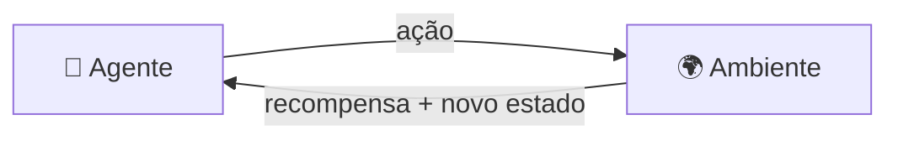
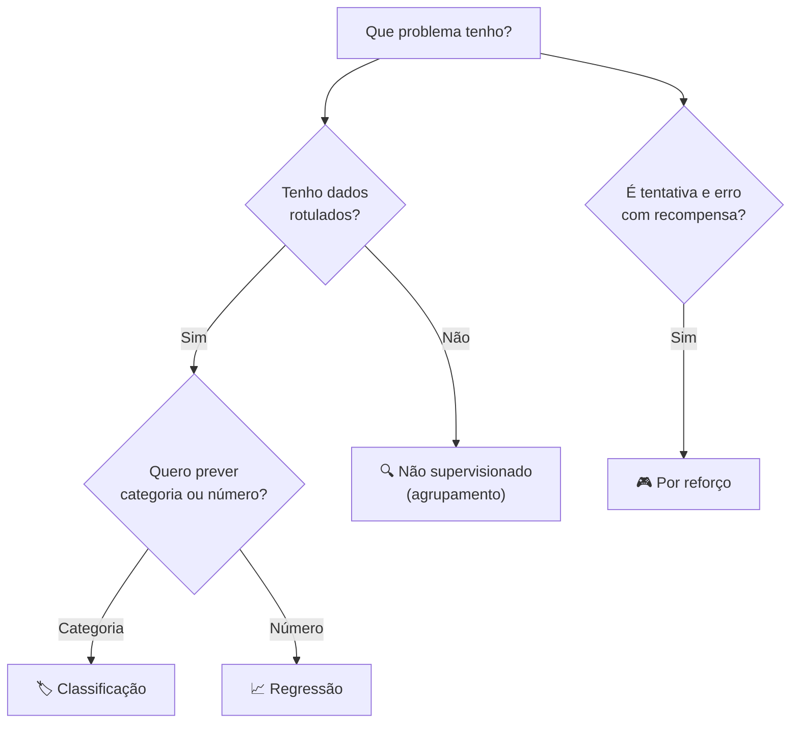

# Módulo 01 · Tipos de aprendizado de máquina

> **Domínio:** 1 · Fundamentos de IA e ML · **Tempo estimado:** 2h30 · **Pré-requisitos:** Módulo 00

## 🎯 Objetivos de aprendizagem

Ao final deste módulo, você será capaz de:

- Diferenciar aprendizado **supervisionado, não supervisionado e por reforço**.
- Reconhecer **classificação, regressão e agrupamento**.
- Associar cada tipo a casos de uso reais.

 

---

 

## 🧠 Conteúdo

 

### 1. Os três grandes tipos de aprendizado

| Tipo | Como aprende | Analogia 🎓 |
|:--|:--|:--|
| 👨‍🏫 **Supervisionado** | Com dados **rotulados** (você mostra a resposta certa). | Um aluno com professor e gabarito. |
| 🔍 **Não supervisionado** | Com dados **sem rótulos** (a máquina acha padrões sozinha). | Um explorador agrupando coisas parecidas. |
| 🎮 **Por reforço** | Por **tentativa e erro**, ganhando recompensas. | Um jogador que aprende jogando. |

 

### 2. Aprendizado supervisionado

Você fornece exemplos **com a resposta certa** (rótulos). O modelo aprende a mapear entrada → saída. Divide-se em duas tarefas principais:

| Tarefa | O que prevê | Exemplo |
|:--|:--|:--|
| 🏷️ **Classificação** | Uma **categoria** (resposta discreta). | Este e-mail é spam ou não? |
| 📈 **Regressão** | Um **número** (resposta contínua). | Qual será o preço desta casa? |

> [!TIP]
> Macete: **classificação** responde "**qual categoria?**" (spam/não spam, gato/cachorro). **Regressão** responde "**quanto?**" (preço, temperatura, idade).

 

### 3. Aprendizado não supervisionado

Aqui **não há rótulos**. O modelo procura estrutura escondida nos dados sozinho:

| Tarefa | O que faz | Exemplo |
|:--|:--|:--|
| 🧩 **Agrupamento (clustering)** | Junta itens parecidos em grupos. | Segmentar clientes por comportamento. |
| 🔗 **Associação** | Descobre relações entre itens. | "Quem compra X também compra Y." |

> [!NOTE]
> Como não há gabarito, o não supervisionado é ótimo para **descobrir** coisas que você nem sabia que existiam nos dados (novos segmentos, anomalias).

 

### 4. Aprendizado por reforço

Um "agente" toma ações em um ambiente e recebe **recompensas** ou **punições**. Com o tempo, aprende a estratégia que maximiza a recompensa.

> [!TIP]
> É assim que IAs aprendem a jogar videogames, controlar robôs e otimizar sistemas. Pense em treinar um cachorro com petiscos: comportamento certo → recompensa.

 

### 5. Escolhendo o tipo certo

 

---

 

## ❓ Quiz — teste seus conhecimentos

 

**1. Um modelo aprende com dados que já têm a resposta certa (rótulos). Que tipo de aprendizado é esse?**

- **A)** Não supervisionado.
- **B)** Supervisionado.
- **C)** Por reforço.
- **D)** Nenhum.

💡 Ver resposta

> ✅ **Resposta: B)** — Dados **rotulados** = aprendizado **supervisionado** (tem "gabarito").

 

**2. Prever o PREÇO de uma casa (um número) é uma tarefa de...**

- **A)** Classificação.
- **B)** Regressão.
- **C)** Agrupamento.
- **D)** Associação.

💡 Ver resposta

> ✅ **Resposta: B)** — Prever um **número contínuo** (preço) é **regressão**. "Quanto?" → regressão.

 

**3. Decidir se um e-mail é "spam" ou "não spam" é uma tarefa de...**

- **A)** Regressão.
- **B)** Classificação.
- **C)** Aprendizado por reforço.
- **D)** Agrupamento.

💡 Ver resposta

> ✅ **Resposta: B)** — Escolher uma **categoria** (spam/não) é **classificação**. "Qual categoria?" → classificação.

 

**4. Segmentar clientes em grupos parecidos, SEM rótulos prévios, é...**

- **A)** Aprendizado supervisionado.
- **B)** Agrupamento (clustering), no aprendizado não supervisionado.
- **C)** Regressão.
- **D)** Aprendizado por reforço.

💡 Ver resposta

> ✅ **Resposta: B)** — Sem rótulos, juntar itens parecidos é **agrupamento** (não supervisionado).

 

**5. Uma IA aprende a jogar um game por tentativa e erro, ganhando pontos. Que tipo de aprendizado?**

- **A)** Supervisionado.
- **B)** Não supervisionado.
- **C)** Por reforço.
- **D)** Classificação.

💡 Ver resposta

> ✅ **Resposta: C)** — Tentativa e erro com **recompensa** = aprendizado **por reforço**.

 

---

 

## 🧪 Mão na massa (sem console!)

- 🔗 **AWS Skill Builder** → procure por *"Types of Machine Learning"*.
- 🔗 Para cada problema (prever vendas, detectar fraude, agrupar músicas), diga qual tipo de aprendizado usaria.

 

---

 

## 📔 Glossário

| Termo | Significado |
|:--|:--|
| **Supervisionado** | Aprende com dados rotulados. |
| **Não supervisionado** | Aprende sem rótulos, achando padrões. |
| **Por reforço** | Aprende por tentativa e erro com recompensas. |
| **Classificação** | Prever uma categoria. |
| **Regressão** | Prever um número. |
| **Agrupamento (clustering)** | Juntar itens parecidos sem rótulos. |
| **Rótulo (label)** | A resposta certa associada a um exemplo. |

 

## ✅ Checklist de conclusão

- [ ] Li todo o conteúdo do módulo
- [ ] Diferencio supervisionado, não supervisionado e por reforço
- [ ] Sei distinguir classificação de regressão
- [ ] Entendo o que é agrupamento
- [ ] Associo cada tipo a casos de uso
- [ ] Fiz o quiz
- [ ] Registrei meu [Checkpoint](https://github.com/melissaalves-stack/awscloudfoundations/issues/new?template=checkpoint-de-modulo.yml)

 

---

**Precisa de ajuda?** 📊 [Checkpoint](https://github.com/melissaalves-stack/awscloudfoundations/issues/new?template=checkpoint-de-modulo.yml) · ❓ [Dúvida](https://github.com/melissaalves-stack/awscloudfoundations/issues/new?template=duvida.yml) · 📖 [Guia](../../GUIA-DO-ALUNO.md) · 🚀 [Builder Center](https://bit.ly/4w720IR)

⬅️ [Módulo 00](./00-ia-ml-deep-learning.md) &nbsp;·&nbsp; 🏠 [Índice do Domínio 1](./README.md) &nbsp;·&nbsp; ➡️ [Módulo 02 · Ciclo de vida de ML](./02-ciclo-de-vida-ml.md)

