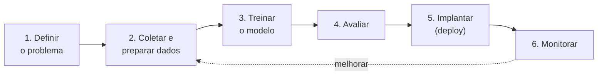

# Módulo 02 · O ciclo de vida de um projeto de ML

> **Domínio:** 1 · Fundamentos de IA e ML · **Tempo estimado:** 2h · **Pré-requisitos:** Módulos 00 e 01

## 🎯 Objetivos de aprendizagem

Ao final deste módulo, você será capaz de:

- Descrever as etapas do **ciclo de vida de machine learning**.
- Entender a importância dos **dados** e da **avaliação** do modelo.
- Conhecer conceitos como **overfitting** e **underfitting**.

 

---

 

## 🧠 Conteúdo

 

### 1. Um projeto de ML é uma jornada

Criar um modelo não é um passo único — é um ciclo com etapas bem definidas:

| Etapa | O que acontece |
|:--|:--|
| 1️⃣ **Definir o problema** | Qual pergunta o modelo vai responder? |
| 2️⃣ **Coletar e preparar dados** | Reunir, limpar e organizar os dados (a etapa mais trabalhosa!). |
| 3️⃣ **Treinar** | O modelo aprende com os dados de treino. |
| 4️⃣ **Avaliar** | Medir o desempenho com dados que o modelo **nunca viu**. |
| 5️⃣ **Implantar (deploy)** | Colocar o modelo em produção para fazer inferências. |
| 6️⃣ **Monitorar** | Acompanhar o desempenho e reajustar ao longo do tempo. |

> [!IMPORTANT]
> A etapa de **dados** (coletar e preparar) costuma consumir a maior parte do tempo do projeto. Modelos são tão bons quanto os dados que recebem.

 

### 2. Divisão dos dados: treino, validação e teste

Para avaliar honestamente, você separa os dados em partes:

| Conjunto | Para quê |
|:--|:--|
| 🏋️ **Treino (training)** | Ensinar o modelo. |
| 🎚️ **Validação (validation)** | Ajustar configurações durante o desenvolvimento. |
| 🧪 **Teste (test)** | Avaliação final com dados nunca vistos. |

> [!TIP]
> Nunca avalie o modelo com os **mesmos dados** do treino — seria como dar a prova com o gabarito já visto. O teste precisa usar dados **novos** para o modelo.

 

### 3. Overfitting e underfitting

Dois problemas clássicos de qualidade do modelo:

| Problema | O que é | Analogia 🎓 |
|:--|:--|:--|
| 📕 **Overfitting** | Decorou os dados de treino, mas vai mal em dados novos. | Aluno que decorou o gabarito, mas não entendeu a matéria. |
| 📉 **Underfitting** | Nem no treino ele foi bem — modelo simples demais. | Aluno que não estudou o suficiente. |

> [!NOTE]
> O objetivo é o **equilíbrio**: um modelo que **generaliza** bem — vai bem tanto no treino quanto em dados novos.

 

### 4. Métricas de avaliação

Como saber se o modelo é bom? Depende da tarefa:

- Para **classificação**: acurácia, precisão, recall, F1.
- Para **regressão**: erro médio (quão longe as previsões ficam do valor real).

> [!TIP]
> Você não precisa calcular métricas na prova, mas reconheça que **acurácia** mede acertos e que existem métricas específicas para cada tipo de problema.

 

---

 

## ❓ Quiz — teste seus conhecimentos

 

**1. Qual etapa do ciclo de ML costuma consumir MAIS tempo?**

- **A)** Definir o problema.
- **B)** Coletar e preparar os dados.
- **C)** Implantar o modelo.
- **D)** Monitorar.

💡 Ver resposta

> ✅ **Resposta: B)** — **Coletar e preparar dados** é geralmente a etapa mais trabalhosa e demorada.

 

**2. Por que avaliamos o modelo com dados que ele nunca viu?**

- **A)** Para deixar o processo mais lento.
- **B)** Para medir honestamente se ele generaliza, e não apenas se decorou.
- **C)** Porque a AWS obriga.
- **D)** Não há motivo.

💡 Ver resposta

> ✅ **Resposta: B)** — Testar com dados **novos** revela se o modelo realmente **generaliza** (não só decorou o treino).

 

**3. Um modelo vai muito bem no treino, mas mal em dados novos. Qual o problema?**

- **A)** Underfitting.
- **B)** Overfitting.
- **C)** Falta de dados de teste.
- **D)** Excesso de inferência.

💡 Ver resposta

> ✅ **Resposta: B)** — Isso é **overfitting**: o modelo "decorou" o treino e não generaliza.

 

**4. Um modelo vai mal até nos dados de treino. Isso é...**

- **A)** Overfitting.
- **B)** Underfitting.
- **C)** Generalização perfeita.
- **D)** Inferência.

💡 Ver resposta

> ✅ **Resposta: B)** — **Underfitting**: o modelo é simples demais e não aprendeu nem o treino.

 

**5. Qual conjunto de dados é usado para a avaliação FINAL do modelo?**

- **A)** Conjunto de treino.
- **B)** Conjunto de validação.
- **C)** Conjunto de teste.
- **D)** Nenhum.

💡 Ver resposta

> ✅ **Resposta: C)** — O conjunto de **teste** (dados nunca vistos) é usado para a avaliação **final**.

 

---

 

## 🧪 Mão na massa (sem console!)

- 🔗 **AWS Skill Builder** → procure por *"Machine Learning Lifecycle"* ou *"ML pipeline"*.
- 🔗 Desenhe o ciclo de ML para um projeto seu (ex.: prever notas de alunos) e liste onde estariam os dados de treino e teste.

 

---

 

## 📔 Glossário

| Termo | Significado |
|:--|:--|
| **Ciclo de vida de ML** | Etapas do projeto: problema → dados → treino → avaliação → deploy → monitoramento. |
| **Treino / Validação / Teste** | Partições dos dados para ensinar, ajustar e avaliar. |
| **Overfitting** | Modelo decorou o treino e não generaliza. |
| **Underfitting** | Modelo simples demais, ruim até no treino. |
| **Generalização** | Ir bem em dados novos. |
| **Acurácia** | Proporção de acertos (classificação). |

 

## ✅ Checklist de conclusão

- [ ] Li todo o conteúdo do módulo
- [ ] Sei descrever as etapas do ciclo de ML
- [ ] Entendo a divisão treino/validação/teste
- [ ] Diferencio overfitting e underfitting
- [ ] Sei que existem métricas por tipo de tarefa
- [ ] Fiz o quiz
- [ ] Registrei meu [Checkpoint](https://github.com/melissaalves-stack/awscloudfoundations/issues/new?template=checkpoint-de-modulo.yml)

 

---

**Precisa de ajuda?** 📊 [Checkpoint](https://github.com/melissaalves-stack/awscloudfoundations/issues/new?template=checkpoint-de-modulo.yml) · ❓ [Dúvida](https://github.com/melissaalves-stack/awscloudfoundations/issues/new?template=duvida.yml) · 📖 [Guia](../../GUIA-DO-ALUNO.md) · 🚀 [Builder Center](https://bit.ly/4w720IR)

⬅️ [Módulo 01](./01-tipos-de-aprendizado.md) &nbsp;·&nbsp; 🏠 [Índice do Domínio 1](./README.md) &nbsp;·&nbsp; ➡️ [Domínio 2 · Fundamentos de IA Generativa](../dominio-2-fundamentos-de-ia-generativa/README.md)

