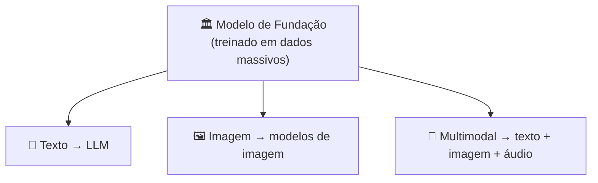

# Módulo 03 · O que é IA Generativa e modelos de fundação

> **Domínio:** 2 · Fundamentos de IA Generativa · **Tempo estimado:** 2h30 · **Pré-requisitos:** Domínio 1

## 🎯 Objetivos de aprendizagem

Ao final deste módulo, você será capaz de:

- Explicar o que é **IA generativa** e como difere do ML tradicional.
- Entender o que é um **modelo de fundação (foundation model)**.
- Reconhecer casos de uso e limitações da IA generativa.

 

---

 

## 🧠 Conteúdo

 

### 1. IA que cria, não só prevê

O ML tradicional **classifica ou prevê** (spam ou não, qual o preço). A **IA generativa** vai além: ela **cria conteúdo novo** — textos, imagens, código, áudio, vídeo.

| | ML tradicional | IA generativa |
|:--|:--|:--|
| O que faz | Analisa e prevê | **Cria** conteúdo novo |
| Exemplo | "Este e-mail é spam?" | "Escreva um e-mail de boas-vindas." |

> [!TIP]
> Pense na diferença entre um **crítico** (avalia) e um **artista** (cria). O ML tradicional é o crítico; a IA generativa é o artista.

 

### 2. Modelos de fundação (Foundation Models)

Um **modelo de fundação** é um modelo **gigante**, treinado com uma quantidade **enorme** de dados variados, capaz de realizar **muitas tarefas diferentes** — resumir, traduzir, responder, gerar código — sem precisar ser treinado do zero para cada uma.

> [!IMPORTANT]
> A grande sacada: em vez de treinar um modelo específico para cada tarefa, você usa **um** modelo de fundação versátil e o adapta. Isso democratizou o acesso à IA.

Exemplos de famílias de modelos de fundação disponíveis na AWS (via Amazon Bedrock): **Anthropic Claude, Amazon Titan, Meta Llama, Mistral, Stability AI**, entre outros.

 

### 3. LLMs: os modelos de linguagem

Quando um modelo de fundação é especializado em **texto/linguagem**, chamamos de **LLM (Large Language Model)** — Grande Modelo de Linguagem. É o que está por trás de assistentes como o Claude.

 

### 4. Modelos multimodais

Alguns modelos entendem e geram **vários tipos de dados ao mesmo tempo** (texto, imagem, áudio) — são os **multimodais**. Por exemplo: você envia uma foto e pede uma descrição em texto.

 

### 5. Casos de uso e limitações

**Onde brilha:** atendimento (chatbots), criação de conteúdo, resumo de documentos, geração e revisão de código, tradução, busca inteligente.

**Cuidados importantes:**

> [!WARNING]
> A IA generativa pode **"alucinar"** — gerar informações que parecem convincentes, mas são **falsas**. Ela também pode refletir **vieses** dos dados de treino. Por isso, respostas importantes devem ser **verificadas por humanos**. (Veremos mais no [Domínio 4 · IA Responsável](../dominio-4-ia-responsavel/README.md).)

 

---

 

## ❓ Quiz — teste seus conhecimentos

 

**1. O que diferencia a IA generativa do ML tradicional?**

- **A)** A IA generativa apenas classifica dados.
- **B)** A IA generativa cria conteúdo novo (texto, imagem, código).
- **C)** A IA generativa não usa dados.
- **D)** Não há diferença.

💡 Ver resposta

> ✅ **Resposta: B)** — A IA generativa **cria** conteúdo novo, enquanto o ML tradicional analisa/prevê.

 

**2. O que é um modelo de fundação (foundation model)?**

- **A)** Um modelo pequeno para uma única tarefa.
- **B)** Um modelo enorme, treinado em dados massivos, capaz de muitas tarefas diferentes.
- **C)** Um banco de dados.
- **D)** Uma política de IAM.

💡 Ver resposta

> ✅ **Resposta: B)** — Um **foundation model** é grande, versátil e serve de base para muitas tarefas.

 

**3. O que significa a sigla LLM?**

- **A)** Large Language Model (Grande Modelo de Linguagem).
- **B)** Long Learning Machine.
- **C)** Low Latency Model.
- **D)** Local Log Manager.

💡 Ver resposta

> ✅ **Resposta: A)** — **LLM = Large Language Model**, um modelo de fundação especializado em linguagem.

 

**4. O que é uma "alucinação" em IA generativa?**

- **A)** Um erro de rede.
- **B)** Quando o modelo gera informação que parece convincente, mas é falsa.
- **C)** Um tipo de criptografia.
- **D)** Um modelo multimodal.

💡 Ver resposta

> ✅ **Resposta: B)** — **Alucinação** é gerar conteúdo plausível, porém **incorreto**. Por isso, verificação humana é importante.

 

**5. Um modelo que entende texto E imagem ao mesmo tempo é chamado de...**

- **A)** Unimodal.
- **B)** Multimodal.
- **C)** Supervisionado.
- **D)** Serverless.

💡 Ver resposta

> ✅ **Resposta: B)** — Modelos que lidam com vários tipos de dados são **multimodais**.

 

---

 

## 🧪 Mão na massa (sem console!)

- 🔗 **AWS Skill Builder** → procure por *"Generative AI"* e *"Foundation Models"*.
- 🔗 Liste 3 tarefas do seu dia a dia que uma IA generativa poderia ajudar — e uma em que você **não** confiaria nela sem revisar.

 

---

 

## 📔 Glossário

| Termo | Significado |
|:--|:--|
| **IA generativa** | IA que cria conteúdo novo. |
| **Modelo de fundação** | Modelo grande e versátil, base para várias tarefas. |
| **LLM** | Modelo de fundação para linguagem (texto). |
| **Multimodal** | Modelo que lida com vários tipos de dados. |
| **Alucinação** | Conteúdo gerado que parece verdadeiro, mas é falso. |
| **Amazon Bedrock** | Serviço da AWS que dá acesso a vários modelos de fundação. |

 

## ✅ Checklist de conclusão

- [ ] Li todo o conteúdo do módulo
- [ ] Diferencio IA generativa de ML tradicional
- [ ] Entendo o que é um modelo de fundação
- [ ] Sei o que é um LLM e o que é multimodal
- [ ] Entendo o risco de alucinações
- [ ] Fiz o quiz
- [ ] Registrei meu [Checkpoint](https://github.com/melissaalves-stack/awscloudfoundations/issues/new?template=checkpoint-de-modulo.yml)

 

---

**Precisa de ajuda?** 📊 [Checkpoint](https://github.com/melissaalves-stack/awscloudfoundations/issues/new?template=checkpoint-de-modulo.yml) · ❓ [Dúvida](https://github.com/melissaalves-stack/awscloudfoundations/issues/new?template=duvida.yml) · 📖 [Guia](../../GUIA-DO-ALUNO.md) · 🚀 [Builder Center](https://bit.ly/4w720IR)

🏠 [Índice do Domínio 2](./README.md) &nbsp;·&nbsp; ➡️ [Módulo 04 · LLMs, tokens e embeddings](./04-llms-tokens-embeddings.md)

