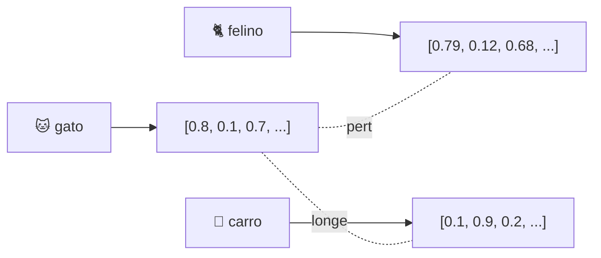

# Módulo 04 · Por dentro dos LLMs: tokens e embeddings

> **Domínio:** 2 · Fundamentos de IA Generativa · **Tempo estimado:** 2h30 · **Pré-requisitos:** Módulo 03

## 🎯 Objetivos de aprendizagem

Ao final deste módulo, você será capaz de:

- Entender o que são **tokens** e como os LLMs "leem" texto.
- Explicar o que são **embeddings** e para que servem.
- Compreender a **janela de contexto** e a **temperatura**.

 

---

 

## 🧠 Conteúdo

 

### 1. Como o LLM enxerga o texto: tokens

Um LLM não lê letras nem palavras exatamente como nós. Ele quebra o texto em **tokens** — pedacinhos que podem ser palavras, partes de palavras ou sinais.

> [!TIP]
> Exemplo aproximado: a frase "Bora construir!" pode virar os tokens `Bora`, ` constru`, `ir`, `!`. Em média, **1 token ≈ 4 caracteres** em inglês (em português varia um pouco).

Por que isso importa? Porque o **custo** e os **limites** dos modelos são medidos em **tokens** (entrada + saída). Textos maiores = mais tokens = mais custo.

 

### 2. A janela de contexto

A **janela de contexto (context window)** é o **máximo de tokens** que o modelo consegue "lembrar" de uma vez — tudo que você enviou mais o que ele responde.

> [!IMPORTANT]
> Se a conversa fica longa demais e ultrapassa a janela de contexto, o modelo "esquece" o começo. Modelos mais novos têm janelas cada vez maiores.

 

### 3. Embeddings: transformando significado em números

Um **embedding** é uma representação do texto (ou imagem) como uma **lista de números** que captura o **significado**. Coisas com sentidos parecidos ficam "próximas" nesse espaço numérico.

> [!NOTE]
> Como "gato" e "felino" têm sentidos próximos, seus embeddings são **próximos**. "Carro" fica **longe**. É assim que a IA mede **similaridade de significado** — a base da **busca semântica** e do **RAG** (que veremos no [Domínio 3](../dominio-3-aplicacoes-de-modelos/README.md)).

 

### 4. Temperatura: criatividade vs. previsibilidade

A **temperatura** controla o quão "criativas" ou "conservadoras" são as respostas do modelo:

| Temperatura | Efeito | Quando usar |
|:--|:--|:--|
| ❄️ **Baixa** (ex.: 0.1) | Respostas mais focadas e previsíveis. | Fatos, código, respostas exatas. |
| 🔥 **Alta** (ex.: 0.9) | Respostas mais variadas e criativas. | Brainstorm, escrita criativa. |

> [!TIP]
> Precisa de uma resposta factual e consistente? Use temperatura **baixa**. Quer ideias variadas e originais? Suba a temperatura.

 

### 5. Outros parâmetros que você pode ver

- **Top-p / Top-k** — outras formas de controlar a variedade das respostas.
- **Max tokens** — limita o tamanho da resposta gerada.

> [!NOTE]
> Para a prova, o essencial é entender **temperatura** (criatividade) e reconhecer que existem outros parâmetros de controle. Não precisa decorar fórmulas.

 

---

 

## ❓ Quiz — teste seus conhecimentos

 

**1. O que é um "token" para um LLM?**

- **A)** Uma senha de acesso.
- **B)** Um pedacinho de texto (palavra ou parte dela) que o modelo processa.
- **C)** Um tipo de instância EC2.
- **D)** Um bucket de armazenamento.

💡 Ver resposta

> ✅ **Resposta: B)** — **Token** é a unidade de texto que o LLM processa. Custo e limites são medidos em tokens.

 

**2. O que é a janela de contexto (context window)?**

- **A)** A tela do computador.
- **B)** O máximo de tokens que o modelo consegue considerar de uma vez.
- **C)** Um tipo de criptografia.
- **D)** A temperatura do modelo.

💡 Ver resposta

> ✅ **Resposta: B)** — A **janela de contexto** é o limite de tokens que o modelo "lembra" em uma interação.

 

**3. Para que servem os embeddings?**

- **A)** Para representar o significado de textos como números, permitindo medir similaridade.
- **B)** Para criptografar dados.
- **C)** Para criar instâncias EC2.
- **D)** Para armazenar backups.

💡 Ver resposta

> ✅ **Resposta: A)** — **Embeddings** transformam significado em números; itens parecidos ficam próximos. É a base da busca semântica.

 

**4. Você quer respostas factuais e previsíveis. Que temperatura usar?**

- **A)** Alta.
- **B)** Baixa.
- **C)** Tanto faz.
- **D)** Temperatura não afeta isso.

💡 Ver resposta

> ✅ **Resposta: B)** — Temperatura **baixa** deixa as respostas mais focadas e consistentes.

 

**5. "Gato" e "felino" têm embeddings próximos. Por quê?**

- **A)** Porque têm o mesmo número de letras.
- **B)** Porque têm significados parecidos.
- **C)** Por acaso.
- **D)** Porque estão no mesmo bucket.

💡 Ver resposta

> ✅ **Resposta: B)** — Embeddings capturam **significado**; palavras com sentidos próximos ficam próximas no espaço numérico.

 

---

 

## 🧪 Mão na massa (sem console!)

- 🔗 **AWS Skill Builder** → procure por *"How LLMs work"* e *"Embeddings"*.
- 🔗 Experimente (em qualquer assistente de IA) fazer a mesma pergunta pedindo respostas "criativas" e "objetivas" e note a diferença de estilo.

 

---

 

## 📔 Glossário

| Termo | Significado |
|:--|:--|
| **Token** | Pedaço de texto processado pelo LLM (mede custo e limites). |
| **Janela de contexto** | Máximo de tokens considerados de uma vez. |
| **Embedding** | Representação numérica do significado de um dado. |
| **Busca semântica** | Encontrar itens por significado, via embeddings. |
| **Temperatura** | Controla criatividade vs. previsibilidade das respostas. |
| **Max tokens** | Limite do tamanho da resposta. |

 

## ✅ Checklist de conclusão

- [ ] Li todo o conteúdo do módulo
- [ ] Entendo o que são tokens e por que importam
- [ ] Sei o que é a janela de contexto
- [ ] Entendo embeddings e busca semântica
- [ ] Sei o efeito da temperatura
- [ ] Fiz o quiz
- [ ] Registrei meu [Checkpoint](https://github.com/melissaalves-stack/awscloudfoundations/issues/new?template=checkpoint-de-modulo.yml)

 

---

**Precisa de ajuda?** 📊 [Checkpoint](https://github.com/melissaalves-stack/awscloudfoundations/issues/new?template=checkpoint-de-modulo.yml) · ❓ [Dúvida](https://github.com/melissaalves-stack/awscloudfoundations/issues/new?template=duvida.yml) · 📖 [Guia](../../GUIA-DO-ALUNO.md) · 🚀 [Builder Center](https://bit.ly/4w720IR)

⬅️ [Módulo 03](./03-ia-generativa-e-modelos-de-fundacao.md) &nbsp;·&nbsp; 🏠 [Índice do Domínio 2](./README.md) &nbsp;·&nbsp; ➡️ [Módulo 05 · Engenharia de prompt](./05-engenharia-de-prompt.md)

