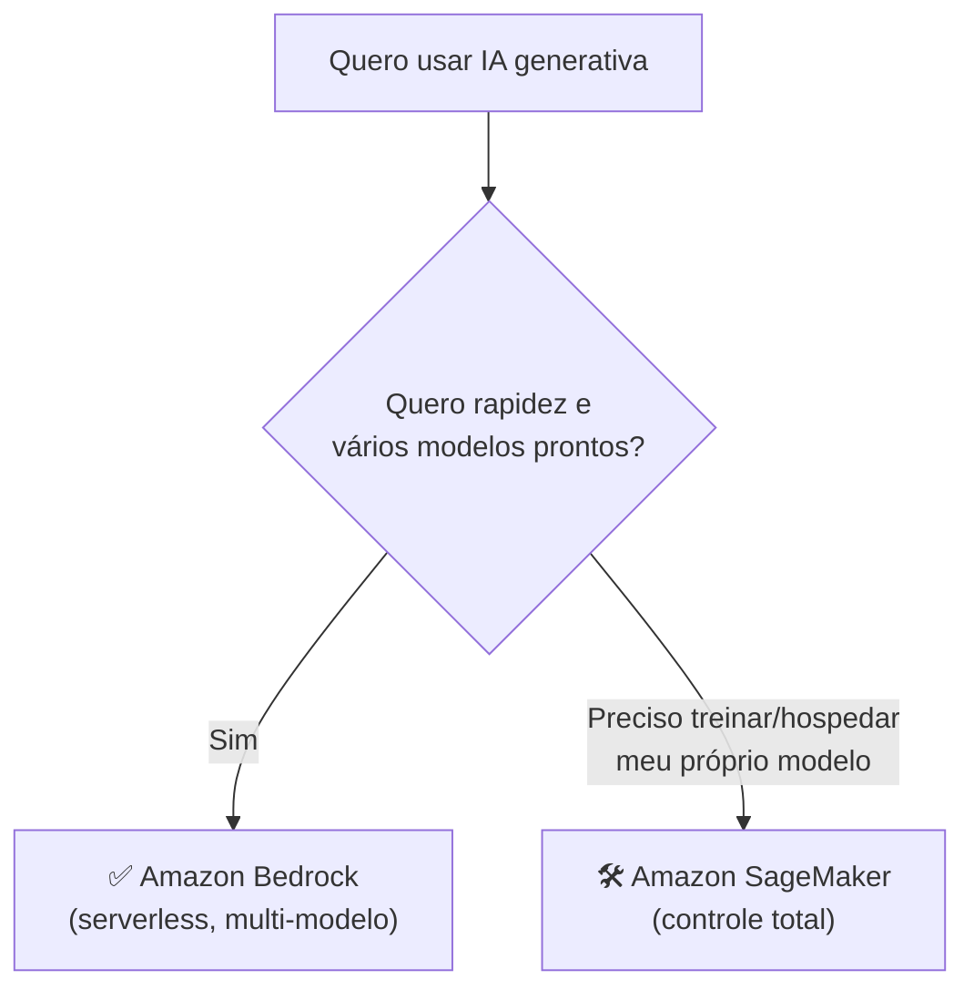

# Módulo 06 · Amazon Bedrock: modelos de fundação como serviço

> **Domínio:** 3 · Aplicações de Modelos · **Tempo estimado:** 2h30 · **Pré-requisitos:** Domínios 1 e 2

## 🎯 Objetivos de aprendizagem

Ao final deste módulo, você será capaz de:

- Explicar o que é o **Amazon Bedrock** e como ele funciona.
- Entender por que o Bedrock é **serverless** e multi-modelo.
- Reconhecer os principais recursos do Bedrock.

 

---

 

## 🧠 Conteúdo

 

### 1. O que é o Amazon Bedrock

O **Amazon Bedrock** é o serviço da AWS que dá acesso a **vários modelos de fundação** (de diferentes provedores) por meio de uma **única API**, sem você precisar gerenciar infraestrutura.

> [!TIP]
> **Analogia do streaming de música** 🎧
> Em vez de comprar o disco de cada artista, você assina **um** serviço e acessa vários catálogos. O Bedrock é assim: uma "assinatura" única que te dá acesso a modelos da Anthropic (Claude), Amazon (Titan), Meta (Llama), Mistral, Stability AI e outros.

 

### 2. Serverless e totalmente gerenciado

Com o Bedrock, você **não** gerencia servidores nem GPUs. É **serverless**: você chama a API, o modelo responde, e você paga pelo uso (por tokens).

> [!IMPORTANT]
> Ponto de prova: o **Bedrock é a porta de entrada mais rápida** para construir aplicações de IA generativa na AWS, porque abstrai toda a infraestrutura e oferece vários modelos prontos.

 

### 3. O que dá para fazer no Bedrock

| Recurso | Para que serve |
|:--|:--|
| 🧪 **Playgrounds** | Testar modelos com prompts, sem escrever código. |
| 📚 **Knowledge Bases** | Conectar seus próprios dados (base para **RAG**, veremos no Módulo 08). |
| 🤖 **Agents** | Criar agentes que executam tarefas em várias etapas. |
| 🛡️ **Guardrails** | Definir limites de segurança e filtros de conteúdo. |
| 🎛️ **Customização** | Ajustar modelos aos seus dados (fine-tuning). |

 

### 4. Bedrock x construir do zero

> [!NOTE]
> Regra prática: **Bedrock** para consumir modelos de fundação prontos, rápido e sem gerenciar infra. **SageMaker** (próximo módulo) quando você precisa **construir, treinar e hospedar** seus próprios modelos, com controle total.

 

---

 

## ❓ Quiz — teste seus conhecimentos

 

**1. O que é o Amazon Bedrock?**

- **A)** Um banco de dados relacional.
- **B)** Um serviço que dá acesso a vários modelos de fundação por uma única API, sem gerenciar infraestrutura.
- **C)** Um serviço de armazenamento de objetos.
- **D)** Uma ferramenta de faturamento.

💡 Ver resposta

> ✅ **Resposta: B)** — O **Bedrock** oferece vários modelos de fundação via API única, de forma serverless.

 

**2. Por que o Bedrock é considerado "serverless"?**

- **A)** Porque não usa modelos.
- **B)** Porque você não gerencia servidores nem GPUs — só chama a API e paga pelo uso.
- **C)** Porque é gratuito.
- **D)** Porque roda no seu computador.

💡 Ver resposta

> ✅ **Resposta: B)** — No Bedrock você **não gerencia infraestrutura**; é totalmente gerenciado e cobrado por uso.

 

**3. Uma vantagem central do Bedrock é...**

- **A)** Acessar modelos de vários provedores em um só lugar.
- **B)** Substituir o IAM.
- **C)** Criar buckets S3.
- **D)** Gerenciar faturas.

💡 Ver resposta

> ✅ **Resposta: A)** — O Bedrock reúne modelos de **vários provedores** (Anthropic, Amazon, Meta, Mistral...) numa única API.

 

**4. Qual recurso do Bedrock ajuda a definir limites de segurança e filtros de conteúdo?**

- **A)** Playgrounds.
- **B)** Guardrails.
- **C)** Knowledge Bases.
- **D)** Agents.

💡 Ver resposta

> ✅ **Resposta: B)** — Os **Guardrails** aplicam limites de segurança e filtros de conteúdo nas respostas.

 

**5. Quando escolher o SageMaker em vez do Bedrock?**

- **A)** Quando quero apenas consumir modelos prontos rapidamente.
- **B)** Quando preciso construir, treinar e hospedar meus próprios modelos, com controle total.
- **C)** Quando quero apenas testar prompts.
- **D)** Nunca; eles fazem a mesma coisa.

💡 Ver resposta

> ✅ **Resposta: B)** — O **SageMaker** é para **controle total** sobre construir/treinar/hospedar modelos. O Bedrock é para consumir modelos prontos.

 

---

 

## 🧪 Mão na massa (sem console!)

- 🔗 **AWS Skill Builder** → procure por *"Amazon Bedrock"* (introdução e playgrounds).
- 🔗 Liste 3 aplicações que você construiria com o Bedrock (ex.: chatbot de dúvidas da Liga) e qual modelo escolheria.

 

---

 

## 📔 Glossário

| Termo | Significado |
|:--|:--|
| **Amazon Bedrock** | Serviço serverless com acesso a vários modelos de fundação. |
| **Serverless** | Sem gerenciamento de infraestrutura pelo usuário. |
| **Playground** | Ambiente para testar modelos com prompts. |
| **Knowledge Base** | Conexão dos seus dados ao modelo (base para RAG). |
| **Guardrails** | Filtros e limites de segurança nas respostas. |
| **Agents** | Recursos que executam tarefas em várias etapas. |

 

## ✅ Checklist de conclusão

- [ ] Li todo o conteúdo do módulo
- [ ] Entendo o que é o Amazon Bedrock
- [ ] Sei por que ele é serverless e multi-modelo
- [ ] Conheço recursos como Guardrails e Knowledge Bases
- [ ] Sei diferenciar Bedrock de SageMaker
- [ ] Fiz o quiz
- [ ] Registrei meu [Checkpoint](https://github.com/melissaalves-stack/awscloudfoundations/issues/new?template=checkpoint-de-modulo.yml)

 

---

**Precisa de ajuda?** 📊 [Checkpoint](https://github.com/melissaalves-stack/awscloudfoundations/issues/new?template=checkpoint-de-modulo.yml) · ❓ [Dúvida](https://github.com/melissaalves-stack/awscloudfoundations/issues/new?template=duvida.yml) · 📖 [Guia](../../GUIA-DO-ALUNO.md) · 🚀 [Builder Center](https://bit.ly/4w720IR)

🏠 [Índice do Domínio 3](./README.md) &nbsp;·&nbsp; ➡️ [Módulo 07 · SageMaker e serviços de IA](./07-sagemaker-e-servicos-de-ia.md)

